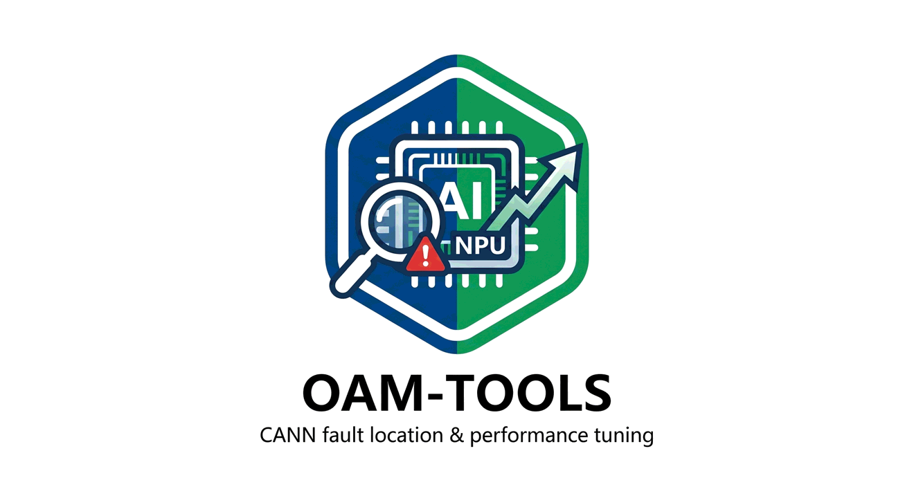

<div align="center">

<p align="center">
  
</p>

[](LICENSE)
[](docs/quick_install.md)

</div>

## 🚀 概述

Oam-Tools 为开发者提供故障定位工具和性能测试调优工具，包含故障信息收集，软硬件信息展示，AI core error报错分析，AI任务性能采集和分析等能力，提升故障问题定位和AI任务性能分析效率。

## 🧩 支持的硬件环境

在搭建环境之前，请先确认硬件在本工具的支持范围内，若无昇腾设备也可以通过docker方式编译构建(详见[快速安装](docs/quick_install.md#方式2docker部署))。

- **CPU 架构**：`aarch64`、`x86_64`
- **昇腾 AI 处理器**：

  | `npu-smi info` Name 列 | 适用产品 | 对应 CANN ops 包代号 |
  | --- | --- | --- |
  | `910B` | Atlas A2 训练系列产品 / Atlas 800I A2 推理产品 | `910b` |
  | `910_93/910C` | Atlas A3 训练系列产品 / Atlas A3 推理系列产品（业内"910C"对应此项） | `A3` |
  | `950` | Atlas 950 系列产品 | `950` |

  > - `npu-smi info`实际可能显示带子型号的字符串（如`910B1` / `910B2` / `910B3` / `910B4`），按"Name 列包含上述关键字"的规则匹配即可。
  > - 其它芯片暂不支持，欢迎提交 issue 反馈。CANN ops 包名拼接规则与下载详见[快速安装](docs/quick_install.md#方式3手动安装)。

## ⚡️ 环境准备

请先按照[快速安装](docs/quick_install.md)指南完成环境准备。

## 🔍 目录结构

关键目录结构如下：

  ```
  ├── cmake                                          # 工程编译目录
  ├── scripts                                        # 辅助构建相关文件
  ├── src                                            # 所有模块的源代码
  |   ├── asys                                       # asys模块目录
  |   ├── hccl_test                                  # hccl_test模块目录
  |   ├── msaicerr                                   # msaicerr模块目录 
  |   ├── msprof                                     # msprof模块目录
  |   ├── third_party                                # 依赖的第三方库头文件
  |   ......
  ├── test                                           # UT/ST用例
  ├── CMakeLists.txt                                 # 构建编译配置文件
  ├── build.sh                                       # 项目工程编译脚本
  ......
  ```

## 🌐 源码编译

执行以下命令进行编译：

```bash
bash build.sh
```

如需指定第三方库路径，可通过 `--cann_3rd_lib_path` 参数传入：

```bash
bash build.sh --cann_3rd_lib_path=${third_party_path}
```

- `--cann_3rd_lib_path`：第三方库存储目录，默认值为 `./third_party`。若本地不存在第三方库，编译脚本将自动从 gitcode 开源仓库下载各第三方库源码。
- 编译过程中会自动下载闭源二进制包，该包含有保证功能正常运行所需的库及头文件，且仅提供 release 版本，**即使编译选项指定为 debug，也只会下载 release 版本的 tar 包**。
- 若编译环境无法访问网络，请参考[离线编译环境准备](docs/quick_install.md#离线编译环境准备)提前完成依赖包的下载与配置，并通过 `--cann_3rd_lib_path` 参数指定依赖包所在目录后再执行编译。
- 更多编译参数请通过 `bash build.sh -h` 查看。

编译完成后，`build_out` 目录下会生成 `cann-oam-tools_<cann_version>_linux-<arch>.run` 软件包，其中 `<cann_version>` 为版本号，`<arch>` 为操作系统架构（可选值：`x86_64` 或 `aarch64`）。

## 🔨 安装
可执行如下命令安装编译生成的oam-tools软件包：

```bash
./cann-oam-tools_<cann_version>_linux-<arch>.run --full --install-path=${install_path}
```
安装完成之后，用户编译生成的oam-tools软件包会替换已安装CANN开发套件包中的oam-tools相关软件。

> 如果您的环境上`grep`版本大于3.8.0，安装时会出现告警，例如`grep: waring: stray \ before -`，这是由于grep高版本对表达式有更严格的校验，但并不影响安装和使用
                                       

## 🧪 验证

编译完成后，用户可以进行测试验证项目功能是否正常。

> Python 依赖安装已在[环境准备](docs/quick_install.md)中处理，无需额外操作。

编译执行测试用例：
```bash
bash build.sh -u
```

如果希望指定单独组件进行测试，可以使用`--component`参数指定：

可选值：`asys`（故障信息收集）、`msaicerr`（AI Core Error 分析）、`msprof`（性能调优）、`all`（所有组件，默认）

```bash
bash build.sh -u --component msprof
```

UT测试用例编译输出目录为`build`，如果想清除历史编译记录，可以执行如下操作：
```bash
rm -rf build_out/ build/
```

### ▶️ 功能运行示例

完成[安装](#-安装)后，工具会被释放到 CANN 安装目录下的 `tools/` 子目录（root 用户默认在 `/usr/local/Ascend/cann/tools/`）。运行示例前请先加载环境变量：

```bash
# root 用户默认路径；非 root 用户将 /usr/local 替换为 ${HOME}
source /usr/local/Ascend/cann/set_env.sh
# 指定路径安装时：source ${install_path}/cann/set_env.sh
```

> 执行上方命令后，`${ASCEND_INSTALL_PATH}` 即为 CANN 安装目录：
> - root 用户默认：`/usr/local/Ascend/cann`
> - 非 root 用户默认：`${HOME}/Ascend/cann`
> - 指定路径安装：`${install_path}/cann`

#### asys（故障信息收集 / 诊断）

`src/asys/` 目录下同时存在 `asys.py` 和指向它的软链接 `asys`（`src/asys/asys -> ./asys.py`），CMake 通过 `install(DIRECTORY ${ASYS_DIR} ...)` 将整个目录原样拷贝，软链接也会保留。因此安装后两种调用都能直接用：

```bash
# 形式一：显式 python3 调用 .py
python3 ${ASCEND_INSTALL_PATH}/tools/ascend_system_advisor/asys/asys.py -h

# 形式二：直接调用软链接 asys（asys.py 自带 #!/usr/bin/env python3 shebang）
${ASCEND_INSTALL_PATH}/tools/ascend_system_advisor/asys/asys -h
```

asys 的子命令在 `src/asys/cmdline/cmd_parser.py` 的 `Command` 枚举中定义，包含 `info / health / collect / launch / diagnose / analyze / config / profiling`。在环境变量加载生效后，可以直接以asys调用：

```bash
# 采集主机与 device 的软硬件信息（不依赖待诊断任务，通常作为环境自检）
asys info

# 体检 device 健康状态
asys health

# 采集环境中已存在的运维信息并打包到指定输出目录
asys collect --output <output_dir>
```

#### msaicerr（AI Core Error 分析）

msaicerr 入口为 `src/msaicerr/msaicerr.py`，安装后位于 `${ASCEND_INSTALL_PATH}/tools/msaicerr/msaicerr.py`。

```bash
# 1) 解析一个已有的 AI Core Error 报告路径，结果输出到 <output_dir>
python3 ${ASCEND_INSTALL_PATH}/tools/msaicerr/msaicerr.py -p <report_dir> -out <output_dir> -dev 0

# 2) 解析单个 dump 文件（dtype 取值参见 -h 输出）
python3 ${ASCEND_INSTALL_PATH}/tools/msaicerr/msaicerr.py -d <dump_file> -out <output_dir> -dtype float16

# 3) 检测当前环境是否具备运行 msaicerr 所需的条件（仅依赖 device 编号）
python3 ${ASCEND_INSTALL_PATH}/tools/msaicerr/msaicerr.py -e -dev 0

# 完整参数说明
python3 ${ASCEND_INSTALL_PATH}/tools/msaicerr/msaicerr.py -h
```

#### msprof（性能调优）

msprof 由 C++ 侧 collector（`basic`、`dvvp`）和 `msprof` Python wheel（分析脚本）组成。`bash build.sh` 完成后，wheel（`msprof-0.0.1-py3-none-any.whl`）会被拷贝到 `src/msprof/collector/dvvp/msprofbin/` 并打包进 `.run` 安装包；安装时自动解包到 `${ASCEND_INSTALL_PATH}/tools/profiler/profiler_tool/` 目录下，无需手动 `pip install`。

分析脚本由 msprof collector 流水线内部调用（入口为 `profiler_tool/analysis/msprof/msprof.py`），不会在 `PATH` 中注册独立的命令行命令。如需手动运行分析脚本，可直接以 python3 调用安装目录下的入口：

```bash
python3 ${ASCEND_INSTALL_PATH}/tools/profiler/profiler_tool/analysis/msprof/msprof.py -h
```

C++ 侧 collector 一般作为 CANN profiler 流水线的内置组件被调用，开发者无需直接执行；回归通过 `bash build.sh -u --component msprof` 运行 gtest 用例（产物 `build/test/ut/msprof/msprofbin/msprof_bin_utest`）。

## 🅿️ Pre-commit
pre-commit 是一个用于管理和维护 Git 预提交钩子（hooks）的框架，通过在代码提交前自动化执行代码检查、格式化和安全扫描，确保代码质量并统一团队规范，显著减少 CI/CD 流水线失败并提升协作效率。
本仓已配置pre-commit，用户可以参考CANN社区的[pre-commit配置指导书中第3章节](https://gitcode.com/cann/infrastructure/blob/main/docs/SC/pre-commit/pre-commit%E9%85%8D%E7%BD%AE%E6%8C%87%E5%AF%BC%E4%B9%A6.md#3-%E7%A4%BE%E5%8C%BA%E8%B4%A1%E7%8C%AE%E8%80%85%E4%BD%BF%E7%94%A8pre-commit%E8%83%BD%E5%8A%9B)安装pre-commit, 首次由于需要配置java，maven环境以及构建jar包，需要的时间比较长。

## 📖 相关文档

[asys工具用户指南](https://hiascend.com/document/redirect/CannCommunityasys)：介绍asys命令行工具的使用方法，支持以下功能：故障信息收集、业务复跑+故障信息收集、软硬件和Device状态信息展示、健康检查、综合检测、组件检测、trace文件解析/coredump文件解析/stackcore文件解析/coretrace文件解析、实时堆栈导出、环境配置、AI Core Error故障信息解析等。

[msaicerr工具用户指南](https://hiascend.com/document/redirect/CannCommunitymsaicerr)：介绍msaicerr命令行工具的使用方法，用于分析AI Core Error问题、解析Dump文件、检查环境等。

[性能调优工具用户指南](https://www.hiascend.com/document/redirect/CannCommunityToolProfiling)：介绍msprof命令行工具的使用方法，用于指导用户采集和分析运行在昇腾AI处理器上的AI任务各个运行阶段的关键性能指标，以便快速定位软、硬件性能瓶颈，提升AI任务性能分析的效率。

[HCCL性能测试工具用户指南](https://www.hiascend.com/document/redirect/CannCommunityToolHcclTest)：介绍hccl_test工具的使用方法，用于指导分布式训练或推理场景下，测试集合通信的功能与性能。

## ℹ️ 相关信息
- [贡献指南](CONTRIBUTING.md)
- [安全声明](SECURITY.md)
- [许可证](LICENSE)
