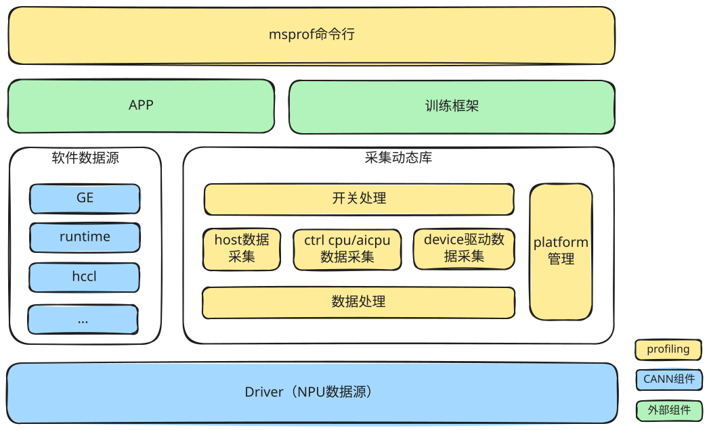
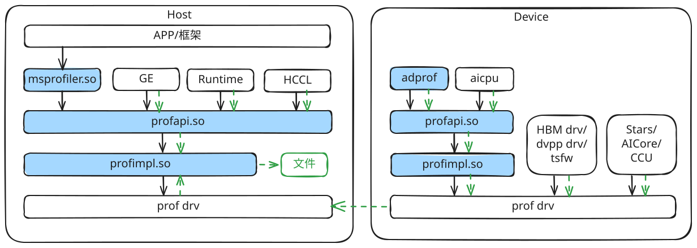
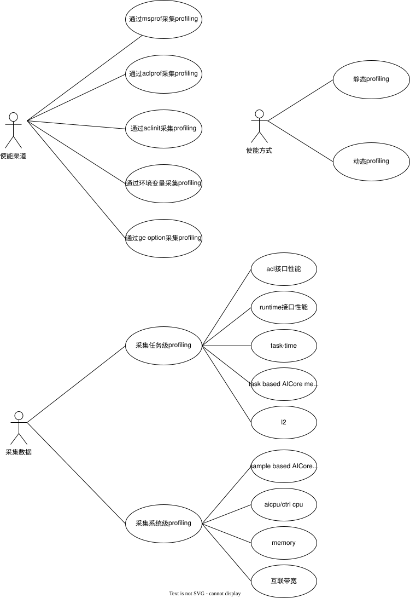

# msprof 架构介绍

## 系统架构总览

**功能概述**：msprof 是昇腾 的整网性能优化工具，为模型和集群性能分析提供数据采集和解析能力。支持通过多种使能方式使能profiling采集，把用户开关配置映射为内部的采集开关；运行期一方面接收 runtime/GE/HCCL 等软件组件主动上报的 Host 侧数据，另一方面通过驱动提供的profiilng channel采集 Device侧的软件（AICPU）和硬件数据（stars任务调度、AICore metrics等）。芯片形态差异通过 Platform 抽象隔离，各模块基于Platform提供的接口判断开关在各芯片的支持情况以及内部映射为哪些数据采集项。

### 架构图

## 核心模块介绍

### ① msprof命令行

**组件职责**：一个可执行的命令行工具，支持用户以命令行的方式拉起app或推理/训练脚本并设置。
**核心流程**：解析命令行参数并拉起app → 将解析后的参数传递给开关处理模块。
**设计考量**：提供友好的用户界面，参数校验失败给出明确易懂的打屏提示。

### ②  开关处理

**组件职责**：统一处理 多种使能方式的输入参数，把差异化输入转换为统一的 `ProfileParams`结构。
**核心流程**：各入口 → 参数解析/校验 → 构造 `ProfileParams`。
**设计考量**：多入口单收敛，避免选项处理逻辑分散在各接口，后续采集链路只面向 `ProfileParams` 编程。

### ③ Host 数据采集

**组件职责**：接收 runtime/GE/HCCL 等Host软件模块上报的性能数据（API 执行时长、算子/task的附加信息）。
**核心流程**：组件注册回调函数→通知组件上报性能数据→组件组装并上报性能数据 → 性能数据保存到无锁的缓冲buffer → 后台线程从缓冲buffer取数据。
**设计考量**：通过无锁队列实现上报接口低开销；上报与落盘解耦。

###  ④ AICPU 数据采集

**组件职责**：采集 Device的AICPU进程（Host主进程setdevice后，会在Device拉起一个执行aicpu算子的进程和一个执行集合通信算子的进程）上报的性能数据以及AICPU/Ctrl CPU占用率等指标。
**核心流程**：组件注册回调函数→通知组件上报性能数据→组件组装并上报性能数据 → 性能数据保存到无锁的缓冲buffer → 后台线程从缓冲buffer取数据并上报给profiling driver->host通过profiling drv获取数据。
**设计考量**：接口封装与Host数据采集保持一致；上报接口低开销。

###  ⑤ Device 驱动数据采集

**组件职责**：通过驱动通道采集NPU硬件性能数据，包括算子执行性能、AICore PMU等。
**核心流程**：Runtime通知setdevice→调 用`prof_drv_start` 打开驱动通道 →  后台线程`ChannelPoll` 轮询数据 。
**设计考量**：将不同类型的数据封装到不同的profiling channel，由profiling driver屏蔽不同类型数据采集方式的差异。

### ⑥ 数据处理

**组件职责**：完成对性能数据的最终处理，包括落盘、回调接口上报、在线解析。
**核心流程**：上传数据->根据初始配置对数据做不同的处理。
**设计考量**：对下提供统一的数据上传接口，对上提供不同的数据处理能力。

### ⑦Platform 管理

**组件职责**：抽象芯片平台差异，决定「某芯片支持哪些采集特性」「某组 metrics 对应哪些 PMU 事件」。
**核心流程**：Platform初始化查询芯片类型->上层模块查询是否支持某特性 → Platform返回支持情况。
**设计考量**：虚接口 + `PLATFORM_REGISTER` 反射注册，新增芯片符合开闭原则。

### 部署图

**msprofiler.so**：提供acl prof接口能力。
**profapi.so**：profiling数据采集的接口层，Host和Device部署的profapi.so是归一的。profapi.so通过dlopen的方式加载profimpl.so，在对动态库大小敏感的场景下，如果生产态下不需要做profiling数据采集，用户可以不部署profimpl.so，仅部署profapi.so，保证上层业务组件的so可以正常加载。
**profimpl.so**：profiling数据采集的实现层，Host和Device部署的profimpl.so是归一的。

## 特性功能介绍

### 用例图

### 动态 Profiling

**功能说明**：区别与默认参数下在启动msprof命令行后就立刻打开性能数据采集，动态profiling允许开发者在程序执行过程中打开profiling。

### acl接口性能

**功能说明**：采集所有CANN acl接口的执行性能。

### runtime接口性能

**功能说明**：采集所有runtime模块接口的执行性能。

### task-time

**功能说明**：采集算子的执行性能。算子的性能数据包括两部分，一部分是host软件在下发算子时上报的性能数据（包含算子的taskid、streamid、kernelname等），一部分是NPU硬件调度单元在调度算子时输出的性能数据（包含算子的taskid、算子调度开始时间、算子调度结束时间），msprof解析时通过taskid将两部分数据关联起来。task-time（op summary表中的task duration）除了算子实际执行时间，还包含了调度的耗时。task-time提供了l0、l1和l2三个级别，区别在于host软件在下发算子时上报的性能数据多少，l0上报的数据最少（仅包含runtime上报的taskid、streamid、kernelname），l2上报的数据最多（包含aclnn/GE/hccl上报的算子shape、attr等），host软件上报的数据越多（NPU硬件调度单元上报性能数据的影响可以忽略），打开profiling后的性能膨胀越大。

### task based AICore metrics

**功能说明**：采集算子的PMU指标。AICore内部有PMU统计寄存器，在算子执行过程中会累计指定的性能指标，task based模式下，NPU硬件调度单元在算子执行结束后，会将AICore内部的PMU统计寄存器读取出来记录到指定内存中，下一个算子开始执行时，AICore内部的PMU统计寄存器会重新计数。PMU统计寄存器中有一个寄存器会固定记录算子执行的总cycle数，Ascend950之前的芯片就是利用总cycle数、AICore频率和block dim计算出了op summary表中aicore_time，所以如果算子的执行过程中AICore发生了调频，计算出来的aicore_time会有较大的误差。从Ascend950代际开始，AICore内部新增了一个寄存器记录本AICore开始执行的syscnt，NPU硬件调度单元在算子执行结束时会把最早执行的AICore记录的syscnt和结束调度的syscnt记录到profiling数据中。Ascend950代际op summary表中aicore_time是利用这两个syscnt相减后除以NPU频率获得，由于syscnt的频率不会发生变化，所以A5代际的aicore_time不会出现因为调频而引起的误差。

### l2

**功能说明**：采集算子的l2命中、miss、victime rate和tlb miss rate。打开此开关后，runtime下发AICore算子时，会给AICore算子自动设置postp中断标志。NPU硬件调度单元执行完算子后会基于这个标志触发postp中断给tsfw，tsfw会读取相关的寄存器。所以打开此开关后，对调度性能会有较大的影响。

### Sample based AICore metrics

**功能说明**：周期采集AICore的PMU指标。此模式下，AICore内部的PMU统计寄存器会一直累积，不会因为算子执行结束就重置，tsfw会周期采集AICore内部的PMU统计寄存器并记录到内存中。

### aicpu/ctrl cpu

**功能说明**：采集aicpu和ctrl cpu的利用率等指标。

### memory

**功能说明**：采集Device整体和module级别的内存占用率。

### 互联带宽

**功能说明**：采集互联通道（nic、hccs、ub等）的收发带宽。

