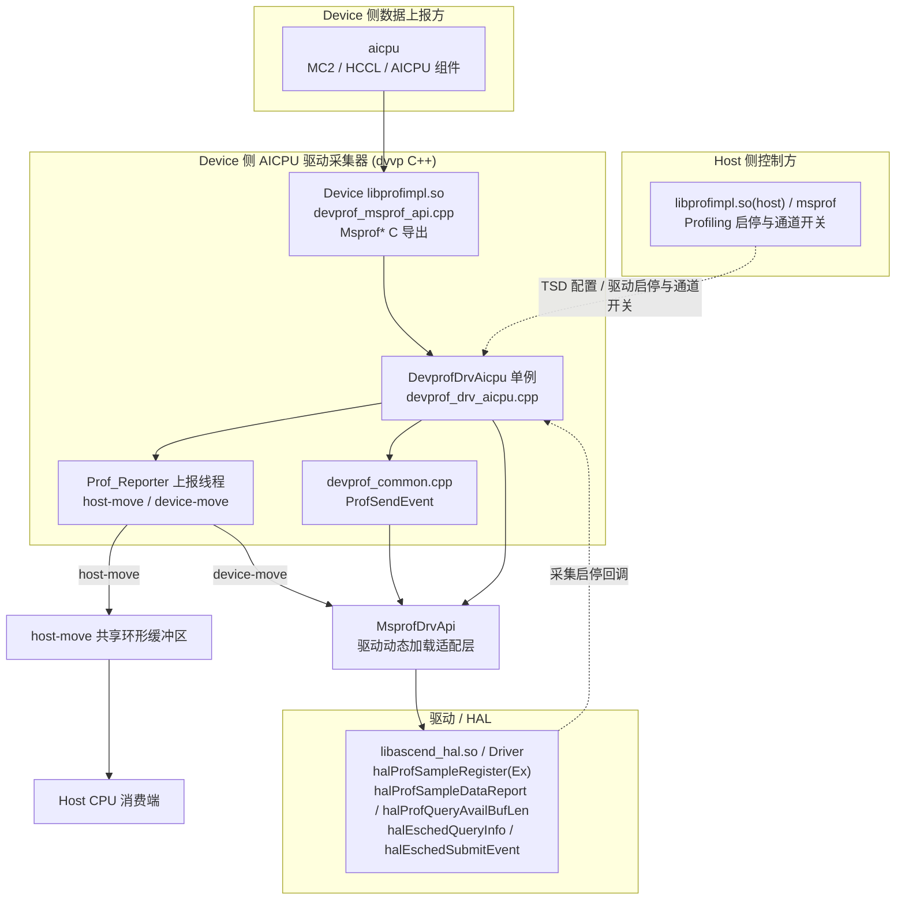
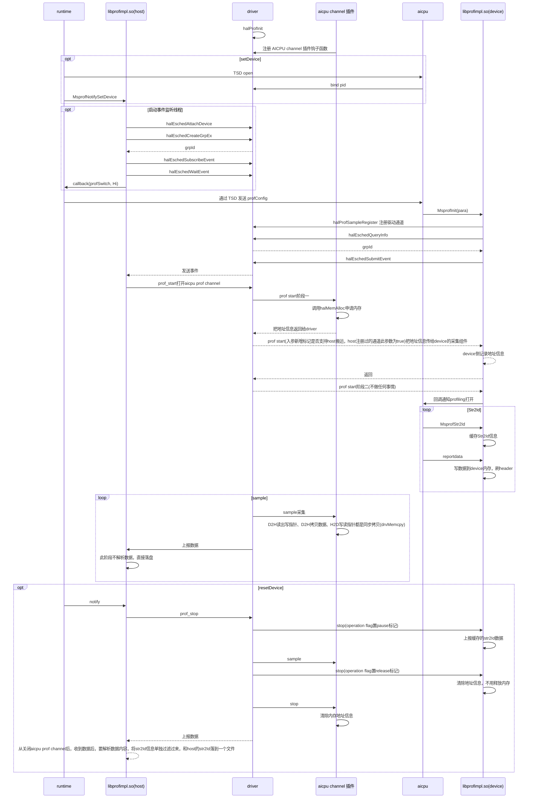
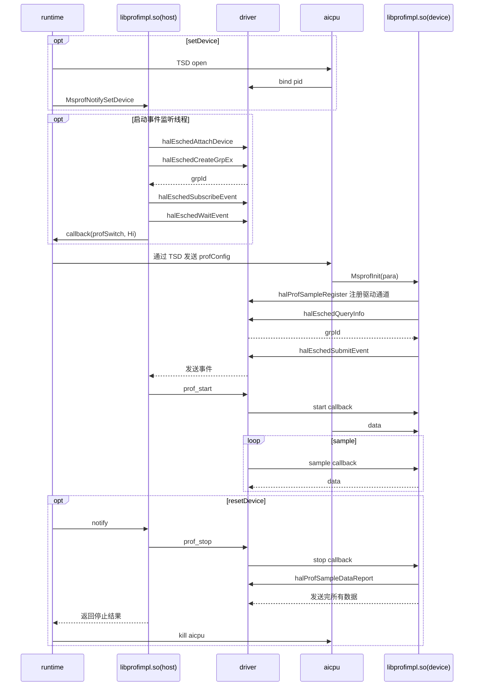
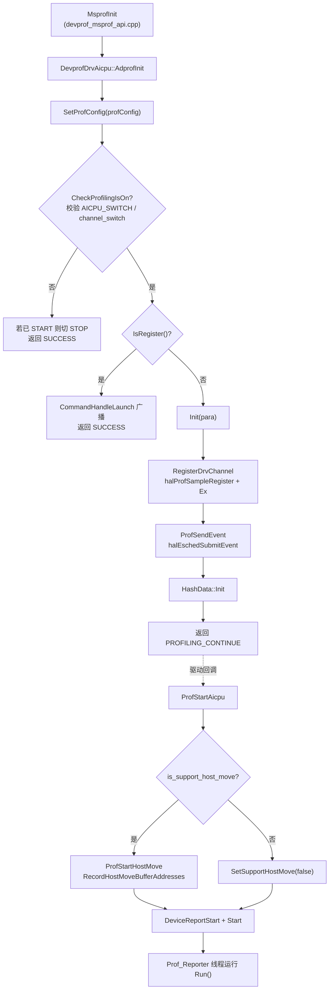
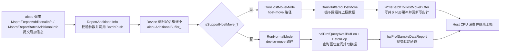
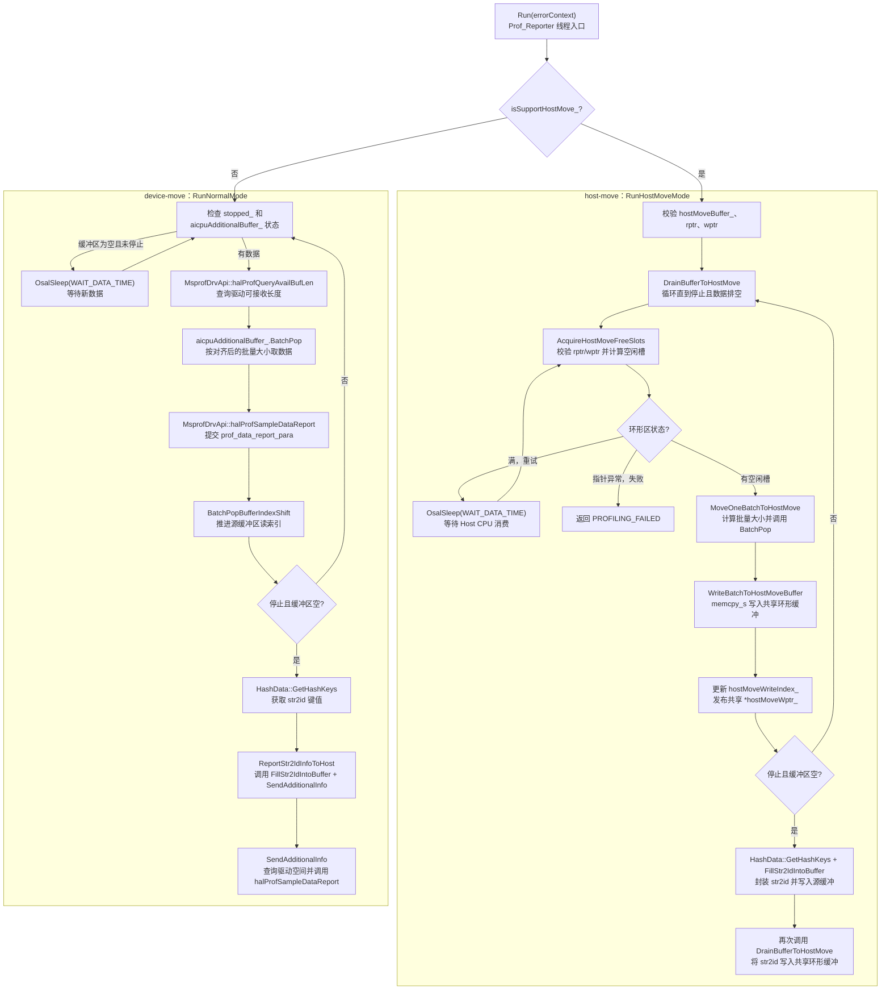
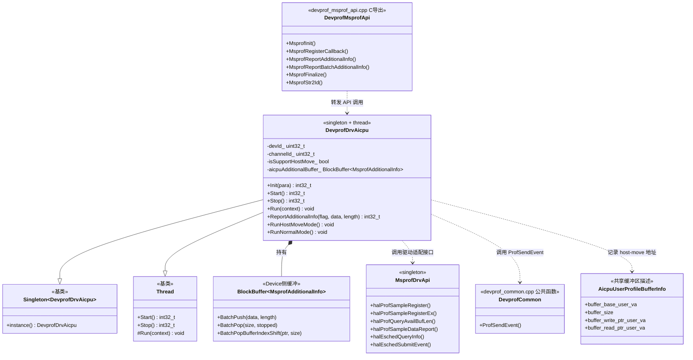
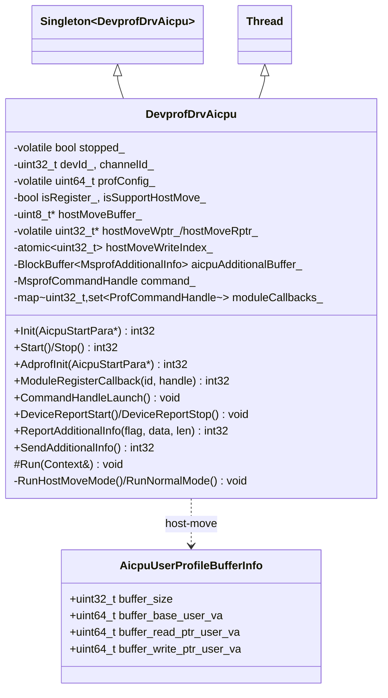

# AICPU 数据采集（Device 侧）模块架构

## 1. 模块概述

- **功能介绍**：本模块负责 Device 侧 AICPU（含自定义 AICPU、以及经 AICPU 驱动通道上报的 MC2/HCCL）Profiling 数据的采集与上报。核心是 Device 侧 `libprofimpl.so` 中的 `DevprofDrvAicpu` 单例：向驱动注册采样算子（`halProfSampleRegister`）、管理采集生命周期、启动上报线程，并把 AICPU 附加信息（`MsprofAdditionalInfo`）经 host-move 环形缓冲区或 device-move 驱动通道搬运回 Host。
- **设计目标**：
  - 通过 `MsprofDrvApi` 延迟加载驱动 HAL API；驱动库或符号缺失时按不支持/错误路径降级，不影响通用服务器上的 Host 侧启动。
  - 以单例 + 后台上报线程模型统一管理 AICPU 通道生命周期（注册 / 启动 / 暂停 / 释放）。
  - 兼容两种数据回传路径：host-move「环形缓冲区直搬」（`RunHostMoveMode`）与 device-move「驱动缓冲区上报」（`RunNormalMode`）。
  - 在驱动提供 host-move 能力时，将 AICPU 数据写入共享环形缓冲区，由配套的 Host CPU 消费端继续处理和上报，减少 Ctrl CPU 侧搬运开销；不支持时自动回退到 device-move 路径（原始 device-move mode 为老流程，后续版本可能日落）。

## 2. 使用场景、架构与对外接口

### 2.1 使用场景

本模块面向用户提供一种 Device 侧 AICPU Profiling 数据采集使用场景：用户启动或停止 Profiling 采集，Device 侧采集器完成组件联动和驱动适配后，将数据通过 host-move 或 device-move 路径回传 Host。该使用场景由以下三个协同环节组成：

1. **AICPU 采集启停**：Profiling 启动时通过 `MsprofInit`（`devprof_msprof_api.cpp`）驱动 `DevprofDrvAicpu::AdprofInit` → `Init` → 向驱动注册采样算子；驱动回调 `ProfStartAicpu` 根据能力优先选择 host-move，能力不可用时选择 device-move 驱动通道路径。
2. **组件回调联动**：MC2、HCCL 等组件通过 `MsprofRegisterCallback` 注册命令回调，采集器在 START/STOP 状态切换时统一广播 `MsprofCommandHandle`。
3. **驱动 API 适配**：AICPU 采集器通过 `MsprofDrvApi` 间接调用 `libascend_hal.so` 中的驱动/Profiling 符号；缺库或缺符号时返回不支持/错误码。

## 2.2 架构与组件交互

### 2.2.1 整体设计思路

上层请求经 `DevprofApi` 的 C 导出层进入 `DevprofDrvAicpu`，由 `MsprofDrvApi` 间接调用驱动 HAL API。AICPU 通道由 `DevprofDrvAicpu` 单例负责注册和生命周期管理。驱动支持 host-move 时，设备侧将数据写入共享环形缓冲区，由配套的 Host CPU 消费端继续处理；否则使用 device-move 的设备侧后台上报线程通过驱动通道回传 Host。

### 2.2.2 架构分层图



### 2.2.3 核心模块交互图


- **场景一（Host-Move Mode）**


- **场景二（Device-Move Mode）**


### 2.3 对外接口

本节列出的接口均为 Profiling 在 Device 侧提供的接口。在通用 Device 构建中，这些接口由 `devprof_msprof_api.cpp` 编入 `libprofimpl.so`（CMake 目标 `profimpl_share_device`）对外提供；部分特定产品构建还会编入 `libascend_devprof.so`。Host 侧 `libprofapi.so` 存在部分同名接口，但其实现入口、调用链和功能职责与 Device 侧接口不同；本文仅描述 Device 侧接口，不将 Host 侧同名接口作为本模块对外接口。

| 接口 | 文件位置 | 说明 |
| ---- | -------- | ---- |
| `MsprofInit` | `collector/dvvp/msprof/devprof/src/devprof_msprof_api.cpp` | 初始化 AICPU 采集模块，传入 `AicpuStartPara` |
| `MsprofRegisterCallback` | `collector/dvvp/msprof/devprof/src/devprof_msprof_api.cpp` | 注册组件命令回调 |
| `MsprofFinalize` | `collector/dvvp/msprof/devprof/src/devprof_msprof_api.cpp` | 停止 Device 侧上报并完成模块收尾 |
| `MsprofStr2Id` | `collector/dvvp/msprof/devprof/src/devprof_msprof_api.cpp` | 生成字符串对应的 Profiling ID |
| `MsprofReportAdditionalInfo` | `collector/dvvp/msprof/devprof/src/devprof_msprof_api.cpp` | 上报单批次 AICPU 附加信息 |
| `MsprofReportBatchAdditionalInfo` | `collector/dvvp/msprof/devprof/src/devprof_msprof_api.cpp` | 批量上报 AICPU 附加信息 |
| `MsprofGetBatchReportMaxSize` | `collector/dvvp/msprof/devprof/src/devprof_msprof_api.cpp` | 查询批量上报最大字节数 |


## 3. 详细设计

### 3.1 核心流程

#### AICPU 注册与启动流程



**流程步骤说明**：

1. `AdprofInit` 无条件先 `SetProfConfig`，再用 `CheckProfilingIsOn` 校验开关（`AICPU_SWITCH=2` 或 `AICPU_CHANNEL_SWITCH_MASK=0x10000`；MC2/HCCL 数据经 aicpu 驱动通道上报，故需校验 channel switch），并在此初始化 `aicpuAdditionalBuffer_`。
2. 已注册时只需 `CommandHandleLaunch` 广播当前命令；未注册时执行 `Init`：按 `channelId`（`PROF_CHANNEL_AICPU` 或 `PROF_CHANNEL_CUS_AICPU`）选择事件组名，调 `RegisterDrvChannel` 注册采样算子，再 `ProfSendEvent` 通过 `halEschedSubmitEvent` 向 Device 发事件。
3. `RegisterDrvChannel` 先调 `halProfSampleRegister`，再调 `halProfSampleRegisterEx`；后者返回 `DRV_ERROR_NOT_SUPPORT` 时兼容老流程（仍标记 `isRegister_=true`）。
4. 驱动回调 `ProfStartAicpu` 中，若支持 host-move 则记录共享环形缓冲区地址，随后切换 START 状态并拉起 `Prof_Reporter` 上报线程。
5. host-move 是当前数据直搬路径。能力不可用时回退到 device-move 驱动通道路径。AICPU 侧批量写入共享 ring buffer，Host CPU 消费端读取后继续处理、上报。

**关键代码**（标注来源文件）：

```cpp
// 文件位置：collector/dvvp/msprof/devprof/src/devprof_drv_aicpu.cpp
int32_t DevprofDrvAicpu::RegisterDrvChannel(uint32_t devId, uint32_t channelId)
{
    ProfSampleRegisterPara registerPara = {1, {ProfStartAicpu, ProfSampleAicpu, nullptr, ProfStopAicpu}};
    int32_t ret = halProfSampleRegister(devId, channelId, &registerPara);
    ...
    ret = halProfSampleRegisterEx(devId, channelId, &registerPara);
    if (ret == DRV_ERROR_NOT_SUPPORT) { isRegister_ = true; return PROFILING_SUCCESS; }  // 兼容老驱动
    ...
}
```

#### 数据上报流程（Run）

数据流为“采集回调 → Device 侧缓冲 → 搬运/驱动上报 → Host 消费与落盘”。host-move 路径先计算共享环形缓冲区空闲槽位，再完成批量搬运并更新写指针，最后由 Host 消费；device-move 路径再查询驱动可接收空间，批量取出附加信息并提交给驱动。





**流程步骤说明**：

1. **公共入口 `Run`**：`DevprofDrvAicpu::Start` 启动 `Prof_Reporter` 线程后进入 `Run`。`Run` 根据 `isSupportHostMove_` 分流：为 true 调用 `RunHostMoveMode`（host-move），为 false 调用 `RunNormalMode`（device-move）。该标志在 `ProfStartAicpu` 中根据驱动回调传入的 `is_support_host_move` 设置。
2. **采集数据进入缓冲**：AICPU 侧调用 `MsprofReportAdditionalInfo` 或 `MsprofReportBatchAdditionalInfo`，最终进入 `DevprofDrvAicpu::ReportAdditionalInfo`；该函数校验数据指针、长度和批量上限后，通过 `aicpuAdditionalBuffer_.BatchPush` 写入 Device 侧 `BlockBuffer<MsprofAdditionalInfo>`。`Prof_Reporter` 从该缓冲区取出数据进行后续上报。

**host-move 路径（`RunHostMoveMode`）**：

1. `RunHostMoveMode` 先检查 `hostMoveBuffer_`、读写指针和缓冲区大小，然后调用 `DrainBufferToHostMove`，持续处理 Device 侧缓冲区，直到停止且数据排空。
2. `DrainBufferToHostMove` 在有数据时调用 `AcquireHostMoveFreeSlots`。该函数读取本地写索引 `hostMoveWriteIndex_` 和 Host CPU 更新的 `*hostMoveRptr_`，校验索引范围并计算可用槽位；保留一个空槽区分“空”和“满”，环形区满时返回重试，指针非法时返回失败。
3. `DrainBufferToHostMove` 调用 `MoveOneBatchToHostMove`，按源缓冲区数据量、环形区空闲槽位和 `MAX_DRV_REPORT_SIZE` 计算本批大小，并通过 `aicpuAdditionalBuffer_.BatchPop` 取得连续数据。
4. `MoveOneBatchToHostMove` 调用 `WriteBatchToHostMoveBuffer`。该函数使用一次或两次 `memcpy_s` 将批量记录写入共享环形缓冲区（跨环回绕时拆成两段），然后更新本地写索引，并以 release 顺序发布共享 `*hostMoveWptr_`，供 Host CPU 消费端读取。
5. 当主数据排空后，`RunHostMoveMode` 从 `HashData::GetHashKeys` 获取 str2id 键值，经 `FillStr2IdIntoBuffer` 切分并写入 `aicpuAdditionalBuffer_`，再调用 `DrainBufferToHostMove` 通过同一 host-move 环形缓冲区发送。

**device-move 路径（`RunNormalMode`）**：

1. `RunNormalMode` 循环检查 `stopped_` 和 `aicpuAdditionalBuffer_` 是否为空；有数据时调用 `MsprofDrvApi::halProfQueryAvailBufLen` 查询驱动通道可接收的字节数。
2. 根据驱动可用长度、`MAX_DRV_REPORT_SIZE` 和 `sizeof(MsprofAdditionalInfo)` 对齐本批大小，再用 `aicpuAdditionalBuffer_.BatchPop` 取得待上报数据；没有可取数据时短暂休眠后重试。
3. 构造 `prof_data_report_para`，调用 `MsprofDrvApi::halProfSampleDataReport` 将数据提交给驱动通道；无论成功或失败，都调用 `aicpuAdditionalBuffer_.BatchPopBufferIndexShift` 推进源缓冲区读索引。
4. 线程停止且附加信息缓冲区排空后，调用 `HashData::GetHashKeys` 获取 str2id；非空时通过 `ReportStr2IdInfoToHost` 处理。该函数调用 `FillStr2IdIntoBuffer` 将键值封装为 `MsprofAdditionalInfo`，再调用 `SendAdditionalInfo`，后者循环查询驱动可用空间并通过 `halProfSampleDataReport` 上报。

**关键函数与用途**：

| 函数 | 用途 |
| --- | --- |
| `Run` | 上报线程入口，根据 host-move 能力选择数据路径 |
| `RunHostMoveMode` | 校验 host-move 共享区并完成主数据、str2id 数据排空 |
| `RunNormalMode` | 通过 device-move 驱动通道循环上报附加信息 |
| `RecordHostMoveBufferAddresses` | 保存驱动传入的共享缓冲区、读指针和写指针地址，并初始化指针 |
| `DrainBufferToHostMove` | 循环从 Device 缓冲搬运数据到共享环形缓冲区 |
| `AcquireHostMoveFreeSlots` | 校验环形区读写索引并计算可写槽位 |
| `MoveOneBatchToHostMove` | 从源缓冲取一批数据并调用批量写入函数 |
| `WriteBatchToHostMoveBuffer` | 处理环形回绕、拷贝记录并发布共享写指针 |
| `ReportAdditionalInfo` | 校验附加信息并写入 `aicpuAdditionalBuffer_` |
| `BatchPush` | 将生产侧附加信息写入 Device 侧缓冲区 |
| `BatchPop` | 从 `aicpuAdditionalBuffer_` 获取连续待上报数据 |
| `BatchPopBufferIndexShift` | 数据提交后推进源缓冲区读索引 |
| `halProfQueryAvailBufLen` | 查询 device-move 驱动通道可接收空间 |
| `halProfSampleDataReport` | 向 device-move 驱动通道提交一批数据 |
| `FillStr2IdIntoBuffer` | 将 str2id 键值切分并封装为附加信息记录 |
| `ReportStr2IdInfoToHost` / `SendAdditionalInfo` | 封装并发送停止阶段缓存的 str2id 信息 |

### 3.2 核心机制详解

本节同时说明数据上报、线程协作和性能优化机制；批量上报与 host-move 直搬优先用于降低小包调用和设备侧拷贝开销。

#### 类职责与线程



| 类/线程 | 职责 |
| --- | --- |
| `DevprofMsprofApi` | 表示 `devprof_msprof_api.cpp` 中的 Device 侧 C 导出层，将初始化、回调注册和数据上报请求转发给 `DevprofDrvAicpu`。 |
| `DevprofDrvAicpu` | AICPU 采集核心单例，管理驱动通道注册、采集生命周期、组件回调和 `Prof_Reporter` 线程，并选择 host-move/device-move 上报路径。 |
| `Thread` / `Prof_Reporter` | `Thread` 提供启动、停止和 `Run` 执行框架；`DevprofDrvAicpu` 继承该类后以 `Prof_Reporter` 线程执行两种数据上报路径。 |
| `BlockBuffer<MsprofAdditionalInfo>` | 暂存 AICPU 产生的附加信息，支持生产侧批量入队以及上报线程批量取数和推进读索引。 |
| `MsprofDrvApi` | 延迟加载 `libascend_hal.so`，封装驱动 Profiling/HAL 符号并提供统一调用入口。 |
| `DevprofCommon` / `AicpuUserProfileBufferInfo` | `DevprofCommon` 提供 `ProfSendEvent`；`AicpuUserProfileBufferInfo` 描述 host-move 共享缓冲区及读写指针地址。 |

##### 线程构成与启动关系

本架构涉及的线程及执行上下文如下。表中“启动组件”表示实际创建或启动该线程的组件，而不是数据流中调用该线程处理结果的组件。

| 线程/执行上下文 | 所属侧 | 启动组件及入口 | 主要作用 | 适用场景 |
| --- | --- | --- | --- | --- |
| 驱动事件监听线程 | Host | Host 侧 `libprofimpl.so` 中的 `ProfAicpuJob::Init` 调用 `ProfDrvEvent::SubscribeEventThreadInit`，由 `OsalCreateTaskWithThreadAttr` 创建，入口为 `EventThreadHandle` | 查询 Device PID，attach Device，创建/查询事件组，订阅并通过 `halEschedWaitEvent` 等待 Device 侧 AICPU 通道就绪事件；收到事件后触发 `CollectionJobRun` 启动采集任务 | host-move、device-move 共用 |
| `ChannelPoll` 驱动通道轮询线程 | Host | Host 侧 `libprofimpl.so` 中的 `ProfChannelManager::Init` 创建 `ChannelPoll` 并调用 `ChannelPoll::Start`，最终调用基类 `Thread::Start` | 调用 `DrvChannelPoll` 轮询已就绪的 Profiling 驱动通道，并把对应通道分发给 `ChannelReader` | host-move、device-move 共用 |
| Channel 读取工作线程池 | Host | `ChannelPoll::Start` 创建并启动 `ThreadPool`；`ProfAicpuJob::Process` 通过 `AddReader` 注册 AICPU 通道对应的 `ChannelReader` 任务 | 并发执行 `ChannelReader::Execute`，从驱动通道读取 AICPU 数据并交给后续上传/落盘流程 | host-move、device-move 共用 |
| `ChannelBuffer` 缓冲线程 | Host | `ChannelPoll::Start` 创建 `ChannelBuffer` 并调用 `ChannelBuffer::Start` | 为通道读取任务准备和周转数据缓冲，解耦驱动通道读取与后续处理 | host-move、device-move 共用 |
| `Prof_Reporter` 数据上报线程 | Device | Device 侧 `libprofimpl.so` 中，驱动执行 `ProfStartAicpu` 回调后调用 `DevprofDrvAicpu::Start`，由基类 `Thread::Start` 启动 | 进入 `DevprofDrvAicpu::Run`；host-move 时执行 `RunHostMoveMode` 写共享环形缓冲区，device-move 时执行 `RunNormalMode` 调用驱动上报接口 | host-move、device-move 共用，但运行时二选一 |
| AICPU channel 插件采样/消费执行上下文 | Host CPU/driver | 由 driver 的 Profiling sample 调度机制触发 AICPU channel 插件；具体线程创建实现在 driver/插件侧，不在 runtime 仓中 | host-move 时读取共享写指针和环形缓冲区数据，更新读指针，并将数据继续送入 Host 侧 Profiling 通道 | 仅 host-move |

AICPU、MC2、HCCL 等组件在各自已有的业务线程或回调执行上下文中调用 `MsprofReportAdditionalInfo`、`MsprofReportBatchAdditionalInfo` 等接口生产数据；这些线程由对应业务组件管理，不是本 Profiling 模块新建的线程，因此不计入本模块线程数量。

#### 性能优化机制

- 批量上报：附加信息按固定上限批量弹出并提交，减少驱动调用次数。
- host-move 直搬：通过共享环形缓冲区批量写入 Host 内存，减少设备侧中间拷贝，同时减少 Ctrl CPU 侧的数据搬运开销，降低 Ctrl CPU 负载。
- 驱动 API 弱依赖：采用延迟加载和符号解析，避免对驱动库形成链接期硬依赖。
- 回调补发：组件晚注册时仅补发当前启动状态，避免遗漏和重复广播。

#### 命令回调广播（ModuleRegisterCallback / CommandHandleLaunch）

**设计思想**：采集器集中管理组件回调，在采集状态切换时向已注册组件广播命令；组件在采集已启动后注册时补发当前启动状态，避免状态丢失和重复广播。

#### 附加信息缓冲与批量上报（aicpuAdditionalBuffer_）

**设计思想**：附加信息先进入有界环形缓冲区，由生产侧批量写入、上报线程批量取出并提交，降低频繁小包上报的开销；字符串标识信息采用同一缓冲和批处理机制。

### 3.3 模块职责划分

| 子模块 | 职责 | 位置 |
| ------ | ---- | ---- |
| Msprof C 导出接口 | 对外暴露 `Msprof*` 接口（Init/Finalize/Report/Register） | `collector/dvvp/msprof/devprof/src/devprof_msprof_api.cpp` |
| DevprofDrvAicpu | AICPU 采集核心：驱动注册、上报线程、host-move、命令回调 | `collector/dvvp/msprof/devprof/src/devprof_drv_aicpu.{cpp,h}` |
| 驱动 API 适配 | 延迟加载 `libascend_hal.so`，解析驱动/Profiling 符号并在缺失时降级 | `collector/dvvp/driver/devmgmt/msprof_drv_api.cpp` / `.h` |
| devprof 公共 | `ProfSendEvent`（`halEschedSubmitEvent`）、`AicpuUserProfileBufferInfo` 结构 | `collector/dvvp/msprof/devprof/src/devprof_common.cpp` / `include/devprof_common.h` |

### 3.4 核心数据结构


