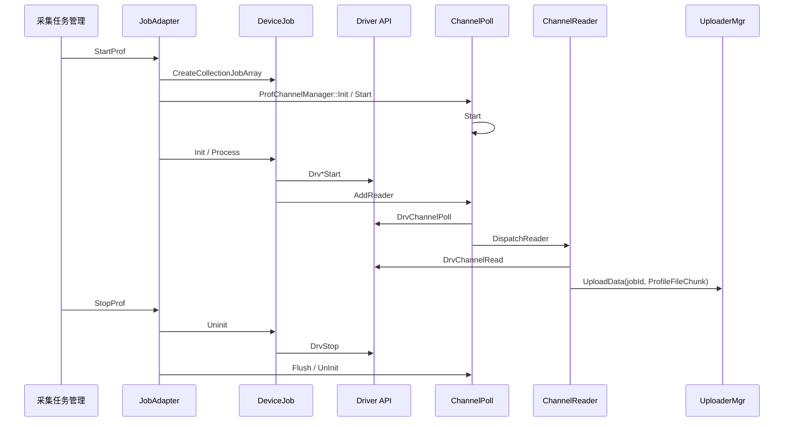
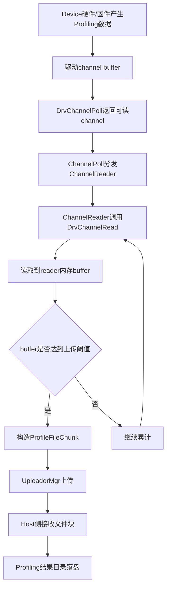
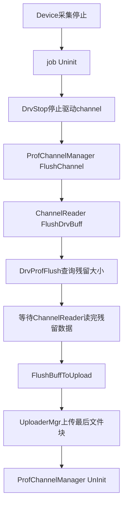
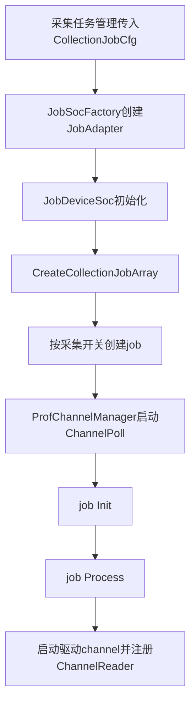
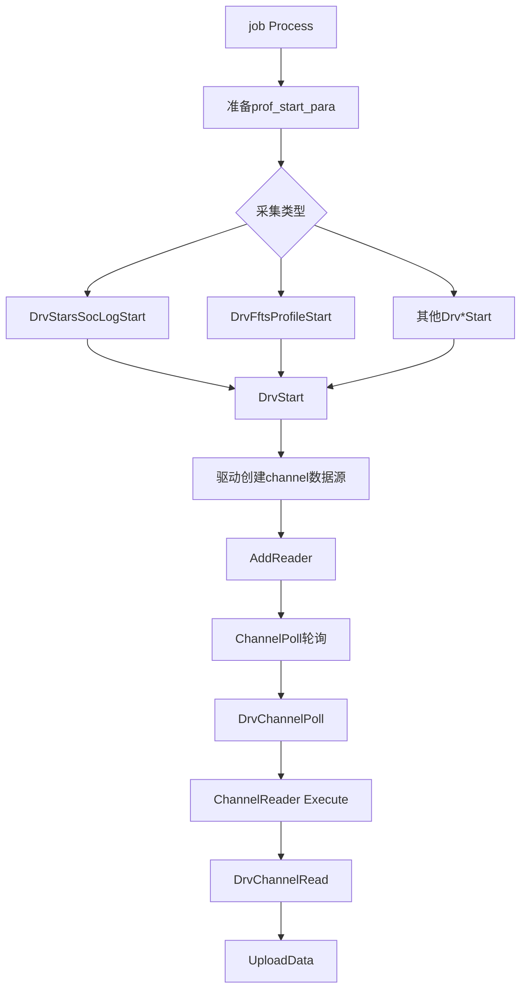

# Device数据采集模块架构

## 1. 模块概述

- **功能介绍**：Device数据采集模块负责根据已解析的Profiling采集配置创建Device侧采集job，通过驱动profiling channel启动硬件/固件数据采集，并由`ChannelPoll`和`ChannelReader`从驱动读取数据后上传到Host侧结果目录。采集范围包括task-based AICore算子log、task-based AICore PMU、sample-based AICore、TS/FFTS调度数据、内存、L2、DVPP等。
- **设计目标**：
  - 以job为粒度管理不同Device采集项，屏蔽不同driver start参数和channel差异。
  - 将采集启动、驱动channel读取、数据上传、停止flush拆分为清晰的职责边界。
  - 通过统一`ChannelPoll`轮询驱动channel，避免每个采集项独立创建轮询线程。

## 2. 使用场景

### 2.1 普通Device采集

开关处理模块完成命令行、acljson、geoption或ACL API配置解析后，将统一的采集参数传入Device采集模块。Device模块根据`ProfileParams`中的采集开关创建对应job，并在job中启动驱动channel。

### 2.2 订阅模式采集

订阅模式与普通模式在Device channel启动和读取上的主流程基本一致，差异主要体现在配置中携带modelId、cacheFlag和订阅开关。Device模块仍复用job创建、驱动启动、channel读取和停止flush链路。

## 3. 模块间接口
Device采集模块接口只保留模块间对接点，不展开内部实现细节。

### 3.1 采集任务管理接口

| 上游模块 | 接口名称 | 下游模块 | 作用 | 位置 |
| --- | --- | --- | --- | --- |
| 开关处理模块 | `JobDeviceSoc::StartProf` / `JobDeviceSoc::StopProf` | Device采集模块 | 接收统一配置，驱动Device侧job创建、启动和停止。 | `src/dfx/msprof/collector/dvvp/profimpl/collect/job_wrapper/include/job_device_soc.h` |

## 4. 架构总览

### 4.1 整体设计思路

Device采集以`ProfileParams`和`CollectionJobCfg`为输入，以采集job为编排单元。每个job负责判断开关、准备驱动参数、启动对应channel并注册reader；全局`ChannelPoll`负责轮询驱动事件，`ChannelReader`负责按channel读取数据并上传。停止时按job反向停止驱动channel，最后flush并释放poll线程。

### 4.2 核心模块交互图

## 5. 数据流与落盘

### 5.1 驱动channel数据流

**流程说明**：

1. 具体job调用`Drv*Start`后，驱动侧开始向对应profiling channel写入Device数据。
2. `ChannelPoll::Run`每轮最多查询多个可读channel，默认poll超时时间为1秒。
3. poll到可读channel后，`ChannelPoll`查找对应`ChannelReader`并投递到线程池执行。
4. `ChannelReader::Execute`循环调用`DrvChannelRead`，将数据读入reader内部buffer；当buffer达到上传阈值或读取结束时，调用`UploadData`。
5. `UploadData`构造`ProfileFileChunk`，设置`chunkModule = PROFILING_IS_FROM_DEVICE`，通过`UploaderMgr::UploadData(jobId, fileChunk)`发送。
6. Host侧接收文件块后按`fileName`、`extraInfo`和slice规则写入Profiling结果目录，形成后续解析使用的Device侧原始数据文件。

### 5.2 停止阶段数据flush流

**流程说明**：

1. job停止时先调用`DrvStop`关闭对应channel的数据产生。
2. 对支持flush的channel，`ChannelReader::FlushDrvBuff`调用`DrvProfFlush`查询驱动残留数据大小。
3. reader在后续`DrvChannelRead`中统计已读flush数据，达到flush大小或读到0时唤醒等待线程。
4. flush完成后调用`FlushBuffToUpload`上传reader buffer中的剩余数据，再释放`ChannelPoll`和reader资源。

## 6. 详细设计

### 6.1 Device job创建与注册流程

**流程说明**：

1. 采集任务管理侧将设备ID、job上下文、`ProfileParams`和结果路径封装为`CollectionJobCfg`。
2. `JobSocFactory::CreateJobAdapter`根据设备形态创建对应adapter，SoC场景进入`JobDeviceSoc`。
3. `JobDeviceSoc::CreateCollectionJobArray`按采集项构造具体job，包括TS、AICore、内存、L2、DVPP等。
4. `ProfChannelManager::Init`创建并启动全局`ChannelPoll`。
5. 每个job在`Process`中调用对应`Drv*Start`启动驱动采集，并通过公共channel job逻辑注册`ChannelReader`。

### 6.2 驱动channel启动与读取流程

**流程说明**：

1. job根据采集项选择具体驱动启动接口。task-based级别AICore算子log数据使用`DrvStarsSocLogStart`，task-based级别AICore算子PMU数据使用`DrvFftsProfileStart`。
2. 各`Drv*Start`接口负责构造`prof_start_para`或采集项私有配置，最终调用`DrvStart`进入驱动。
3. channel启动成功后，job注册`ChannelReader`，并将deviceId、channelId、输出文件名、job上下文绑定到reader。
4. `ChannelPoll`线程周期调用`DrvChannelPoll`获得可读channel，并分发到对应reader。
5. `ChannelReader::Execute`循环调用`DrvChannelRead`读取数据，缓存后通过上传通路发送到Host。

### 6.3 核心机制详解

#### job隔离

每个采集项封装为独立job，job只负责自己的开关判断、参数组装、驱动启动和停止。这样新增采集项时主要新增或扩展对应job，不需要改动`ChannelPoll`和`ChannelReader`读取框架。

#### channel读取隔离

每个reader绑定一个device/channel/输出文件名。`ChannelPoll`只负责发现可读channel并投递reader，不直接读取数据。reader内部使用独立buffer累计数据，单个channel读失败只影响该reader，不会直接阻塞其他channel。

#### 轮询与线程池

`ChannelPoll`统一轮询所有驱动channel，减少每个采集项独立线程的开销；reader执行通过线程池分发，并用`schedulingTime_`避免同一个reader被重复调度过多次。线程池大小按设备数量计算，最小不低于默认线程数，最大不超过设备上限。

#### 停止flush

停止阶段先停止驱动channel，再对支持flush的channel执行`DrvProfFlush`和残留读取。该机制在停止窗口内尽量读取驱动残留buffer，减少数据丢失。

## 7. 线程机制

| 线程/任务 | 创建位置 | 生命周期 | 职责 |
| --- | --- | --- | --- |
| `ChannelPoll`线程 | `ProfChannelManager::Init` -> `ChannelPoll::Start` | Device采集启动到`ProfChannelManager::UnInit` | 周期调用`DrvChannelPoll`获取可读channel，并分发reader。 |
| `ChannelReader`任务 | job注册reader后由`ChannelPoll::DispatchReader`投递 | channel可读时由线程池调度 | 调用`DrvChannelRead`读取数据，构造并上传`ProfileFileChunk`。 |
| Channel线程池 | `ChannelPoll::Start` | `ChannelPoll`启动到停止 | 执行reader任务，线程池队列大小由`CHANNELPOLL_THREAD_QUEUE_SIZE`控制。 |
| `ChannelBuffer`辅助线程 | `ChannelPoll::Start` | `ChannelPoll`启动到停止 | 为reader提供buffer复用能力，降低频繁分配大buffer的开销。 |

线程同步要点：

- `ChannelPoll`使用`readers_`映射保存device/channel到reader的关系，并通过互斥锁保护增删查。
- `ChannelReader::Execute`使用`mtx_`保护reader内部buffer和读取状态，避免flush和普通读取并发破坏buffer。
- `FlushDrvBuff`使用`flushMutex_`和条件变量等待驱动残留数据读完，再触发最后一次上传。
- `ChannelPoll::Stop`按poll线程、线程池、ChannelBuffer顺序停止，最后清理计数和buffer对象。

## 8. 子模块职责划分

| 子模块 | 位置 | 职责 |
| --- | --- | --- |
| 采集任务管理子模块 | `src/dfx/msprof/collector/dvvp/profimpl/collect/job_wrapper/src/job_device_soc.cpp` | 根据统一配置创建Device采集任务并组织job执行顺序。 |
| job adapter子模块 | `src/dfx/msprof/collector/dvvp/profimpl/collect/job_wrapper/include/job_device_soc.h`、`src/dfx/msprof/collector/dvvp/profimpl/collect/job_wrapper/src/job_device_soc.cpp` | 管理Device采集生命周期，创建和停止采集job。 |
| collection job子模块 | `src/dfx/msprof/collector/dvvp/profimpl/collect/job_wrapper/include/prof_comm_job.h`、`src/dfx/msprof/collector/dvvp/profimpl/collect/job_wrapper/src/prof_comm_job.cpp`、`src/dfx/msprof/collector/dvvp/profimpl/collect/job_wrapper/src/prof_*_job.cpp` | 负责具体采集项的开关判断、驱动参数准备和启动停止。 |
| 驱动适配子模块 | `src/dfx/msprof/collector/dvvp/driver/inc/ai_drv_prof_api.h`、`src/dfx/msprof/collector/dvvp/driver/channel/ai_drv_prof_api.cpp`、`src/dfx/msprof/collector/dvvp/driver/devmgmt/msprof_drv_api.cpp` | 封装驱动so接口、channel start/stop/poll/read。 |
| channel管理子模块 | `src/dfx/msprof/collector/dvvp/profimpl/collect/job_wrapper/include/prof_channel_manager.h`、`src/dfx/msprof/collector/dvvp/profimpl/collect/job_wrapper/src/prof_channel_manager.cpp` | 管理`ChannelPoll`生命周期和全局flush。 |
| channel读取子模块 | `src/dfx/msprof/collector/dvvp/transport/prof_channel.h`、`src/dfx/msprof/collector/dvvp/transport/prof_channel.cpp` | 轮询和读取驱动channel数据。 |
| 数据上传子模块 | `src/dfx/msprof/collector/dvvp/transport/uploader_mgr.h`、`src/dfx/msprof/collector/dvvp/transport/uploader_mgr.cpp` | 将Device数据按文件块上传到Host侧处理。 |
## 9. 核心数据结构

| 数据结构 | 说明 | 位置 |
| --- | --- | --- |
| `ProfileParams` | Profiling统一参数结构，承载采集开关、频率、metrics、订阅等配置。 | `src/dfx/msprof/collector/dvvp/common`相关头文件 |
| `CollectionJobCfg` | job运行配置，包含公共参数、job上下文、事件列表、数据路径等。 | `src/dfx/msprof/collector/dvvp/profimpl/collect/job_wrapper/include/collection_job.h` |
| `prof_start_para` | 驱动channel启动参数，由`Drv*Start`填充后传入驱动。 | `src/dfx/msprof/collector/dvvp/driver/inc/msprof_drv_api.h` |
| `PROF_POLL_INFO` | 驱动channel poll返回结构，标识可读device/channel。 | `src/dfx/msprof/collector/dvvp/driver/inc/ai_drv_prof_api.h` |
| `ProfileFileChunk` | Device数据上传文件块结构。 | `src/dfx/msprof/collector/dvvp/common`相关头文件 |
