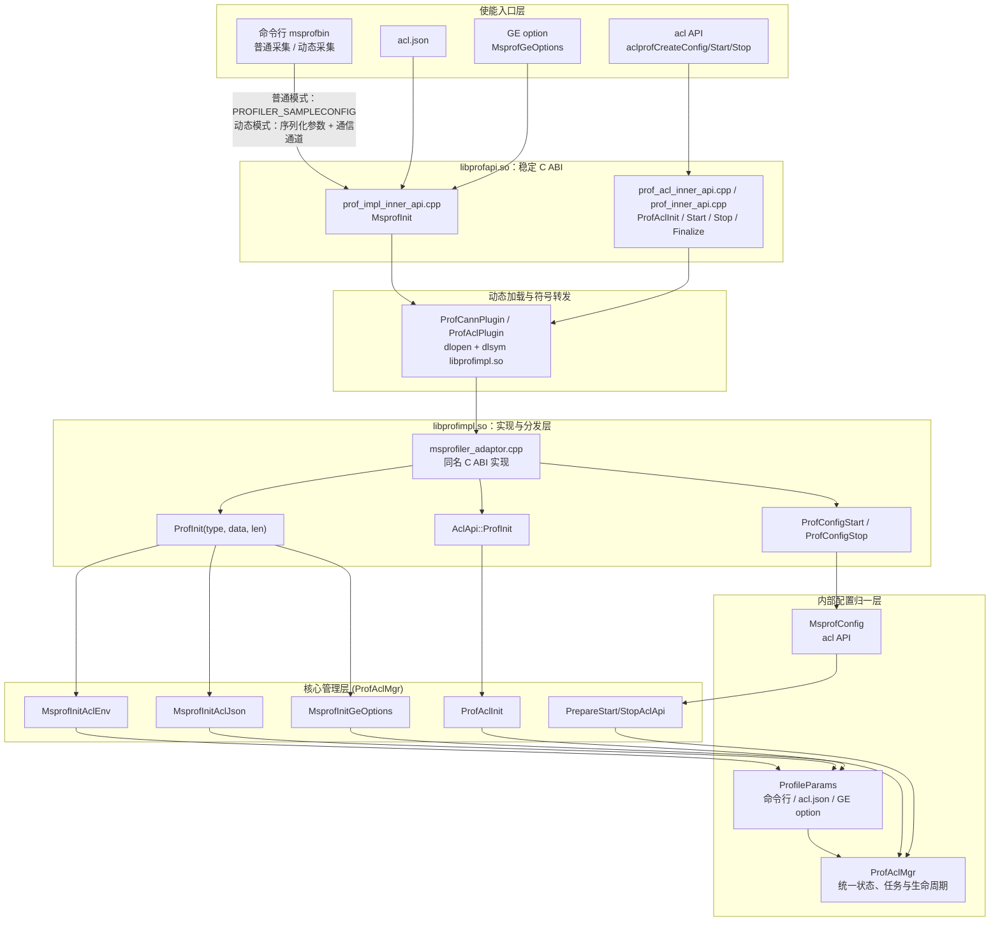
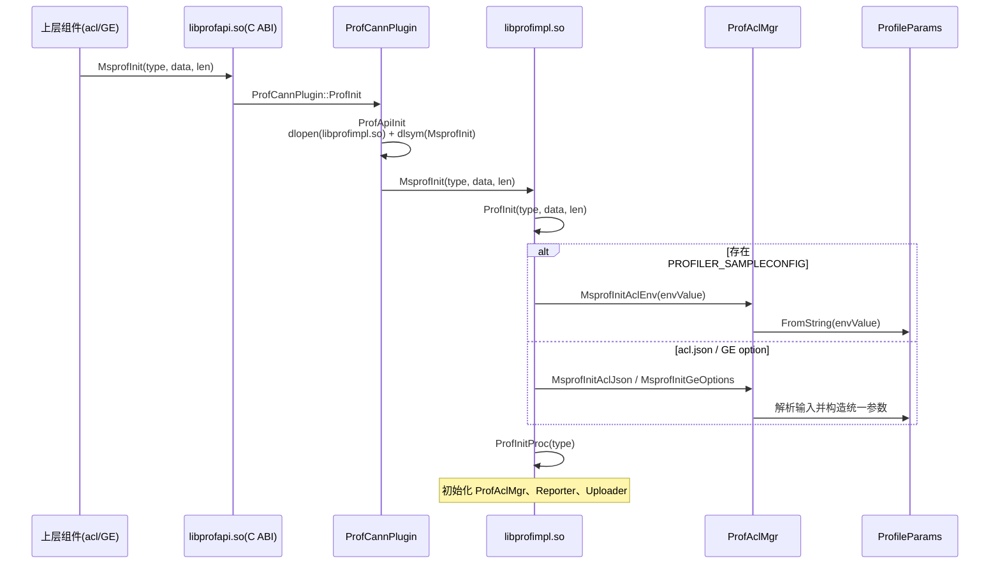
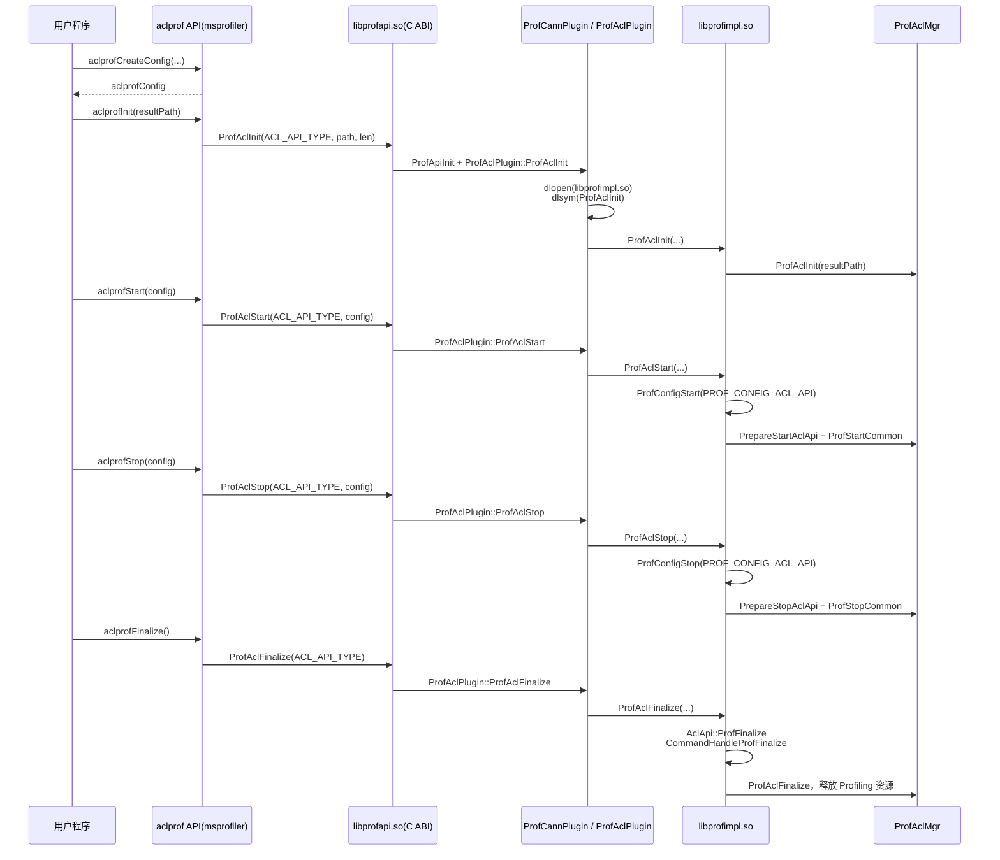
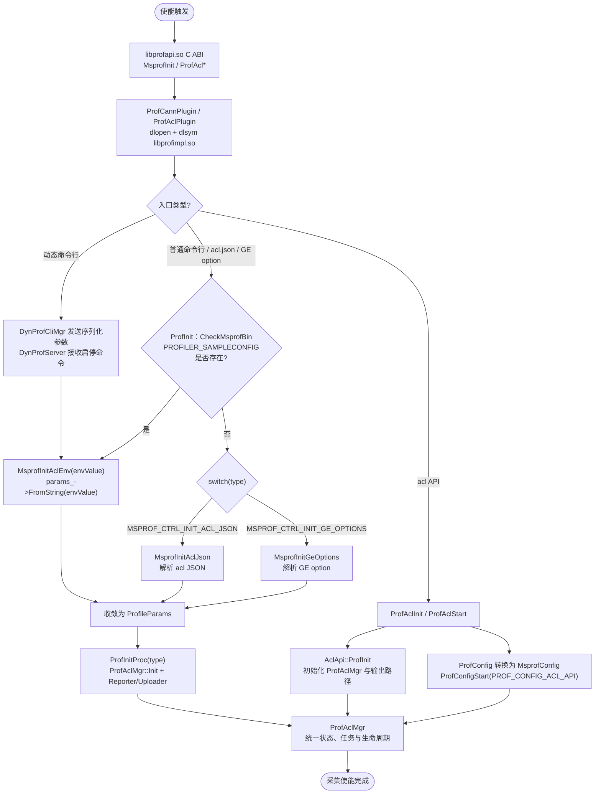
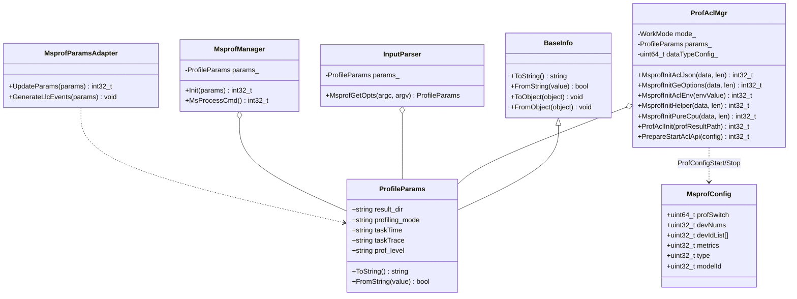

# 使能与选项处理 模块架构

## 1. 模块概述

- **功能介绍**：msprof（Profiling）支持 4 种使能方式来启动性能数据采集：命令行 msprof（包含普通采集和动态采集）、acl.json、GE option、acl API。各入口的参数形式和启停方式不同，但均通过 `libprofapi.so` 对外导出的 C ABI 进入 Profiling，实现侧由 `libprofapi.so` 按需加载 `libprofimpl.so`，最终在 `ProfAclMgr` 中收敛为统一的参数状态和采集任务。本模块聚焦“使能入口 → C ABI → 动态加载 → 参数归一 → 任务启停”链路。
- **设计目标**：
  - **多入口统一**：无论用户从命令行、acl.json、GE option 还是 acl API 进入，都在实现层转换为内部配置，并由 `ProfAclMgr` 统一管理采集状态、任务和生命周期，降低维护成本。
  - **前后端解耦**：调用方只依赖 `libprofapi.so` 导出的稳定 C ABI——上层组件（acl/GE）经 `MsprofInit`（声明于对外交付头 `inc/toolchain/aprof_pub.h`），msprof 内部的 msprofiler 用户 API 层经 `ProfAcl*`（内部头，不对外交付）；`libprofapi.so` 通过 `dlopen`/`dlsym` 按需加载 `libprofimpl.so` 中的实际实现，实现二进制解耦与可选加载。
  - **参数可序列化**：`ProfileParams` 继承 `BaseInfo`，通过 `FromString`/`ToString`（JSON）实现在进程/模块间传递。

## 2. 使用场景与对外接口

### 2.1 使用场景

- **场景一（命令行 msprof，含动态采集）**：普通采集由 `msprof --output=... --application=...` 拉起被测程序，将序列化后的 `ProfileParams` 写入 `PROFILER_SAMPLECONFIG`；动态采集是命令行方式的子模式，由 `--dynamic=on` 配合 `--application` 或 `--pid` 选择目标进程。`DynProfCliMgr` 将同一份序列化参数通过动态采集通信通道发送给应用内的 `DynProfServer`，服务端再调用 `MsprofInitAclEnv` 完成参数恢复和采集启停。因此动态采集仍复用命令行参数体系，不作为独立的使能方式。
- **场景二（acl.json）**：用户调用 `aclInit(configPath)` 时传入 acl.json 路径。ACL 从文件顶层提取 `profiler` 配置段；当不存在有效的 `PROFILER_SAMPLECONFIG` 环境变量时，将该配置段序列化为字符串，通过 `MsprofInit(MSPROF_CTRL_INIT_ACL_JSON, data, len)` 传给 Profiling。`ProfAclMgr::MsprofInitAclJson` 校验 `switch=on` 和各配置项，并转换为统一参数。
- **场景三（GE option）**：GE 将 Profiling option 和 job 信息封装为 `MsprofGeOptions`，调用 `MsprofInit(MSPROF_CTRL_INIT_GE_OPTIONS, data, len)`，由 `ProfAclMgr::MsprofInitGeOptions` 解析为内部参数。该方式与 `aclgrphProfInit`/`aclgrphProfStart`/`aclgrphProfStop` 这一组 GE 主动控制 API 是不同入口。
- **场景四（acl API）**：用户在代码中调用 `aclprofCreateConfig` / `aclprofInit` / `aclprofStart` / `aclprofStop` 主动控制采集区间。

### 2.2 对外接口

| 接口 | 文件位置 | 说明 |
| ---- | -------- | ---- |
| `main` / `InputParser::MsprofGetOpts` | `collector/dvvp/msprofbin/src/msprof_bin.cpp`、`collector/dvvp/msprofbin/src/input_parser.cpp` | 命令行工具入口，解析参数生成 `ProfileParams` |
| `MsprofInit(dataType, data, dataLen)` | `collector/dvvp/profapi/src/prof_impl_inner_api.cpp` | `libprofapi.so` 导出的 C ABI；经 `ProfCannPlugin` 动态转发到 `libprofimpl.so` 同名实现 |
| `aclprofCreateConfig` / `aclprofStart` / `aclprofStop` | `collector/dvvp/msprofiler/prof_acl_api.cpp` | acl API 方式，创建配置并经 `ProfAcl*` C ABI 启停采集 |
| `aclgrphProfInit` / `aclgrphProfStart` / `aclgrphProfStop` | `collector/dvvp/msprofiler/prof_ge_core.cpp` | GE 主动控制接口，经 `ProfAcl*` C ABI 调用实现层；不属于 `MSPROF_CTRL_INIT_GE_OPTIONS` 分支 |

> 说明：`aclprof*` 用户 API 的其余部分（`aclprofCreateStamp`/`aclprofMark`/`aclprofRange*` 等打点标注类、`aclprofGetStepTimestamp` 时间戳类及 `aclprofModelSubscribe` 订阅类）位于 `collector/dvvp/msprofiler/prof_acl_core.cpp`，同样经 `ProfAcl*` C ABI 进入实现层，但服务于采集期间的打点与订阅，不参与本模块所述的使能链路（构造配置、启停采集区间），故不展开。

## 3. 架构总览

### 3.1 整体设计思路

4 种使能方式首先进入 `libprofapi.so` 导出的 C ABI（`MsprofInit` / `ProfAclInit` / `ProfAclStart` 等）。`ProfCannPlugin` 或 `ProfAclPlugin` 首次调用时通过 `dlopen("libprofimpl.so")` 加载实现库，并通过 `dlsym` 获取同名实现函数。普通命令行、acl.json 和 GE option 在 `ProfInit` 中按 `MsprofCtrlCallbackType` 分发；动态命令行由 `ProfInit` 启动应用内服务，再由 `DynProfServer` 使用客户端传入的参数启动或停止采集；acl API 通过 `ProfConfigStart` 按 `ProfConfigType` 分发。各路径最终均由 `ProfAclMgr` 维护统一参数状态并启动对应采集任务。

### 3.2 架构分层图



### 3.3 核心模块交互图

**命令行、acl.json、GE option 初始化交互**：



**acl API 使能交互**：



## 4. 详细设计

### 4.1 核心流程

#### 4 种使能方式归一流程



**流程步骤说明**：

1. 上层 acl/GE 只调用 `libprofapi.so` 导出的 `MsprofInit`、`ProfAclInit`、`ProfAclStart` 等 C ABI。`ProfCannPlugin::ProfApiInit` 负责 `dlopen("libprofimpl.so")`，`ProfCannPlugin`/`ProfAclPlugin` 再通过 `dlsym` 获取实现库中的同名函数；未加载实现库时按接口约定降级返回，从而保持上层与实现库的二进制解耦。
2. `libprofimpl.so` 中 `msprofiler_adaptor.cpp` 的 `MsprofInit` 调用 `Analysis::Dvvp::ProfilerCommon::ProfInit(dataType, data, dataLen)`。`ProfInit` 首先通过 `CheckMsprofBin` 检查环境变量 `PROFILER_SAMPLECONFIG`，普通命令行因此进入 `MsprofInitAclEnv`。动态命令行同样复用 msprofbin 的参数解析与 `ProfileParams` 序列化，但由 `DynProfCliMgr` 经通信通道发送给应用内 `DynProfServer`，服务端收到开始命令后调用 `MsprofInitAclEnv`。
3. 若无该环境变量，则按 `type`（`MsprofCtrlCallbackType`）分发到 `ProfAclMgr` 的 `MsprofInitAclJson` / `MsprofInitGeOptions` / `MsprofInitHelper` / `MsprofInitPureCpu`。
4. acl API 不走 `ProfilerCommon::ProfInit` 的类型分支：初始化经 `ProfAclInit`（`msprofiler_adaptor.cpp` → `Msprofiler::AclApi::ProfInit`）进入 `ProfAclMgr::ProfAclInit`，start/stop 配置再经 `ProfConfigStart`/`ProfConfigStop` 进入 `PrepareStartAclApi`/`PrepareStopAclApi`。
5. 所有 4 种使能方式最终均归一到 `ProfAclMgr`：命令行、acl.json、GE option 将输入转换为 `ProfileParams`，acl API 将 `ProfConfig` 转换为内部 `MsprofConfig` 并更新管理器状态。此后由 `ProfAclMgr` 完成必要的 Reporter/Uploader 初始化、任务构造及采集启停。

**关键代码**（分发逻辑）：

```cpp
// 文件位置：collector/dvvp/profimpl/adapter/src/msprofiler_impl.cpp
int32_t ProfInit(uint32_t type, VOID_PTR data, uint32_t len)
{
    ...
    std::string envValue;
    if (CheckMsprofBin(envValue)) {                     // 命令行 msprof：env 收敛
        ret = ProfAclMgr::instance()->MsprofInitAclEnv(envValue);
    } else {
        switch (type) {
            case MSPROF_CTRL_INIT_ACL_JSON:
                ret = ProfAclMgr::instance()->MsprofInitAclJson(data, len);
                break;
            case MSPROF_CTRL_INIT_GE_OPTIONS:
                ret = ProfAclMgr::instance()->MsprofInitGeOptions(data, len);
                break;
            case MSPROF_CTRL_INIT_HELPER:
                ret = ProfAclMgr::instance()->MsprofInitHelper(data, len);
                break;
            case MSPROF_CTRL_INIT_PURE_CPU:
                ret = ProfAclMgr::instance()->MsprofInitPureCpu(data, len);
                break;
            default:
                MSPROF_LOGE("Invalid MsprofCtrlCallback type: %u", type);
        }
    }
    ...
    return ProfInitProc(type);
}
```

### 4.2 核心机制详解

本节按“入口分发 → 输入解析 → 参数归一”的参数流转主线组织（4.2.1–4.2.3），并以 4.2.4 单独说明贯穿各环节的实现库按需加载机制。

#### 4.2.1 使能方式总览与分发机制

4 种使能方式的入口、关键实现与分发路径如下表：

| 使能方式 | 入口文件 | 关键类 / 函数 | 分发类型 / 路径 |
| -------- | -------- | ------------- | --------------- |
| 命令行 msprof（普通/动态） | `collector/dvvp/msprofbin/src/msprof_bin.cpp`（链接为 msprofbin 可执行程序，唯一 `main` 入口） | `main` → `InputParser::MsprofGetOpts` 解析参数 → `MsprofManager::Init`/`MsProcessCmd` 校验并拉起应用（`MsprofParamsAdapter` 二次加工）；动态模式 `--dynamic=on` 由 `DynProfCliMgr` 与应用内动态服务交互；两者共用 `ProfileParams` | 普通模式经 `PROFILER_SAMPLECONFIG` 进入 `MsprofInitAclEnv`；动态模式使用 `MSPROF_CTRL_INIT_DYNA` 启动服务，并由动态通信通道传递序列化参数和启停命令 |
| acl.json | `collector/dvvp/profapi/src/prof_impl_inner_api.cpp`（`MsprofInit` C ABI） | `MsprofInit` → `ProfInit` → `ProfAclMgr::MsprofInitAclJson` | `MSPROF_CTRL_INIT_ACL_JSON`（=1） |
| GE option | `collector/dvvp/profapi/src/prof_impl_inner_api.cpp`（`MsprofInit` C ABI；上层 GE 调用方在 GE 仓） | `MsprofInit` → `ProfInit` → `ProfAclMgr::MsprofInitGeOptions`（输入结构 `MsprofGeOptions` 定义于 `inc/toolchain/aprof_pub.h`） | `MSPROF_CTRL_INIT_GE_OPTIONS`（=2） |
| acl API | `collector/dvvp/msprofiler/prof_acl_api.cpp`（使能链路 `aclprof*` API；打点/订阅类 API 在 `prof_acl_core.cpp`，见 2.2 说明） | `aclprofCreateConfig`/`aclprofStart`/`aclprofStop` → `ProfAclMgr::ProfAclInit` / `PrepareStartAclApi` | `ProfConfigType::PROF_CONFIG_ACL_API`（=6） |

> 说明：命令行方式的实现在 oam-tools 仓 `src/msprof/` 下；其余三种方式的实现在 runtime 仓 `src/dfx/msprof/` 下（oam-tools 仓对应目录仅保留部分头文件），表中路径均为各仓 `collector/dvvp/` 下的相对路径。acl.json 与 GE option 共用 `MsprofInit` C ABI 入口，仅 `type` 取值不同。

分发规则：

- **环境变量优先**：`ProfInit` 先经 `CheckMsprofBin` 检查 `PROFILER_SAMPLECONFIG`，存在时不论 `type` 为何均进入 `MsprofInitAclEnv`，因此命令行配置优先于 acl.json / GE option。
- **按类型分发**：无该环境变量时，按 `type`（`MsprofCtrlCallbackType`）分发到 `ProfAclMgr` 的 `MsprofInitAclJson` / `MsprofInitGeOptions` / `MsprofInitHelper` / `MsprofInitPureCpu`。
- **acl API 旁路**：acl API 不经 `ProfInit` 的 `type` 分支，start/stop 配置经 `ProfConfigStart` / `ProfConfigStop` 按 `ProfConfigType`（如 `PROF_CONFIG_ACL_API`）分发。

> 说明：`MsprofCtrlCallbackType` 定义于 `pkg_inc/profiling/aprof_pub.h`（`MSPROF_CTRL_INIT_ACL_ENV=0`、`ACL_JSON=1`、`GE_OPTIONS=2`、`FINALIZE=3`、`HELPER=4`、`PURE_CPU=5`、`AICPU=6`、`DYNA=0xFF`）；`ProfConfigType` 定义于 `collector/dvvp/msprof/engine/include/prof_acl_mgr.h`。

#### 4.2.2 各使能方式的输入解析

各使能方式的差异集中在输入形式与解析位置，解析产物统一收敛为内部参数（见 4.2.3）。

##### 命令行参数解析（msprofbin）

**设计思想**：`msprofbin` 是独立可执行程序。`main`（`msprof_bin.cpp`）初始化 `Platform` 后创建 `InputParser`，调用 `MsprofGetOpts` 按 `LONG_OPTIONS` 表逐项解析命令行开关，生成 `ProfileParams`；随后 `MsprofManager::Init` 接管参数并做 `ParamsCheck`，`MsProcessCmd` 经 `RunningMode` 拉起被测应用。`RunningMode` 内调用 `MsprofParamsAdapter` 完成参数二次加工，参数最终经 `ProfileParams::ToString()` 序列化为 JSON，由 `app/application.cpp` 在拉起子进程时以 `PROFILER_SAMPLECONFIG` 环境变量注入。

动态采集归属于命令行使能方式。用户指定 `--dynamic=on` 后，`InputParser::MsprofDynamicCheckValid` 校验必须且只能配置 `--application` 或 `--pid` 之一，并由 `DynProfCliMgr` 记录目标进程。交互式动态采集时，`DynProfCliMgr` 将 `ProfileParams::ToString()` 的结果发送给应用内 `DynProfServer`，服务端收到开始命令后调用 `MsprofInitAclEnv` 解析该字符串；delay/duration 动态采集则由 `DynProfThread` 从 `PROFILER_SAMPLECONFIG` 读取参数。动态采集改变的是目标进程连接和启停时机，不新增参数体系或独立使能入口。

##### acl.json 配置解析

- 输入为 ACL 侧从 acl.json 顶层 `profiler` 配置段提取并序列化的字符串（属 ACL 组件职责，见 2.1 场景二）；msprof 侧入口为 `MsprofInit(MSPROF_CTRL_INIT_ACL_JSON, data, len)` C ABI（`profapi/src/prof_impl_inner_api.cpp`）。
- 该调用经 `ProfCannPlugin` 动态转发到 `libprofimpl.so` 的同名实现，进入 `ProfInit`；无 `PROFILER_SAMPLECONFIG` 环境变量时按 `type` 分发到 `ProfAclMgr::MsprofInitAclJson(data, len)`。
- `MsprofInitAclJson` 完成入参校验（`CheckAclJsonInitData`）与回调前置检查（`CallbackInitPrecheck`）后，将输入构造成配置字符串，交由 `ParseAclJsonConfig` 基于 NanoJson（`common/json/json.cpp`）解析。
- `CheckAclJsonConfigInvalid` 检查字段合法性并要求 `switch` 为 `on`，`MsprofAclJsonParamConstruct` 将 `output`、`task_time`、`aicpu`、`hccl` 等选项转换为 `ProfileParams`。
- `CheckWhitelistAndBuildConfig` 执行公共的白名单校验和配置展开（与 GE option、命令行 `MsprofInitAclEnv` 路径共用），后续统一进入 `ProfAclMgr::Init` 及采集任务启动流程。

##### GE option 解析

- GE 将 Profiling option 和 job 信息封装为 `MsprofGeOptions` 结构（定义于 `inc/toolchain/aprof_pub.h`），通过 `MsprofInit(MSPROF_CTRL_INIT_GE_OPTIONS, data, len)` 传入。
- 实现层由 `ProfAclMgr::MsprofInitGeOptions` 将该结构解析并转换为 `ProfileParams`，随后进入统一的校验与任务启动流程。
- 该方式与 GE 主动控制 API（`aclgrphProfInit` / `aclgrphProfStart` / `aclgrphProfStop`）是不同入口：后者经 `ProfAcl*` C ABI 直接进入实现层控制采集区间，不走 `MSPROF_CTRL_INIT_GE_OPTIONS` 分支。

##### acl API 配置转换

- 用户在代码中调用 `aclprofCreateConfig` 创建 `ProfConfig` 配置对象，并通过 `aclprofInit` / `aclprofStart` / `aclprofStop` / `aclprofFinalize` 主动控制采集区间。
- 初始化经 `ProfAclInit` 进入 `ProfAclMgr::ProfAclInit`，完成 `ProfAclMgr` 与结果输出路径初始化。
- start/stop 时 `ProfConfigStart` / `ProfConfigStop` 按 `ProfConfigType::PROF_CONFIG_ACL_API` 分发，由 `PrepareStartAclApi` / `PrepareStopAclApi` 将 `ProfConfig` 转换为内部 `MsprofConfig`，再经 `ProfStartCommon` / `ProfStopCommon` 完成采集启停。

#### 4.2.3 参数归一与统一管理

**设计思想**：4 种使能方式的差异仅保留在“输入解析”和“启停控制”阶段：命令行使用序列化环境变量，acl.json 使用 `profiler` JSON 对象，GE option 使用图引擎选项，acl API 使用 `ProfConfig`；进入实现层后统一收敛，由 `ProfAclMgr` 集中管理。

- **归一载体**：
  - 命令行、acl.json 和 GE option 归一为 `ProfileParams`（`message/prof_params.h`）：继承自 `BaseInfo`，通过 `ToString()` / `FromString()` 支持 JSON 序列化，可在进程/模块间传递；命令行普通模式经 `PROFILER_SAMPLECONFIG` 环境变量、动态采集经通信通道传递的正是其序列化结果。
  - acl API 在实现边界将外部 `ProfConfig` 转换为内部 `MsprofConfig`，再经 `ProfConfigStart` / `ProfConfigStop` 驱动启停。
- **统一管理**：两类配置并非同一数据结构，但都会进入 `ProfAclMgr`，由其统一维护采集状态、执行参数校验与平台/特性适配，并构造和启停采集任务。

#### 4.2.4 实现库动态按需加载

- `libprofapi.so` 中的 `ProfCannPlugin` / `ProfAclPlugin` 在首次调用时通过 `dlopen("libprofimpl.so", RTLD_LAZY | RTLD_NODELETE)` 按需加载实现库，并通过 `dlsym` 获取其中的同名实现函数。
- 实现库缺失或加载失败时按接口约定降级返回，不影响上层组件运行。
- 由此上层组件（acl / GE / 用户程序）仅依赖 `libprofapi.so` 导出的稳定 C ABI，与 `libprofimpl.so` 保持二进制解耦；可选加载带来的性能收益见第 6 节。

### 4.3 模块职责划分

| 子模块 | 职责 | 位置 |
| ------ | ---- | ---- |
| msprofbin | 普通/动态命令行解析、目标应用拉起或连接、参数生成与序列化 | `collector/dvvp/msprofbin/` |
| msprofiler（acl/ge API） | 提供 acl/GE 用户接口，并仅依赖 `ProfAcl*` 等 C ABI | `collector/dvvp/msprofiler/` |
| profapi | 对 acl/GE 等上层提供稳定 C ABI，通过插件按需加载并转发到 `libprofimpl.so` | `collector/dvvp/profapi/` |
| profimpl/adapter | 实现 `libprofimpl.so` 中的同名 C ABI，并完成 `ProfInit` / `ProfConfigStart` 分发 | `collector/dvvp/profimpl/adapter/` |
| msprof/engine（ProfAclMgr） | 各使能方式的初始化与任务下发 | `collector/dvvp/msprof/engine/` |
| message / config | 参数结构、序列化、平台与特性适配 | `collector/dvvp/message/`、`collector/dvvp/common/config/` |

### 4.4 核心数据结构



## 5. 关键文件索引

| 子模块 | 文件路径 | 核心内容 |
| ------ | -------- | -------- |
| 命令行入口 | `collector/dvvp/msprofbin/src/msprof_bin.cpp` | `main`，Platform 初始化、`MsprofGetOpts`、`MsprofManager::Init` |
| 命令行解析 | `collector/dvvp/msprofbin/src/input_parser.cpp`、`include/input_parser.h` | `InputParser`、`LONG_OPTIONS` 选项表、`MsprofArgsType` |
| 命令行管理 | `collector/dvvp/msprofbin/src/msprof_manager.cpp`、`include/msprof_manager.h` | `MsprofManager`（`Init`/`MsProcessCmd`/`ParamsCheck`） |
| 参数适配 | `collector/dvvp/msprofbin/src/msprof_params_adapter.cpp` | `MsprofParamsAdapter`（`UpdateParams`/`GenerateLlcEvents`） |
| 通用参数解析 | `collector/dvvp/common/argparse/argparser.cpp`、`argparser.h` | `Argparser`（`Parse`/`Execute`） |
| 动态命令行控制 | `collector/dvvp/msprof/dynamic_profiling/`、`collector/dvvp/msprofbin/src/input_parser.cpp` | `DynProfCliMgr` / `DynProfMgr`，控制目标进程连接及动态启停 |
| acl.json 入口 | `src/acl/aclrt_impl/toolchain/profiling.cpp` | 从 acl.json 提取 `profiler` 配置段并调用 `MsprofInit(MSPROF_CTRL_INIT_ACL_JSON, ...)` |
| C ABI 门面 | `collector/dvvp/profapi/src/prof_impl_inner_api.cpp`、`prof_acl_inner_api.cpp`、`prof_inner_api.cpp` | `libprofapi.so` 导出的 `Msprof*` / `ProfAcl*` 接口 |
| 实现库加载 | `collector/dvvp/profapi/src/prof_cann_plugin.cpp`、`prof_acl_plugin.cpp` | `dlopen("libprofimpl.so")` 并通过 `dlsym` 加载实现函数 |
| acl API | `collector/dvvp/msprofiler/prof_acl_api.cpp` | `aclprofCreateConfig`/`aclprofStart`/`aclprofStop` |
| GE option | `inc/toolchain/aprof_pub.h`、`collector/dvvp/msprof/engine/src/prof_acl_mgr.cpp` | `MsprofGeOptions` 及 `ProfAclMgr::MsprofInitGeOptions`；上层 GE 调用方在 GE 仓 |
| GE 主动控制 API | `collector/dvvp/msprofiler/prof_ge_core.cpp` | `aclgrphProfInit`/`aclgrphProfStart`/`aclgrphProfStop`，经 `ProfAcl*` ABI 进入实现层 |
| 实现层 C ABI | `collector/dvvp/profimpl/adapter/src/msprofiler_adaptor.cpp` | `libprofimpl.so` 内的 `MsprofInit`/`ProfAclInit` 等同名实现符号 |
| 分发实现 | `collector/dvvp/profimpl/adapter/src/msprofiler_impl.cpp` | `ProfInit`/`ProfInitProc`/`ProfConfigStart` |
| acl API 实现 | `collector/dvvp/profimpl/adapter/src/msprofiler_acl_api.cpp` | `ProfInit(ProfType,...)`/`ProfStart`/`ProfStop` |
| JSON 解析 | `collector/dvvp/profimpl/adapter/src/json_parser.cpp` | `JsonParser`（`ParseJsonFile` 等），解析 `/etc/prof.json` 内部配置（通道周期、缓存长度等），不参与 acl.json 用户配置解析 |
| 核心管理 | `collector/dvvp/msprof/engine/src/prof_acl_mgr.cpp`、`include/prof_acl_mgr.h` | `ProfAclMgr::MsprofInitAclJson/GeOptions/AclEnv`、`ProfConfigType` |
| 参数结构 | `collector/dvvp/message/prof_params.h` | `ProfileParams`（`ToString`/`FromString`） |
| 参数二次适配 | `collector/dvvp/task_handle/src/prof_params_adapter.cpp` | `ProfParamsAdapter` |
| 平台/特性 | `collector/dvvp/common/config/config_manager.cpp`、`feature_manager.cpp` | `ConfigManager`（`PlatformType`）、`FeatureManager` |

## 6. 性能优化策略

- **可选加载**：`libprofapi.so` 的 `ProfCannPlugin` 通过 `dlopen("libprofimpl.so", RTLD_LAZY | RTLD_NODELETE)` 按需加载核心实现，并以 `dlsym` 获取接口符号；上层组件无需直接链接 `libprofimpl.so`。
- **参数归一处理**：字符串配置入口只在边界处解析一次并转换为 `ProfileParams`；acl API 将结构化配置转换为内部 `MsprofConfig`，后续统一复用 `ProfAclMgr` 的校验和任务管理逻辑。
