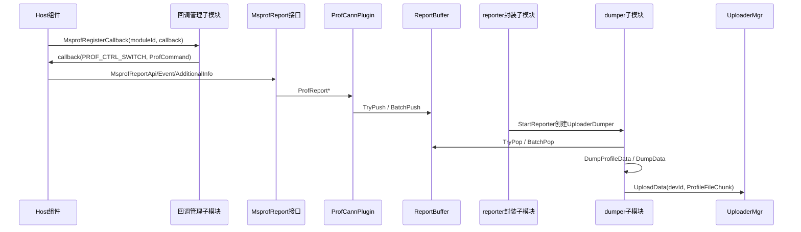
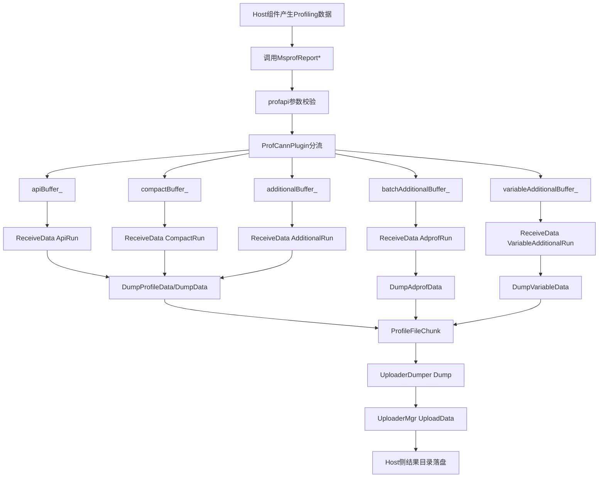
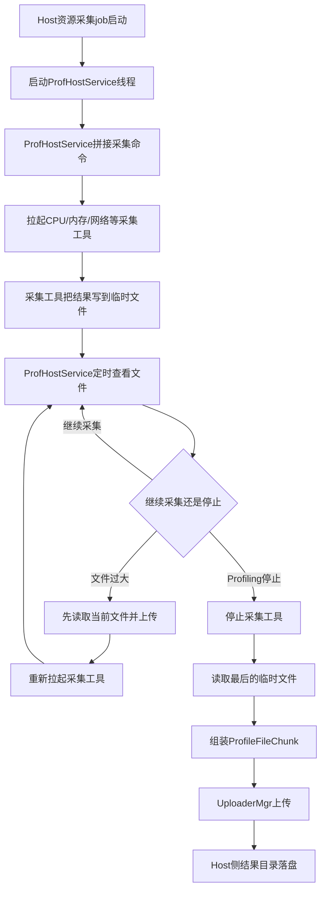
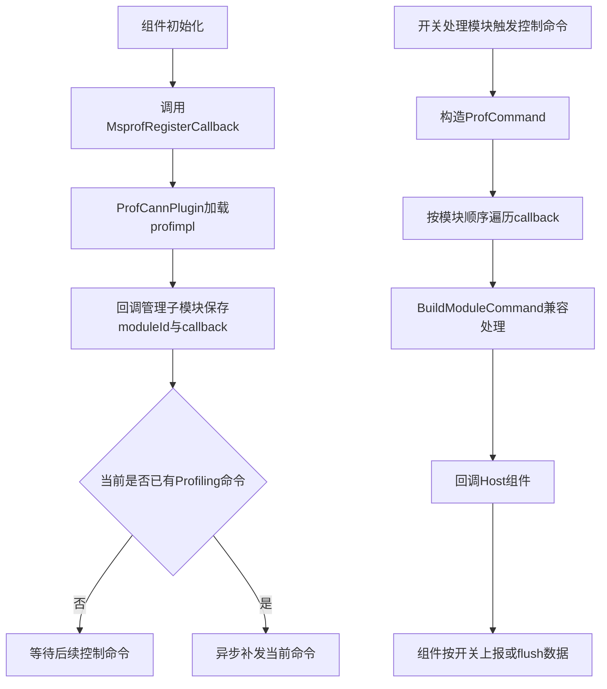

# Host数据采集模块架构

## 1. 模块概述

- **功能介绍**：Host数据采集模块负责接收Runtime、AscendCL、GE、HCCL等Host侧组件主动上报的Profiling数据，并提供Host组件注册Profiling控制回调的机制。Host组件通过回调感知Profiling启动/停止状态，通过`MsprofReport*`接口把Host侧性能数据写入采集缓冲区，后台dumper线程再把缓冲区数据转换为文件块并上传落盘。
- **设计目标**：
  - 统一Host组件感知Profiling状态的机制，组件通过`MsprofRegisterCallback`注册后即可接收控制回调。
  - 统一Host侧数据上报入口，组件通过`MsprofReport*`提交API、event、compact、additional等不同形态数据。
  - 上报接口只做必要校验和buffer入队，数据dump、上传和落盘由后台dumper线程处理。
  - Host数据采集模块只描述Host数据来源、buffer接收和上报数据流，不展开开关处理、Device驱动采集和解析展示等非本模块职责。

## 2. 使用场景

### 2.1 Host组件接收Profiling控制信号

Runtime、AscendCL、GE、HCCL等Host组件在初始化阶段调用`MsprofRegisterCallback`注册模块ID和回调函数。Profiling状态变化时，开关处理模块触发控制命令，Host数据采集模块根据当前`ProfCommand`回调各组件。组件收到启动命令后按开关决定是否采集和上报数据，收到停止/Finalize命令后完成组件侧缓存flush和收尾。

### 2.2 Host组件主动上报数据

Host组件在业务执行路径中调用`MsprofReportApi`、`MsprofReportEvent`、`MsprofReportCompactInfo`、`MsprofReportAdditionalInfo`、`MsprofReportBatchAdditionalInfo`等接口上报数据。上报数据先进入profapi侧buffer，再由`MsprofReporter`创建的`UploaderDumper`线程从buffer取出、dump为`ProfileFileChunk`并交给`UploaderMgr`上传落盘。

### 2.3 Host系统资源采集

Host系统资源采集job用于采集CPU、内存、进程、网络、磁盘等Host资源数据。该类数据由Host采集工具生成临时结果文件，`ProfHostService`负责读取结果并按`ProfileFileChunk`上传。其入口开关和job编排属于采集任务框架，本文重点说明其在Host数据模块内的数据流、线程和落盘方式。

## 3. 模块间接口

Host采集模块接口主要包括Host侧组件直接调用的`Msprof*`回调注册接口和数据上报接口。

| 上游模块 | 接口名称 | 下游模块 | 作用 | 位置 |
| --- | --- | --- | --- | --- |
| Host组件 | `MsprofRegisterCallback` | 回调管理子模块 | 注册Profiling控制回调。 | `src/dfx/msprof/collector/dvvp/profapi/src/prof_impl_inner_api.cpp` |
| Host组件 | `MsprofReportApi` | 上报buffer子模块 | 上报API类定长数据，主要用于Host侧接口性能数据。 | `src/dfx/msprof/collector/dvvp/profapi/src/prof_impl_inner_api.cpp` |
| Host组件 | `MsprofReportEvent` | 上报buffer子模块 | 上报event类定长数据。 | `src/dfx/msprof/collector/dvvp/profapi/src/prof_impl_inner_api.cpp` |
| Host组件 | `MsprofReportCompactInfo` | 上报buffer子模块 | 上报compact结构化数据。 | `src/dfx/msprof/collector/dvvp/profapi/src/prof_impl_inner_api.cpp` |
| Host组件 | `MsprofReportAdditionalInfo` | 上报buffer子模块 | 上报additional扩展数据。 | `src/dfx/msprof/collector/dvvp/profapi/src/prof_impl_inner_api.cpp` |
| Host组件 | `MsprofReportBatchAdditionalInfo` | 上报buffer子模块 | 批量上报`MsprofAdditionalInfo`数组，长度必须按`sizeof(MsprofAdditionalInfo)`对齐。 | `src/dfx/msprof/collector/dvvp/profapi/src/prof_impl_inner_api.cpp` |

## 4. 架构总览

### 4.1 整体设计思路

Host数据采集分为两条数据来源：Host组件主动上报和Host系统资源采集。组件主动上报通过callback感知Profiling状态，再通过`MsprofReport*`进入profapi buffer；`ReceiveData`从buffer取出数据并dump为`ProfileFileChunk`，`UploaderDumper`将文件块交给`UploaderMgr`落盘。Host系统资源采集通过`ProfHostService`拉起采集工具并读取结果文件，之后同样按`ProfileFileChunk`上传。

### 4.2 核心模块交互图

## 5. 数据流与落盘

### 5.1 Host组件上报数据流

**流程说明**：

1. Host组件根据Profiling回调开关，在业务路径中组装`MsprofApi`、`MsprofEvent`、`MsprofCompactInfo`或`MsprofAdditionalInfo`数据。
2. profapi入口做空指针、长度和批量上报边界校验，随后进入`ProfCannPlugin`。
3. `ProfCannPlugin`按数据类型写入不同buffer；该阶段不做落盘，避免业务线程承担文件IO。
4. `MsprofReporter::StartReporter`为对应模块创建`UploaderDumper`，`UploaderDumper::Run`调用`ReceiveData::DoReportRun`循环取buffer数据。
5. `ReceiveData`按模块类型选择`ApiRun`、`CompactRun`、`AdditionalRun`、`AdprofRun`或`VariableAdditionalRun`，将buffer数据组织为`ProfileFileChunk`。
6. `UploaderDumper::Dump`校验文件tag，设置Host侧`chunkModule`，再通过`UploaderMgr::UploadData`进入数据处理模块并落盘。
7. 停止阶段`UploaderDumper::Flush`调用`ReceiveData::FlushAll`等待buffer清空，并通过`WriteDone`通知对应transport写入结束。

### 5.2 Host系统资源数据流

**流程说明**：

1. Host资源采集job启动后，会创建`ProfHostService`线程。
2. `ProfHostService`根据采集类型拼接命令，例如CPU、内存、进程、网络、磁盘分别对应不同采集工具或脚本命令。
3. 采集工具在后台运行，把采集到的文本结果持续写入临时文件。
4. `ProfHostService`线程不直接采样系统指标，而是定时查看临时文件状态。
5. 如果文件太大，`ProfHostService`先停止当前工具，读取已有文件内容并上传，然后重新启动工具继续采集，避免单个文件无限增长。
6. Profiling停止时，`ProfHostService`停止采集工具，读取最后一次临时文件内容，组装`ProfileFileChunk`并通过`UploaderMgr`上传。
7. 上传成功后删除临时文件，最终由数据处理模块写入Host侧结果目录。

## 6. 详细设计

### 6.1 Host组件回调注册与通知流程

**流程说明**：

1. 组件调用`MsprofRegisterCallback(moduleId, callback)`后，profapi转到`ProfCannPlugin::ProfRegisterCallback`，再进入回调管理子模块保存。
2. 回调管理子模块用`moduleCallbacks_`保存模块ID到callback集合的映射，并用互斥锁保护注册过程。
3. 控制命令到达时，回调管理子模块保存callback快照后释放注册锁，再按模块顺序执行回调，避免组件回调执行期间阻塞新组件注册。
4. 启动类命令优先`RUNTIME -> ASCENDCL -> GE`；停止类命令优先`GE -> ASCENDCL -> RUNTIME`；其他模块追加在后。
5. 后注册组件如果发现`command_`中已有有效命令，会通过detach线程补发当前命令，避免组件注册晚于Profiling启动而漏接状态。

### 6.2 核心机制详解

#### 回调命令兼容

`BuildModuleCommand`基于模块ID对命令进行兼容处理。内部开关不直接透传给组件；当某些采集能力需要组件使用更高一级或不同语义开关时，模块命令在回调前完成转换，保证组件只处理自己能识别的`ProfCommand`。

#### 多缓冲分流

| buffer | 输入接口 | 输入结构体 | 接收/dump路径 | 大小约束 |
| --- | --- | --- | --- | --- |
| `apiBuffer_` | `MsprofReportApi` | `MsprofApi` | `ReceiveData::ApiRun` | 固定为`sizeof(MsprofApi)`。 |
| `apiBuffer_` | `MsprofReportEvent` | `MsprofEvent` | `ReceiveData::ApiRun` | 当前实现复用API buffer通路，调用方需保证结构定义兼容。 |
| `compactBuffer_` | `MsprofReportCompactInfo` | `MsprofCompactInfo` | `ReceiveData::CompactRun` | `length`需匹配compact数据结构大小。 |
| `additionalBuffer_` | `MsprofReportAdditionalInfo` | `MsprofAdditionalInfo`或扩展数据 | `ReceiveData::AdditionalRun` | 单条上报按接口传入`length`校验。 |
| `batchAdditionalBuffer_` | `MsprofReportBatchAdditionalInfo` | `MsprofAdditionalInfo[]` | `ReceiveData::AdprofRun` | `length % sizeof(MsprofAdditionalInfo) == 0`，且最大`131072`字节，即`512 * sizeof(MsprofAdditionalInfo)`。 |
| `variableAdditionalBuffer_` | 内部变长数据通路 | 变长additional数据 | `ReceiveData::VariableAdditionalRun` | 按变长buffer协议写入和批量弹出。 |

分流设计同时承担性能优化职责：高频API打点、大块additional、批量additional不共享同一个队列，业务线程只做入队，dump和上传由`UploaderDumper`线程处理。

#### buffer清空与停止flush

`ReceiveData::DoReportRun`循环从buffer取数，取不到数据时通过`SetBufferEmptyEvent`通知等待方。停止阶段`UploaderDumper::Flush`调用`ReceiveData::FlushAll`，等待`reportBufEmpty_`返回true后执行`WriteDone`，保证已进入buffer的数据尽量完成dump和上传。

## 7. 线程机制

| 线程/任务 | 创建位置 | 生命周期 | 职责 |
| --- | --- | --- | --- |
| Host组件业务线程 | 组件自身 | 组件控制 | 调用`MsprofReport*`上报数据；本模块只在该线程内做轻量入队。 |
| callback补发线程 | 回调管理子模块 | 后注册且已有命令时detach一次 | 对晚注册组件异步补发当前`ProfCommand`，避免注册路径同步执行组件逻辑。 |
| `UploaderDumper`线程 | `MsprofReporter::StartReporter` -> `UploaderDumper::Start` | reporter启动到`UploaderDumper::Stop` | 执行`ReceiveData::DoReportRun`，从api/compact/additional等buffer取数据并dump为文件块。 |
| Host采集工具管理线程 | Host资源job启动`ProfHostService` | Host资源采集job启动到`Stop` | 拉起采集工具、周期检查临时文件大小、停止时读取结果并上传。 |
| Host采集工具进程 | `ProfHostService::Process` | `ProfHostService`管理 | 实际采集CPU、内存、进程、网络、磁盘等Host资源并写临时文件。 |

线程同步要点：

- callback注册使用`regCallback_`互斥锁保护`moduleCallbacks_`，下发回调前复制快照，降低锁持有时间。
- `ReceiveData`通过`cvBufferEmpty_`通知buffer已清空，`FlushAll`最多等待多轮，避免停止阶段无限等待。
- `ProfHostService`通过条件变量`isJobUnint_`控制周期等待和停止唤醒，避免停止阶段长时间等待文件大小检查周期。

## 8. 子模块职责划分

| 子模块 | 位置 | 职责 |
| --- | --- | --- |
| profapi接口子模块 | `src/dfx/msprof/collector/dvvp/profapi/src/prof_impl_inner_api.cpp`、`src/dfx/msprof/collector/dvvp/profapi/src/prof_cann_plugin.cpp` | 暴露Host数据上报和callback注册接口，处理动态库加载和空指针校验。 |
| 回调管理子模块 | `src/dfx/msprof/collector/dvvp/profimpl/adapter/src/command_handle.cpp` | 保存组件callback，构造并下发`ProfCommand`，处理后注册补发。 |
| 上报buffer子模块 | `src/dfx/msprof/collector/dvvp/profapi/inc/prof_cann_plugin.h`、`src/dfx/msprof/collector/dvvp/profapi/src/prof_cann_plugin.cpp` | 承接Host组件高频数据上报，提供非阻塞入队/批量入队能力。 |
| reporter子模块 | `src/dfx/msprof/collector/dvvp/msprof/common/src/msprof_reporter.cpp` | 按模块创建并管理`UploaderDumper`实例，对外提供reporter初始化、flush和SendData能力。 |
| dumper子模块 | `src/dfx/msprof/collector/dvvp/msprof/common/src/receive_data.cpp`、`src/dfx/msprof/collector/dvvp/msprof/engine/src/uploader_dumper.cpp`、`src/dfx/msprof/collector/dvvp/msprof/platform/include/data_dumper.h` | 从report buffer取数据，dump为`ProfileFileChunk`并转交`UploaderMgr`。 |
| Host资源采集子模块 | `src/dfx/msprof/collector/dvvp/profimpl/collect/job_wrapper/src/prof_host_job.cpp` | 拉起CPU、内存、进程、网络、磁盘等Host资源采集工具，读取临时文件并按文件块上传结果。 |

## 9. 核心数据结构

| 数据结构 | 说明 | 位置 |
| --- | --- | --- |
| `ProfCommand` | 组件控制命令，携带命令类型、开关、device列表、modelId和参数JSON。 | `prof_api.h`相关头文件，`command_handle.cpp`使用 |
| `MsprofApi` | API类上报数据结构。 | `prof_api.h`相关头文件 |
| `MsprofEvent` | Event类上报数据结构。 | `prof_api.h`相关头文件 |
| `MsprofCompactInfo` | compact结构化上报数据。 | `prof_api.h`相关头文件 |
| `MsprofAdditionalInfo` | additional扩展上报数据。 | `prof_api.h`相关头文件 |
| `ProfileFileChunk` | 文件块上传结构，Host组件上报数据和Host工具结果最终按该结构发送。 | `src/dfx/msprof/collector/dvvp/common`相关头文件 |
