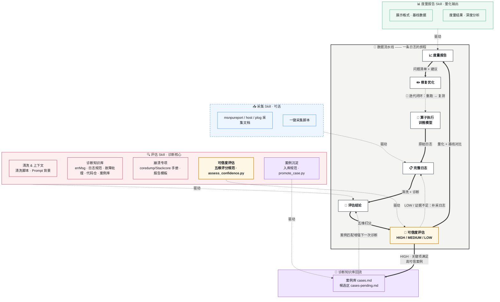

# 日志分析技能 — 工作流与架构图

## 综合流程图

下图分两层展示：**上层**是一条日志流经的数据流水线（每条连线标注流动的产物），**下层**是驱动各阶段的三个 Skill 及其能力组件。虚线「驱动」箭头表示哪个 Skill 支撑哪一步，底部虚线表示迭代闭环。

评估结论产出后先经过 **🎯 可信度评估**：高可信结论继续进入度量报告，并沉淀到诊断知识库的案例库，增强下一次诊断的案例匹配；低可信结论回到补采日志环节补齐证据，不进入报告定论。

## 流程说明

| 阶段 | 说明 |
| --- | --- |
| **算子执行 / 训推模型** | 运行算子或训练/推理模型，产生原始运行日志 |
| **采集 Skill（可选）** | 当日志不完整或需要从多源采集时启用；包含 msnpureprot、host、plog 三类采集文档及采集脚本 |
| **完整的日志** | 经采集（或直接获取）后的完整日志数据，崩溃场景可包含 coredump / Stackcore / asys / msnpureport 产物 |
| **评估 Skill** | 对日志进行清洗、结合背景知识、故障处理参考、coredump 分析手册和案例库进行评估分析 |
| **🎯 可信度评估** | 对评估结论本身按五维模型（证据完整性/一致性/因果链/复现验证/知识对齐）打分，输出 HIGH / MEDIUM / LOW / INSUFFICIENT 等级，决定结论能否作定论、能否入库 |
| **🧠 案例库沉淀** | HIGH 且关键项满足的报告写入 `cases.md`，MEDIUM 或待补证的进 `cases-pending.md` 候选区；沉淀后的案例反哺下一次诊断的 Step 5 案例匹配 |
| **度量报告 Skill** | 按照基线和展示格式，生成度量结果和分析报告（含诊断可信度章节） |
| **按度量结果分析修改** | 根据度量报告发现的问题，对算子/模型进行调整优化 |
| **🔄 迭代循环** | 修改完成后重新执行，形成持续优化闭环 |

## 各 Skill 子组件详情

### 📥 采集 Skill（可选）

| 组件 | 职责 |
| --- | --- |
| msnpureprot 采集文档 | msnpureprot 相关日志的采集规范和方法 |
| host 日志采集文档 | 宿主机日志的采集规范和方法 |
| plog 日志采集文档 | plog 日志的采集规范和方法 |
| 采集脚本 | 自动化执行日志采集的脚本工具 |

### 🔍 评估 Skill

| 组件 | 职责 |
| --- | --- |
| 清洗脚本 | 对原始日志进行预处理和格式化清洗 |
| Prompt 背景介绍 | 为 LLM 评估提供的领域背景上下文 |
| errMsg 文档 | 已知错误消息的分类与解释参考 |
| 日志规范 | 日志格式与字段的规范定义 |
| 故障处理参考 | AI Core Error、OOM、进程中断、进程卡住等典型故障定位流程 |
| coredump/Stackcore 分析手册 | Host core、Device Stackcore、asys/msnpureport、符号解析和日志关联命令模板 |
| coredump 报告模板 | 崩溃专项分析报告结构和证据完整性检查清单 |
| 代码仓地址 | 关联源码仓库，便于定位问题根因 |
| 常见案例库 | 历史典型问题及其解决方案汇总 |
| 可信度评估规范 | 五维评分模型、入库关键项、可信度等级与处置方式 |
| 可信度评分脚本 | `scripts/assess_confidence.py`，按检查表计算分数、等级和入库判定 |
| 案例沉淀规范 | 入库门槛、案例格式、去重合并、脱敏要求和案例库维护规则 |
| 案例沉淀脚本 | `scripts/promote_case.py`，把高可信报告转为规范案例写入案例库或候选区 |

### 🎯 可信度与案例回流闭环

| 环节 | 输入 | 输出 | 判定 |
| --- | --- | --- | --- |
| 可信度评分 | 诊断报告 + 检查表 JSON | 分数 / 等级 / 缺口清单 | 五维加分求和 |
| 报告采信 | 可信度等级 | 定论 / 最可能原因 / 初步判断 | < 50 时不给根因结论 |
| 案例入库 | `case_gate` 字段 | `cases.md` / `cases-pending.md` / 不入库 | HIGH 且关键项满足且修复已验证才入主库 |
| 知识增强 | 案例库 | 下一次诊断 Step 5 案例匹配 | 案例被证伪时从主库移除 |

### 📊 度量报告 Skill

| 组件 | 职责 |
| --- | --- |
| 展示格式 | 度量报告的输出格式与模板定义 |
| 基线数据 | 用于对比的基准性能/质量数据 |
| 度量结果文档 | 本次度量的原始结果记录 |
| 度量结果分析文档 | 对度量结果的深度分析与改进建议 |
