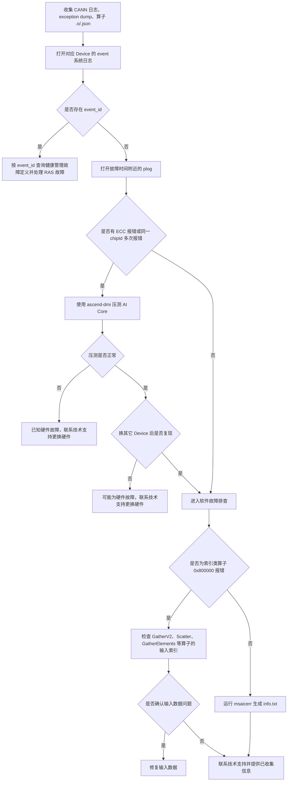

# AI Core Error 专项诊断参考

> **执行入口**：本页保留完整定位背景；本库实际运行 [AI Core Error 处理流](fault-flows/aicore-error-flow.md)，只分析已有材料。下文"收集/压测/换 Device 复现/补齐"不构成本轮执行要求，不启动补采、硬件检测或业务复跑。已有对应结果时可引用；缺失则记录 evidence_gaps 与结论边界，继续其他现有证据。任意 event_id、重复 chipId 或通用 EZ9999 都须核对版本、定义及本次事件关联，不能直接作为硬件或软件根因定论。

> 本文档面向 CANN 日志中的 AI Core / AI Vector Core 异常，整理
> 排查流程、关键证据和典型问题案例。用于分析 `EZ9999`、`Aicore kernel execute
> failed`、`aivec error exception`、`aicore error exception`、AI Core task timeout、
> exception dump 和 `msaicerr` 结果。

## 目录

- [问题现象](#问题现象)
- [关键日志字段](#关键日志字段)
- [证据收集](#证据收集)
- [排查流程](#排查流程)
- [分支说明](#分支说明)
- [结论边界](#结论边界)
- [案例库](#案例库)

## 问题现象

常见入口包括：

```text
EZ9999: Inner Error!
there is an aivec error exception
there is an aicore error exception
Aicore kernel execute failed
Task run failed ... KERNEL_AIVEC
fault kernel_name=<kernel>
```

`EZ9999` 是上层通用错误码，不能单独作为根因。应继续提取嵌套错误中的
`serial number`、`chipId`、`core id`、`error code`、`errorStr`、
`fault kernel_name`、`device_id`、`stream_id` 和 `task_id`。

异步执行中可能连续打印多个算子错误。先按 `serial number` 和原始日志时间定位首个
AI Core Error，再区分首错、后续上下文中止和框架层传播错误。

## 关键日志字段

| 字段 | 含义 | 使用方式 |
| --- | --- | --- |
| `serial number` | 异步错误序号 | 优先分析序号最小的首报错 |
| `chipId` / `dieId` | 芯片和 die 标识 | 检查是否在同一物理位置重复出现 |
| `core id` | AI Core / AIV Core 标识 | 结合 ECC、RAS 和换卡复现判断硬件可能性 |
| `error code` | AI Core 错误寄存器解码 | 必须结合 `errorStr`、算子类型和 dump，不可只看十六进制值 |
| `errorStr` | 错误文字说明 | 区分 MTE 地址、非法指令、timeout/trap 等现象 |
| `fault kernel_name` | 报错 kernel | 定位算子及对应 `.o/.json` 编译产物 |
| `device_id` | Runtime Device | 关联 Device event、健康信息和 exception dump |
| `stream_id` / `task_id` | 流和任务 | 关联 plog、dump、`msaicerr` 与上下游任务 |
| `hash` | 算子编译 hash | 在算子缓存中定位匹配产物 |
| `pc start` / `para base` | 指令和参数地址 | 供异常地址、指令和参数解析使用 |
| `mte error info` | Memory Transfer Engine 信息 | 排查地址范围、搬运长度和内存生命周期 |
| `vec error info` | Vector 单元信息 | 分析 AI Vector Core 异常 |
| `ifu error info` | 取指单元信息 | 结合 RAS/ECC 判断指令侧异常 |

## 证据收集

至少收集以下材料：

1. 故障时间窗内的完整 CANN plog，不只保留框架抛出的最后一条异常。
2. 对应 Device 的系统 event 日志：`slog/dev-os-<id>/run/event/event_*.log`。
3. exception dump 文件。
4. `fault kernel_name` 对应的算子 `.o` 和 `.json` 文件。
5. CANN、Driver、Firmware、芯片型号和框架版本。
6. 多卡场景的 rank、主机、Device、PID 映射。
7. 硬件分支需要 ECC、设备健康、`ascend-dmi` 和换 Device 复现结果。
8. 软件分支需要 `msaicerr` 输出、输入 shape/index、tiling 和内存生命周期信息。

不能获得某项材料时，在报告中明确写为"未提供"，不要用猜测填补。

## 排查流程



| 顺序 | 证据 | 判断条件 | 下一步 | 中间过程记录 |
| --- | --- | --- | --- | --- |
| 1 | Device event 日志 | 存在 `event_id` | 先处理 RAS 硬件故障 | 记录 event_id 值、对应健康管理定义、是否与本次故障时间关联 |
| 2 | 故障时间附近的 plog | ECC 或同一 `chipId` 多次报错 | 运行 `ascend-dmi` AI Core 压测 | 记录 chipId 值、重复次数、ECC 类型；无 ECC 则跳至软件排查 |
| 2a | `ascend-dmi` | 压测异常 | 联系技术支持处理硬件 | 记录压测结果（`GENERAL_WARN`/`EMERGENCY_WARN`）、异常详情 |
| 2b | 换 Device 复现 | 原 Device 异常、其它 Device 不复现 | 倾向原硬件问题 | 记录原 Device ID、换后 Device ID、复现/不复现结果 |
| 3 | 算子类型、`error code`、输入 | 索引类算子出现 `0x800000` | 检查输入索引范围 | 记录算子名、error code、errorStr、index 值与输入维度对比 |
| 4 | exception dump、`.o/.json` | 不是已确认的索引输入问题 | 使用 `msaicerr` 解析并保留 `info.txt` | 记录 dump 路径、算子 hash、msaicerr 根因结论、解析是否成功 |

`msaicerr` 不是所有 AI Core Error 的第一步。它位于 RAS、ECC/硬件和明确的索引类
输入检查之后。每步的中间过程记录写入 `diagnosis.md` 的 `result.steps`，包含
step_id、检查内容、发现结果和下一步，便于追溯走到哪一步定位到问题。

## 分支说明

### RAS 与 event_id

- 使用日志中的 Device ID 找到对应 `event_*.log`。
- 如果出现 `event_id`，按当前 CANN/硬件版本的健康管理定义解释。
- RAS 分支成立时先处理硬件告警，再分析上层算子传播错误。
- 没有 event 日志不等于没有 RAS 故障，只能写"RAS 证据未提供"。

### ECC、chipId 与硬件验证

- ECC 记录或同一 `chipId` 重复异常是硬件候选证据，不是单独定论。
- 流程没有给出"同一 chipId 多次"的固定次数阈值，不要擅自设置为两次。
- 用 `ascend-dmi` 压测和换 Device 复现区分固定硬件问题与可迁移的软件问题。
- AI Core 压测命令为 `ascend-dmi --dg -i aicore -s`；出现 `GENERAL_WARN` 或
  `EMERGENCY_WARN` 表示可能存在 AI Core 问题。
- 多 Device 同时出现相同 kernel 错误时，不可仅凭数量排除或确认硬件。

### 0x800000 与索引类算子

- 只有确认是 Gather、Scatter、GatherElements 等索引类算子时，才优先检查输入索引。
- `0x800000` 还必须结合 `errorStr`。例如日志文字为 MTE DDR 地址越界时，应继续检查
  地址生产者、shape、tiling、搬运长度和内存生命周期。
- 未获得输入 index 或 dump 证据时，结论只能是"索引/地址问题候选"。

### msaicerr 软件分析

使用与故障版本、Device、stream/task 和算子产物匹配的材料运行 `msaicerr`。重点保留：

- `info.txt` 的根因结论和解析失败信息。
- 故障指令、地址和参数映射。
- exception dump 与 `.o/.json` 的版本/hash 对应关系。
- 报错 kernel 与首报错序号的对应关系。

工具无法解析时，不要把工具失败改写成算子根因，应补齐版本、符号或编译产物。

## 结论边界

- `fault kernel_name` 证明故障被定位到该任务，不自动证明该 kernel 是最上游根因。
- 首个打印错误的 rank/Device 是首报者，不自动是故障源。
- 后发的 stream synchronize、context abort、框架 RuntimeError 和子进程错误通常是传播结果。
- AI Core task timeout 证明任务没有按期完成，不自动证明硬件损坏、网络故障或算子死循环。
- Event Wait 超时必须追踪对应 Event Record 所在流；仅有 Wait 端不能闭合因果链。
- 多通信 group 同时使用 AIV 的告警是调度/资源互锁候选，需要调用顺序或对照复现验证。
- 没有复现、修复后复跑和回归结果时，不得声明根因或解决方案已验证。

## 案例库

案例库只收录已给出问题现象、定位依据、故障根因和处理方法的典型案例，
用于匹配明确的日志或 `msaicerr` 特征。案例不能替代当前现场的版本、设备、首错
和复现证据。

### 案例索引

| 编号 | 案例 | 首要识别特征 |
| --- | --- | --- |
| `0009` | HBM 比特 ECC 故障 | `event_id=0x80E01809/0x80E01801`、`multi-bit ECC` |
| `0010` | icache 数据校验故障 | `event_id=0x80C98000`、`compare_fail_num != 0` |
| `0011` | AI Core 硬件故障 | data-cache 2-bit ECC、`ascend-dmi` 报 `EMERGENCY_WARN` |
| `0012` | 索引类算子索引越界 | 索引类算子、`0x800000`、index 超出输入维度 |
| `0013` | 系统环境/硬件问题 | `Failed to execute the built-in sample operator` |
| `0014` | 单算子运行报错 | `Failed to execute the single-operator test case` |
| `0015` | atomic add 精度溢出 | `Atomic add has a precision overflow` |
| `0016` | 算子输入输出数据地址异常 | `input/output ... is abnormal`、地址超出已分配范围 |
| `0017` | 算子输入 args 下发前后不一致 | `args before execute` 与 `args after execute` 不同 |
| `0018` | Dump 数据失败 | `Failed to get dump data of error op` |
| `0019` | 算子输入 args 错误 | `args ... after execute` 中存在错误的 Host/Device 地址 |

### 案例详解

#### OFFICIAL-0009：HBM 比特 ECC 故障

**问题现象**

- Device event 日志出现 `event_id=0x80E01809` 或 `event_id=0x80E01801`。
- 黑匣子 `hisi_logs/device-<id>/*/bbox/kbox.txt` 出现 `Hardware Error`、
  `section_type: memory error` 和 `error_type: 3, multi-bit ECC`。

**故障根因**

HBM 颗粒发生多 bit ECC。`0x80E01809` 表示巡检触发的多 bit ECC，通常与 HBM
颗粒部分失效或无法保持数据有关；`0x80E01801` 表示用户内存空间被访问时触发多
bit ECC 且地址热隔离失败。

**处理方法**

1. 按产品和版本查询《健康管理故障定义》，不要跨版本套用 Event ID 处置。
2. 对 `0x80E01809` 保留错误地址和隔离记录，按设备自处理结果观察。
3. 对 `0x80E01801`，Host PID 为 0 时复位 SOC；Host PID 非 0 时结束相关进程，
   等待恢复后仍异常再复位 SOC。

#### OFFICIAL-0010：icache 数据校验故障

**问题现象**

- Device event 日志出现 `event_id=0x80C98000`。
- Atlas A2 trace 日志出现 `stars_print_error_pc_icache_and_hbm_info`；其它适用产品
  可能出现 `check_error_pc_icache_and_hbm_info`。
- 关键字段为 `compare_fail_num`。

**故障根因**

只有 `compare_fail_num != 0` 时，才判定存在 icache 内存跳变硬件故障。
其含义是 icache 数据与 GM 校验不一致，候选原因包括 icache 数据跳变或 GM 数据
被改写。

**处理方法**

1. 退出并重新执行训练任务，或重新发起推理请求。
2. 重试仍异常时复位 SOC。
3. 故障持续时按硬件故障处理并联系维修支持。

#### OFFICIAL-0011：AI Core 硬件故障

**问题现象**

```text
errcode:(0, 0x80000000, 0)
errorStr: A 2-bit ECC error occurs in the data-cache data-ram.
```

**故障根因**

使用 `ascend-dmi --dg -i aicore` 压测 AI Core，结果出现 `EMERGENCY_WARN`，
可确认 AI Core 硬件故障。日志中的单条 ECC 文字仍应与压测结果
结合，不能省略验证步骤。

**处理方法**

保存 plog、压测结果和设备映射，联系技术支持更换故障硬件。

#### OFFICIAL-0012：索引类算子索引越界

**问题现象**

索引类算子出现 `0x800000`。常见映射包括 GatherV2 / `index_select`、Scatter /
`scatter_update`、GatherElements / `gather`，通常存在名为 `index` 或 `indices` 的输入。

**故障根因**

这类算子出于性能考虑可能不执行索引越界检查，越界后不能准确上报输入错误，
最终表现为 AI Core Error。

**处理方法**

打印输入 shape、维度 `dim` 和所有 index，验证：

```text
0 <= index[i] < input.shape[dim]
```

确认越界后继续反查 index 的生产代码。只有算子类型和输入证据同时匹配时，才能
采用本案例，不能把所有 `0x800000` 都解释为索引越界。

#### OFFICIAL-0013：系统环境或硬件问题

**关键日志特征**

```text
Failed to execute the built-in sample operator. Check the environment.
```

**故障根因**

`msaicerr` 的内置标杆算子只覆盖 GM/UB 搬运以及基础 vector、cube 指令。该最小
算子也无法运行，说明问题不局限于原业务算子，系统环境或硬件功能存在异常。

**处理方法**

使用 MindCluster ToolBox 检查系统环境和硬件；仍不能排除时，提交 asys 收集结果、
完整 `msaicerr` 结果和首算子信息。该结论是"环境/硬件"类别判断，不应在没有
进一步检查时直接写成某个具体部件损坏。

#### OFFICIAL-0014：单算子运行报错

**关键日志特征**

```text
Failed to execute the single-operator test case. The operator logic may be incorrect.
```

`info.txt` 还会给出 Basic information、AI Core DFX Register 和可能的 CCE/源码行。

**候选根因**

- 算子逻辑读写未分配地址。
- 编译器生成了错误的底层指令。
- 索引等输入数据错误导致非法访问。
- tilingdata 计算或选择错误。

**处理方法**

1. 保留 `info_<timestamp>` 目录下的全部文件。
2. 按 `debug_info.txt` 给出的环境和命令运行生成的 `test_single_op.py`。
3. 在相同输入和产物下稳定复现后，结合寄存器、指令和源码行区分上述候选原因。
4. 无法定位时提交完整 `info_<timestamp>`，不要只提交最终的 `info.txt`。

#### OFFICIAL-0015：atomic add 精度溢出

**关键日志特征**

```text
Atomic add has a precision overflow. Check the operator precision.
Note that if tasks are concurrently executed on the NPU, a false warning may be reported.
```

**故障根因**

极端输入在 atomic 累加时发生精度溢出，可能表现为 `0x800000`。还必须检查 Device
slog：没有 `Vm fault failed` 时才进入 atomic 精度溢出分支；出现该关键字表示内存
越界，不属于此案例。并发任务可能造成 `msaicerr` 误报。

**处理方法**

对输入和算子执行精度调优，并在隔离并发干扰后复测。Atlas A2 训练和
推理系列因硬件优化不会出现该问题，因此必须先核对产品型号。

#### OFFICIAL-0016：算子输入输出数据地址异常

**关键日志特征**

```text
The input/output memory address of the operator is abnormal
(or the original dumped data fails). Check the framework or application.
*[ERROR]input[1] is out of range
input[1] addr: 0xaaaaaaaa
input[2] addr: 0x0
```

**故障根因**

`msaicerr` 根据 Device 内存申请和释放日志计算有效地址范围；输入或输出地址不在
该范围时给出异常。`0x0`、`0xaaaaaaaa` 是案例中的异常示例，不是适用于所有平台
的唯一判据。

**处理方法**

- 离线推理图输入输出或单算子调用：检查应用申请、释放和传入地址的源码。
- 其它框架场景：保留 asys 和 `msaicerr` 全量结果，交由框架或技术支持追踪地址来源。

#### OFFICIAL-0017：算子输入 args 下发前后不一致

**关键日志特征**

```text
If the arguments are inconsistent before and after operator execution,
memory access may be out of bounds.
args before execute: [...]
args after execute:  [...]
```

**故障根因**

kernel args 中包含输入、输出、workspace 和 `tiling_gm` 等地址。执行前后内容变化
说明参数区可能被越界写坏，进而导致 AI Core Error。

**处理方法**

1. 创建内存检测配置，内容为 `op_debug_config=ccec_O0,ccec_g,oom`。
2. 推理场景在 ATC 转换时传入 `--op_debug_config=<gm_debug.cfg>`。
3. 训练场景在 NPU 初始化前设置 `npu.global_options().op_debug_config`。
4. 复跑并使用 asys 收集完整故障信息，依据检测结果定位越界写入者。

#### OFFICIAL-0018：Dump 数据失败

**关键日志特征**

```text
The input/output memory address of the operator is abnormal
(or the original dumped data fails). Check the framework or application.
Failed to get dump data of error op!
```

**故障根因**

AI Core Error 回调按输入输出地址和大小读取数据。业务执行和错误回调都无法读取
同一地址时，通常说明输入输出地址错误；但仅有上层"没有 dump 文件"不足以匹配
本案例，必须有 `msaicerr` 的 Dump info 解析失败证据。

**处理方法**

检查 `info.txt` 的 `4. Operator Input/Output Memory`。若故障算子是推理首算子，
检查用户脚本是否分配了足够且有效的地址空间；否则保留完整材料并追踪错误地址的
上游生产者。

#### OFFICIAL-0019：算子输入 args 错误

**问题现象**

plog 在 `Aicore kernel execute failed` 后打印 `args(<range>) after execute`，其中存在
0 地址或与当前产品 Device 地址范围不一致的参数。示例的 RealDiv 首参数为
`0x4f453840`，被判断为 Host 地址误传给 AI Core。

**故障根因**

算子参数包含 Host 地址、空地址或其它错误地址，AI Core 访问该参数时失败。地址
前缀与产品相关：旧 Atlas 训练系列和 Atlas A2 的判断方向不同，不能把 `0x1240`
前缀作为跨产品的固定规则。

**处理方法**

追踪产生错误 args 的训练脚本和算子调用。例如 `cpu_tensor / npu_tensor` 会混用
Host 与 Device 地址，应把参与 Device 算子的两个 Tensor 都放到 Device。修改后
使用相同输入复跑，并确认参数地址和 AI Core Error 同时恢复。
