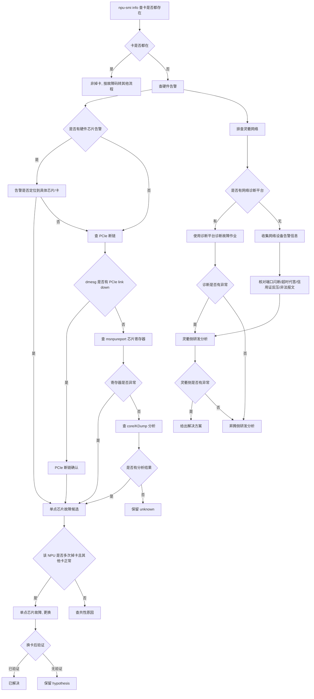

# 掉卡挂死（Card Drop）专项诊断参考

> **执行入口**：本页为离线分析参考，只分析已提供的 BMC 日志、Host dmesg、`msnpureport` 导出存档、网络设备告警信息等已有材料，不执行现场 `npu-smi`、复位、换卡、压测或网络设备查询命令。现场命令转为对已有存档的离线核对项。已有对应结果时可引用；缺失则记录 evidence_gaps 与结论边界，继续其他现有证据。

> 本文档面向 CANN 日志中的掉卡挂死问题，整理
> 排查流程、关键证据和典型问题案例。用于分析 `EL0001`、
> PCIe link down、灵衢网络代答/丢包/窝包、`ascend-dmi` 压测异常、
> RAS 告警和 AICERROR 硬件/软件故障定位。

## 目录

- [问题现象](#问题现象)
- [关键日志字段](#关键日志字段)
- [证据收集](#证据收集)
- [排查流程](#排查流程)
- [分支说明](#分支说明)
- [结论边界](#结论边界)
- [案例库](#案例库)

## 问题现象

常见入口包括：

```text
npu-smi info  # 查不到某张卡
EL0001 Device_Absent / Device_Abnormal
# BMC 告警卡消失
# dmesg 中 PCIe link down
# 灵衢网络端口闪断/Down
# 超时代答
# 信用证反压
# 非法报文
```

掉卡的核心特征是卡从系统消失，与卡仍在但报错的场景不同。若设备仍可查询到，即使存在严重或致命告警，
也不属于掉卡定位专题，应依据具体故障码进入对应的故障处理流程。

## 关键日志字段

| 字段 | 含义 | 使用方式 |
| --- | --- | --- |
| `EL0001` | 设备不存在或异常 | 确认卡是否从系统消失 |
| `rp_id_using_cnt` | RP（Receive Path）ID 使用计数 | 存在/非零表示 RP 窝包 |
| `lp_id_using_cnt` | LP（Local Path）ID 使用计数 | 存在/非零表示 LP 窝包 |
| `drp_cnt` | VOQ 丢包计数 | 存在表示 VOQ 丢包 |
| `cur_pkt` | 当前包计数 | 存在表示 VOQ 窝包 |
| `pkt_lprp_port_en_drop_cnt` | 端口使能丢包计数 | 表示 port-en 类型丢包 |
| `rp_id_using_summit` | RP ID 使用峰值 | 非窝包指标，为历史使用峰值，不能误判为窝包 |
| `lp_id_using_summit` | LP ID 使用峰值 | 非窝包指标，为历史使用峰值，不能误判为窝包 |
| `chip-id` / `port-id` | 芯片和端口标识 | 用于端口映射，定位具体物理链路 |
| `event_id` | RAS 告警事件 ID | 按健康管理故障定义解释，关联 AICERROR |
| `0x800000` | AI Core Error 错误码 | 结合 `mte_biu_rdwr_resp` 判断多 bit ECC / 超时代答 / 数据越界 |
| `0x0` | AI Core Error 错误码 | 结合 `timeout or trap error` 判断 AIC/V 超时类问题 |
| `PASS` / `GENERAL_WARN` / `EMERGENCY_WARN` | ascend-dmi 压测结果 | PASS=正常；WARN/EMERGENCY=可能硬件故障 |

## 证据收集

至少收集以下材料：

1. `npu-smi info` 快照（故障时间点），记录卡列表和缺失卡 ID。
2. BMC 日志，记录告警时间、类型、卡/槽位、严重级别。
3. Host dmesg，记录 PCIe 事件、断链、硬件错误。
4. `msnpureport` 导出存档（`-f` 复位后或 `-t2` 不复位），含芯片寄存器、DFX、复位记录。
5. 1520 日志（A3 平台），A3 场景特有的诊断记录。
6. core / KDump 分析结果。
7. 网络设备告警信息：端口闪断/Down、超时代答、信用证反压、非法报文。
8. 灵衢网络诊断结果（如有）。
9. `ascend-dmi` 压测/诊断结果存档。
10. Device event 日志：`slog/dev-os-<id>/run/event/event_*.log`。
11. CANN、Driver、Firmware、芯片型号和框架版本。
12. 历史掉卡记录：该卡/其他卡历史掉卡次数、换卡记录。
13. 代答/丢包/窝包查询结果存档（如已有网络设备查询输出）。
14. 异常算子 `.o` 和 `.json` 文件、dump 数据、plog 日志（软件故障分支）。

不能获得某项材料时，在报告中明确写为"未提供"，不要用猜测填补。

## 排查流程



| 顺序 | 证据 | 判断条件 | 下一步 | 中间过程记录 |
| --- | --- | --- | --- | --- |
| 1 | npu-smi info 快照 | 卡是否都存在 | 卡在→非掉卡；卡消失→继续 | 记录预期卡数、实际卡数、缺失卡 ID |
| 2 | BMC 日志、dmesg | 是否有硬件告警 | 有→定位芯片；无→查 PCIe | 记录告警时间、类型、卡/槽位、严重级别 |
| 3 | 告警内容 | 告警是否定位到具体芯片/卡 | 是→单点候选；否→继续查 PCIe | 记录告警是否指向具体芯片、芯片编号 |
| 4 | dmesg/系统日志 | 是否有 PCIe link down | 是→PCIe 断链；否→查寄存器 | 记录 PCIe 事件时间、是否与卡消失时间关联 |
| 5 | msnpureport 导出存档 | 芯片寄存器是否异常 | 是→硬件候选；否→查 core/KDump | 记录寄存器值、DFX 信息、复位记录 |
| 6 | core/KDump 分析结果 | 是否有硬件故障定位 | 有→具体定位；无→保留 unknown | 记录分析结论或"无分析结果" |
| 7 | 网络设备告警信息 | 是否有端口闪断/超时代答/信用证反压/非法报文 | 有→灵衢侧分析；无→昇腾侧分析 | 记录告警类别、关联端口/链路、时间 |
| 8 | 代答/丢包/窝包查询存档 | 是否存在代答/丢包/窝包 | 有→联系研发分析；无→继续 | 记录 rp_id_using_cnt/lp_id_using_cnt/drp_cnt/cur_pkt 值、代答开关状态 |
| 9 | ascend-dmi 压测结果存档 | 压测是否正常 | PASS→正常；WARN/EMERGENCY→硬件候选 | 记录压测结果、AIC/BUS 电压状态 |
| 10 | 历史掉卡记录 | 该卡是否多次掉卡、其他卡是否正常 | 是→单点芯片故障；否→查共性 | 记录该卡历史掉卡次数、其他卡状态 |
| 11 | 换卡/换板记录及验证 | 换后是否验证 | 有验证→已解决；无验证→hypothesis | 记录换卡时间、验证结果或"无验证记录" |

每步的中间过程记录写入 `diagnosis.md` 的 `result.steps`，包含 step_id、检查内容、
发现结果和下一步，便于追溯走到哪一步定位到问题。

## 分支说明

### 掉卡核心定位

掉卡定位流程主干：**`npu-smi info` 查卡是否都存在 → 是=非掉卡（按故障码处理）/ 否=查
硬件告警 → PCIe 断链 → core/KDump 分析 → 是否单点芯片故障 → 更换**。

"灵衢网络存在丢包但没有超时"分支归网络排查；"定位 NPU 的片号新增流程"按芯片型号核对
版本适用边界。

### 灵衢网络排查

灵衢网络排查分两种路径：

**有网络诊断平台**：
1. 优先使用诊断平台对故障作业进行诊断。
2. 诊断有异常→灵衢侧研发分析→灵衢侧有异常→给出解决方案；灵衢侧无异常→昇腾侧研发分析。
3. 诊断无异常→昇腾侧研发分析。

**无网络诊断平台**：
1. 收集网络设备告警信息。
2. 核对四类告警：端口闪断/Down、超时代答、信用证反压、非法报文。
3. 四类告警→灵衢侧研发分析→灵衢侧有异常→给出解决方案；灵衢侧无异常→昇腾侧研发分析。

### 代答、丢包及窝包查询

在已有网络设备查询存档中核对以下指标：

**代答查询**：
- 核对超时代答是否开启（查询结果倒数第三列：0=关闭，1=开启）。
- 核对代答统计是否有非零值（非零=已发生代答→联系研发分析）。

**窝包查询**：
- 核对端口映射表中的 `chip-id` 和 `port-id`。
- RP 窝包：核对 `rp_id_using_cnt` 是否存在/非零（存在=RP 窝包）。
- LP 窝包：核对 `lp_id_using_cnt` 是否存在/非零（存在=LP 窝包）。
- **注意**：`rp_id_using_summit` 和 `lp_id_using_summit` 是使用峰值，不是窝包。比较
  alloc 与 release 值，相等=无窝包，不等=存在窝包。

**VOQ 丢包查询**：
- 核对 `drp_cnt` 是否存在（存在=VOQ 丢包）。
- 核对 `cur_pkt` 是否存在（存在=VOQ 窝包）。

**Port-en 丢包查询**：
- 核对 `pkt_lprp_port_en_drop_cnt` 是否存在/非零。

窝包查询每次只能查一个接口，批量查询需要手动组装或使用脚本。确认代答/丢包/窝包后，
联系研发分析定位。

### Ascend DMI 工具

在已有 `ascend-dmi` 结果存档中核对：

**AICORE 压测**：
- 核对压测结果（`PASS`=正常；`GENERAL_WARN`/`EMERGENCY_WARN`=可能硬件故障）。
- 压测需要约 20-40GB Host 服务器内存，内存不足会导致进程异常中断。

**AICORE 诊断**：
- 核对诊断后 AIC 和 BUS 电压是否正常。
- 电压异常时须执行 `ascend-dmi -r` 恢复 NPU 环境（已有恢复记录时可引用）。

### 硬件故障定位流程

硬件故障定位流程主干：**收集 Device 日志和 BMC 日志 → 是否有 RAS 告警 → 隔离问题节点 →
单算子微流程用例是否必现 → 典型高压用例压测 → 重启/AC 下电再上电复现 → 收集实验数据 →
芯片给结论**。

| 核对节点 | 离线核对内容 | 结论边界 |
| --- | --- | --- |
| 收集日志 | Device 日志、BMC 日志 | 前置必要条件 |
| 是否有 RAS 告警 | event_id、RAS 告警记录 | 有→核对 RAS 告警和 AICERROR 是否有关联；无→是否有其他已知问题 |
| RAS 与 AICERROR 关联 | RAS 告警与 AICERROR 时间和位置关联 | 有关联→隔离问题节点；无关联→继续 |
| 隔离问题节点 | 隔离后是否复现 | 单算子微流程用例是否必现 |
| 典型高压用例压测 | FA、MatMul 等高压用例结果 | 是否复现 |
| 重启复现 | 重启后使用复现场景再次复现 | 是否复现 |
| AC 下电再上电复现 | AC 下电再上电后使用复现场景再次复现 | 是否复现 |
| 收集实验数据 | 是否固定 core、错误码、报错算子、bus CPM、aic CPM、复现时间、寄存器信息 | 芯片给结论 |

任一阶段不复现时，转为刷调测版本、拉偏（BUS、AIC）复现。只有重启和 AC 下电再上电都
稳定复现时，才进入收集实验数据和芯片给结论阶段。

### 软件故障定位流程

软件故障定位流程主干：**收集单算子复现所需信息 → 判断信息是否完整 → 使用 msaicerr 工具
复现 → 是否复现问题 → 根据错误码处理**。

| 核对节点 | 离线核对内容 | 结论边界 |
| --- | --- | --- |
| 单算子复现信息 | 异常算子编译信息（`.o`/`.json`）、ERROR 级 plog、异常算子 dump 数据 | 三类日志放在同一目录 |
| 信息是否完整 | 三类日志是否齐备 | 完整→使用 msaicerr；不完整→asys 或手工补充 |
| 是否复现问题 | msaicerr 复现结果 | 复现→算子侧研发分析；不复现→根据错误码处理 |
| `0x800000` + `mte_biu_rdwr_resp` | 多 bit ECC / A3 超时代答 / 数据越界 | 硬件维护 / 网络维护 / 算子侧研发 |
| `0x0` + `timeout or trap error` | AIC/V 超时类问题 | 已知问题→按方案闭环；非已知→算子侧研发 |
| 其他错误码 | msSanitizer 工具诊断 | 算子侧研发分析 |

**重要前置条件**：plog 日志、dump 数据、异常算子 `.o` 文件、`msnpureport -f` 获取的
device 日志须在定位前收集。

## 结论边界

- 上报告警但卡仍可查到不属于掉卡，应按故障码转其他流程处理。
- 单次掉卡或仅有 PCIe 断链不足以定论单点芯片故障，须有寄存器/告警定位和换卡验证。
- 仅"卡消失"无 PCIe 记录时，PCIe 链路异常分支为 `unresolved`。
- 仅"有 BMC 告警"未关联到具体卡时，不能定论平台/电源/散热问题。
- `rp_id_using_summit` / `lp_id_using_summit` 是使用峰值，不是窝包，不能误判。
- 代答/丢包/窝包查询每次只能查一个接口，不能凭单接口结果覆盖全部链路。
- `ascend-dmi` 压测 `PASS` 不等于无硬件问题，`WARN`/`EMERGENCY` 是候选证据，须结合其他
  证据。
- RAS 告警和 AICERROR 须有关联证据（时间、位置），不能凭共存定论。
- 硬件故障复现须通过重启和 AC 下电再上电两个阶段都稳定复现，单阶段不复现不能定论。
- msaicerr 无法解析时不等于算子无问题，应补齐版本、符号或编译产物。
- 换卡后验证记录才记"已解决"；无验证不记。
- 没有复现、修复后复跑和回归结果时，不得声明根因或解决方案已验证。

## 案例库

案例库只收录已给出问题现象、定位依据、故障根因和处理方法的典型案例，
用于匹配明确的日志或告警特征。案例不能替代当前现场的版本、设备、首错
和复现证据。

### 案例索引

| 编号 | 案例 | 首要识别特征 |
| --- | --- | --- |
| `D001` | 单点芯片故障（反复掉卡） | `npu-smi` 查不到卡、该卡反复掉卡、其他卡正常、寄存器异常 |
| `D002` | PCIe 链路断链 | dmesg 中 PCIe link down、卡消失时间与 PCIe 事件关联 |
| `D003` | 灵衢网络超时代答 | 网络设备告警超时代答、代答统计非零、`rp_id_using_cnt` 存在 |
| `D004` | 灵衢网络丢包 | `drp_cnt` 存在、VOQ 丢包、端口闪断/Down |
| `D005` | AI Core 硬件故障（ascend-dmi 压测异常） | `EMERGENCY_WARN`、AIC/BUS 电压异常 |
| `D006` | RAS 告警关联 AICERROR | `event_id` 与 AICERROR 时间位置关联、隔离后必现 |
| `D007` | A3 超平面超时代答导致 AICERROR | `0x800000` + `mte_biu_rdwr_resp`、A3 场景 |

### 案例详解

#### D001：单点芯片故障（反复掉卡）

**问题现象**

- `npu-smi info` 查不到某张卡。
- 该卡历史多次掉卡，其他卡正常。
- BMC 日志有硬件芯片告警，定位到具体芯片。

**故障根因**

单点芯片故障，该 NPU 芯片反复掉卡，其他卡正常，BMC 告警和寄存器记录定位到该芯片。

**处理方法**

1. 确认卡从系统消失（`npu-smi info` 快照）。
2. 查 BMC 日志硬件告警，确认定位到具体芯片/卡。
3. 查 dmesg 或 msnpureport 寄存器，确认异常。
4. 核对该卡历史掉卡记录，确认反复掉卡且其他卡正常。
5. 更换故障卡/板，换卡后验证是否解决。

#### D002：PCIe 链路断链

**问题现象**

```text
EL0001 Device_Absent
# dmesg 中 PCIe link down
```

**故障根因**

PCIe 链路断链导致卡从系统消失。dmesg 中 PCIe link down 事件时间与卡消失时间关联。

**处理方法**

1. 确认卡从系统消失。
2. 查 dmesg 中 PCIe link down 事件，确认与卡消失时间关联。
3. 查 PCIe 链路错误计数。
4. 按硬件故障处理，更换故障卡/板并验证。

#### D003：灵衢网络超时代答

**问题现象**

- 灵衢网络设备告警显示超时代答。
- 代答统计有非零值。
- `rp_id_using_cnt` 存在。

**故障根因**

灵衢网络 HCCS 链路发生超时代答，导致数据异常。代答开关为开启状态，代答统计非零确认
代答已发生。

**处理方法**

1. 收集网络设备告警信息，核对超时代答告警。
2. 在已有代答查询存档中核对代答开关状态（倒数第三列 1=开启）。
3. 核对代答统计是否有非零值。
4. 核对 `rp_id_using_cnt` 是否存在（RP 窝包）。
5. 确认后代答/窝包后联系灵衢侧研发分析。
6. 按网络维护流程处理。

#### D004：灵衢网络丢包

**问题现象**

- 灵衢网络设备告警显示端口闪断/Down。
- `drp_cnt` 存在（VOQ 丢包）。

**故障根因**

灵衢网络端口发生丢包，VOQ 丢包计数非零，可能由端口闪断或链路异常引起。

**处理方法**

1. 收集网络设备告警信息，核对端口闪断/Down 告警。
2. 在已有丢包查询存档中核对 `drp_cnt` 是否存在。
3. 核对 `cur_pkt` 是否存在（VOQ 窝包）。
4. 核对 `pkt_lprp_port_en_drop_cnt` 是否存在/非零（port-en 丢包）。
5. 确认丢包后联系灵衢侧研发分析。
6. 按网络维护流程处理。

#### D005：AI Core 硬件故障（ascend-dmi 压测异常）

**问题现象**

```text
ascend-dmi -dg -i aicore -s -sc 3 -q
# 结果: EMERGENCY_WARN
# AIC/BUS 电压异常
```

**故障根因**

AI Core 硬件故障，`ascend-dmi` 压测结果为 `EMERGENCY_WARN`，AIC 和 BUS 电压异常。

**处理方法**

1. 在已有 `ascend-dmi` 压测结果中核对结果（`EMERGENCY_WARN`）。
2. 核对 AIC 和 BUS 电压是否异常。
3. 电压异常时确认是否已执行 `ascend-dmi -r` 恢复 NPU 环境。
4. 保存压测结果和设备映射，联系技术支持更换故障硬件。

#### D006：RAS 告警关联 AICERROR

**问题现象**

- Device event 日志出现 `event_id`（RAS 告警）。
- 同时出现 AICERROR。
- RAS 告警和 AICERROR 时间和位置关联。

**故障根因**

RAS 硬件告警触发 AICERROR。RAS 告警与 AICERROR 在时间和位置上关联，隔离问题节点后
单算子微流程用例必现，重启和 AC 下电再上电后仍复现。

**处理方法**

1. 收集 Device 日志和 BMC 日志。
2. 核对 RAS 告警（`event_id`）与 AICERROR 是否有关联。
3. 隔离问题节点。
4. 单算子微流程用例是否必现，典型高压用例（FA、MatMul）压测。
5. 重启后使用复现场景再次复现→复现→AC 下电再上电后再次复现→复现。
6. 收集实验数据（是否固定 core、错误码、报错算子、bus CPM、aic CPM、复现时间、寄存器信息）。
7. 芯片给结论，按硬件故障处理。

#### D007：A3 超平面超时代答导致 AICERROR

**问题现象**

```text
errcode: 0x800000
errorStr: mte_biu_rdwr_resp
```

- A3 场景，AICERROR 错误码 `0x800000` + `mte_biu_rdwr_resp`。
- 灵衢网络存在超时代答。

**故障根因**

A3 超平面存在超时代答，导致 AI Core 访存异常，表现为 `0x800000` + `mte_biu_rdwr_resp`。
非硬件多 bit ECC，非数据越界，而是网络代答导致的访存响应异常。

**处理方法**

1. 确认 AICERROR 错误码为 `0x800000` + `mte_biu_rdwr_resp`。
2. 排除硬件多 bit ECC（核对 ECC 记录）。
3. 排除数据越界（核对算子输入和 dump）。
4. A3 场景核对灵衢网络是否存在超时代答。
5. 确认超时代答后按网络维护流程处理。
