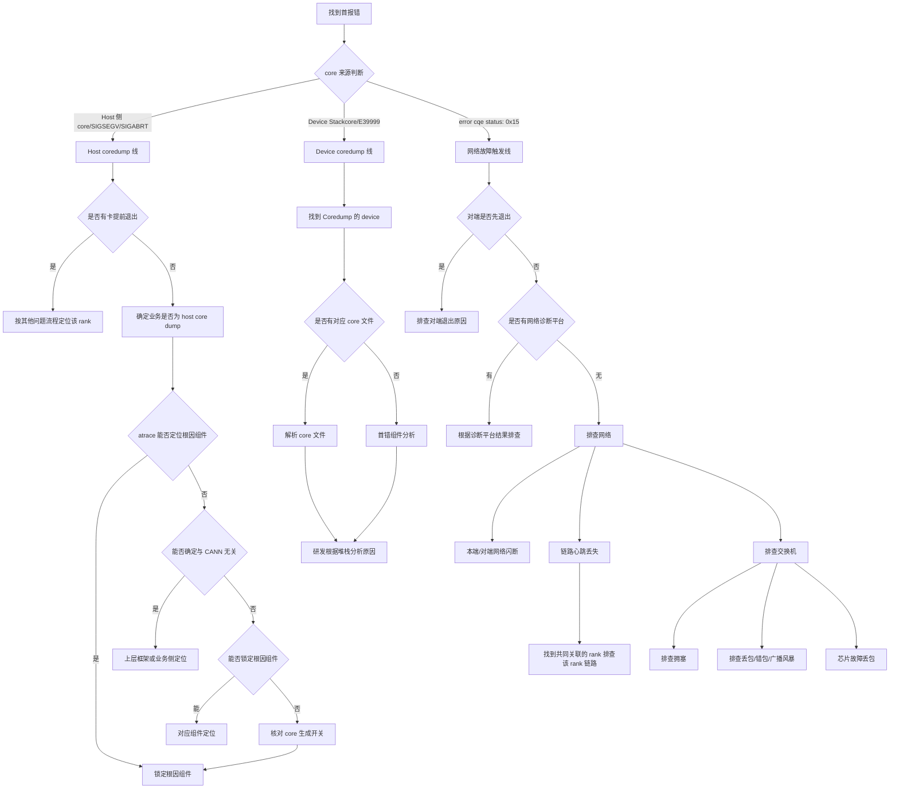

# Coredump 专项诊断参考

> **执行入口**：本页为离线分析参考，只分析已有 core 文件、plog、device 日志、网络诊断存档等材料，不执行现场命令、不附加运行进程、不重新触发崩溃。现场命令（`gdb`、`asys analyze`、`stackview.sh`、网络设备查询等）转为对已有存档的离线核对项。已有对应结果时可引用；缺失则记录 evidence_gaps 与结论边界，继续其他现有证据。

> 本文档面向 CANN 日志中的 coredump 问题，整理
> 排查流程、关键证据和典型问题案例。用于分析 `E39999`、
> `error cqe status: 0x15`、`cqe error status[12]`、`Destructor`、
> `HDC send err ret(25)` 和 core dump 定位全流程。

## 目录

- [问题现象](#问题现象)
- [关键日志字段](#关键日志字段)
- [证据收集](#证据收集)
- [排查流程](#排查流程)
- [分支说明](#分支说明)
- [结论边界](#结论边界)
- [案例库](#案例库)

## 问题现象

常见入口包括：

```text
Segmentation fault (core dumped)
Aborted (core dumped)
E39999
HDC send err ret(25)
Server destroy success
error cqe status: 0x15
cqe error status[12]
status[ERROR CQE]
status[LOST]
Destructor
```

coredump 分为 **host coredump** 与 **device coredump** 两条线。host coredump 在 Host 侧
进程崩溃时生成 Linux core 文件，伴随 SIGSEGV/SIGABRT 信号。device coredump 一般 core 在
aicpu，报错码为 `E39999` 且 plog deviceos 日志无对应 error 日志。网络故障（如 `error cqe
status: 0x15`）可触发对端进程退出，进而导致 coredump 传播。

## 关键日志字段

| 字段 | 含义 | 使用方式 |
| --- | --- | --- |
| `E39999` | device core dump 错误码（core 在 aicpu） | 结合 plog deviceos 无 error 日志判断是否 device coredump |
| `HDC send err ret(25)` | HDC 发送错误返回码 25 | 无 `E39999` 时在 plog 中查找，表示对端 device session 已关闭 |
| `Server destroy success` | HDC 组件 info 级日志 | message 日志中出现表示 device 侧已销毁 hdc server |
| `-25` / `session has been closed` | HCCP host 侧 opcode 错误 | 表示对端（device）session 被关闭 |
| `error cqe status: 0x15` | RoCE 重传超次 | 排查对端是否先退出或网络故障 |
| `cqe error status[12]` | cqe 错误状态码 12 | 用于定位对端 IP（`remoteIP`）和本端 IP（`localIP`） |
| `status[ERROR CQE]` | 故障状态类型 | plog 中按 `by rank` 搜索区分故障类型 |
| `status[LOST]` | 故障状态类型 | 关联的 IP 为疑似对端/链路问题 |
| `Destructor` | 对端进程退出标记 | 对端 plog 中出现，时间早于本端 `error cqe` 则对端先退出 |
| `localIP` | 本端 IP | 从 cqe error 日志行提取 |
| `remoteIP` | 对端 IP | 定位对端 run/plog 目录，核对 `Destructor` |
| `GEfinalize` | 进程结束标记 | plog run 日志中超时前出现表示进程提前退出 |
| `subProcPid` | device 子进程 PID | 在 `slog/dev-os-*/debug/device-os/` 中匹配 core 文件名 |
| `stackcore.aicpu_scheduler*` | device core 文件命名模式 | 在 `stackcore/dev-os-*/` 目录下查找 |
| `core.%t.%e.%p` | host core 文件命名格式 | `%t`=时间戳，`%e`=可执行文件名，`%p`=PID |

## 证据收集

至少收集以下材料：

1. 故障时间窗内的完整 CANN plog，包括 `plog/run` 和 `plog/debug` 目录。
2. 训练打屏日志（stdout），用于查找 coredump 信号和业务报错 traceback。
3. atrace 日志（host coredump 时记录 core 信号与堆栈）。
4. host message 日志（业务日志未记录时作为 fallback）。
5. device 日志：`slog/dev-os-*/debug/device-os/`，用于按 `subProcPid` 匹配 core 文件。
6. `stackcore/dev-os-*/` 目录下的 `stackcore.aicpu_scheduler*` 文件。
7. core 文件生成开关配置记录：`ulimit -c`、`core_pattern`、device coredump 配置。
8. 现网报错版本对应的 opp 包（解析 core 文件时匹配 so 文件）。
9. 网络故障相关日志：`error cqe`、`by rank`、`status[LOST]` 搜索结果。
10. 对端 run/plog 目录（通过 `remoteIP` 定位），核对 `Destructor` 时间。
11. CANN、Driver、Firmware、芯片型号和框架版本。
12. 多卡场景的 rank、主机、Device、PID 映射及各 rank 退出时间。
13. 已有 gdb/asys/stackview 解析结果存档。

不能获得某项材料时，在报告中明确写为"未提供"，不要用猜测填补。

## 排查流程



| 顺序 | 证据 | 判断条件 | 下一步 | 中间过程记录 |
| --- | --- | --- | --- | --- |
| 1 | plog/应用日志首报错 | core 来源判断 | Host core→C线；Device core→D线；error cqe→E线 | 记录首报错原文、错误码、来源类型 |
| 2 | 各 rank plog 退出时间、`GEfinalize` | 是否有卡提前退出 | 有→按其他问题流程；无→继续确认 host core dump | 记录提前退出 rank、GEfinalize 时间与首报错时间对比 |
| 3 | 训练日志、atrace、host message 日志 | 确认是否为 host core dump | 是→锁定组件；否→其他流程 | 记录 core 信号、atrace 堆栈关键帧 |
| 4 | atrace 堆栈 | 能否确定与 CANN 无关 | 能→上层定位；否→继续锁定组件 | 记录堆栈中 CANN 组件帧 |
| 5 | 堆栈组件归属 | 能否锁定根因组件 | 能→对应组件；否→核对 core 生成开关 | 记录组件归属、符号匹配状态 |
| 6 | `E39999`、plog deviceos 日志 | 是否为 device core dump | 是→找到 device；否→其他流程 | 记录 device_id、错误码、deviceos 是否有 error |
| 7 | `stackcore/dev-os-*/`、`subProcPid` | 是否有对应 core 文件 | 有→解析；无→首错组件分析 | 记录 core 文件路径、subProcPid 匹配结果 |
| 8 | 解析后堆栈 | 首错组件 | 研发分析 | 记录首错组件、符号状态、故障地址 |
| 9 | `error cqe status: 0x15` | 是否为网络故障触发 | 是→判断对端是否先退出 | 记录首报错原文、error cqe 位置 |
| 10 | `cqe error status[12]` 日志行、`remoteIP`、`localIP` | 定位对端 | 对端 plog 中核对 `Destructor` | 记录 localIP、remoteIP、对端 run/plog 路径 |
| 11 | 对端 `Destructor` 时间 vs 本端 `error cqe` 时间 | 对端是否先退出 | 是→排查对端退出原因；否→排查网络 | 记录对端 Destructor 时间、本端 error cqe 时间、时间先后 |
| 12 | `by rank` 搜索结果、`status[LOST]` IP 频次 | 网络故障定位 | 定位频繁 LOST 的 IP 对应链路 | 记录故障状态类型、LOST 关联 IP 及频次 |

每步的中间过程记录写入 `diagnosis.md` 的 `result.steps`，包含 step_id、检查内容、
发现结果和下一步，便于追溯走到哪一步定位到问题。

## 分支说明

### Host coredump 线

host coredump 默认 plog 部分卡有报错；若 plog 没有报错，优先上层分析。

1. **是否有卡提前退出**：部分卡上报超时时，未上报超时的 device 疑似提前退出；所有卡
   plog 均未报错时，比较各 device plog size，最小的疑似提前退出。`GEfinalize` 在超时前
   出现确认提前退出。
2. **确定是否为 host core dump**：训练日志中的 coredump 信号、atrace 日志的 core 信号与
   堆栈、host message 日志交叉确认。
3. **能否确定与 CANN 无关**：atrace 堆栈中无 CANN 接口/组件帧→上层框架或业务侧定位；
   有 CANN 组件帧→继续锁定根因组件。
4. **能否锁定根因组件**：堆栈中 CANN 组件归属明确→对应组件定位；不明确→核对 core 生成
   开关配置（可能缺少 core 文件），保留 undetermined。

### Device coredump 线

device coredump 前提是能够收取 plog 和 device 日志。

1. **找到 Coredump 的 device**：
   - 有 `E39999`：报错码为 `E39999` 且 plog deviceos 日志无 error → 大概率 device coredump。
   - 无 `E39999`：plog 中查找 `HDC send err ret(25)`；message 日志中查找 `Server destroy
     success`。机制为 device core → 销毁流程 → 释放 hdc server → host 侧 opcode `-25`。
2. **是否有对应 core 文件**：在 `stackcore/dev-os-*/` 查找 `stackcore.aicpu_scheduler*`，
   按 `subProcPid` 匹配。有→解析 core 文件；无→首错组件分析。
3. **解析 core 文件**：取回 core 文件，根据报错版本找到 opp 包，区分组件类型找 so 文件
   （aicpu 组件→`Ascend910-aicpu_syskernels.tar.gz`；其他组件→
   `Ascend910-aicpu_extend_syskernels.tar.gz`；部分 so 在驱动包 `filesystem-le.cpio.gz`），
   将 so 和 core 放同级目录，运行 `stackview.sh` 解析。
4. **研发根据堆栈分析原因**：解析后由对应组件研发根据堆栈分析。

### 网络故障触发线（error cqe status: 0x15）

`error cqe status: 0x15` 表示 RoCE 重传超次，有两个可能原因：对端退出或网络故障。

1. **找到首报错**：确认首报错为 `error cqe status: 0x15`。
2. **判断对端是否先退出**：
   - 在已有 plog 中搜索 `cqe error status[12]`，提取 `remoteIP`（对端）和 `localIP`（本端）。
   - 通过 `remoteIP` 定位对端的 run/plog 目录。
   - 在对端 plog 中搜索 `Destructor`，比较对端 `Destructor` 时间与本端 `error cqe` 时间。
   - 对端 `Destructor` 时间早于本端 `error cqe` 时间 → 对端先退出 → 排查对端退出原因。
   - 无 `Destructor` 或时间晚于 `error cqe` → 排查网络。
3. **排查网络**：
   - 有网络诊断平台 → 根据诊断平台结果排查。
   - 无网络诊断平台 → 排查以下分支：
     - 本端、对端网络闪断。
     - 链路心跳丢失 → 找到共同关联的 rank，排查该 rank 相关的链路。
     - 排查交换机 → 排查拥塞 / 排查丢包、错包、广播风暴 / 芯片故障丢包。

### plog 快检网络故障

在已有 plog 的 `run/plog` 目录中快速检查网络故障：

1. 搜索 `error cqe` 确认是否存在网络故障相关日志。
2. 搜索 `by rank` 枚举故障状态类型（如 `status[ERROR CQE]` 和 `status[LOST]`）。
3. 聚焦 `status[LOST]` 关联的 IP，按出现频次排序，频次最高的 IP 为疑似对端/链路问题。

### core 文件生成开关

host 需要手动先打开 core 文件生成开关，必须在 host core dump 发生之前完成：

- 核对 core 文件输出目录是否已创建。
- 核对 `core_pattern` 是否配置为带时间戳/可执行文件名/PID 的格式。
- 核对 `suid_dumpable` 是否已启用。
- 核对 `ulimit -c` 是否设置为 unlimited。

未开启 core 生成开关是 core 文件缺失的原因，应写入 `evidence_gaps`。

### 无 core 或符号不可用时

没有 Host core、Device Stackcore 或可读符号时，仍按本流程完成诊断：

1. 从退出记录、信号文本和应用日志确定可确认的中断事实。
2. 以崩溃前后的日志建立可见时间线，无法定位的事件保留为 `unknown`。
3. 将"直接触发位置"与"上游根因"分别标记。只有信号而无调用链时，根因状态使用
   `hypothesis` 或 `undetermined`。
4. 在 `evidence_gaps` 说明缺失的 core、符号或版本信息及其影响。

## 结论边界

- `E39999` 路径是"大概率"device coredump，不是绝对定论，须结合 plog deviceos 无 error
  日志交叉确认。
- `HDC send err ret(25)` 和 `Server destroy success` 表示 device 侧已进入销毁流程，不等于
  host 侧 HDC 故障。
- `error cqe status: 0x15` 不唯一是网络故障，也可能是对端退出导致，两种原因须区分。
- 对端 plog 无 `Destructor` 不等于网络故障，只是对端退出假设无支持证据，应转排查网络。
- `cqe error status[12]` 是用于定位对端 IP 的辅助状态码，与首报错 `error cqe status: 0x15`
  不同，不能混淆。
- `GEfinalize` 必须出现在超时时间点之前才表示提前退出。
- plog size 最小仅为快速锁定方法，不是最终确认。
- core 文件名 `subProcPid` 匹配是定位对应业务 core 文件的依据，但 core 存在不等于根因已定位。
- 堆栈解析中 `??` 帧通常表示缺少符号或栈损坏，不能直接跳过。
- 工具无法解析时，不要把工具失败改写成根因，应补齐版本、符号或编译产物。
- `status[LOST]` IP 频次仅为快速定位疑似对端/链路，不是最终定论。
- 没有复现、修复后复跑和回归结果时，不得声明根因或解决方案已验证。

## 案例库

案例库只收录已给出问题现象、定位依据、故障根因和处理方法的典型案例，
用于匹配明确的日志或堆栈特征。案例不能替代当前现场的版本、设备、首错
和复现证据。

### 案例索引

| 编号 | 案例 | 首要识别特征 |
| --- | --- | --- |
| `CD001` | device coredump（E39999） | `E39999`、plog deviceos 无 error、`stackcore.aicpu_scheduler*` |
| `CD002` | device coredump（HDC send err ret(25)） | `HDC send err ret(25)`、`Server destroy success`、opcode `-25` |
| `CD003` | 网络故障触发 coredump（对端先退出） | `error cqe status: 0x15`、对端 `Destructor` 时间早于本端 |
| `CD004` | 网络故障触发 coredump（交换机丢包） | `error cqe status: 0x15`、无 `Destructor`、`status[LOST]` 频次高 |
| `CD005` | TDT 组件 device coredump | `subProcPid` 匹配 core 文件、TDT 组件报错 |
| `CD006` | core 文件缺失 | core 生成开关未开启、`ulimit -c` 为 0 |
| `CD007` | 链路心跳丢失触发 coredump | `error cqe status: 0x15`、`status[LOST]`、共同关联 rank |

### 案例详解

#### CD001：device coredump（E39999）

**问题现象**

```text
E39999
# plog deviceos 日志无对应 error
```

**故障根因**

device 侧 aicpu 发生 core dump。`E39999` 表示 aicpu 异常，plog deviceos 日志无 error 日志
确认非 deviceos 组件直接报错。

**处理方法**

1. 确认 `E39999` 报错码，核对 plog deviceos 日志确实无 error。
2. 在 `stackcore/dev-os-*/` 查找 `stackcore.aicpu_scheduler*` 文件。
3. 按 `subProcPid` 匹配对应业务的 core 文件。
4. 使用 `stackview.sh` 或 `asys analyze` 解析 core 文件，由组件研发分析。

#### CD002：device coredump（HDC send err ret(25)）

**问题现象**

```text
HDC send err ret(25)
Server destroy success
opcode error -25 (session has been closed)
```

**故障根因**

device 侧 core 后进入销毁流程，销毁 hdc server 后 host 侧 opcode 报错 `-25`。

**处理方法**

1. 在 plog 中查找 `HDC send err ret(25)`。
2. 在 message 日志中查找 `Server destroy success`。
3. 确认 device session 关闭时间与 host opcode 报错时间先后。
4. 按 device core dump 流程查找并解析 core 文件。

#### CD003：网络故障触发 coredump（对端先退出）

**问题现象**

```text
error cqe status: 0x15
cqe error status[12]
localIP[10.52.167.89]
remoteIP[10.52.171.213]
```

- 对端 plog 中 `Destructor` 时间早于本端 `error cqe` 时间。

**故障根因**

对端进程先退出（如 host OOM、segment fault），本端在 RoCE 通信中因对端不可达导致重传
超次，报 `error cqe status: 0x15`。根因在对端退出原因，非网络故障。

**处理方法**

1. 确认首报错为 `error cqe status: 0x15`。
2. 在 plog 中搜索 `cqe error status[12]`，提取 `remoteIP` 和 `localIP`。
3. 通过 `remoteIP` 定位对端 run/plog 目录。
4. 在对端 plog 中搜索 `Destructor`，比较时间先后。
5. 对端先退出→排查对端退出原因（host OOM / segment fault / 其他）。
6. 按对端退出原因处理。

#### CD004：网络故障触发 coredump（交换机丢包）

**问题现象**

```text
error cqe status: 0x15
# 对端 plog 无 Destructor
# status[LOST] by rank 频次最高的 IP
```

**故障根因**

交换机丢包导致 RoCE 重传超次。对端未退出（无 `Destructor`），网络故障为根因。`status[LOST]`
频次最高的 IP 对应的链路为疑似故障链路。

**处理方法**

1. 确认首报错为 `error cqe status: 0x15`。
2. 在 plog 中搜索 `cqe error status[12]`，提取 `remoteIP` 和 `localIP`。
3. 在对端 plog 中搜索 `Destructor`，确认无 `Destructor` 或时间晚于 `error cqe`。
4. 排查网络：无网络诊断平台→排查交换机→排查丢包、错包、广播风暴。
5. 搜索 `by rank` 枚举故障类型，聚焦 `status[LOST]` 频次最高的 IP 对应链路。
6. 按网络维护流程处理。

#### CD005：TDT 组件 device coredump

**问题现象**

- plog 显示 device6 coredump，22:36:33 报错。
- `slog/dev-os-6/debug/device-os/` 对应时间点附近 TDT 组件报错，`subProcPid=7518`。
- `stackcore/dev-os-6/` 有 4 个 core 文件。

**故障根因**

TDT 组件在 device 侧 core dump。通过 `subProcPid` 匹配到文件名包含 7518 的 core 文件。

**处理方法**

1. 根据 plog 报错时间和 device 日志找到报错组件（TDT）及 `subProcPid`。
2. 在 `stackcore/dev-os-6/` 中找到文件名包含 `subProcPid` 值的 core 文件。
3. 取回 core 文件，根据报错版本找到对应 opp 包。
4. core 在其他组件→`Ascend910-aicpu_extend_syskernels.tar.gz`，解压获取 so 文件。
5. 将 so 文件和 core 文件放在同级目录，运行 `stackview.sh` 解析。

#### CD006：core 文件缺失

**问题现象**

- 进程中断发生但未找到 core 文件。
- `stackcore/dev-os-*/` 目录下无 `stackcore.aicpu_scheduler*` 文件。

**故障根因**

core 文件生成开关未开启。`ulimit -c` 为 0、`core_pattern` 未配置或 `suid_dumpable`
未启用时，进程崩溃不生成 core 文件。

**处理方法**

1. 核对 `ulimit -c` 是否设置为 unlimited。
2. 核对 `core_pattern` 是否配置为有效路径和命名格式。
3. 核对 `suid_dumpable` 是否启用。
4. 核对 device 侧 coredump 配置是否开启。
5. 在下次复现前开启 core 生成开关，记录缺失为 `evidence_gaps`。

#### CD007：链路心跳丢失触发 coredump

**问题现象**

```text
error cqe status: 0x15
# 对端 plog 无 Destructor
# status[LOST] by rank
```

**故障根因**

链路心跳丢失导致 RoCE 重传超次。多个 rank 报 `status[LOST]`，找到共同关联的 rank，
该 rank 相关的链路为故障链路。

**处理方法**

1. 确认首报错为 `error cqe status: 0x15`。
2. 确认对端未先退出（无 `Destructor`）。
3. 排查网络：链路心跳丢失→找到共同关联的 rank。
4. 搜索 `by rank` 和 `status[LOST] by rank`，按 IP 频次排序。
5. 找到多个 rank 共同关联的 rank，排查该 rank 相关的链路。
6. 按网络维护流程处理。
