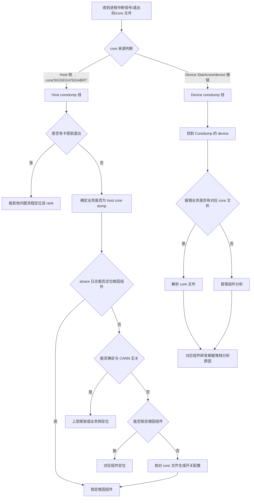

# 进程中断（Crash）专项诊断参考

> **执行入口**：本页为离线分析参考，只分析已有材料，不执行现场命令、不附加运行进程、不重新触发崩溃或抓取 core。现场命令（`gdb`、`asys analyze`、`cat core` 等）转为对已有 core/Stackcore 文件的离线核对项。已有对应结果时可引用；缺失则记录 evidence_gaps 与结论边界，继续其他现有证据。

> 本文档面向 CANN 日志中的进程中断问题，整理
> 排查流程、关键证据和典型问题案例。用于分析 `Segmentation fault`、
> `Aborted`、`E39999`、`HDC send err ret(25)`、`GEfinalize` 和 core dump 定位。

## 目录

- [问题现象](#问题现象)
- [关键日志字段](#关键日志字段)
- [证据收集](#证据收集)
- [排查流程](#排查流程)
- [分支说明](#分支说明)
- [结论边界](#结论边界)
- [案例库](#案例库)

## 问题现象

常见入口包括：

```text
Segmentation fault (core dumped)
Aborted (core dumped)
Fatal Python error: Segmentation fault
RuntimeError: CANN error, error code: E39999
HDC send err ret(25)
Server destroy success
GEfinalize
# 有时无明显报错，进程直接消失
```

退出码参考：139 = SIGSEGV（段错误），134 = SIGABRT（异常终止），137 = SIGKILL（被杀，
可能是 OOM Killer，但不等于 OOM）。

进程中断分为 **host coredump** 与 **device coredump** 两条线。host coredump 一般伴随
两种现象：部分卡 plog 上报超时，或所有卡 plog 均未报错。device coredump 一般 core 在
aicpu，报错码为 `E39999` 且 plog 的 deviceos 日志没有对应 error 日志。先判断本次中断
属于哪条线，再进入对应子流程。

## 关键日志字段

| 字段 | 含义 | 使用方式 |
| --- | --- | --- |
| `E39999` | device core dump 错误码（core 在 aicpu） | 结合 plog deviceos 日志无 error 判断是否 device coredump |
| `HDC send err ret(25)` | HDC 发送错误返回码 25 | 无 `E39999` 时在 plog 中查找此打印，表示对端 device session 已关闭 |
| `Server destroy success` | HDC 组件 info 级日志 | message 日志中出现表示 device 侧已销毁 hdc server |
| `-25` / `session has been closed` | HCCP host 侧 opcode 错误 | 表示对端（device）session 被关闭，非 host 侧 HDC 问题 |
| `GEfinalize` | 进程结束标记 | plog run 日志中超时时间点之前出现此打印，表示进程提前退出 |
| `subProcPid` | device 子进程 PID | 在 `slog/dev-os-*/debug/device-os/` 中定位报错组件，匹配 core 文件名 |
| `stackcore.aicpu_scheduler*` | device core 文件命名模式 | 在 `stackcore/dev-os-*/` 目录下查找对应 core 文件 |
| `core.%t.%e.%p` | host core 文件命名格式 | `%t`=时间戳，`%e`=可执行文件名，`%p`=PID |
| 信号类型 | coredump 信号 | 训练日志/atrace/host message 日志中记录的信号及堆栈 |
| atrace 堆栈 | host 侧调用栈 | host coredump 时 atrace 日志记录 core 信号与堆栈信息 |

## 证据收集

至少收集以下材料：

1. 故障时间窗内的完整 CANN plog，包括 `plog/run` 和 `plog/debug` 目录。
2. 训练打屏日志（stdout），用于查找业务报错 traceback 和 coredump 信号。
3. atrace 日志（host coredump 时记录 core 信号与堆栈）。
4. host message 日志（业务日志未记录时作为 fallback 判断 host coredump）。
5. device 日志：`slog/dev-os-*/debug/device-os/`，用于按 `subProcPid` 匹配 core 文件。
6. `stackcore/dev-os-*/` 目录下的 `stackcore.aicpu_scheduler*` 文件。
7. core 文件生成开关配置记录：`ulimit -c`、`core_pattern`、device coredump 配置。
8. 现网报错版本对应的 opp 包（用于解析 core 文件时匹配 so 文件）。
9. CANN、Driver、Firmware、芯片型号和框架版本。
10. 多卡场景的 rank、主机、Device、PID 映射及各 rank 退出时间。

不能获得某项材料时，在报告中明确写为"未提供"，不要用猜测填补。

## 排查流程



| 顺序 | 证据 | 判断条件 | 下一步 | 中间过程记录 |
| --- | --- | --- | --- | --- |
| 1 | 信号、退出码、core 文件来源 | Host core / Device Stackcore | 进入对应线 | 记录信号类型、退出码、core 文件路径、来源是 Host 还是 Device |
| 2 | 各 rank plog 退出时间、plog size | 是否有卡提前退出 | 有→按其他问题流程定位；无→继续确认 host core dump | 记录提前退出 rank、plog size 对比、退出时间与首报错时间对比；查找 `GEfinalize` 打印和业务 traceback |
| 3 | 训练日志、atrace、host message 日志 | 确认是否为 host core dump | 是→继续锁定组件；否→按其他问题流程 | 记录 core 信号、atrace 堆栈关键帧、是否有 host message 日志佐证 |
| 4 | atrace 日志堆栈 | 能否确定与 CANN 无关 | 能→上层框架/业务定位；否→继续锁定根因组件 | 记录堆栈中是否涉及 CANN 接口/组件、堆栈归属 |
| 5 | 堆栈中 CANN 组件归属 | 能否锁定根因组件 | 能→对应组件定位；否→核对 core 生成开关并保留 | 记录组件归属（GE/ACL/HCCL/Runtime/驱动）、符号匹配状态 |
| 6 | Device 报错原文、`E39999`、`HDC send err ret(25)` | 是否为 device core dump | 是→找到 coredump 的 device；否→其他流程 | 记录 device_id、错误码、plog deviceos 是否有 error 日志、`Server destroy success` 是否出现 |
| 7 | `stackcore/dev-os-*/` 目录、`subProcPid` | 报错业务是否有对应 core 文件 | 有→解析 core 文件；无→首错组件分析 | 记录 core 文件路径、subProcPid 匹配结果、core 文件数量 |
| 8 | 解析后堆栈（stackview.sh / asys） | 首错组件 | 研发根据堆栈分析原因 | 记录首错组件、符号匹配状态、故障线程、故障地址、so 文件来源 |

每步的中间过程记录写入 `diagnosis.md` 的 `result.steps`，包含 step_id、检查内容、
发现结果和下一步，便于追溯走到哪一步定位到问题。

## 分支说明

### 是否有卡提前退出

host coredump 一般伴随两种现象：部分卡 plog 上报超时，或所有卡 plog 均未报错。

- **部分卡上报超时**：未退出的 device 会上报超时。找到未上报超时的 device，结合训练日志
  和 `plog/run` 目录日志分析，确定是否提前退出。plog run 日志中超时时间点之前有
  `GEfinalize` 打印、训练日志有业务报错 traceback，则确认提前退出。
- **所有卡 plog 均未报错**：比较 `plog/run` 目录下各 device 对应 plog 的 size，size 明显
  小于其他 device 的为疑似提前退出卡，再结合训练日志和 plog 进一步分析。

提前退出判断需要 plog 和训练日志联合证据，不能仅凭单一来源定论。`GEfinalize` 必须出现在
超时时间点之前才表示提前退出。plog size 最小仅为快速锁定方法，不是最终确认。

### 判断是否为 host Core Dump

三种方法交叉确认：

1. 训练日志中是否有 coredump 信号（如 `Segmentation fault`、`Aborted`），根据常见
   coredump 信号及其原因判断是否为 host coredump。
2. host coredump 时 atrace 日志会记录 core 的信号以及堆栈信息。
3. 业务日志未记录时，结合 host message 日志判断是否为 host coredump。

### 判断是否为 device core dump

- **有 `E39999`**：报错码为 `E39999` 且 plog 的 deviceos 日志没有对应 error 日志，大概率
  是 device coredump（core 在 aicpu）。
- **无 `E39999`**：plog 日志中查找 `HDC send err ret(25)` 打印；message 日志中查找 HDC
  组件 info 级日志 `Server destroy success`。机制为 device 侧 core → 进入销毁流程 → 释放
  资源（包括销毁 device 侧创建的 hdc server）→ HCCP host 侧通过 hdc 通道下发 opcode 报错
  `-25`（session has been closed，表示对端 device session 被关闭）。

`-25` 错误表示对端（device）session 已关闭，不是 host 侧 HDC 问题。`E39999` 路径是"大概率"，
不是绝对定论。

### 如何找到对应业务的 core 文件

1. device 日志 slog 同级目录下有 `stackcore` 文件夹，进入后找到 core dump 的 devid。
2. `stackcore/dev-os-*/` 目录下有 `stackcore.aicpu_scheduler*` 文件，可能有多个 core 文件。
3. 根据 plog 报错时间点，在 `slog/dev-os-*/debug/device-os/` 中找到报错组件，读取其
   `subProcPid`。
4. core 文件名中包含对应 `subProcPid` 值的即为该报错业务生成的 core 文件。

### 如何解析 core 文件

1. 将对应 core 文件取回本地（可直接 cat core 文件内容，复制到本地）。
2. 根据现网报错版本找到对应的 opp 包并解压。
3. 区分组件类型找 so 文件路径：
   - core 在 aicpu 组件 → 找 `Ascend910-aicpu_syskernels.tar.gz`
   - core 在其他组件 → 找 `Ascend910-aicpu_extend_syskernels.tar.gz`
   - 部分 so 文件在驱动包中 → 找 `filesystem-le.cpio.gz`
4. 将 so 文件和 core 文件放在同级目录下。
5. 在存放 core 文件和 so 文件的目录下运行 `stackview.sh` 解析 core 文件。

解析 core 文件通常由 AICPU 调度器团队找到对应组件，由组件研发进一步解析 core 文件分析。
工具无法解析时，不要把工具失败改写成根因，应补齐版本、符号或编译产物。

### 如何打开 core 文件生成开关

host 需要手动先打开 core 文件生成开关，必须在 host core dump 发生之前完成：

- 核对 core 文件输出目录是否已创建（如 `/npu/core_file/`）。
- 核对 `core_pattern` 是否配置为带时间戳/可执行文件名/PID 的格式（如
  `core.%t.%e.%p`）。
- 核对 `suid_dumpable` 是否已启用。
- 核对 `ulimit -c` 是否设置为 unlimited。

未开启 core 生成开关是 core 文件缺失的原因，应写入 `evidence_gaps`。

### 无 core 或符号不可用时

没有 Host core、Device Stackcore 或可读符号时，仍按本流程完成诊断：

1. 从退出记录、信号文本和应用日志确定可确认的中断事实。
2. 以崩溃前后的日志、线程/任务标识和时间窗建立可见时间线，无法定位的事件保留为
   `unknown`。
3. 将"直接触发位置"与"上游根因"分别标记。只有信号而无访问地址或调用链时，根因状态使用
   `hypothesis` 或 `undetermined`。
4. 在 `evidence_gaps` 说明缺失的 core、符号或版本信息及其影响。

Python 异常栈只反映解释器层面的退出路径；除非有 native 信号、core 或设备错误与其形成
时序和实体关联，否则不将 Python 最后一条异常升级为 native 崩溃根因。

## 结论边界

- 退出码 137 仅为 SIGKILL 线索，不能确认段错误或 OOM；退出状态含义结合 shell/容器/调度器
  原始记录核对。
- `E39999` 路径是"大概率"device coredump，不是绝对定论，须结合 plog deviceos 无 error
  日志交叉确认。
- `HDC send err ret(25)` 和 `Server destroy success` 表示 device 侧已进入销毁流程，不等于
  host 侧 HDC 故障。
- `GEfinalize` 必须出现在超时时间点之前才表示提前退出；之后出现是正常结束流程。
- plog size 最小仅为快速锁定疑似异常 device 的方法，不是最终确认，须结合训练日志和 plog
  进一步分析。
- core 文件名 `subProcPid` 匹配是定位对应业务 core 文件的依据，但 core 文件存在不等于
  根因已定位。
- 堆栈解析中 `??` 帧通常表示缺少符号、卸载的共享库、stripped 二进制、exe/core 不匹配或
  栈损坏，不能直接跳过。
- 没有复现、修复后复跑和回归结果时，不得声明根因或解决方案已验证。
- 两条线（host/device）可能同时存在；按任务关联和时间线区分本次主中断与传播，不按固定
  优先级覆盖较早事件。

## 案例库

案例库只收录已给出问题现象、定位依据、故障根因和处理方法的典型案例，
用于匹配明确的日志或堆栈特征。案例不能替代当前现场的版本、设备、首错
和复现证据。

### 案例索引

| 编号 | 案例 | 首要识别特征 |
| --- | --- | --- |
| `C001` | device core dump（aicpu） | `E39999`、plog deviceos 无 error 日志 |
| `C002` | device core dump（无 E39999） | `HDC send err ret(25)`、`Server destroy success`、opcode `-25` |
| `C003` | host coredump 伴随卡提前退出 | `GEfinalize` 打印在超时前、训练日志 traceback、plog size 偏小 |
| `C004` | TDT 组件 device core dump | `subProcPid` 匹配 core 文件、TDT 组件报错 |
| `C005` | core 文件缺失 | core 生成开关未开启、`ulimit -c` 为 0 |

### 案例详解

#### C001：device core dump（aicpu）

**问题现象**

- 报错码为 `E39999`。
- plog 的 deviceos 日志没有对应的 error 日志。

**故障根因**

device 侧 aicpu 发生 core dump。`E39999` 表示 device 侧 aicpu 异常，plog deviceos 日志
无 error 日志说明非 deviceos 组件直接报错，大概率是 aicpu 进程 core。

**处理方法**

1. 确认 `E39999` 报错码，核对 plog deviceos 日志确实无对应 error。
2. 在 `stackcore/dev-os-*/` 目录下查找 `stackcore.aicpu_scheduler*` 文件。
3. 按 `subProcPid` 匹配对应业务的 core 文件。
4. 使用 `stackview.sh` 或 `asys analyze` 解析 core 文件，由组件研发根据堆栈分析原因。

#### C002：device core dump（无 E39999）

**问题现象**

```text
HDC send err ret(25)
Server destroy success
opcode error -25 (session has been closed)
```

**故障根因**

device 侧发生 core 后进入销毁流程，释放资源时销毁了 device 侧创建的 hdc server。HCCP
host 侧通过 hdc 通道下发 opcode 时报错 `-25`（session has been closed），表示对端 device
session 已被关闭。

**处理方法**

1. 在 plog 中查找 `HDC send err ret(25)` 打印。
2. 在 message 日志中查找 HDC 组件 info 级日志 `Server destroy success`。
3. 确认 device 侧 session 关闭时间与 host 侧 opcode 报错时间的先后关系。
4. 按 device core dump 流程查找并解析 core 文件。

#### C003：host coredump 伴随卡提前退出

**问题现象**

- 部分卡 plog 上报超时，未上报超时的 device 疑似提前退出。
- plog run 日志中超时时间点之前有 `GEfinalize` 打印。
- 对应节点训练日志有业务报错 traceback。

**故障根因**

某 rank 进程在通信阶段提前退出（业务侧原因导致），未退出的 device 在通信中等待对端
导致上报超时。`GEfinalize` 出现在超时时间点之前确认了进程提前退出。

**处理方法**

1. 找到未上报超时的 device，结合训练日志和 `plog/run` 目录日志确认是否提前退出。
2. 核对 `GEfinalize` 打印是否在超时时间点之前。
3. 查看训练日志中业务报错 traceback，确定提前退出的业务侧原因。
4. 按业务报错原因处理，不属于 CANN 侧问题。

#### C004：TDT 组件 device core dump

**问题现象**

- plog 显示 device6 coredump，plog 在 22:36:33 报错。
- device 日志 `slog/dev-os-6/debug/device-os/` 对应时间点附近有 TDT 组件报错。
- `subProcPid=7518`。
- `stackcore/dev-os-6/` 文件夹下有 4 个 core 文件。

**故障根因**

TDT 组件在 device 侧发生 core dump。通过 `subProcPid` 匹配到文件名包含 7518 的 core
文件，即为该笔报错业务生成的 core 文件。

**处理方法**

1. 根据 plog 报错时间和 device 日志找到报错组件（TDT）及其 `subProcPid`。
2. 在 `stackcore/dev-os-6/` 中找到文件名包含 `subProcPid` 值的 core 文件。
3. 取回 core 文件，根据报错版本找到对应 opp 包。
4. 区分组件类型（core 在其他组件 → `Ascend910-aicpu_extend_syskernels.tar.gz`），解压
   获取 so 文件。
5. 将 so 文件和 core 文件放在同级目录，运行 `stackview.sh` 解析。

#### C005：core 文件缺失

**问题现象**

- 进程中断发生但未找到 core 文件。
- `stackcore/dev-os-*/` 目录下无 `stackcore.aicpu_scheduler*` 文件。

**故障根因**

host 侧 core 文件生成开关未开启，或 device 侧 coredump 配置未启用。`ulimit -c` 为 0、
`core_pattern` 未配置或 `suid_dumpable` 未启用时，进程崩溃不会生成 core 文件。

**处理方法**

1. 核对 `ulimit -c` 是否设置为 unlimited。
2. 核对 `core_pattern` 是否配置为有效路径和命名格式（如 `core.%t.%e.%p`）。
3. 核对 `suid_dumpable` 是否启用。
4. 核对 device 侧 coredump 配置是否开启。
5. 在下次复现前开启 core 生成开关，记录缺失为 `evidence_gaps`。
