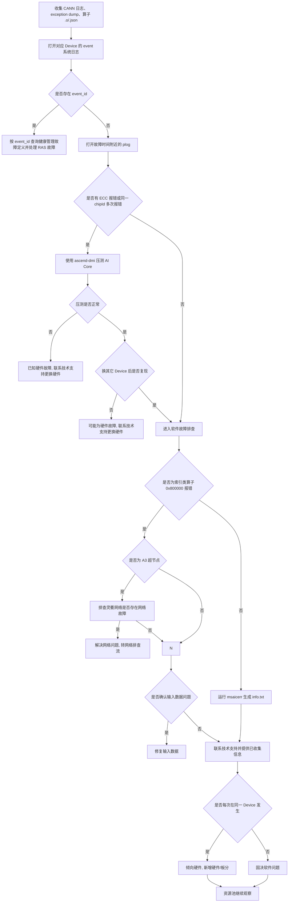

# AI Core Error 典型故障处理流

> **执行入口**：入口场景 `aicore_error`。先读 [公共约定](common-flow.md)，再核对 [AI Core Error 专项](../ai-core-reference.md) 的适用边界。只分析已提供的 plog、event、exception dump、算子产物、工具结果及验证记录，不执行硬件压测、换卡复跑或重新抓 dump。现场操作（`ascend-dmi` 压测、`msaicerr`、换 Device 复现等）不执行，只在已有材料中找对应结果/字段；没有这些结果时记 `evidence_gaps`，继续现有日志证据分析。

## 问题现象

常见入口包括：

```text
EZ9999: Inner Error!
there is an aivec error exception
there is an aicore error exception
Aicore kernel execute failed, device_id=0, stream_id=10, task_id=42
fault kernel_name=MatMulV2.op123
```

`EZ9999` 是上层通用错误码，不能单独作为根因。必须继续提取嵌套错误中的 `serial number`、`chipId`、`core id`、`error code`、`errorStr`、`fault kernel_name`、`device_id`、`stream_id` 和 `task_id`。

## 排查流程

AIC Error 定位流程主干：**找到首报错 → 首报是否为算子 AICERROR → 查 RAS 件故障（event_id）→ 查网络 → ECC error 关键字 → 通用排查 → 疑似硬件 → DMI 压测 → 压测结果分支 → 软硬件判定 → 每次同 Device → 固决软件/新增硬件/资源池观察**。



| 顺序 | 证据 | 判断条件 | 下一步 | 中间过程记录 |
| --- | --- | --- | --- | --- |
| 1 | Device event 日志 | 存在 `event_id` | 先处理 RAS 硬件故障 | 记录 event_id 值、对应健康管理定义、是否与本次故障时间关联 |
| 2 | 故障时间附近的 plog | ECC 或同一 `chipId` 多次报错 | 运行 `ascend-dmi` AI Core 压测 | 记录 chipId 值、重复次数、ECC 类型；无 ECC 则跳至软件排查 |
| 2a | `ascend-dmi` 压测结果 | 压测异常（`GENERAL_WARN`/`EMERGENCY_WARN`） | 联系技术支持处理硬件 | 记录压测结果、异常详情 |
| 2b | 换 Device 复现记录 | 原 Device 异常、其它 Device 不复现 | 倾向原硬件问题 | 记录原 Device ID、换后 Device ID、复现/不复现结果 |
| 2c | 产品型号、`error code`、网络诊断记录 | A3 超节点且 `0x800000`：核对灵衢网络是否有端口闪断/超时代答/信用证反压/非法报文 | 有网络故障→转网络排查流；无→继续索引检查 | 记录产品型号、是否 A3 超节点、网络诊断结论、是否有端口闪断/超时代答等告警 |
| 3 | 算子类型、`error code`、输入 | 索引类算子出现 `0x800000` | 检查输入索引范围 | 记录算子名、error code、errorStr、index 值与输入维度对比 |
| 4 | exception dump、`.o/.json` | 不是已确认的索引输入问题 | 使用 `msaicerr` 解析并保留 `info.txt` | 记录 dump 路径、算子 hash、msaicerr 根因结论、解析是否成功 |
| 5 | 历史记录 | 是否每次在同一 Device 发生 | 是→倾向硬件；否→倾向软件 | 记录历次 Device ID 是否相同、后续是否再次发生 |
| 6 | 软件修复验证 / 硬件换板记录 / 资源池观察 | 是否有验证/观察记录 | 有验证→已解决；观察中→hypothesis | 记录修复措施、验证结果或观察状态 |

每步的中间过程记录写入 `diagnosis.md` 的 `result.steps`，包含 step_id、检查内容、发现结果和下一步，便于追溯走到哪一步定位到问题。

`msaicerr` 不是所有 AI Core Error 的第一步。它位于 RAS、ECC/硬件和明确的索引类输入检查之后。案例候选必须核对算子、版本、设备、首错和输入条件；相同 kernel 或十六进制寄存器值不等于相同根因。core 与 AI Core Error 同时存在时，按任务关联和时间线区分 Device 异常、Host 传播及独立崩溃，不按固定优先级覆盖较早事件。

## 证据盘点

| 材料 | 提取字段 | 缺失/不匹配的影响 |
| --- | --- | --- |
| 原始 plog / 屏幕日志 | serial number、时间、chip/die/core、kernel、device/stream/task、error code/errorStr、PC/参数地址 | 无法确认的关联或首错序号标 unknown，不把最后一条框架异常当首错 |
| 对应 Device 的 event / 黑匣子存档 | event_id、发生时间、设备、RAS/ECC 原文与处置状态 | 未提供 event 不代表没有硬件异常 |
| 已有 exception dump、`.o/.json` | kernel/hash、编译版本、输入输出地址/shape/dtype、tiling、参数映射 | 对应关系不明时不能将解析的 file:line 当作本次故障位置 |
| 已有 msaicerr `info.txt` | 根因提示、故障指令、地址映射、解析失败、材料对应关系 | 工具报解析/取 dump 失败属于工具结果，不自动证明算子错误 |
| 已存档硬件与复现记录 | ECC/健康、`ascend-dmi` 诊断结论、使用设备、控制变量、原始结果 | 只把既有记录作为证据，不启动新检测 |

保留完整寄存器多行块、任务下发/完成、Event Record/Wait、正常参数与前后任务日志。清洗不能只留下 `EZ9999` 一行或删除低级别的任务关联信息。

### 子检查

| 子检查 | 离线核对内容 |
| --- | --- |
| Ascend DMI 工具压测核对 | 核对已有 `ascend-dmi` 压测/诊断结果：AI Core 压测命令为 `ascend-dmi -dg -i aicore -s`，AI Core 诊断命令为 `ascend-dmi -dg -i aicore`。结果为 `PASS` 表示正常；出现 `GENERAL_WARN` 或 `EMERGENCY_WARN` 表示可能存在 AI Core 硬件问题。压测需占用 Host 约 20~40GB 内存，诊断完成后须检查 aic 和 bus 电压是否正常。未提供压测结果时记 `evidence_gaps`，不执行新压测 |
| 硬件故障定位子流程 | 硬件故障定位流程：① 收集 Device 日志、BMC 日志后核对是否有 RAS 告警；② RAS 告警与 AICERROR 是否关联（时间、设备、芯片）；③ 无 RAS 告警时核对是否有其他已知问题；④ 隔离问题节点后核对单算子微流程用例是否必现；⑤ 用典型高压用例（FA、MatMul 等）压测是否复现；⑥ 重启后用复现场景再次复现；⑦ AC 下电再上电后再次复现；⑧ 收集实验数据（是否固定 core、错误码、报错算子、bus CPM、aic CPM、复现时间、相关寄存器信息）交芯片团队给结论。每步仅核对已有记录，不执行现场复现 |
| 软件故障定位子流程 | 软件故障定位流程：① 单算子复现微流程——核对信息是否完整（异常算子编译信息 `.o/.json`、ERROR 级别 plog、异常算子 dump 数据），完整则核对 `msaicerr` 复现结果，不完整则核对 asys 或手工收集记录；② 是否复现问题——复现则算子侧研发分析，未复现则按错误码分支处理：`0x800000`+`mte_biu_rdwr_resp`→多 bit ECC 硬件或 A3 超平面超时代答，`0x0`/timeout/trap→排查 AIC/V Timeout 历史案例，其他错误码→`msSanitizer` 工具诊断。仅核对已有工具结果，不执行新工具 |
| A3 超节点灵衢网络排查 | A3 超节点出现 `0x800000` 时核对灵衢网络诊断记录：有网络诊断平台时优先核对诊断结果；无诊断平台时核对网络设备告警信息——端口闪断/Down、超时代答、信用证反压、非法报文。核对结果区分灵衢侧异常（给解决方案）与昇腾侧异常（昇腾研发分析）。记录网络诊断结论、告警类型、是否与本次 AICERROR 时间关联 |

## 分支与竞争假设

| 分支 | 评估动作 | 结论边界 |
| --- | --- | --- |
| RAS / ECC | 对齐 event_id、时间、设备及当前版本故障定义，解释对应异常 | event_id 需正确解码且与本次相关；不能把任意 event 当硬件定论 |
| 同 chip/core 反复异常 | 结合已有 ECC、硬件测试和换设备对照记录 | 重复位置是候选证据，不能单独判芯片损坏，也不自设重复次数阈值 |
| 索引/地址异常 | 核对索引类算子、errorStr、实际 index 范围、输入维度与地址来源 | `0x800000` 不单独证明索引越界；缺输入证据时保留候选 |
| 内存生命周期/搬运 | 对照已有 dump、tiling、地址范围、生产者及分配/释放序列 | 报错 kernel 可能只是受害者，须核对更早的写入或错误参数来源 |
| 任务超时/Event 等待 | 对齐 dispatch/done、Event Record/Wait、流和任务依赖 | 缺 done 不自动证明死循环；没有完整日志不能排除正常完成后未记录 |
| 版本/产物不匹配 | 核对 CANN、硬件、编译 hash、工具和符号版本 | 不匹配会限制解析可信度，不等于它已经造成业务故障 |

有相关证据时先解释 RAS/ECC，再评估明确输入问题与软件分支；该顺序不是要求补齐前一分支材料后才能继续。缺某来源则记录该分支未解决，继续已有软件证据分析。

### 分支决策顺序

对每个入口错误按以下顺序记录结果，任一分支证据不足都继续后续分支，不因缺失材料提前结束：

1. **事件关联**：确认错误与 host/PID/rank/device/stream/task 及时间窗属于同一任务；关联失败时只保留为候选。
2. **RAS/ECC**：查找同一 Device 的 `event_id`、ECC 类型和处置状态；有明确且匹配的定义时标记硬件分支支持。
3. **索引/地址**：核对算子类型、`errorStr`、输入索引或地址范围；`0x800000` 单独出现时保持 unresolved。
4. **任务与内存**：核对 dispatch/done、参数地址、生产者任务和生命周期，识别受害 kernel 与更早写入者。
5. **工具解析**：仅对版本、Device、stream/task、hash 均匹配的已有 dump 使用 `msaicerr`；解析失败记录为工具结果和证据缺口。
6. **版本/产物**：核对运行时与编译产物版本/hash；不匹配只降低该证据的可用范围，不直接生成根因。

每个分支都写入 `branch_decisions`，至少包含 `branch`、`status`（`supported`/`excluded`/`unresolved`）、`evidence_refs`、`counter_evidence` 和 `reason`，确保缺证与排除理由可追溯。

## 子步骤产物

所有步骤写入 `diagnosis.md.result.steps`，每项带公共状态、输入/证据引用、缺口及 next_step。

| step_id | 执行动作 | findings 必含字段 |
| --- | --- | --- |
| A1 | 案例与本次 AI Core 入口核对 | entry_errors、signals、nested_error_details、case_comparison、event_identity、classification_conflicts |
| A2 | 盘点版本、任务与已有异常产物 | material_inventory、versions、kernel_hash_mapping、task_identity、parse_results、mismatches |
| A3 | 首错与依赖链分析，按流程评估各分支 | first_error_candidate、serial_scope、timeline_links、ras_ecc_assessment、network_assessment、input_address_assessment、task_dependencies、branch_decisions、alternative_decisions |
| A4 | 输出结论、建议和检查依据 | confirmed_facts、root_cause_status、limitations、recommendations、check_evidence |

A4 同步填充公共诊断字段。`serial number` 只能在可比较的同一记录范围内辅助定位首错，不跨主机/进程机械取全局最小值。

## 结论与可信度

- 直接事实："<device/stream/task> 的 <kernel> 报 <原文异常>"；根因需继续用指令、参数/地址来源、RAS 或源码证据支持。
- 无 dump 仍可评估现有日志/RAS/参数证据；不追加能力等级或总分上限。无法解析的位置和无法排除的竞争假设必须保留。
- D1/D2 首错与互证须对应同次任务；D3 仅 kernel 名不满足根因已定位；D4 无已有修复记录不记已验证；D5 案例命中需核对版本及实际证据异同。
- `msaicerr` 报错本身不为 `source_code_confirmed` 加分。只在已有匹配源码与现场证据证实推断时填 true。

案例参考先沿用 `case-match.md` 候选，再核对 [专项案例](../ai-core-reference.md)；未命中仍完成全部诊断。建议只写适用前提与已有验证状态，不执行修复生产环境。

## 案例覆盖矩阵

下表把专项中的案例映射到本流分支，确保命中任一案例时均有明确核对路径；案例命中仍需现场证据闭合：

| 案例 | 入口特征 | 对应分支 | 必要核对 |
| --- | --- | --- | --- |
| OFFICIAL-0009 | `0x80E01809`/`0x80E01801`、multi-bit ECC | RAS/ECC | event 定义、Device、地址与处置状态 |
| OFFICIAL-0010 | `0x80C98000`、`compare_fail_num != 0` | RAS/ECC | trace 与 event 时间、适用产品 |
| OFFICIAL-0011 | data-cache 2-bit ECC | RAS/ECC | 已有 AI Core 诊断结果或压测记录（未提供则保持缺口） |
| OFFICIAL-0012 | 索引类算子 + `0x800000` | 索引/地址 | index、shape、dim 和地址生产者 |
| OFFICIAL-0013 | built-in sample operator 失败 | 工具解析/环境 | `msaicerr` 输出及环境版本 |
| OFFICIAL-0014 | single-operator test 失败 | 工具解析/环境 | 算子输入、产物与测试结果 |
| OFFICIAL-0015 | atomic add precision overflow | 任务与内存 | 算子类型、输入范围与已有验证 |
| OFFICIAL-0016 | input/output address abnormal | 索引/地址 | 地址范围、分配记录和上下游任务 |
| OFFICIAL-0017 | args before/after execute 不一致 | 任务与内存 | 参数快照、stream/task 和时间顺序 |
| OFFICIAL-0018 | failed to get dump data | 工具解析 | 原始失败行、dump 可用性与解析限制 |
| OFFICIAL-0019 | args after execute 含错误地址 | 任务与内存 | Host/Device 地址、参数来源和版本/hash |

未命中上述案例时仍按六个分支完成 `A1`–`A4`，并在 `case_comparison` 中写明未命中原因。

参考：[公共约定](common-flow.md)、[AI Core Error 专项](../ai-core-reference.md)、[故障处理专题](../fault-handling.md)、[网络排查流](network-flow.md)、[错误码](../err-messages.md)、[可信度规范](../confidence-assessment.md)。
