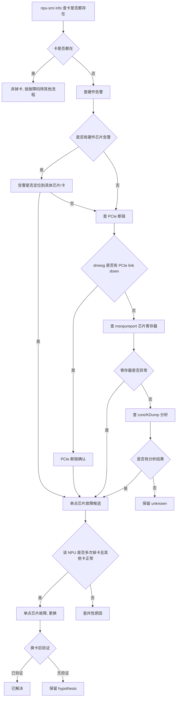

# 掉卡典型故障处理流

> **执行入口**：入口场景 `card_drop`。掉卡指 NPU 卡从系统中消失（`npu-smi info` 查不到）。本流只离线分析已提供的 BMC 日志、Host dmesg、`msnpureport -f`（复位后）或 `msnpureport -t2`（不复位）获取的芯片 DFX 日志、1520 日志（A3）等存档，不执行现场 `npu-smi`、复位或换卡。先读 [公共约定](common-flow.md)，特别是 §0 找首节点。

> **边界**：本流仅处理 NPU 卡确实从系统中消失的情况。若设备仍可查询到，即使存在严重或致命告警，也应依据具体故障码进入对应的故障处理流程。

## 问题现象

常见入口包括：

```text
npu-smi info  # 查不到某张卡
EL0001 Device_Absent / Device_Abnormal
# BMC 告警卡消失
# dmesg 中 PCIe link down
```

掉卡的核心特征是卡从系统消失，与卡仍在但报错的场景不同。

## 排查流程

掉卡定位流程主干：**`npu-smi info` 查卡是否都存在 → 是=非掉卡（按故障码处理）/ 否=查硬件告警 → PCIe 断链 → core/KDump 分析 → 是否单点芯片故障 → 更换**。



| 顺序 | 证据 | 判断条件 | 下一步 | 中间过程记录 |
| --- | --- | --- | --- | --- |
| 1 | npu-smi info 快照 | 卡是否都存在 | 卡在→非掉卡；卡消失→继续 | 记录预期卡数、实际卡数、缺失卡 ID |
| 2 | BMC 日志、dmesg | 是否有硬件告警 | 有→定位芯片；无→查 PCIe | 记录告警时间、类型、卡/槽位、严重级别 |
| 3 | 告警内容 | 告警是否定位到具体芯片/卡 | 是→单点候选；否→继续查 PCIe | 记录告警是否指向具体芯片、芯片编号 |
| 4 | dmesg/系统日志 | 是否有 PCIe link down | 是→PCIe 断链；否→查寄存器 | 记录 PCIe 事件时间、是否与卡消失时间关联 |
| 5 | msnpureport 导出 | 芯片寄存器是否异常 | 是→硬件候选；否→查 core/KDump | 记录寄存器值、DFX 信息、复位记录 |
| 6 | core/KDump 分析结果 | 是否有硬件故障定位 | 有→具体定位；无→保留 unknown | 记录分析结论或"无分析结果" |
| 7 | 历史掉卡记录 | 该卡是否多次掉卡、其他卡是否正常 | 是→单点芯片故障；否→查共性 | 记录该卡历史掉卡次数、其他卡状态 |
| 8 | 换卡/换板记录及验证 | 换后是否验证 | 有验证→已解决；无验证→hypothesis | 记录换卡时间、验证结果或"无验证记录" |

每步的中间过程记录写入 `diagnosis.md` 的 `result.steps`，包含 step_id、检查内容、发现结果和下一步，便于追溯走到哪一步定位到问题。

"灵衢网络存在丢包但没有超时"分支归 [网络排查流](network-flow.md)；"定位 NPU 的片号新增流程"按芯片型号核对版本适用边界。掉卡确认为硬件候选后，按 [子检查](#子检查) 中的硬件故障定位子流程核对 RAS 告警关联、DMI 压测结果、单算子复现与 AC 下电复现记录；确认为非硬件时按软件故障定位子流程核对已有工具结果。

## 证据盘点

| 材料 | 提取字段 | 缺失时的结论边界 |
| --- | --- | --- |
| `npu-smi info` 快照 | 卡列表、故障时间点、缺失的卡 ID、健康状态 | 无快照则无法确认卡是否消失，保留为 `unknown` |
| BMC 日志 | 告警时间、类型、卡/槽位、严重级别 | 无 BMC 日志不等于没有硬件告警 |
| Host dmesg | PCIe 事件、断链、硬件错误、时间 | 无 dmesg 则 PCIe 断链分支 `unresolved` |
| msnpureport 导出（-f/-t2） | 芯片寄存器、DFX、复位记录、设备状态 | 未导出则寄存器分支 `unresolved` |
| 1520 日志（A3） | A3 平台特有的诊断记录 | A3 场景缺失 1520 记为 `evidence_gaps` |
| core / KDump 分析结果 | 崩溃时间、硬件故障定位、寄存器 | 无分析结果保留为 `unknown`，不阻断其他证据 |
| 历史掉卡记录 | 该卡/其他卡历史掉卡次数、换卡记录 | 无历史记录则"多次发生"分支 `unresolved` |
| Ascend DMI 压测/诊断结果 | 压测结果（`PASS`/`GENERAL_WARN`/`EMERGENCY_WARN`）、诊断详情 | 未提供则硬件验证分支 `unresolved`，不启动新压测 |

### 子检查

| 子检查 | 离线核对内容 |
| --- | --- |
| Ascend DMI 工具压测核对 | 核对已有 `ascend-dmi` 压测/诊断结果：AI Core 压测命令为 `ascend-dmi -dg -i aicore -s`，AI Core 诊断命令为 `ascend-dmi -dg -i aicore`。结果为 `PASS` 表示正常；出现 `GENERAL_WARN` 或 `EMERGENCY_WARN` 表示可能存在 AI Core 硬件问题。压测需占用 Host 约 20~40GB 内存。未提供压测结果时记 `evidence_gaps`，不执行新压测 |
| 硬件故障定位子流程 | 硬件故障定位流程：① 收集 Device 日志、BMC 日志后核对是否有 RAS 告警；② RAS 告警与本次故障是否关联（时间、设备、芯片）；③ 无 RAS 告警时核对是否有其他已知问题；④ 隔离问题节点后核对单算子微流程用例是否必现；⑤ 用典型高压用例（FA、MatMul 等）压测是否复现；⑥ 重启后用复现场景再次复现；⑦ AC 下电再上电后再次复现；⑧ 收集实验数据（是否固定 core、错误码、报错算子、bus CPM、aic CPM、复现时间、相关寄存器信息）交芯片团队给结论。每步仅核对已有记录，不执行现场复现 |
| 灵衢网络排查 | 掉卡伴随网络异常时核对已有的灵衢网络诊断记录：如已提供网络诊断结果，优先核对；否则核对已有的网络设备告警和统计记录——端口闪断/Down、超时代答、信用证反压、非法报文。核对结果区分灵衢侧异常（给解决方案）与昇腾侧异常（昇腾研发分析）。代答查询核对：是否开启超时代答（`get oda table hccs rplp timeout` 倒数第三列为 1 表示开启）、代答统计是否有非 0 值。丢包/窝包查询核对网络设备统计结果 |
| 软件故障定位子流程 | 掉卡确认为非硬件时核对软件定位记录：单算子复现微流程是否信息完整（异常算子编译信息 `.o/.json`、ERROR 级别 plog、异常算子 dump 数据）；是否使用 `msaicerr` 工具复现；按错误码分支处理（`0x800000`+`mte_biu_rdwr_resp`→多 bit ECC 硬件或 A3 超时代答；`0x0`/timeout/trap→AIC/V Timeout 历史案例；其他错误码→`msSanitizer` 工具诊断）。仅核对已有工具结果，不执行新工具 |

## 判定矩阵

| 分支 | 支持所需证据 | 不能单独作为根因的信号 |
| --- | --- | --- |
| 单点芯片故障 | 该卡反复掉卡 + 其他卡正常 + 寄存器/告警定位到该芯片 + 换卡后验证 | 单次掉卡或仅有 PCIe 断链 |
| PCIe 链路异常 | dmesg 中 PCIe link down 与卡消失时间关联 + 链路错误计数 | 仅"卡消失"，无 PCIe 记录 |
| 平台/电源/散热问题 | BMC 中电源/温度/风扇告警与掉卡时间关联 | 仅"有 BMC 告警"，未关联到具体卡 |
| 网络丢包伴随（非超时） | 网络丢包记录但未触发超时 | 见 [网络排查流](network-flow.md) |
| 上报告警但卡仍在 | 平台告警 + `npu-smi` 卡仍可查 | 属于非掉卡，按故障码转其他流程 |

## 子步骤产物

每步更新同一个 `diagnosis.md.result.steps`，包含公共状态、输入/证据引用、缺口与 next_step。

| step_id | 执行动作 | findings 必含字段 |
| --- | --- | --- |
| D1 | 案例与掉卡事件核对，确认卡是否消失 | signals、case_comparison、event_identity、card_present（true/false/unknown）、missing_card_ids、classification_conflicts |
| D2 | 盘点 BMC/dmesg/msnpureport/1520 等材料 | material_inventory、versions、chip_model、hardware_alarms、pcie_events、register_info、kdump_results、history_drops |
| D3 | 对齐掉卡时间、告警、PCIe 断链与竞争假设 | first_error_candidate、timeline_links、alarm_card_link、pcie_link_status、branch_decisions、alternative_decisions、unresolved_links |
| D4 | 输出掉卡根因边界、建议和检查依据 | confirmed_facts、root_cause_status、limitations、recommendations、check_evidence |

D4 填满公共诊断字段。掉卡是硬件场景，建议以"更换故障卡/板并验证"为主，须标注已有验证状态；无验证记录不得写"已解决"。

## 结论与评分边界

"已确认 <卡 ID> 在 <时间> 从系统消失，证据 <原始引用>；<单点芯片故障/PCIe 链路/平台问题> 为 <confirmed/hypothesis/undetermined>。<缺口> 使 <具体判断> 仍无法确认。"

- D1 首错为卡消失/PCIe 断链的最早记录；无明确 ERROR 时 `has_first_error_line` 按实际定位判断。
- D2 `npu-smi` 快照与 dmesg/BMC 属于独立来源，可互证；同一日志副本不算多源。
- D3 掉卡根因需寄存器/告警/换卡验证闭合；仅 PCIe 断链不够 `root_cause_localized`。
- D4 换卡后验证记录才记 `fix_verified`；无验证不记。
- D5 命中历史掉卡案例须核对芯片型号、版本和实际告警异同。

参考：[公共约定](common-flow.md)、[故障处理专题](../fault-handling.md)、[网络排查流](network-flow.md)、[错误码](../err-messages.md)、[可信度规范](../confidence-assessment.md)。
