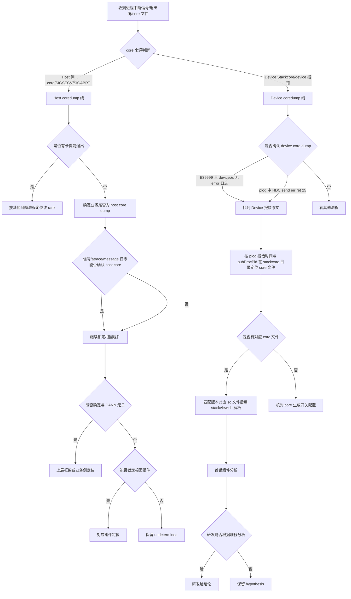

# 进程中断典型故障处理流

> **执行入口**：入口场景 `crash`。已有 Host core、Device Stackcore、异常信号或明确进程中断记录时使用本流。只离线分析现有材料，不附加运行进程，不重新触发崩溃或抓取 core。现场解析（`gdb`/`asys analyze`）转为对已有 core/Stackcore 的离线解析。先读 [公共约定](common-flow.md)，特别是 §0 找首节点。

## 问题现象

常见入口包括：

```text
Segmentation fault (core dumped)
Aborted (core dumped)
Fatal Python error: Segmentation fault
RuntimeError: CANN error, error code: ...
# 有时无明显报错，进程直接消失
```

退出码参考：139 = SIGSEGV（段错误），134 = SIGABRT（异常终止），137 = SIGKILL（被杀，可能是 OOM Killer，但不等于 OOM）。

## 排查流程

coredump 分为 **host coredump** 与 **device coredump** 两条线，各自有独立定位流程。默认 plog 部分卡有报错；若 plog 没有报错，优先上层分析。先判断本次中断属于哪条线，再进入对应子流程。



| 顺序 | 证据 | 判断条件 | 下一步 | 中间过程记录 |
| --- | --- | --- | --- | --- |
| 1 | 信号、退出码、core 文件来源 | Host core / Device Stackcore | 进入对应线 | 记录信号类型、退出码、core 文件路径、来源是 Host 还是 Device |
| 2a | 各 rank 退出时间、plog size、训练日志 | 有卡提前退出（未报超时 device 疑似退出；或 plog size 明显偏小；plog run 日志超时前有 `GEfinalize`；训练日志有业务报错 traceback） | 按 OOM/掉卡/通信流程定位该 rank | 记录提前退出 rank、退出时间与首报错时间对比、各 device plog size 对比、是否有 GEfinalize 打印、是否有 traceback |
| 2b | core 文件、信号、堆栈、atrace、host message 日志 | 确认 Host 进程中断（训练日志 coredump 信号、atrace 堆栈、message 日志三重确认） | 继续 atrace 定位 | 记录 core 文件名、信号、是否有 atrace、message 日志是否记录 core 信号 |
| 3 | atrace 日志 | 与 CANN 接口/资源相关 | 锁定根因组件 | 记录 atrace 中关键帧、是否涉及 CANN 接口 |
| 4 | 堆栈归属 | 是否纯上层框架/业务 | 能确定→上层定位；不能→继续 | 记录堆栈中是否有 CANN 组件帧 |
| 5 | 堆栈中 CANN 组件 | 能否锁定根因组件 | 锁定→对应组件；未锁定→undetermined | 记录组件归属（GE/ACL/HCCL/Runtime/驱动）、匹配符号状态 |
| 6 | Device 报错原文、plog deviceos 日志 | 是否确认 device core dump：`E39999` 且 deviceos 无 error 日志，或 plog 中 `HDC send err ret(25)`/`hdc recv error 25` | 是→定位 core 文件；否→转其他流程 | 记录是否有 E39999、deviceos 是否有 error、是否有 HDC ret(25)/session has been closed、message 日志是否有 `Server destroy success` |
| 6a | plog 报错时间、`slog/dev-os-*/debug/device-os/` 中 subProcPid | 在 `stackcore/dev-os-*/` 下按 subProcPid 匹配 core 文件 | 找到→解析；未找到→核对开关 | 记录报错 device_id、plog 报错时间、device-os 日志中的 subProcPid、stackcore 目录下 core 文件名是否含该 PID（如 `stackcore.aicpu_scheduler.<pid>.*`） |
| 7 | Stackcore 存在性、版本对应 so 文件 | 有对应 core 文件且能匹配版本 so | 有→用 stackview.sh 解析；无→核对开关 | 记录 core 文件是否存在、core 生成开关状态、so 文件来源（aicpu_syskernels/aicpu_extend_syskernels/驱动包）、版本是否匹配 |
| 8 | stackview.sh 解析后堆栈 | 首错组件 | 研发分析 | 记录首错组件、符号匹配状态、故障线程、故障地址、so 文件映射路径（如 `libaicpu_scheduler.so`/`libpt_kernels.so`） |
| 9 | 研发分析记录 | 能否给结论 | 有→结论；无→hypothesis | 记录研发结论或"无研发记录" |

每步的中间过程记录写入 `diagnosis.md` 的 `result.steps`，包含 step_id、检查内容、发现结果和下一步，便于追溯走到哪一步定位到问题。

### 判断属于哪条线

| 判断依据 | host coredump | device coredump |
| --- | --- | --- |
| core/中断来源 | Host 侧进程 core（Linux core 文件）、SIGSEGV/SIGABRT | Device 侧 Stackcore、asys 输出、device 报错 |
| 关键报错码/日志 | 训练日志中的 coredump 信号、atrace 记录的 core 信号与堆栈 | `E39999` 且 plog deviceos 日志无相应 error；或 plog 中 `HDC send err ret(25)`/`hdc recv error 25`（device 侧异常先释放 HDC 连接，message 日志有 `Server destroy success`） |
| 前提材料 | plog、atrace 日志、host message 日志 | 能够收取 plog、device 日志 |
| 报错位置 | Host 进程堆栈 | Coredump 的 device 报错 |

两条线可能同时存在；按任务关联和时间线区分本次主中断与传播，不按固定优先级覆盖较早事件。退出码 137 仅为 SIGKILL 线索，不能确认段错误或 OOM；退出状态含义结合 shell/容器/调度器原始记录核对。明确 Python 异常退出与 native signal core 分开记录；框架最后一条异常可能是此前 Device/OOM 故障的传播。

### 无 core 或符号不可用时

没有 Host core、Device Stackcore 或可读符号时，仍按本流完成诊断：

1. 从退出记录、信号文本和应用日志确定可确认的中断事实，并在 `first_error` 中引用原始位置；
2. 以崩溃前后的日志、线程/任务标识和时间窗建立可见时间线，无法定位的事件保留为 `unknown`；
3. 将"直接触发位置"与"上游根因"分别标记。只有信号而无访问地址或调用链时，`root_cause.status` 使用 `hypothesis` 或 `undetermined`；
4. 在 `evidence_gaps` 说明缺失的 core、符号或版本信息及其影响，照常输出 `diagnosis.md`，不以缺少文件为由跳过诊断。

Python 异常栈只反映解释器层面的退出路径；除非有 native 信号、core 或设备错误与其形成时序和实体关联，否则不将 Python 最后一条异常升级为 native 崩溃根因。

## 证据盘点

| 材料 | 提取字段 | 核对要求 |
| --- | --- | --- |
| Host core | 文件类型、架构、进程/线程、信号、PC、寄存器、映射及崩溃时间 | 与 exe、PID/任务和故障时窗对应；只有文件存在不足以记"产物齐备" |
| Device Stackcore / 已有 asys 输出 | Device、进程/线程、信号/异常、寄存器、栈帧 | 与 Host Linux core 分开解析，不能套用错误格式 |
| exe、debug so、已提供依赖 | Build ID、版本、架构、加载映射、符号状态 | 匹配才使用符号定位；不能拿其他版本的漂亮栈帧代替未解析地址 |
| 应用/plog/device/内核存档 | 崩溃前首错、正常执行与资源生命周期、rank/PID/task 关联 | 原文和多行堆栈完整保留，不能仅截取最后 ERROR |
| 已有源码与验证记录 | commit/ref、对应函数、触发输入、修复/回归结果 | 明确哪些是现场事实、代码支持的推断及已验证结果 |

根据 [命令手册](../coredump-command-playbook.md) 使用安装且适用的离线工具解析已有文件；记录工具版本、参数、输入哈希、输出及错误。工具不可用或符号不匹配时保留地址/模块和限制，继续现有日志分析。

### 子检查

| 子检查 | 离线核对内容 |
| --- | --- |
| 如何打开 core 文件生成开关 | 核对已有配置是否开启：`core_pattern` 是否指向有效目录（如 `/npu/core_file/core.%t.%e.%p`）、`suid_dumpable` 是否为 1、`ulimit -c` 是否为 unlimited、device coredump 配置是否开启。未开启是 core 缺失的原因，写入 `evidence_gaps` |
| 如何确定是否有卡提前退出 | host coredump 伴随两种现象：部分卡 plog 上报超时、或所有卡 plog 均未报错。按各 rank 退出时间与首报错关系判断：通信阶段 device 退出时未退出 device 会上报超时，找到未上报超时的 device；所有卡均未报错时按 `plog/run` 目录下各 device plog 的 size 分析，size 明显小于其他 device 的疑似提前退出。进程提前退出时 plog run 日志在超时时间点之前有 `GEfinalize` 打印，训练日志有业务报错 traceback |
| 判断是否为 host Core Dump | 按三重依据判定：训练日志中是否有 coredump 信号（结合常见信号及原因判断）；atrace 日志是否记录 core 信号与堆栈信息；业务日志未记录时结合 host message 日志判断。三者综合确认是否为 host coredump |
| 如何确定为 device core dump | 报错码为 `E39999` 且 plog deviceos 日志无相应 error 日志时大概率是 device coredump（一般 core 在 aicpu）；若无 `E39999`，plog 中有 `HDC send err ret(25)`/`hdc recv error 25` 打印，且 message 日志中 HDC 组件有 `Server destroy success` 的 info 级别提示，表示 device 侧异常先释放 HDC 连接导致 HCCP host 侧下发 opcode 报错 -25（session has been closed） |
| 如何找到对应业务的 core 文件 | device 日志 slog 同级目录下有 `stackcore` 文件夹，进入后找到 core dump 的 device id，`stackcore/dev-os-*/` 下有 `stackcore.aicpu_scheduler.*` 的 core 文件（可能有多个）。按 plog 报错时间点，在 `slog/dev-os-*/debug/device-os/` 中根据 `subProcPid` 找到对应组件报错，再回到 `stackcore/dev-os-*/` 下匹配文件名包含该 subProcPid 的 core 文件 |
| 如何解析 core 文件确定问题组件 | 解析 core 文件需匹配版本对应的 so 文件：按现网报错版本找到对应 opp 包解压；core 在 aicpu 组件找 `Ascend910-aicpu_syskernels.tar.gz`，core 在其他组件找 `Ascend910-aicpu_extend_syskernels.tar.gz`，部分 so 文件在驱动包的 `filesystem-le.cpio.gz` 中。将对应 so 文件与 core 文件放同级目录后，用 `stackview.sh -c <core文件> -p ./` 解析。解析后根据堆栈中 so 文件归属（如 `libaicpu_scheduler.so`/`libpt_kernels.so`）定位首错组件，交组件研发进一步分析 |
| 首错组件分析 | 从解析堆栈/日志中定位首报错组件（GE/ACL/HCCL/Runtime/驱动等），区分首错与传播 |

## 判定矩阵

| 候选原因 | 支持证据 | 不足以定论的信号 |
| --- | --- | --- |
| 空指针/非法地址访问 | 匹配符号的故障指令、寄存器、对象/参数及代码路径 | 仅 SIGSEGV 或地址接近零 |
| 越界/use-after-free | 已有检测报告、分配/释放或写入路径、对象生命周期与故障访问关联 | 任意崩溃栈、坏地址或 allocator 报错 |
| 断言/主动 abort | SIGABRT 与断言原文、触发条件、调用链一致 | 仅 libc abort 栈顶，未追上游触发原因 |
| 版本/ABI 不匹配 | 实际加载的库、ABI/符号/布局冲突与现场调用链 | 只发现工具或符号包版本不一致 |
| 并发/生命周期错误 | 线程关系、锁/资源销毁和使用的顺序证据或既有验证记录 | 单次堆栈显示在锁、析构或 free 中 |
| Device/OOM 异常传播 | 较早的已关联 Device/内存异常到 Host 中断的链路 | 同包里有 EZ9999/EL0004，但时间或进程无法关联 |
| 外部终止 | 匹配调度/容器/系统退出原因记录 | 仅"进程消失"或退出码 |

先解释直接触发点，再追上游原因。崩溃线程可能只是受害者；没有既有分配/写入证据时，不凭终点栈推定上游内存破坏者。

## 子步骤产物

每步更新同一个 `diagnosis.md.result.steps`，包含公共状态、输入/证据引用、缺口与 next_step。

| step_id | 执行动作 | findings 必含字段 |
| --- | --- | --- |
| C1 | 案例、信号与本次事件核对，判断 host/device 线 | signals、case_comparison、event_identity、crash_kind、dump_line（host/device）、classification_conflicts |
| C2 | 材料匹配和离线解析 | material_inventory、versions、binary_symbol_match、source_ref、tool_results、signal、fault_thread、frames、fault_address |
| C3 | 对齐首错、堆栈、正常事件及竞争假设 | first_error_candidate、timeline_links、direct_trigger、upstream_candidates、alternative_decisions、unresolved_links |
| C4 | 输出有边界的根因、建议、检查表 | confirmed_facts、root_cause_status、limitations、recommendations、check_evidence |

C4 填满公共诊断字段。可以将 [崩溃报告模板](../coredump-report-template.md) 作为 Markdown 人读章节，但不能替换机器字段，也不能将规划的命令写入"已执行"附录。

## 结论与评分边界

"已确认 <进程> 发生 <信号/中断>，直接触发位置为 <匹配后的模块/地址>；<上游原因> 为 <confirmed/hypothesis/undetermined>。<缺口> 使 <具体判断> 仍无法确认。"

- D1 的 `has_crash_artifacts` 按实际支持本次结论的产物完整性评估，不把目录存在 core 当齐备。
- D2 的跨源对齐需要时间与 PID/task 等对应，不能把 core 和其解析文本计为两个独立来源。
- D3 的 `root_cause_localized` 不是"已有栈顶函数"；`chain_no_gap` 需要触发状态到崩溃的证据链。
- D4 使用已有验证记录；D5 仅符号可读不等于源码已证实。符号/版本缺失在各检查项中如实反映，不新增评分封顶。
- 案例库中相同信号或栈帧只作为候选；实际解释异同后再评估 `case_matched`，按准入条件决定是否沉淀案例。

参考：[公共约定](common-flow.md)、[Coredump 命令手册](../coredump-command-playbook.md)、[Coredump 报告模板](../coredump-report-template.md)、[故障处理专题](../fault-handling.md)、[错误码](../err-messages.md)、[可信度规范](../confidence-assessment.md)。
