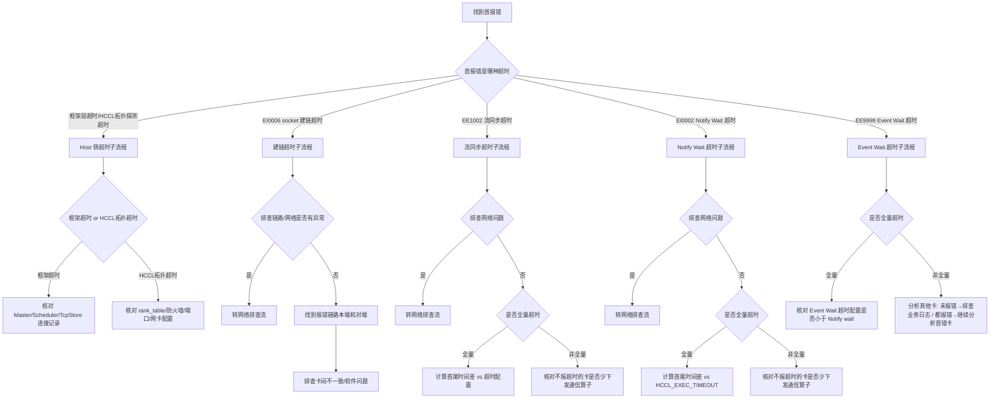

# 进程卡住与关联通信超时处理流

> **执行入口**：入口场景 `hang`；`comm_timeout` 复用本流的通信分支并保留原场景 ID。仅分析已有日志、堆栈、配置、采样与验证记录，不执行 `asys stack`、进程附加、信号注入、连通性探测或新 profiling。超时类型分流转为在已有日志中按首报错归类超时类型。先读 [公共约定](common-flow.md)，特别是 §0 找首节点。

## 问题现象

常见入口包括：

```text
[INFO] step=1000, loss=2.345   # 之后无新输出
[ERROR][HCCL] EI0002 Communication_Error_Timeout
[ERROR] EE1002 Execution_Error_Stream_Synchronize_Timeout
[ERROR] EE9999 Event Wait Timeout
no progress for 300s
deadlock detected
```

进程存在但无进展，CPU 使用率接近 0%，plog 最后一条日志时间戳在很久以前。超时类问题分为 Host 侧超时与 Device 侧超时两大类。

## 排查流程

超时类问题定位流程主干：**找到首报错 → 首报错是哪种超时 → 按超时类型进入对应子流程**。



| 顺序 | 证据 | 判断条件 | 下一步 | 中间过程记录 |
| --- | --- | --- | --- | --- |
| 1 | plog/应用日志首报错 | 超时类型归类 | 进入对应子流程 | 记录首报错原文、错误码、超时类型、rank/device |
| 2 | 框架日志/Master/Scheduler 连接记录 | Host 侧：框架超时 or HCCL 拓扑超时 | 框架→核对连接；HCCL→核对配置 | 记录连接超时原文、rank_table 配置、防火墙/端口状态 |
| 3 | 网络诊断记录 | 建链/流同步/Notify：排查网络是否有异常 | 有→转网络流；无→继续 | 记录网络诊断结论、是否有端口闪断/告警 |
| 4 | 是否所有卡都报超时 | 全量 or 非全量 | 全量→计算时间差；非全量→核对少下发 | 记录报超时的卡列表、不报的卡列表、覆盖率 |
| 5 | 首尾报错时间差 vs 超时配置 | 时间差大于 or 小于超时配置 | 大于→增大超时；小于→排查不一致 | 记录首报错时间、尾报错时间、时间差、超时配置值 |
| 6 | 不报超时的卡通信算子下发记录 | 是否少下发通信算子 | 少下发→分析 atrace；非少下发→卡间不同步 | 记录各卡通信算子数量对比、atrace 分析结果 |
| 7 | Event Wait 超时配置 vs Notify wait 配置 | Event Wait 配置是否小于 Notify wait | 是→调大 Event Wait 超时；否→收集日志排查 | 记录两个超时配置值、配置关系 |

每步的中间过程记录写入 `diagnosis.md` 的 `result.steps`，包含 step_id、检查内容、发现结果和下一步，便于追溯走到哪一步定位到问题。

### 超时类型分类

| 大类 | 子类型 | 识别特征 | 子流程 |
| --- | --- | --- | --- |
| Host 侧超时 | 训推框架超时 | 框架层超时报错（PyTorch TcpStore/连接 Master 超时、MindSpore 连接 Scheduler 超时） | §1.1 |
| Host 侧超时 | HCCL Host 侧建链超时 | HCCL 拓扑探测超时、通信域 rankSize 不符、防火墙/IP 端口被占用 | §1.1 |
| Device 侧超时 | 建链超时（EI0006） | socket 建链超时、`EI0006` | §1.2 |
| Device 侧超时 | 流同步超时（EE1002） | `EE1002`、Stream 同步超时 | §1.3 |
| Device 侧超时 | Notify Wait 超时（EI0002） | `EI0002`、Notify wait timeout | §1.4 |
| Device 侧超时 | Event Wait 超时（EE9999） | `EE9999`、Event Wait 超时 | §1.5 |

### 1.1 Host 侧超时子流程

| 子类型 | 核对节点 | 离线核对内容 |
| --- | --- | --- |
| 训推框架超时（PyTorch） | Worker 节点从 TcpStore 获取元信息超时 / Worker 节点连接 Master 节点超时 | 已有框架日志中超时报错、Master/TcpStore 连接记录 |
| 训推框架超时（MindSpore） | Worker 节点连接 Scheduler 超时 | 已有框架日志中 Scheduler 连接记录 |
| HCCL 拓扑探测超时 | 通信域 rankSize 与实际不符 / 同一 Device 在同一通信域充当不同 rank / 超时时间内有卡未初始化（是否为固定卡）/ Host 防火墙未开放 / IP 或端口被占用 / 通信域内不同 rank 使用 Host 网卡不一样 | rank_table 配置、防火墙记录、端口占用记录、网卡配置、各 rank 初始化时间 |

`EI0002`/AllReduce timeout 支持通信等待超时，不自动证明网络故障或某个 rank 是根因。`EE1002` 是 Stream 同步超时，结合实际任务和首错核对，不自动写"算子死循环"。核对同一任务中所有可用 rank 的早期异常与退出：较早 OOM/crash 可解释其他 rank 后续等待，但缺对端记录时不能假设对端已死。案例命中后仍核对通信类型、配置、版本、rank 映射与早期事件；不把 CASE-002 的 OOM 原因套给所有 HCCL timeout。

### 1.2 建链超时子流程（EI0006）

建链超时流程：**找到首报错 → 首报错是否为 socket 建链超时 → 判断设备型号 → 排查链路/网络 → 找到报错链路的本端和对端 → 排查软件问题/卡间不一致**。

| 核对节点 | 离线核对内容 | 结论边界 |
| --- | --- | --- |
| 首报错是否为 socket 建链超时 | 建链超时报错原文、`EI0006` | 否→解决首报错（转其他流程） |
| 判断设备型号 | A3→排查 1520 是否有超时代答或其他问题；通用→排查链路网络是否有异常 | A3 场景须核对 1520 日志 |
| 排查链路/网络是否有异常 | 已有网络诊断记录、链路状态 | 是→解决网络链路问题（转 [网络排查](network-flow.md)）；否→继续找本端对端 |
| 找到报错异常链路的本端和对端 | 报错链路的两端 rank/device/IP | 定位到具体链路 |
| 排查卡间不一致 | 建链时间不够（首尾建链超时时间超过阈值）/ 通信算子数量下发不一致 / 对端业务卡住（数据集处理/程序bug/其他）/ 对端业务提前退出（host OOM/segment fault/其他） | 各子项须有时间或证据关联 |
| 排查软件问题 | 通信算子类型下发不一致 / 其他问题 | 通信算子类型不一致→转 HCCL 研发分析 |

**重要**：检查建链之间的机器是否有版本混跑的情况，不允许混跑。

判断是否全量建链超时的统计方法见 [子检查](#子检查)：统计报 `wait socket establish timeout` 的卡数，若等于节点数 × 每节点卡数则为全量超时。

### 1.3 流同步超时子流程（EE1002）

流同步超时流程：**首报错流同步超时 → 排查网络问题 → 是否全量超时 → 全量/非全量分支**。

| 核对节点 | 离线核对内容 | 结论边界 |
| --- | --- | --- |
| 排查网络问题 | 已有网络诊断记录 | 是→解决网络问题；否→继续 |
| 是否全量超时 | 是否所有卡都报流同步超时 | 全量→§1.3.1；非全量→§1.3.2 |

#### 1.3.1 全量超时

计算首尾报错时间差：
- **大于流同步超时时间** → 可设置更大的超时时间 `ACL_DEVICE_SYNC_TIMEOUT`或解决不一致
- **小于流同步超时时间** → 是否有卡的 traceback 不一致 → 否→结合全量 device 日志继续分析 / 是→取异常节点 device 日志继续分析

#### 1.3.2 非全量超时

关注不报超时的卡是否少下发通信算子：
- **少下发** → 分析 atrace 日志找到少下发算子 / host 慢卡在 host 侧 / 其他情况找 HCCL 分析
- **非少下发（卡间不同步）** → 迭代前（编译快慢有区别 / 数据权重加载差异 / 通信算子下发异常）/ 迭代中（PP 设置过大 / 个别卡有额外操作或不一致的行为）→ 可设置更大超时或解决不一致 / 联系研发定位

### 1.4 Notify Wait 超时子流程（EI0002）

**重要提示：不要看见有 Notify wait 超时就认为是 CANN 或 HCCL 的问题！先确认是否是全量 Notify wait 超时！**

Notify wait 超时流程：**找到首报错 → 首报错 notify wait timeout → 排查网络问题 → 判断是否全量超时 → 全量/非全量分支**。

| 核对节点 | 离线核对内容 | 结论边界 |
| --- | --- | --- |
| 排查网络问题 | 已有网络诊断记录 | 是→解决网络问题；否→继续判断全量 |
| 判断是否全量超时 | 是否所有卡都报 notify wait timeout（统计方法见子检查） | 非全量→§1.4.1；全量→§1.4.2 |

#### 1.4.1 非全量超时

关注不报超时的卡是否少下发通信算子：
- **少下发** → 分析 atrace 日志找到少下发算子 / host 慢卡在 host 侧 / 其他情况找 HCCL 分析
- **非少下发（卡间不同步）** → 迭代前（编译快慢 / 加载 ckpt 快慢 / 数据集下载快慢）/ 迭代中（个别卡有额外操作或不一致）→ 设置更大的 `HCCL_EXEC_TIMEOUT` 或解决不一致 / 联系研发定位

#### 1.4.2 全量超时

获取首尾报错时间，比较上步时间差与 `HCCL_EXEC_TIMEOUT`：
- **大于 timeout** → 增加 `HCCL_EXEC_TIMEOUT` 超过卡间最大时间差
- **小于 timeout** → 排查所有卡，从首报错开始：
  - 通信算子下发不一致
  - 两卡互等超时
  - 建链 timeout 比执行 timeout 长

**顺藤摸瓜排查等待关系**（小于 timeout 时重点排查）：从首报错的维测日志中提取 `localRank` 与 `remoteRank`，按 `NOTIFY WAIT, localRank:` 关键词过滤，将 localRank 与 remoteRank 串联得到等待链（如 `146->147->148->...->760->1528->760`）。在等待链中找到 `A->B->A` 的环路关系即定位互等的两张卡。多卡成环时可通过脚本检测：将关系链中的卡号记录到列表，把 remoteRank 在列表中检索，若已存在则说明成环。

### 1.5 Event Wait 超时子流程（EE9999）

Event Wait 超时流程：**首报错为 Event Wait 超时 → 是否全量超时 → 全量/非全量分支**。

| 核对节点 | 离线核对内容 | 结论边界 |
| --- | --- | --- |
| 是否全量超时 | 是否所有卡都报 Event Wait 超时 | 全量→核对 Event Wait 超时配置是否小于 Notify wait：是→Event wait 超时时间配置大于 Notify wait（问题不复现→解决 / 能复现→收集日志继续）；否→收集 device 和 atrace 日志→排查历史案例 |
| 非全量超时 | 分析其他卡 | 其他卡存在未报错的→排查业务日志（业务报错比 Event Wait 更早→业务侧分析 / 没有业务报错→同全量分支）；其他卡都有报错→其他不是首错不需要关注，继续分析首错卡 |
| 排查历史案例 | 已有案例匹配 | 已知问题→按历史案例解决方案处理；非已知问题→研发分析 |

### 子检查

| 子检查 | 离线核对内容 |
| --- | --- |
| 如何判断是否全量 notify wait 超时 | 统计报 `notify wait timeout` 的卡数，若统计个数 = 节点数 × 每节点卡数则为全量超时。节点较多时按各节点文件夹分别统计报错文件数；卡数较少时可逐个列出报错行（关键词 `notify wait timeout occurred during task execution`）。A2 维测日志中若无 `notify wait timeout` 文字，改为统计 `stuck notify num`。记录报错卡数、节点数、每节点卡数、是否等于总数 |
| 如何判断是否全量建链超时 | 统计报 `wait socket establish timeout` 的卡数，若统计个数 = 节点数 × 每节点卡数则为全量超时。方法同 notify wait 全量判断。记录报错卡数、节点数、每节点卡数、是否等于总数 |
| notify wait timeout 如何顺藤摸瓜排查等待关系 | 从首报错维测日志中提取 `localRank`/`remoteRank`（关键词 `NOTIFY WAIT, localRank:`），将 localRank 与 remoteRank 串联成等待链。在等待链中找 `A->B->A` 环路定位互等卡；多卡成环时用脚本检测：将关系链卡号记入列表，把 remoteRank 在列表中检索，已存在则成环。记录等待链、环路卡号对 |
| 大模型训推 host 慢/卡住 | host 慢需业务分析：权重加载慢、dataloader 慢。host 卡住候选原因：模型权重加载卡住、训练数据加载卡住。程序不打印日志看似卡住时，核对已有堆栈快照：Python 程序核对 py-spy dump 结果，C++ 程序核对 gdb attach 后 bt 结果。记录卡住进程 PID、堆栈快照中等待位置（如权重加载/数据加载/IO 等待） |
| 如何排查通信算子下发不一致 | 在 plog 中找 HCCL `TaskExceptionHandler` 三行维测日志（关键词 `run failed, base info`）：第 1 行含通信域名 `tag[...]` 与算法名；第 2 行含 `rankSize`/`rankId`；第 3 行含 `timeStamp`/`deviceId`/`count`/`reduceType`/`dataType`。按通信域分组比较各卡的 `tag`（通信算子类型）、`count`、`dataType` 是否一致：若某卡下发 AllGather 而其他卡下发 AllReduce 则为下发不一致。记录各卡通信算子类型分布、不一致卡号、参考卡号、差异字段 |

## 证据盘点与保真要求

| 材料 | 提取字段 | 缺失时保留的边界 |
| --- | --- | --- |
| 应用/plog 的完整时间窗 | 首末时间、最后完成与首次未完成步骤、持续心跳、dispatch/done、Record/Wait | 文件截止不等于业务停滞；日志级别或轮转可使完成事件不可见 |
| 所有已提供 rank 日志 | host/PID/rank/device、collective 类型/序号/group、进入/完成事件、退出与异常 | 不能假定未提供 rank 健康或故障；不同机器时钟可能有偏差 |
| 已有线程/进程堆栈（atrace） | 快照时间、线程、等待函数、锁/队列/任务身份 | 单个 futex/waitpid/recv 帧不证明死锁及其根因 |
| 配置/启动与已有进程记录 | world size、rank 映射、rank table、启动方式、端点、退出原因、HCCL_EXEC_TIMEOUT、ACL_DEVICE_SYNC_TIMEOUT | 配置意图不一定等于实际生效状态 |
| 已有 profiling / 状态存档 | 同任务的活动区间、进展、耗时和资源等待 | 没有基线时不能凭"很久"确认异常长任务 |

必须保留 INFO/DEBUG 级别的心跳、每 rank 的正常完成、通信进入/退出、数据加载和初始化事件；重复事件保留次数、位置和时间差。它们是区分"无进展""仍在运行"和"日志已截断"的主要依据。

## 判定矩阵与竞争假设

| 分支 | 支持所需证据 | 不能单独作为根因的信号 |
| --- | --- | --- |
| 某 rank 先退出/失败，其余等待 | 该 rank 的明确退出/首错、同次 collective 身份和其他 rank 后续等待 | 单条 Rank not ready、最后打印者或只有内存高占用 |
| collective 调用不一致 | 同 group/迭代/序号的调用类型、shape/count 或进入顺序差异 | 各 rank 打印顺序不同；可能是时钟/缓冲差异 |
| 初始化/配置问题 | 有效 rank 配置、启动记录和具体异常可关联 | 没有 GE/HCCL 行就推定网络不通 |
| 网络/连接问题 | 已有连接错误/网络诊断记录、端点/时间与故障关联 | HCCL timeout 本身；不能默认通过增加超时修复。详见 [网络排查流](network-flow.md) |
| fork / 资源继承或锁依赖 | 实际启动方式、ACL 初始化先后、相关代码/栈及资源或等待关系 | DataLoader、fork、waitpid 或 futex 字样本身 |
| 数据加载/IO 等待 | 任务阶段、队列/worker/IO 栈和生产消费进展记录 | 主线程停在 DataLoader，不足以证明 worker 死锁 |
| 算子/流依赖等待 | dispatch/done、Event Record/Wait、任务/流依赖与上下游异常 | 缺 done 或同步函数超时，不直接证明死循环 |
| 正常长任务/日志中断 | 已有活动或后续完成、性能基线、文件截止/轮转/级别信息 | 无后续日志不能排除此分支 |
| 超时配置不当 | Event Wait 超时配置 < Notify wait、首尾时间差 > 超时配置 | 仅"超时"不证明配置不当 |

锁循环/死锁的结论需要等待关系形成闭环或已有验证证据；否则表述为"在 <位置> 等待，原因未定"。Event/Notify Wait 应核对对应 Record 端，不能只凭等待端闭合因果链。

### `comm_timeout` 专用判断

当入口场景为 `comm_timeout` 时，保留 `scenario_id=comm_timeout`，并按以下顺序完成通信分支：

1. **定位超时操作**：从原始日志提取 collective 类型（AllReduce、Broadcast 等）、group、迭代/序号、参与 rank、进入和超时时间，确认超时属于同一次通信操作。
2. **建立 rank 对照表**：为每个可见 rank 标记 `entered`、`completed`、`exited` 或 `unknown`。缺失 rank 日志使用 `unknown`，不推断其状态。
3. **寻找首发异常**：在超时前的时间窗内搜索 OOM、崩溃、设备错误、进程退出和数据/IO 停滞，并通过 PID、rank、device、任务序号和时间关系确认是否与超时相关。
4. **核对调用一致性**：比较各 rank 的 collective 名称、group、序号、shape/count 和进入顺序；字段缺失时将该分支标记为 `unresolved`。
5. **评估网络假设**：只有已有连接错误、端点信息和时间关系共同支持时，才将网络/连接问题列为 `supported`；`EI0002` 或 timeout 文本本身只能证明等待超时。
6. **区分传播与根因**：若某 rank 的已确认首错先于其他 rank 等待，可输出"首错导致通信等待"；通信超时自身仍记录为传播事件，首错原因单独给出状态。

该分支至少在 `H1`–`H4` 中填充 `collective_alignment`、`rank_coverage`、`rank_exit_chain`、`network_evidence`、`propagation_status` 和 `unresolved_links`。无法闭合因果链时，结论使用"通信操作在指定时间窗内未完成，具体原因未确定"，并列出尚未排除的 rank、调用一致性和网络假设。

## 子步骤产物

每步更新同一个 `diagnosis.md.result.steps`，并保留公共状态、输入/证据引用、缺口和 next_step。

| step_id | 执行动作 | findings 必含字段 |
| --- | --- | --- |
| H1 | 案例/分类与观察区间核对，归类超时类型 | signals、case_comparison、event_identity、observation_window、expected_progress、hang_confirmed、timeout_type（notify/event/host_link/stream_sync/framework/host_topo）、is_all_timeout（全量/非全量）、classification_conflicts |
| H2 | 盘点多 rank、堆栈、配置和正常进展 | material_inventory、versions、rank_map、rank_coverage、clock_alignment、last_progress_by_rank、stack_snapshots、atrace_logs、effective_config、timeout_config（HCCL_EXEC_TIMEOUT/ACL_DEVICE_SYNC_TIMEOUT） |
| H3 | 按对应子流程核对，对齐通信/任务依赖、首错和竞争假设 | first_error_candidate、timeout_subflow、first_last_time_diff、time_diff_vs_timeout、collective_alignment、task_dependencies、rank_exit_chain、branch_decisions、alternative_decisions、unresolved_links |
| H4 | 输出等待位置、因果边界和检查依据 | confirmed_facts、wait_location、root_cause_status、limitations、recommendations、check_evidence |

H4 填满公共诊断字段。`hang_confirmed=false` 不代表分析失败，仍应完成报告，说明"现有日志不足以区分真实卡住与观察窗口结束"。

## 结论与评分边界

- 事实与根因分开："<rank/group/task> 在 <观察区间> 未见进展/发生等待超时"；只有关联证据充分时才写退出源、通信不一致或锁循环。
- D1 没有 ERROR 的真实 hang 不虚构首报错，`has_first_error_line=false`；可在时间线保留最早明确异常/停滞候选。继续原评分与报告，关键项按原规则限制入库。
- D2 多 rank 日志需确认独立来源与同次事件，时钟未对齐不能机械全局排序。D3 未提供对端、网络或 Record 端时保留对应未排除假设。
- D4 仅已有修复/回归记录可加分。建议修改超时或启动方式必须注明条件和未验证状态，不执行改配置或重跑。
- 没有现场堆栈不裁剪本流、不额外封顶；现有日志可支持到何种范围就写到何种范围。

参考：[公共约定](common-flow.md)、[故障处理专题](../fault-handling.md)、[错误码](../err-messages.md)、[网络排查流](network-flow.md)、[CASE-002 与案例库](../cases.md)、[可信度规范](../confidence-assessment.md)；案例相似只形成候选，实际异同核对后才评估是否匹配。
