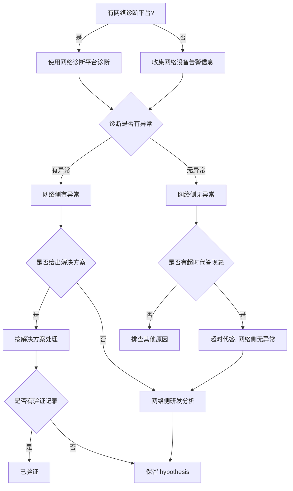

# 网络排查典型故障处理流

> **执行入口**：入口场景 `network`；也作为 `comm_timeout`/`hang` 中网络假设分支的细化流程。本流只离线分析已提供的网络诊断报告、网络设备告警、plog 中的 RoCE/HCCL 报错、连通性记录和验证记录，不执行现场连通性探测、抓包或网络配置变更。"使用网络诊断平台诊断""收集网络设备告警"转为核对已有诊断报告/告警记录。先读 [公共约定](common-flow.md)，特别是 §0 找首节点。

## 问题现象

常见入口包括：

```text
[ERROR][HCCL] EI0002 Communication_Error_Timeout  # 通信超时（需进一步核对是否网络）
[ERROR] EI0013 ROCE CQE error
# 端口闪断 / Down
# 网络设备告警
# 丢包记录
```

`EI0002`/HCCL timeout 本身不证明网络故障，须有网络侧证据才能确认。

## 排查流程

网络排查流程主干：**有网络诊断平台优先使用 → 端口闪断/Down → 无平台则收集网络设备告警 → 诊断有异常/无异常 → 网络侧有异常/无异常 → 给出解决方案或超时代答 → 网络侧研发分析**。



| 顺序 | 证据 | 判断条件 | 下一步 | 中间过程记录 |
| --- | --- | --- | --- | --- |
| 1 | 网络诊断报告 | 是否有诊断报告且覆盖故障时间窗 | 有→按报告结论核对；无→转告警核对 | 记录诊断平台名称、报告时间窗、是否覆盖本次故障 |
| 2 | 端口/链路状态记录 | 是否有端口闪断/Down 事件 | 有→网络方向候选；无→继续 | 记录端口名、闪断时间、是否与故障时间关联 |
| 3 | 网络设备告警 | 是否有告警记录 | 有→支持网络异常；无→不排除网络问题 | 记录告警时间、类型、设备、端口、严重级别 |
| 4 | 诊断报告结论 | 诊断是否有异常 | 有异常→网络侧有异常；无异常→转超时代答 | 记录诊断结论、异常类型/位置 |
| 5 | 网络侧研发分析结论 | 是否有研发分析 | 有→按结论处理；无→保留 hypothesis | 记录研发分析结论或"无研发分析" |
| 6 | 超时代答记录 | 网络侧无异常时是否有超时代答 | 有→超时代答保留未解决；无→排查其他原因 | 记录代答类型（RPTX/RPRX/LPTX/LPRX）、端口、时间 |
| 7 | 解决方案验证记录 | 是否有验证 | 有→已验证；无→hypothesis | 记录解决方案、验证结果或"无验证" |

每步的中间过程记录写入 `diagnosis.md` 的 `result.steps`，包含 step_id、检查内容、发现结果和下一步，便于追溯走到哪一步定位到问题。

## 证据盘点

| 材料 | 提取字段 | 缺失时的结论边界 |
| --- | --- | --- |
| 网络诊断报告 | 诊断时间窗、作业、异常结论、异常类型/位置 | 无报告则诊断分支 `unresolved` |
| 网络设备告警 | 告警时间、类型、设备、端口、严重级别 | 无告警不等于网络无问题 |
| plog 中 RoCE/HCCL 报错 | roce 报错原文、hccp 报错、时间、rank/device | 见 [超时流](hang-flow.md) 中通信分支 |
| 端口/链路状态记录 | 端口状态、闪断/Down 时间、链路错误计数 | 无记录则端口分支 `unresolved` |
| 连通性记录 | 已有连通性测试结果、端点、时间 | 无记录则连通性分支 `unresolved` |
| 网络侧研发分析 | 分析结论、异常定位、解决方案、验证记录 | 无分析保留 `hypothesis` |

## 判定矩阵

| 分支 | 支持所需证据 | 不能单独作为根因的信号 |
| --- | --- | --- |
| 网络设备/端口故障 | 端口闪断/Down + 告警 + 与故障时间关联 | 仅 HCCL timeout，无网络证据 |
| RoCE/链路异常 | roce 报错 + 链路错误 + 诊断报告异常 | 仅"有 roce 报错"，未关联到具体链路 |
| 超时代答（网络侧无异常） | 诊断无异常 + 超时代答现象 + 网络侧研发分析 | 仅"超时"，未排除业务侧 |
| 信用证反压（缓解） | 反压记录 + 反压后表现 | 反压是缓解，非根因 |
| 非网络问题 | 排除网络后指向业务/OOM/掉卡等其他根因 | 不能因网络证据不足就跳到非网络结论，须有其他根因证据 |

## 子步骤产物

每步更新同一个 `diagnosis.md.result.steps`，包含公共状态、输入/证据引用、缺口与 next_step。

| step_id | 执行动作 | findings 必含字段 |
| --- | --- | --- |
| N1 | 案例与网络事件入口核对 | signals、case_comparison、event_identity、has_diag_platform、classification_conflicts |
| N2 | 盘点诊断报告/告警/端口/连通性等材料 | material_inventory、versions、diag_report、network_alarms、port_events、roce_errors、connectivity_records |
| N3 | 按流程评估诊断有/无异常及网络侧分支 | first_error_candidate、diag_result（abnormal/normal）、network_side_result、branch_decisions、alternative_decisions、unresolved_links |
| N4 | 输出网络根因边界、建议和检查依据 | confirmed_facts、root_cause_status、limitations、recommendations、check_evidence |

N4 填满公共诊断字段。建议以修复网络设备/端口、调整 RoCE 配置、反压缓解为主，须标注适用前提与已有验证状态；超时代答未解决时如实写明。

## 结论与评分边界

"已确认 <端口/链路/RoCE> 存在网络异常，证据 <诊断报告/告警原文>；<网络根因> 为 <confirmed/hypothesis/undetermined>。<缺口> 使 <具体判断> 仍无法确认。"

- D1 首错为网络报错/端口事件的最早记录；无明确行时 `has_first_error_line` 按实际定位判断。
- D2 诊断报告、网络告警、plog 属独立来源，可互证；同一来源副本不算多源。
- D3 网络根因需诊断报告/告警/链路证据闭合；仅 HCCL timeout 不够 `root_cause_localized`。
- D4 网络修复后验证记录才记 `fix_verified`；无验证不记。
- D5 命中历史网络案例须核对网络拓扑、设备、RoCE 配置异同。

参考：[公共约定](common-flow.md)、[故障处理专题](../fault-handling.md)、[超时流](hang-flow.md)、[错误码](../err-messages.md)、[可信度规范](../confidence-assessment.md)。
