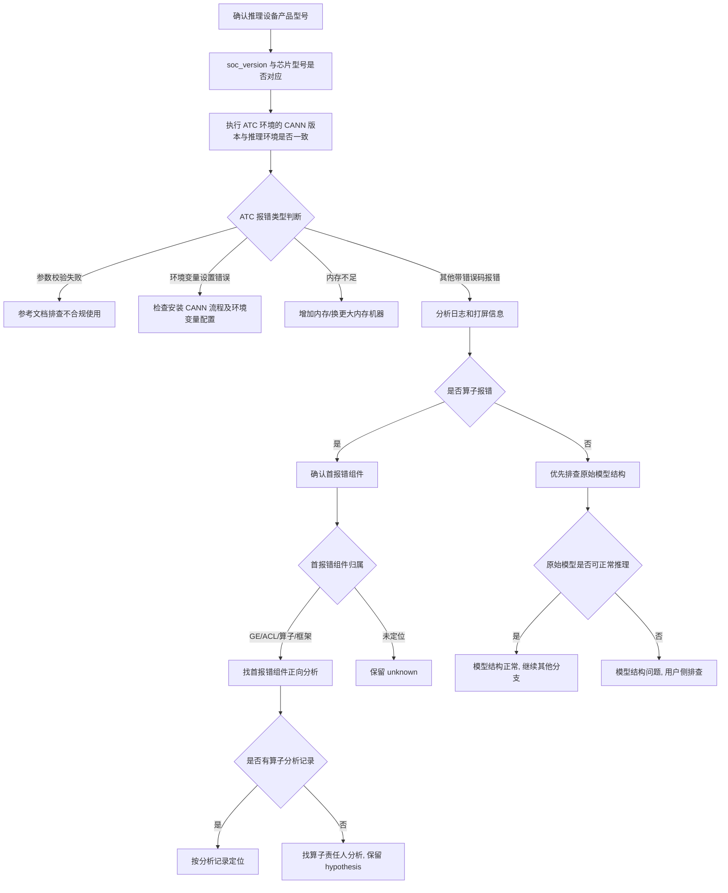

# 离线推理/ATC 典型故障处理流

> **执行入口**：入口场景 `offline_inference`。本流覆盖离线推理场景的 ATC 模型转换报错、离线推理报错、性能与精度问题。只离线分析已提供的 ATC 日志、plog、模型文件、环境配置和验证记录，不执行现场 ATC 重转、推理复跑或环境变量切换。现场操作（"修改 soc_version 后排查""使用配套 CANN 进行 ATC"等）不执行，只在已有配置/日志中核对对应状态与报错。先读 [公共约定](common-flow.md)，特别是 §0 找首节点。

## 问题现象

常见入口包括：

```text
ATC start working, model conversion failed
ERROR: soc_version does not match the actual chip model
ERROR: parameter validation failed
ERROR: memory not enough during ATC
ERROR: operator xxx execute failed during inference
```

## 排查流程

ATC 问题定位流程主干：**确认版本信息 → 按 ATC 报错类型分支（参数校验失败 / 环境变量设置错误 / 内存不足 / 其他带错误码报错）→ 其他带错误码报错分析是否算子报错 → 确认首报错组件 → 正向分析**。



| 顺序 | 证据 | 判断条件 | 下一步 | 中间过程记录 |
| --- | --- | --- | --- | --- |
| 1 | 推理设备信息 | 产品型号、芯片型号 | 确认 soc_version 是否对应 | 记录产品型号、芯片型号 |
| 2 | ATC 命令中 soc_version | soc_version 与实际芯片型号是否对应 | 不对应→参数校验失败候选；对应→排除 | 记录 soc_version 值、芯片型号、是否匹配 |
| 3 | ATC 环境 CANN 版本、推理环境 CANN 版本 | 版本是否一致 | 不一致→环境变量候选；一致→排除 | 记录 ATC 环境 CANN 版本、推理环境 CANN 版本、是否一致 |
| 4 | ATC 日志报错原文 | 报错类型分类 | 按类型进入对应分支 | 记录报错原文、错误码、报错类型 |
| 5 | ATC 日志/plog | 是否算子报错 | 是→确认首报错组件；否→排查模型结构 | 记录是否定位到算子、算子名 |
| 6 | 首报错组件归属 | GE/ACL/算子/框架 | 定位到→正向分析；未定位→unknown | 记录组件归属、报错位置 |
| 7 | 已有分析记录/源码 | 能否正向分析 | 有→按记录定位；无→hypothesis | 记录分析结论或"无分析记录" |
| 8 | 模型文件 | 原始模型是否可正常推理 | 异常→用户侧排查；正常→继续其他分支 | 记录模型结构核对结果 |

每步的中间过程记录写入 `diagnosis.md` 的 `result.steps`，包含 step_id、检查内容、发现结果和下一步，便于追溯走到哪一步定位到问题。

## 证据盘点

| 材料 | 提取字段 | 缺失时的结论边界 |
| --- | --- | --- |
| ATC 命令与日志 | soc_version、输入模型、报错原文、错误码、时间、CANN 版本 | 无 ATC 日志则无法定位 ATC 阶段问题 |
| 推理设备信息 | 产品型号、芯片型号、CANN 版本、驱动版本 | 设备信息缺失则版本核对分支 `unresolved` |
| 环境变量配置 | `ASCEND_HOME_PATH`、`LD_LIBRARY_PATH`、`ATC` 相关变量 | 配置缺失则环境变量分支 `unresolved` |
| plog / 打屏日志 | 首报错、算子报错、组件归属、错误码 | 无 plog 则无法定位算子/组件 |
| 模型文件 | 原始模型结构、算子列表、输入输出 | 模型缺失则模型结构分支 `unresolved` |
| 已有验证记录 | 变更前后结果、修复验证、回归 | 无验证不记 `fix_verified` |

## 判定矩阵

| 分支 | 支持所需证据 | 不能单独作为根因的信号 |
| --- | --- | --- |
| soc_version / 产品型号不匹配 | ATC 命令中 soc_version 与实际芯片型号比对不一致 + 修正后验证 | 仅"有报错"，未核对 soc_version |
| CANN 版本不一致 | ATC 环境 CANN 与推理环境 CANN 版本比对不一致 | 仅"版本不同"，未关联到具体报错 |
| 参数校验失败 | ATC 日志中参数校验失败原文 + 不合规参数 | 仅"ATC 失败"，无具体参数 |
| 环境变量设置错误 | 环境变量相关报错 + 配置记录 | 仅"推理失败"，无变量报错 |
| 内存不足（ATC 阶段） | ATC 内存不足报错 + 机器内存配置 | 仅"报错"，未确认是 ATC 内存 |
| 算子报错 | plog/打屏定位到具体算子 + 算子组件 | 仅"有错误码"，未定位算子 |
| 原始模型结构问题 | 模型结构核对 + 原始模型可/不可推理验证 | 仅"推理失败"，未核对模型 |
| 离线推理性能问题 | 已有 profiling/性能数据 + 瓶颈定位 | 见[性能流](performance-flow.md)，非本流主干 |
| 离线推理精度问题 | 已有精度比对结果 + 异常算子 | 见[精度流](precision-flow.md)，非本流主干 |

## 子步骤产物

每步更新同一个 `diagnosis.md.result.steps`，包含公共状态、输入/证据引用、缺口与 next_step。

| step_id | 执行动作 | findings 必含字段 |
| --- | --- | --- |
| I1 | 案例与离线推理入口核对，确认版本信息 | signals、case_comparison、event_identity、soc_version_match、cann_version_match、product_model、classification_conflicts |
| I2 | 盘点 ATC 日志/设备/环境/模型等材料 | material_inventory、versions、atc_command、env_config、model_info、plog_errors |
| I3 | 按报错类型分支评估，定位首报错组件 | first_error_candidate、atc_error_type（param/env/mem/other）、is_op_error、first_error_component、branch_decisions、alternative_decisions、unresolved_links |
| I4 | 输出离线推理根因边界、建议和检查依据 | confirmed_facts、root_cause_status、limitations、recommendations、check_evidence |

I4 填满公共诊断字段。建议以修正 soc_version、使用配套 CANN、调整环境变量、增加内存、修正模型结构为主，须标注适用前提与已有验证状态。

## 结论与评分边界

"已确认 <ATC/推理阶段> 报 <原文错误>，证据 <原始引用>；<版本不匹配/参数校验/环境变量/算子/模型结构> 为 <confirmed/hypothesis/undetermined>。<缺口> 使 <具体判断> 仍无法确认。"

- D1 首错为 ATC/推理日志中最早可关联的报错行；无明确行时按实际定位判断。
- D2 ATC 日志与 plog/设备信息属独立来源，可互证；同一日志副本不算多源。
- D3 离线推理根因需定位到具体组件/算子/配置并有证据；仅"ATC 失败"不够 `root_cause_localized`。
- D4 修正后验证记录才记 `fix_verified`；无验证不记。
- D5 命中历史离线推理案例须核对 CANN 版本、soc_version、算子异同。

参考：[公共约定](common-flow.md)、[故障处理专题](../fault-handling.md)、[错误码](../err-messages.md)、[性能流](performance-flow.md)、[精度流](precision-flow.md)、[可信度规范](../confidence-assessment.md)。
