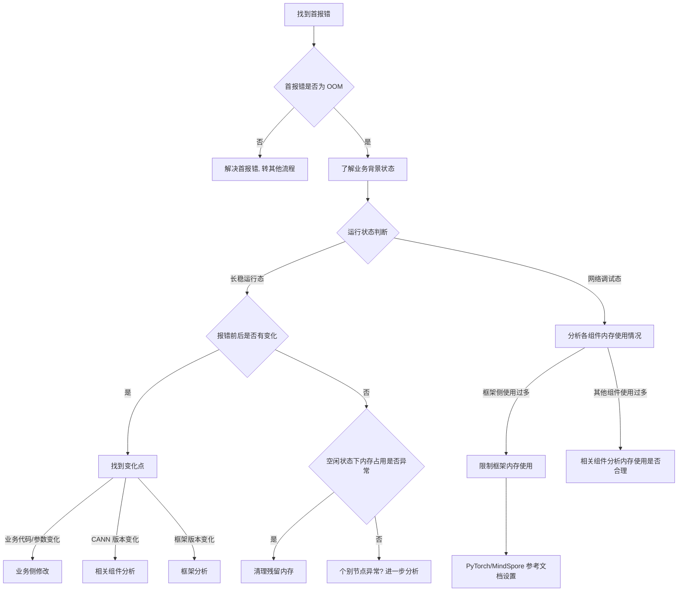

# OOM 典型故障处理流

> **执行入口**：入口场景 `oom`；也作为 crash/hang/comm_timeout 中的内存竞争假设使用。本流使用已提供的日志、配置和采样存档，不启动实时监控或补采。现场命令（`npu-smi info -t memory`、`CANN_MEMORY_DEBUG`、`free -h` 等）不执行，只在已有材料中找对应内存占用证据。先读 [公共约定](common-flow.md)，特别是 §0 找首节点。

## 问题现象

常见入口包括：

```text
[ERROR][ACL] EL0004 HBM memory allocation failed, requested=32GB, available=28GB
[ERROR][GE] Load graph to device failed: memory not enough
Out of memory: Kill process <pid> (python)
RuntimeError: [Core] Out of memory.
```

退出码 137 仅为 SIGKILL 线索，不能确认 OOM；须核对内存分配失败原文或内核 OOM Kill 记录。

## 排查流程

NPU OOM 定位流程主干：**找到首报错 → 首报错是否为 OOM → 了解业务背景状态 → 长稳运行态/网络调试态分支 → 找到变化点或分析各组件内存 → 给出优化方向**。



| 顺序 | 证据 | 判断条件 | 下一步 | 中间过程记录 |
| --- | --- | --- | --- | --- |
| 1 | plog/应用日志 | 首报错是否为 OOM（EL0004、HBM allocation failed、memory not enough、框架 Out of memory） | 是→继续；否→转其他流程 | 记录首报错原文、错误码、侧别（Device/Host/框架） |
| 2 | 模型/算子、batch/shape、训练或推理阶段 | 了解业务背景状态 | 区分长稳运行态/网络调试态 | 记录业务类型、batch size、模型规模、运行阶段 |
| 3 | 报错前后业务状态、内存占用曲线、配置变更 | 长稳运行态：报错前后是否有变化 | 有变化→找变化点；无变化→查空闲内存 | 记录变化点类型（业务代码/CANN版本/框架版本）、变化前后对比 |
| 4 | GE/ACL/HCCL 内存统计、npu-smi 内存快照 | 网络调试态：分析各组件内存使用情况 | 框架多→限制框架内存；其他组件多→分析是否合理 | 记录各组件占用值、total/used/free、占用分布 |
| 5 | 空闲/预热阶段内存基线、残留进程 | 空闲状态下内存占用是否异常 | 异常→清理残留内存；正常→个别节点分析 | 记录空闲时 used/total、是否有残留进程、基线对比 |
| 6 | CANN 版本、框架版本、业务代码变更 | 找到变化点 | 按变化类型分别处理 | 记录变化点、变更前后内存表现、是否关联到本次 OOM |

每步的中间过程记录写入 `diagnosis.md` 的 `result.steps`，包含 step_id、检查内容、发现结果和下一步，便于追溯走到哪一步定位到问题。

## 证据盘点

| 材料 | 提取字段 | 缺失时的结论边界 |
| --- | --- | --- |
| plog / 应用日志 | 分配 API/模块、请求字节、可用/保留量、错误原文、时间、PID/rank/device | 没有底层信息则保留侧别或分配机制未知 |
| 已存档内存采样 | 样本时间、设备、total/used/free、采样来源与故障时间差 | 事后低占用不能证明故障时有余量，也不能证明碎片 |
| 已存档内核 / 容器 / 调度日志 | 被杀 PID、OOM/cgroup 限制、退出原因、时间 | 无记录不等于没有 OOM Kill；137 不足以替代该证据 |
| 模型与运行配置 | batch/shape、模型/优化器/缓存、框架内存上限、rank 映射 | 不能凭大模型名称猜测内存构成或配置错误 |
| 既有内存曲线 / 分配释放记录 | 同一业务阶段的占用、请求/释放序列、对象归属 | 只有占用增长不能确认泄漏，须区分预热、缓存与活跃对象 |
| 已有复现/验证记录 | 变更前后配置、触发条件、结果和覆盖范围 | 不声称修复或回归已验证 |

必须保留正常分配/释放、训练 step、缓存增长、rank 到达同步点等 INFO/DEBUG 行；它们用于判断时序与竞争假设。

### 子检查

| 子检查 | 离线核对内容 |
| --- | --- |
| 如何快速找到报错的首节点 | 收集所有 rank 的 host 日志（plog 和 device 日志，目录结构：`plog/debug/device-*` 为 device 侧 ERROR 日志回传、`plog/debug/plog` 为 host 侧 ERROR 日志、`plog/run` 为 INFO 日志）。按时间排序所有 ERROR 日志找到最先报错的 rank 与报错内容。存在未报错 rank 时定位原因：未报错卡都是首错后被 kill（核对 watchdog/平台 kill 记录）、CANN 上层报错导致进程早于首错结束（框架/平台定位）、有进程早于首错发生 coredump（核对 core 文件）、个别 rank 提前正常结束（框架/业务定位卡间设置不一致）。记录首报错 rank、首报错时间、首报错原文、未报错 rank 的原因 |

## 判定矩阵

| 分支 | 成立所需证据 | 允许结论 / 未解决项 |
| --- | --- | --- |
| Device 容量不足 | 本次 Device 分配失败 + 同时段可用容量/请求量或明确分配器诊断 | 可判容量限制；只有构成证据充分才归因于模型、激活、KV cache 或通信 buffer |
| 分配请求异常 | 请求量、shape/dtype/尺寸计算与已有输入/源码可关联 | 区分合法的大请求与尺寸计算错误；请求很大本身不证明 bug |
| 分配器碎片 | 分配器/内存池记录明确表明总余量与可满足块不一致，且适用机制可核对 | 可支持碎片假设；低利用率或 reserved > allocated 单独不充分 |
| Host OOM Kill | 匹配进程的内核/容器 OOM 记录 | 确认被 OOM 杀死；具体触发源仍需进程/对象归属证据 |
| 外部 kill / 作业终止 | 调度器、容器或操作记录明确给出相应终止原因 | 作为竞争假设或触发原因；不能把 SIGKILL 重写为内存耗尽 |
| 框架配额/内存池限制 | 有效配置与同一分配请求的失败记录可关联 | 确认限制作用；框架报错本身不证明物理 HBM 已满。"框架使用过多 → 限制框架内存"归此分支 |
| 内存泄漏 | 可比业务阶段持续增长 + 对象/分配生命周期证据 + 缓存/预热等替代解释已核对 | 支持具体泄漏位置；仅时间曲线增长保留"持续增长，原因未定" |
| 残留内存未清理 | 空闲状态高占用 + 残留进程/未释放分配记录 | "清理残留内存"归此分支；须有残留证据，不能凭"重启后好了"反推 |

## 子步骤产物

每一步更新 `diagnosis.md.result.steps`，公共字段见 [公共约定](common-flow.md)，下列为每步 `findings` 必含字段：

| step_id | 执行动作 | findings 字段 |
| --- | --- | --- |
| O1 | 首节点核对：原始信号、候选案例与本次任务关联 | signals、case_comparison、event_identity、oom_side（device/host/framework/unknown）、long_run_change（长稳报错前后变化点）、classification_conflicts |
| O2 | 盘点并离线读已有材料，核对各组件内存使用 | material_inventory、versions、allocation_events、memory_samples、sample_time_relation、component_memory_usage、process_exit_events、idle_baseline |
| O3 | 对齐首错/释放/退出/其他 rank 等待，逐个判断分支 | first_error_candidate、normal_progress、timeline_links、branch_decisions、alternative_decisions、unresolved_links、change_point |
| O4 | 输出证据边界与评分依据 | confirmed_facts、root_cause_status、limitations、recommendations、check_evidence |

O4 同步填充公共 `first_error/timeline/causal_chain/root_cause/alternatives/recommendations/checks/references`。先引用原文再解释，不用摘要代替首报错。

## 结论与评分边界

- 仅有 EL0004：可确认相应分配失败，不可直接写"碎片""泄漏"或某个 buffer 超限。
- 只有 137：写"终止信号线索，OOM 未获证实"；把 OOM 与其他终止原因均保留为候选。
- 缺故障时采样：写明无法核对容量分支，继续用分配器、配置和时间线证据评估，不裁剪诊断步骤、不封顶评分。
- D1 首错需排除传播/清理日志并定位原文；D2 不能把同一 plog 的多份副本当多源；D3 不能用不存在的 dmesg 排除外部 kill/Host OOM；D4 只看已有验证记录。
- [CASE-004](../cases.md) 的图加载 OOM、CASE-002 的 rank 退出后通信等待仅作候选，须分别核对内存构成、PID/rank 映射与原始 OOM Kill 证据。命中案例不自动填 `case_matched=true`。

结论写法："已确认 <分配失败/被 OOM Kill>，证据 <原始引用>。<具体根因> 当前为 <confirmed/hypothesis/undetermined>；<缺口> 限制了 <哪项判断>。"无根因证据时仍交付完整诊断与可信度，案例准入按原评分门槛。

### OOM 诊断交付要求

`diagnosis.md` 的 OOM 结果至少应让读者回答以下问题，并逐项给出原始证据引用：

1. **发生了什么**：指出分配失败或进程终止的原文、文件和行号，标明 Host、Device、框架配额或未知侧别。
2. **谁先发生**：`first_error` 只指向与本次任务关联的最早异常；后续 rank 的等待、超时和清理记录放在 `timeline` 的传播/清理角色。
3. **哪条分支成立**：在 `branch_decisions` 中分别记录容量不足、请求异常、碎片、Host OOM Kill、外部终止、框架限制、泄漏、残留内存的 `status`（confirmed/hypothesis/undetermined/excluded），以及支持证据和反证。未找到材料时使用 `undetermined`，不要把缺失当作排除。
4. **因果链是否闭合**：`causal_chain` 的每一跳都包含起点、终点、支持证据和反证。若只能确认"分配失败"，则根因状态保持 `hypothesis` 或 `undetermined`，不能补写具体内存对象或机制。
5. **还能确认什么**：`evidence_gaps` 写清缺少的材料及其影响，例如"没有故障时内存采样，无法区分容量不足与碎片；当前仅确认分配请求失败"。

当 OOM 与通信超时、崩溃或卡住同时出现时，报告同时保留主场景和次场景，并明确传播关系。例如"rank0 的 EL0004 先于其他 rank 的 AllReduce timeout，支持 rank0 退出导致同步等待；EL0004 的具体内存机制仍未确定"。

建议只在现有证据支持时填写：降低 batch/shape、释放缓存、调整内存池、修正尺寸计算、修复泄漏、处理 Host cgroup 限制或清理残留内存。每条建议都标注适用前提、预期影响和已有验证状态；没有验证记录时不得写成已修复。

参考：[公共约定](common-flow.md)、[内存专题](../fault-handling.md)、[错误码](../err-messages.md)、[可信度](../confidence-assessment.md)。
