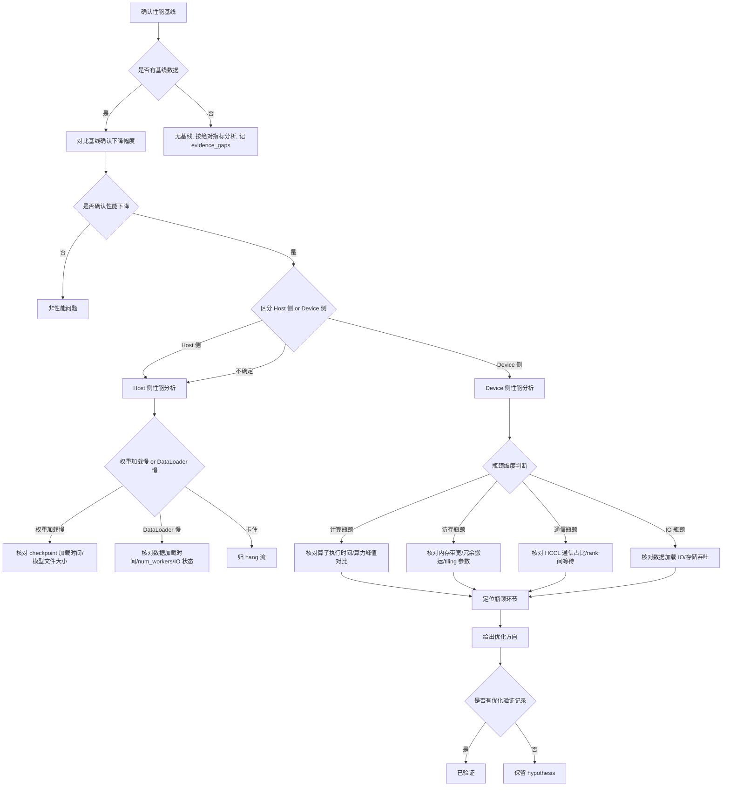

# 性能问题典型故障处理流

> **执行入口**：入口场景 `performance`。性能问题指训练或推理吞吐下降、延迟增大、迭代变慢或相比基线出现性能回归，进程仍在运行但效率低于预期。本流只离线分析已提供的 profiling 数据、plog、应用日志、性能基线和验证记录，不执行现场 `asys perf`、`npu-smi` 监控、profiling 重采或业务复跑。先读 [公共约定](common-flow.md)，特别是 §0 找首节点。

> 性能问题与 hang 的区分：hang 是无进展或等待超时，performance 是有进展但效率低于预期；两者可共存，按主场景路由。

## 问题现象

常见入口包括：

```text
# 吞吐下降
throughput: 1500 samples/s (baseline: 3000 samples/s)
# 迭代变慢
step_time: 2.5s (baseline: 1.2s)
# Host 慢
weight loading time: 300s (baseline: 60s)
dataloader time: 1.8s/step (compute time: 0.3s/step)
```

性能问题不一定有 ERROR 级别日志，INFO/DEBUG 中的耗时统计、step 时间、吞吐指标和 profiling 数据是主要证据。

## 排查流程

性能问题定位流程主干：**确认性能基线 → 确认性能下降现象 → 区分 Host 侧 / Device 侧瓶颈 → 定位瓶颈环节（计算 / 访存 / 通信 / IO）→ 给出优化方向**。



| 顺序 | 证据 | 判断条件 | 下一步 | 中间过程记录 |
| --- | --- | --- | --- | --- |
| 1 | 历史吞吐/step 时间/迭代耗时 | 是否有基线数据 | 有→对比确认下降；无→按绝对值分析 | 记录基线值、当前值、下降幅度或"无基线" |
| 2 | 日志/profiling 中吞吐、延迟、step 时间 | 是否确认性能下降 | 是→区分 Host/Device；否→非性能问题 | 记录当前吞吐、step 时间、与基线差值 |
| 3 | Host 耗时数据、堆栈快照 | Host 侧 or Device 侧 | Host→权重/DataLoader 分析；Device→瓶颈维度 | 记录 Host 耗时占比、Device 耗时占比、判断依据 |
| 4 | 权重加载时间、checkpoint 大小 | 权重加载是否慢 | 慢→Host 瓶颈候选 | 记录加载时间、文件大小、与基线对比 |
| 5 | 数据加载时间、num_workers、IO 吞吐 | DataLoader 是否慢 | 慢→Host 瓶颈候选 | 记录加载时间、worker 数、队列积压、IO 吞吐 |
| 6 | profiling 算子耗时、算力峰值 | 计算瓶颈 | 占比高→计算瓶颈 | 记录慢算子列表、耗时占比、与峰值对比 |
| 7 | profiling 内存带宽、搬运次数 | 访存瓶颈 | 带宽高→访存瓶颈 | 记录带宽利用率、冗余搬运次数、tiling 参数 |
| 8 | profiling HCCL 通信时间、rank 等待 | 通信瓶颈 | 占比高→通信瓶颈 | 记录通信时间占比、rank 间等待、重叠度 |
| 9 | 优化验证记录 | 是否有验证 | 有→已验证；无→hypothesis | 记录优化措施、变更前后对比、验证结果 |

每步的中间过程记录写入 `diagnosis.md` 的 `result.steps`，包含 step_id、检查内容、发现结果和下一步，便于追溯走到哪一步定位到问题。

### Host 侧性能分析

Host 侧问题分为"慢"和"卡住"两类，本流只处理"慢"：

| 子类型 | 核对内容 | 结论边界 |
| --- | --- | --- |
| 权重加载慢 | 已有日志中 `load_state_dict` / checkpoint 加载时间、模型文件大小与基线对比 | 加载时间显著大于基线支持慢结论；无基线按绝对值判断 |
| DataLoader 慢 | 已有日志中数据加载时间、worker 数量、IO 吞吐、队列积压 | 加载慢支持 Host 瓶颈；须核对配置 |
| 权重加载卡住 | 已有堆栈（py-spy dump）显示卡在加载 | **归 [hang 流](hang-flow.md)**，本流不处理 |
| 训练数据加载卡住 | 已有堆栈显示卡在数据加载 | **归 [hang 流](hang-flow.md)**，本流不处理 |

若材料中包含 py-spy dump 或 gdb bt 输出，作为 Host 侧瓶颈定位证据引用；未提供堆栈时该分支 `unresolved`。

### Device 侧性能分析

| 维度 | 核对内容 | 结论边界 |
| --- | --- | --- |
| 计算瓶颈 | profiling 中算子执行时间占比、FA/MatMul 等典型算子耗时、与算力峰值对比 | 计算占比高支持计算瓶颈；须排除数据供给不足导致的假象 |
| 访存瓶颈 | profiling 中内存带宽利用率、HBM 读写量、tile/tiling 参数、不必要搬运 | 带宽接近上限支持访存瓶颈；须区分有效计算与冗余搬运 |
| 通信瓶颈 | profiling 中 HCCL 通信时间占比、rank 间等待时间、通信与计算重叠度 | 通信占比高支持通信瓶颈；须核对是否正常通信开销还是异常等待 |
| IO 瓶颈 | 数据加载 IO 时间、磁盘/网络存储吞吐、与 Device 计算的匹配度 | IO 等待大于计算时间支持 IO 瓶颈；须核对存储配置 |

## 证据盘点

| 材料 | 提取字段 | 缺失时的结论边界 |
| --- | --- | --- |
| profiling 数据（ait/asys perf） | 算子耗时、通信时间、内存带宽、瓶颈算子、timeline | 无 profiling 则无法做 Device 侧瓶颈定位，保留 `unknown` |
| plog / 应用日志 | step 时间、迭代耗时、吞吐指标、权重加载时间、数据加载时间 | 无日志则无法做 Host 侧时间分析 |
| 性能基线 / 历史数据 | 基线吞吐、step 时间、迭代耗时、历史 profiling | 无基线则性能下降幅度不可量化，按绝对指标分析 |
| py-spy / gdb 堆栈快照 | 快照时间、线程、等待函数、调用链 | 无堆栈则 Host 侧瓶颈定位 `unresolved` |
| 模型与运行配置 | batch size、模型结构、优化器、num_workers、混合精度配置 | 配置影响性能预期；缺失则无法判断配置是否合理 |
| HCCL 通信配置 | world size、通信域、通信算法、buffer size | 通信配置影响通信开销预期；缺失则通信分支 `unresolved` |
| 已有优化与验证记录 | 优化措施、变更前后性能对比、回归验证 | 无验证不记 `fix_verified` |
| npu-smi / 硬件状态快照 | 卡型号、频率、温度、健康状态 | 硬件降频/高温可能影响性能；无快照则该分支 `unresolved` |

必须保留正常 step 的耗时记录、数据加载完成事件、通信进入/退出、权重加载完成等 INFO/DEBUG 行；它们是区分"慢"与"卡住"、量化性能下降幅度的主要依据。

## 判定矩阵

| 分支 | 支持所需证据 | 不能单独作为根因的信号 |
| --- | --- | --- |
| Host 侧计算/IO 瓶颈 | Host 侧耗时占比显著 + profiling/日志中 Host 环节耗时数据 + 与基线对比 | 仅"用户说慢"，无 Host 耗时数据 |
| 权重加载慢 | 权重加载时间显著大于基线 + 模型文件大小 + 加载方式 | 仅"大模型"，未核对加载时间 |
| DataLoader 慢 | 数据加载时间显著大于计算时间 + num_workers/IO 配置 + 队列积压记录 | 仅"用了 DataLoader"，无时间数据 |
| Device 计算瓶颈 | profiling 中计算算子耗时占比高 + 与算力峰值对比 + 慢算子列表 | 仅"profiling 有数据"，未定位瓶颈算子 |
| Device 访存瓶颈 | profiling 中内存带宽利用率高 + 冗余搬运记录 + tiling 参数 | 仅"有 memcpy"，未核对是否冗余 |
| 通信瓶颈 | profiling 中通信时间占比高 + rank 间等待 + 通信与计算重叠度 | 仅"用了 HCCL"，未核对通信占比 |
| 硬件降频/异常 | npu-smi 中频率/温度异常 + 与正常状态对比 | 仅"有 npu-smi"，未核对频率/温度 |
| 版本/配置变化引入 | 版本/配置变化前后性能对比 + 变化点定位 | 仅"换了版本"，未关联到性能变化 |
| 混合精度/编译策略影响 | 混合精度配置 + 编译策略 + 与基线对比 | 仅"用了 FP16"，未核对性能差异 |
| 非 NPU 性能问题 | 排除 NPU 侧后指向 CPU/IO/网络等其他瓶颈 | 不能因 NPU 侧证据不足就跳到非 NPU 结论，须有其他瓶颈证据 |

性能问题与 hang 的边界：进程无进展或等待超时归 hang；进程有进展但效率低于预期归 performance。两者同时出现时，hang 通常是更紧急的故障，按主场景路由，performance 作为次场景保留。

## 子步骤产物

每步更新同一个 `diagnosis.md.result.steps`，包含公共状态、输入/证据引用、缺口与 next_step。

| step_id | 执行动作 | findings 必含字段 |
| --- | --- | --- |
| F1 | 案例与性能问题入口核对，确认基线与下降现象 | signals、case_comparison、event_identity、has_baseline、performance_drop_evidence、host_or_device（host/device/unknown）、classification_conflicts |
| F2 | 盘点 profiling/日志/配置/堆栈等材料 | material_inventory、versions、profiling_data、plog_metrics、baseline_data、stack_snapshots、model_config、hccl_config、hardware_status |
| F3 | 按 Host/Device 维度评估瓶颈环节，对齐竞争假设 | first_error_candidate、host_assessment、device_assessment、bottleneck_type（compute/memory/communication/io/unknown）、bottleneck_location、branch_decisions、alternative_decisions、unresolved_links |
| F4 | 输出性能根因边界、建议和检查依据 | confirmed_facts、root_cause_status、limitations、recommendations、check_evidence |

F4 填满公共诊断字段。性能问题的建议以优化算子、调整 batch/tiling、减少冗余搬运、优化通信策略、调整 DataLoader 配置、开启混合精度等为主，须标注适用前提与已有验证状态；无验证记录时不得写成已优化。

## 结论与评分边界

"已确认 <环节> 存在性能瓶颈，证据 <profiling/日志原文>；<计算/访存/通信/IO/Host> 瓶颈为 <confirmed/hypothesis/undetermined>。<缺口> 使 <具体判断> 仍无法确认。"

- D1 性能场景不一定有 ERROR，首错为首个性能异常/下降记录；无明确 ERROR 时 `has_first_error_line` 按实际定位判断，INFO/DEBUG 中的耗时异常可作为候选。
- D2 profiling、plog 和 npu-smi 属独立来源，可互证；同一 profiling 的不同视图不算多源。
- D3 性能根因需定位到具体瓶颈环节并有 profiling/日志证据；仅"整体慢"不够 `root_cause_localized`。
- D4 优化后性能提升验证才记 `fix_verified`；无验证不记。
- D5 命中历史性能案例须核对模型、版本、配置、硬件异同。
- 无 profiling 数据不裁剪本流、不额外封顶；现有日志可支持到何种范围就写到何种范围。仅有用户描述"慢"而无量化证据时，根因状态保持 `undetermined`，不凭描述下结论。

参考：[公共约定](common-flow.md)、[故障处理专题](../fault-handling.md)、[错误码](../err-messages.md)、[超时流](hang-flow.md)、[网络排查流](network-flow.md)、[可信度规范](../confidence-assessment.md)。
