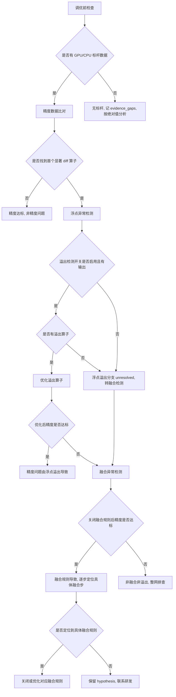

# 精度异常典型故障处理流

> **执行入口**：入口场景 `precision`。精度异常指计算结果与期望值偏差超阈值（loss 异常、NaN/Inf、精度不达标）。本流只离线分析已提供的 dump 数据、精度比对结果、溢出检测输出、融合规则配置和验证记录，不执行现场 dump 重采、复跑或开关切换。现场操作（"打开溢出检测开关""关闭融合规则""enable UB Fusion only"等）不执行，只在已有配置/输出中核对对应状态与结果。先读 [公共约定](common-flow.md)，特别是 §0 找首节点。

## 问题现象

常见入口包括：

```text
loss = nan / loss = inf
max_diff=0.01 exceeds threshold=0.001
精度不达标 / accuracy not met
NaN detected in output tensor
```

## 排查流程

精度异常定位流程主干：**调优前检查 → 数据比对 → 浮点异常检测 → 融合异常检测 → 融合定位**。



| 顺序 | 证据 | 判断条件 | 下一步 | 中间过程记录 |
| --- | --- | --- | --- | --- |
| 1 | 标杆数据、融合规则开关状态 | 调优前检查：是否有标杆、融合开关状态 | 有标杆→数据比对；无标杆→记缺口 | 记录标杆是否存在、融合开关当前状态 |
| 2 | 精度 dump 比对结果 | 是否找到首个显著 diff 算子 | 是→浮点检测；否→非精度问题 | 记录首个 diff 算子名、diff 值、阈值 |
| 3 | 溢出检测开关状态、溢出检测输出 | 是否有溢出算子 | 是→优化溢出算子；否→转融合检测 | 记录开关是否启用、溢出算子名、溢出值/位置 |
| 4 | 优化后精度验证 | 优化溢出算子后精度是否达标 | 是→浮点溢出导致；否→转融合检测 | 记录优化措施、变更前后精度对比 |
| 5 | 融合规则配置、关闭融合后精度 | 关闭融合规则后精度是否达标 | 是→融合导致，逐步定位；否→整网排查 | 记录关闭融合前后精度对比 |
| 6 | 逐步定位验证记录（仅 UB Fusion） | 是否定位到具体融合规则 | 是→关闭/优化对应规则；否→保留 hypothesis | 记录逐步比对的 Forward/Backward step、命中的融合规则 |

每步的中间过程记录写入 `diagnosis.md` 的 `result.steps`，包含 step_id、检查内容、发现结果和下一步，便于追溯走到哪一步定位到问题。

### 融合定位伪码

融合定位核对顺序：

1. **先排除浮点溢出**：核对溢出检测开关是否启用、溢出检测输出。若启用且优化后精度 PASS→精度问题由浮点溢出导致。
2. **再排除融合开关**：若启用溢出检测但精度仍 FAIL→非溢出导致，核查融合。若关闭融合后精度仍 FAIL→非融合导致，须查整网。若关闭融合后精度 PASS→精度问题由融合导致，定位具体融合步。
3. **逐步定位融合步**：仅打开 UB Fusion，逐步比对每个 Forward/Backward step 的数据，定位到具体融合规则。须有逐步验证记录支持，不能跳步指定。

## 证据盘点

| 材料 | 提取字段 | 缺失时的结论边界 |
| --- | --- | --- |
| 精度 dump 数据（GPU/CPU/NPU） | 算子/层、输入输出张量、shape/dtype、diff 值、阈值 | 无 dump 则无法做算子级精度比对 |
| 溢出检测输出 | 溢出算子、溢出值、位置、开关状态 | 无输出则浮点溢出分支 `unresolved` |
| 融合规则配置 | 图融合/UB 融合开关、具体规则列表、关闭/启用验证记录 | 无配置则融合分支 `unresolved` |
| loss/指标曲线 | loss 变化点、NaN/Inf 出现位置、与正常基线对比 | 仅 loss 异常不定位到具体算子 |
| 已有优化与验证记录 | 优化措施、变更前后精度、是否回归 | 无验证不记 `fix_verified` |
| 模型/算子与版本信息 | 模型结构、算子类型、CANN/框架版本 | 版本变化可能是精度变化点 |

## 判定矩阵

| 分支 | 支持所需证据 | 不能单独作为根因的信号 |
| --- | --- | --- |
| 浮点溢出 | 溢出检测输出 + 溢出算子 + 优化后达标验证 | 仅 loss=NaN 或仅"可能有溢出" |
| 融合规则导致 | 关闭融合后达标 + 逐步定位到具体规则的验证 | 仅"关闭融合后达标"未定位到具体规则 |
| 算子精度问题 | 算子级 dump diff + 算子类型 + 输入范围核对 | 仅"某算子 diff 大"，未核对输入与上游 |
| 数据/输入问题 | 输入数据异常 + 修正后达标验证 | 仅"精度不达标" |
| 版本/迁移引入 | 版本变化前后精度对比 + 变化点定位 | 仅"换了版本" |
| 整网问题（非融合非溢出） | 排除溢出与融合后仍 FAIL + 整网排查记录 | 不能因排除前两项就跳到整网结论，须有排查记录 |

## 子步骤产物

每步更新同一个 `diagnosis.md.result.steps`，包含公共状态、输入/证据引用、缺口与 next_step。

| step_id | 执行动作 | findings 必含字段 |
| --- | --- | --- |
| P1 | 案例与精度异常入口核对，调优前检查 | signals、case_comparison、event_identity、baseline_available、fusion_switch_status、classification_conflicts |
| P2 | 盘点 dump/溢出/融合配置等材料 | material_inventory、versions、dump_coverage、overflow_detection、fusion_config、loss_curve |
| P3 | 按伪码顺序排除浮点溢出→融合→算子，评估各分支 | first_error_candidate、overflow_assessment、fusion_assessment、op_diff_assessment、branch_decisions、alternative_decisions、unresolved_links |
| P4 | 输出精度根因边界、建议和检查依据 | confirmed_facts、root_cause_status、limitations、recommendations、check_evidence |

P4 填满公共诊断字段。精度问题的建议以算子优化、关闭/调整融合规则、改用高精度模式为主，须标注适用前提与已有验证状态。

## 结论与评分边界

"已确认 <算子/层/融合规则> 存在精度异常，证据 <dump diff/溢出输出原文>；<浮点溢出/融合/算子> 为 <confirmed/hypothesis/undetermined>。<缺口> 使 <具体判断> 仍无法确认。"

- D1 精度场景首错为首个显著 diff/NaN/Inf 的位置；无明确行时按 dump 比对结果定位。
- D2 dump 比对与溢出检测属独立来源；同一 dump 的不同切片不算多源。
- D3 精度根因需定位到具体算子/融合规则并有验证；仅"关闭融合后达标"不够 `root_cause_localized`。
- D4 优化后达标验证才记 `fix_verified`；无验证不记。
- D5 命中历史精度案例须核对算子、版本、融合配置异同。

参考：[公共约定](common-flow.md)、[故障处理专题](../fault-handling.md)、[CASE-001/CASE-005](../cases.md)、[错误码](../err-messages.md)、[可信度规范](../confidence-assessment.md)。
