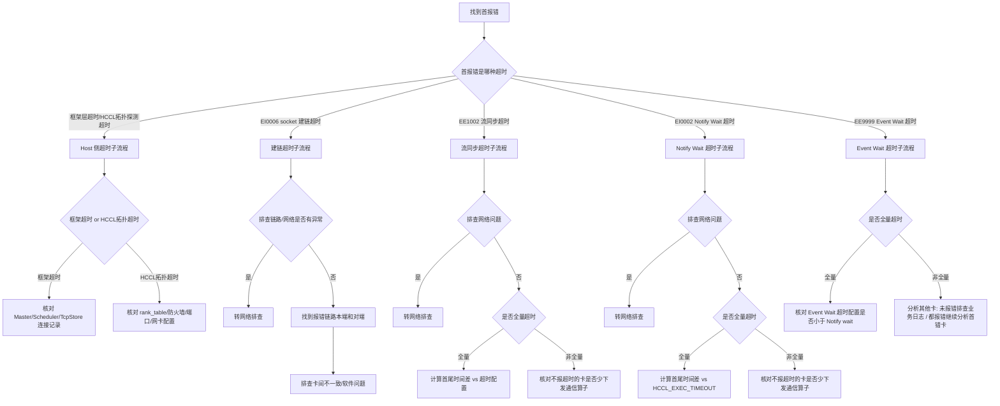

# 进程卡死（Hang）专项诊断参考

> **执行入口**：本页为离线分析参考，只分析已有日志、堆栈、配置、采样与验证记录，不执行现场命令、不附加运行进程、不注入信号、不执行连通性探测或新 profiling。现场命令（`grep`、`py-spy`、`gdb attach`、`msnpureport` 等）转为对已有材料的离线核对项。已有对应结果时可引用；缺失则记录 evidence_gaps 与结论边界，继续其他现有证据。

> 本文档面向 CANN 日志中的进程卡死与超时类问题，整理
> 排查流程、关键证据和典型问题案例。用于分析 `EI0002`、`EI0006`、
> `EE9999`、`EE1002`、`notify wait timeout`、`stream sync timeout`、
> `event wait timeout` 和 `wait socket establish timeout`。

## 目录

- [问题现象](#问题现象)
- [关键日志字段](#关键日志字段)
- [证据收集](#证据收集)
- [排查流程](#排查流程)
- [分支说明](#分支说明)
- [结论边界](#结论边界)
- [案例库](#案例库)

## 问题现象

常见入口包括：

```text
[INFO] step=1000, loss=2.345   # 之后无新输出
[ERROR][HCCL] EI0002 Communication_Error_Timeout
[ERROR] EI0006 Communication_Error_Get_Socket
[ERROR] EE1002 Execution_Error_Stream_Synchronize_Timeout
[ERROR] EE9999 Event Wait Timeout
notify wait timeout occurred during task execution
wait socket establish timeout
no progress for 300s
deadlock detected
```

进程存在但无进展，CPU 使用率接近 0%，plog 最后一条日志时间戳在很久以前。超时类问题分为
**Host 侧超时**与 **Device 侧超时**两大类，须先按首报错归类超时类型，再进入对应子流程。

## 关键日志字段

| 字段 | 含义 | 使用方式 |
| --- | --- | --- |
| `EI0002` | 执行通信操作超时（Notify Wait 超时） | 按全量/非全量分支排查，不可直接归因为 CANN/HCCL 问题 |
| `EI0006` | 建链超时（Socket 获取失败） | 排查链路/网络/版本混跑/卡间不一致 |
| `EE9999` | Event Wait 超时 | 核对 Event Wait 超时配置是否小于 Notify wait |
| `EE1002` | 流同步超时（Stream Synchronize Timeout） | 须先判断是否确实为流同步超时，再按全量/非全量排查 |
| `HCCL_EXEC_TIMEOUT` | HCCL 执行超时配置 | 比较首尾报错时间差与此配置值，判断是否需要增大超时 |
| `ACL_DEVICE_SYNC_TIMEOUT` | 流同步超时配置（起支持） | 流同步超时时核对是否需要增大此值 |
| `HCCL_IF_BASE_PORT` | HCCL 监听端口环境变量 | Host 侧建链超时时核对端口是否被占用 |
| `HCCL_SOCKET_IFNAME` | 拓扑探测网卡环境变量 | Host 侧建链超时时核对不同 rank 是否使用相同 Host 网卡 |
| `notify wait timeout` | Notify Wait 超时日志关键字 | 统计报超时的卡数，判断是否全量超时 |
| `stuck notify num` | A2 维测日志中超时关键字 | A2 日志无 `notify wait timeout` 时用此关键字统计 |
| `wait socket establish timeout` | 建链超时日志关键字 | 统计报建链超时的卡数，判断是否全量建链超时 |
| `localRank` / `remoteRank` | 本端/对端卡号 | 从首报错起串联等待关系，检测 A→B→A 互等环 |
| `tag[AllReduce` | 通信算子标签 | 结合 `count[1]`、`dataType[int64]`、`op[sum]` 识别 barrier 算子 |
| `streamID` / `taskID` | 流和任务标识 | 关联 TaskExceptionHandler 三行维测日志 |
| `rankSize` / `rankId` | 通信域大小和卡索引 | 核对各 rank 通信参数一致性 |
| `GEfinalize` | 进程结束标记 | plog run 日志中超时前出现表示进程提前退出 |

## 证据收集

至少收集以下材料：

1. 故障时间窗内的完整 CANN plog，包括 `plog/run` 和 `plog/debug` 目录。
2. `msnpureport -f` 获取的 device 日志（故障前已收集的存档）。
3. 训练打屏日志（stdout），用于查找业务报错和进度停滞。
4. atrace 日志（用于分析 host 慢/卡住和少下发通信算子）。
5. 各 rank 的 host 日志（plog + device 日志），用于全量/非全量统计。
6. 超时配置记录：`HCCL_EXEC_TIMEOUT`、`ACL_DEVICE_SYNC_TIMEOUT`、`HCCL_IF_BASE_PORT`、
   `HCCL_SOCKET_IFNAME`。
7. rank_table 配置文件（Host 侧建链超时时核对 rankSize、IP、端口）。
8. HCCL TaskExceptionHandler 三行维测日志（`grep "run failed, base info"`）。
9. 网络诊断记录（如已有网络诊断结果）。
10. 多卡场景的 rank、主机、Device、PID 映射及各 rank 退出时间。
11. 已有堆栈采样记录（py-spy dump 或 gdb attach 的结果存档）。

不能获得某项材料时，在报告中明确写为"未提供"，不要用猜测填补。

## 排查流程



| 顺序 | 证据 | 判断条件 | 下一步 | 中间过程记录 |
| --- | --- | --- | --- | --- |
| 1 | plog/应用日志首报错 | 超时类型归类 | 进入对应子流程 | 记录首报错原文、错误码、超时类型、rank/device |
| 2 | 框架日志/Master/Scheduler/TcpStore 连接记录 | Host 侧：框架超时 or HCCL 拓扑超时 | 框架→核对连接；HCCL→核对配置 | 记录连接超时原文、rank_table 配置、防火墙/端口状态、网卡配置 |
| 3 | 网络诊断记录 | 建链/流同步/Notify：排查网络是否有异常 | 有→转网络排查；无→继续 | 记录网络诊断结论、是否有端口闪断/告警 |
| 4 | 是否所有卡都报超时（全量统计） | 全量 or 非全量 | 全量→计算时间差；非全量→核对少下发 | 记录报超时的卡列表、不报的卡列表、覆盖率、统计方法 |
| 5 | 首尾报错时间差 vs 超时配置 | 时间差大于 or 小于超时配置 | 大于→增大超时；小于→排查不一致 | 记录首报错时间、尾报错时间、时间差、超时配置值 |
| 6 | 不报超时的卡通信算子下发记录 | 是否少下发通信算子 | 少下发→分析 atrace；非少下发→卡间不同步 | 记录各卡通信算子数量对比、atrace 分析结果 |
| 7 | Event Wait 超时配置 vs Notify wait 配置 | Event Wait 配置是否小于 Notify wait | 是→调大 Event Wait 超时；否→收集日志排查 | 记录两个超时配置值、配置关系 |
| 8 | HCCL TaskExceptionHandler 三行维测日志 | 通信算子下发是否一致 | 不一致→定位少下发/异常算子；一致→继续 | 记录 tag/AlgType/rankSize/rankId/count/dataType 对比结果 |
| 9 | localRank / remoteRank 等待关系链 | 是否存在 A→B→A 互等环 | 有→两卡互等定位；无→继续排查 | 记录等待关系链、成环节点、首报错位置 |

每步的中间过程记录写入 `diagnosis.md` 的 `result.steps`，包含 step_id、检查内容、
发现结果和下一步，便于追溯走到哪一步定位到问题。

## 分支说明

### 超时类型分类

| 大类 | 子类型 | 识别特征 | 子流程 |
| --- | --- | --- | --- |
| Host 侧超时 | 训推框架超时 | 框架层超时报错（PyTorch TcpStore/连接 Master 超时、MindSpore 连接 Scheduler 超时） | §1.1 |
| Host 侧超时 | HCCL Host 侧建链超时 | HCCL 拓扑探测超时、通信域 rankSize 不符、防火墙/IP 端口被占用 | §1.1 |
| Device 侧超时 | 建链超时（EI0006） | socket 建链超时、`EI0006`、`wait socket establish timeout` | §1.2 |
| Device 侧超时 | 流同步超时（EE1002） | `EE1002`、Stream 同步超时 | §1.3 |
| Device 侧超时 | Notify Wait 超时（EI0002） | `EI0002`、`notify wait timeout` | §1.4 |
| Device 侧超时 | Event Wait 超时（EE9999） | `EE9999`、Event Wait 超时 | §1.5 |

### 1.1 Host 侧超时

| 子类型 | 离线核对内容 |
| --- | --- |
| 训推框架超时（PyTorch） | Worker 节点从 TcpStore 获取元信息超时 / Worker 节点连接 Master 节点超时 |
| 训推框架超时（MindSpore） | Worker 节点连接 Scheduler 超时 |
| HCCL 拓扑探测超时 | 通信域 rankSize 与实际不符 / 同一 Device 在同一通信域充当不同 rank / 超时时间内有卡未初始化（是否为固定卡）/ Host 防火墙未开放 / IP 或端口被占用 / 通信域内不同 rank 使用 Host 网卡不一样 |

HCCL 拓扑探测超时的处理方法：
- 防火墙未开放：核对防火墙是否开放对应端口。
- IP 或端口被占用：核对是否通过环境变量 `HCCL_IF_BASE_PORT` 修改 HCCL 监听端口。
- 不同 rank 使用不同 Host 网卡：核对是否通过环境变量 `HCCL_SOCKET_IFNAME` 修改拓扑探测使用的网卡。
- 超时时间内有卡未初始化：核对是否为固定卡，固定卡→联系研发定位；非固定卡→业务侧分析。
- 通信域 rankSize 与实际不符 / 同一 Device 充当不同 rank：业务侧分析。

### 1.2 建链超时（EI0006）

建链超时流程：**找到首报错 → 首报错是否为 socket 建链超时 → 判断设备型号 → 排查链路/网络
→ 找到报错链路的本端和对端 → 排查软件问题/卡间不一致**。

| 核对节点 | 离线核对内容 | 结论边界 |
| --- | --- | --- |
| 首报错是否为 socket 建链超时 | 建链超时报错原文、`EI0006` | 否→解决首报错（转其他流程） |
| 判断设备型号 | A3→排查 1520 是否有超时代答或其他问题；通用→排查链路网络是否有异常 | A3 场景须核对 1520 日志 |
| 排查链路/网络是否有异常 | 已有网络诊断记录、链路状态 | 是→解决网络链路问题；否→继续找本端对端 |
| 找到报错异常链路的本端和对端 | 报错链路的两端 rank/device/IP | 定位到具体链路 |
| 排查卡间不一致 | 建链时间不够 / 通信算子数量下发不一致 / 对端业务卡住 / 对端业务提前退出 | 各子项须有时间或证据关联 |
| 排查软件问题 | 通信算子类型下发不一致 / 其他问题 | 通信算子类型不一致→转 HCCL 研发分析 |

**重要**：检查建链之间的机器是否有版本混跑的情况，不允许混跑。

判断是否全量建链超时：在已有日志中统计 `wait socket establish timeout` 出现次数。若
count = 节点数 × 每节点卡数，则为全量建链超时。

卡间不一致的子项：
- 建链时间不够：全量日志中最早和最晚的建链超时报错时间超过配置的建链超时时间阈值 →
  将超时时间配大后再试。
- 通信算子数量下发不一致：框架分析算子数量下发不一致的原因。
- 对端业务卡住：数据集处理卡住未等到数据 / 程序 bug 导致卡住 / 其他原因。
- 对端业务提前退出：host OOM 自动杀进程 / 程序 bug 导致 segment fault core dump / 其他原因。

### 1.3 流同步超时（EE1002）

**重要**：定位流同步超时问题要优先判断是否为流同步超时。

流同步超时流程：**首报错流同步超时 → 排查网络问题 → 是否全量超时 → 全量/非全量分支**。

#### 全量超时

计算首尾报错时间差：
- **大于流同步超时时间** → 可设置更大的超时时间 `ACL_DEVICE_SYNC_TIMEOUT`（起支持）
  或解决不一致。
- **小于流同步超时时间** → 是否有卡的 traceback 不一致 → 否→结合全量 device 日志继续分析 /
  是→取异常节点 device 日志继续分析。

#### 非全量超时

关注不报超时的卡是否少下发通信算子：
- **少下发** → 分析 atrace 日志找到少下发算子 / host 慢卡在 host 侧 / 其他情况找 HCCL 分析。
- **非少下发（卡间不同步）** → 迭代前（编译快慢有区别 / 数据权重加载差异 / 通信算子下发异常）/
  迭代中（PP 设置过大 / 个别卡有额外操作或不一致的行为）→ 可设置更大超时或解决不一致 /
  联系研发定位。

### 1.4 Notify Wait 超时（EI0002）

**重要提示：不要看见有 Notify wait 超时就认为是 CANN 或 HCCL 的问题！先确认是否是全量
Notify wait 超时！**

Notify wait 超时流程：**找到首报错 → 首报错 notify wait timeout → 排查网络问题 → 判断
是否全量超时 → 全量/非全量分支**。

判断是否全量 notify wait timeout：在已有日志中统计 `notify wait timeout` 出现次数。A2
维测日志中无 `notify wait timeout` 时改用 `stuck notify num` 统计。若 count = 节点数 ×
每节点卡数，则为全量超时。

#### 非全量超时

关注不报超时的卡是否少下发通信算子：
- **少下发** → 分析 atrace 日志找到少下发算子 / host 慢卡在 host 侧 / 其他情况找 HCCL 分析。
- **非少下发（卡间不同步）** → 迭代前（编译快慢 / 加载 ckpt 快慢 / 数据集下载快慢）/ 迭代中
  （个别卡有额外操作或不一致）→ 设置更大的 `HCCL_EXEC_TIMEOUT` 或解决不一致 / 联系研发定位。

#### 全量超时

获取首尾报错时间，比较上步时间差与 `HCCL_EXEC_TIMEOUT`：
- **大于 timeout** → 增加 `HCCL_EXEC_TIMEOUT` 超过卡间最大时间差。
- **小于 timeout** → 排查所有卡，从首报错开始：
  - 通信算子下发不一致。
  - 两卡互等超时。
  - 建链 timeout 比执行 timeout 长。

### 1.5 Event Wait 超时（EE9999）

Event Wait 超时流程：**首报错为 Event Wait 超时 → 是否全量超时 → 全量/非全量分支**。

#### 全量超时

核对 Event Wait 超时配置是否小于 Notify wait：
- **是** → Event wait 超时时间配置大于 Notify wait（问题不复现→解决 / 能复现→收集 device
  和 atrace 日志→排查历史案例）。
- **否** → 收集 device 和 atrace 日志 → 排查历史案例。

#### 非全量超时

分析其他卡：
- **其他卡存在未报错的** → 排查业务日志（业务报错比 Event Wait 更早→业务侧分析 / 没有业务
  报错→同全量分支核对配置）。
- **其他卡都有报错** → 其他不是首错不需要关注，继续分析首错卡。

排查历史案例：已知问题→按历史案例解决方案处理；非已知问题→研发分析。

### 通信算子下发不一致排查

在已有 plog 中查找 HCCL TaskExceptionHandler 三行维测日志：

- 离线核对：在已有 plog 中搜索 `run failed, base info`（推荐关键字，避免训练日志和 plog
  混在一起时误匹配）。
- 第一行：`streamID`、`taskID`、`tag[]`（通信域名）、`AlgType`（算法名）。
- 第二行：`group`、`rankSize`、`rankId`。
- 第三行：`timeStamp`、`deviceId`、`index`、`count`、`reduceType`、`src`、`dst`、`dataType`。

判断通信算子下发不一致：比较各卡同一 group 的算子关键字（A）、count 和 dataType 是否一致。
barrier 算子的识别特征为 `tag[AllReduce` + `count[1]` + `dataType[int64]` + `reduceType[sum]`，
上层业务 `barrier()` 底层 HCCL 使用此 AllReduce 通信算子。

### 顺藤摸瓜排查等待关系

从首报错起，在已有维测日志中按 `NOTIFY WAIT, localRank:` 关键字过滤，将 `localRank` 与
`remoteRank` 串联起来，检测是否存在 A→B→A 互等环。多卡成环互等与两卡互等同理，通过记录
关系链中的卡号列表，若 remoteRank 已在列表中则成环。

### 大模型训推 host 慢卡住

当程序无日志输出且疑似卡住时，如已有堆栈采样记录可引用：

- **Python 程序**：核对是否已有 `py-spy dump --pid <PID>` 的输出存档。
- **C++ 程序**：核对是否已有 `gdb attach <PID>` + `bt` 的输出存档。

host 慢的常见原因：权重加载慢、dataloader 慢。host 卡住的常见原因：模型权重加载卡住、
训练数据加载卡住。

### barrier 机制说明

HCCL 中 barrier 通过 AllReduce 实现。上层业务调用 `barrier()`，底层 HCCL 下发 AllReduce
通信算子，特征为 `tag[AllReduce`、`count[1]`、`dataType[int64]`、`op[sum]`。一张卡
slow/stuck 会导致其他所有卡在 barrier 处超时。

## 结论边界

- `EI0002`/AllReduce timeout 支持通信等待超时，不自动证明网络故障或某个 rank 是根因。
- `EE1002` 是 Stream 同步超时，结合实际任务和首错核对，不自动写"算子死循环"。
- 不要看见有 Notify wait 超时就认为是 CANN 或 HCCL 的问题，先确认是否全量超时。
- 建链超时须检查机器间是否有版本混跑，不允许混跑。
- 流同步超时须先判断是否确实为流同步超时。
- 全量/非全量统计须覆盖所有 rank，不能仅凭部分卡判断。
- 首尾报错时间差大于超时配置时，增大超时是缓解措施，不等于根因定位。
- 通信算子下发不一致须比较同一 group 的算子关键字、count 和 dataType，不能仅凭打印顺序
  不同判断。
- 等待关系成环需要完整的 localRank→remoteRank 链，不能凭单条日志闭合因果链。
- Event/Notify Wait 应核对对应 Record 端，不能只凭等待端闭合因果链。
- 没有现场堆栈不裁剪本流程，现有日志可支持到何种范围就写到何种范围。
- 没有复现、修复后复跑和回归结果时，不得声明根因或解决方案已验证。

## 案例库

案例库只收录已给出问题现象、定位依据、故障根因和处理方法的典型案例，
用于匹配明确的日志或超时特征。案例不能替代当前现场的版本、设备、首错
和复现证据。

### 案例索引

| 编号 | 案例 | 首要识别特征 |
| --- | --- | --- |
| `H001` | 全量 Notify Wait 超时（两卡互等） | `EI0002`、全量超时、localRank↔remoteRank 成环 |
| `H002` | 非全量 Notify Wait 超时（少下发通信算子） | `EI0002`、非全量、atrace 发现少下发算子 |
| `H003` | 建链超时（版本混跑） | `EI0006`、`wait socket establish timeout`、机器间版本不一致 |
| `H004` | Event Wait 超时（配置小于 Notify wait） | `EE9999`、全量超时、Event Wait 配置 < Notify wait 配置 |
| `H005` | 流同步超时（卡间不同步） | `EE1002`、非全量、迭代前编译快慢差异 |
| `H006` | 通信算子下发不一致 | TaskExceptionHandler 日志、tag/count/dataType 不一致 |
| `H007` | HCCL 拓扑探测超时（端口被占用） | HCCL 拓扑探测超时、IP 或端口被占用 |
| `H008` | host 慢卡住（权重加载卡住） | 无日志输出、py-spy/gdb 显示停在权重加载 |

### 案例详解

#### H001：全量 Notify Wait 超时（两卡互等）

**问题现象**

- 所有卡上报 `EI0002` Notify Wait 超时。
- 全量统计 count = 节点数 × 每节点卡数。
- 首尾报错时间差小于 `HCCL_EXEC_TIMEOUT`。

**故障根因**

两卡互等导致全量超时。从首报错起按 `NOTIFY WAIT, localRank:` 过滤维测日志，串联
localRank 与 remoteRank 等待关系，发现 A→B→A 互等环。例如 rank760 与 rank1528 互等，
导致整个通信域死锁等待。

**处理方法**

1. 确认全量超时（统计 `notify wait timeout` 次数 = 节点数 × 每节点卡数）。
2. 比较首尾报错时间差与 `HCCL_EXEC_TIMEOUT`，确认小于 timeout。
3. 从首报错起按 `NOTIFY WAIT, localRank:` 过滤，串联等待关系链。
4. 检测成环节点（A→B→A），定位互等的两卡。
5. 分析互等原因（通信算子下发不一致 / 业务逻辑问题）。

#### H002：非全量 Notify Wait 超时（少下发通信算子）

**问题现象**

- 部分卡上报 `EI0002` Notify Wait 超时，部分卡未报超时。
- 非全量统计确认。

**故障根因**

不报超时的卡少下发了通信算子。分析 atrace 日志发现该卡未下发某个 AllReduce 算子，
导致其他卡在 Notify Wait 处等待超时。少下发原因为 host 慢、卡在 host 侧。

**处理方法**

1. 确认非全量超时，列出报超时和未报超时的卡。
2. 核对不报超时的卡是否少下发通信算子。
3. 分析 atrace 日志找到少下发的算子。
4. 判断少下发原因（host 慢 / 其他），host 慢时分析权重加载、dataloader 等。
5. 如已有 `py-spy dump` 或 `gdb attach` 存档，引用堆栈定位卡住位置。

#### H003：建链超时（版本混跑）

**问题现象**

```text
EI0006 Communication_Error_Get_Socket
wait socket establish timeout
```

**故障根因**

建链之间的机器存在 CANN 版本混跑，版本不一致导致建链失败。

**处理方法**

1. 确认首报错为 socket 建链超时（`EI0006`、`wait socket establish timeout`）。
2. 检查建链之间的机器是否有版本混跑（不允许混跑）。
3. 统一版本后重新建链。
4. 若版本一致，排查链路/网络是否有异常，找到报错链路的本端和对端。

#### H004：Event Wait 超时（配置小于 Notify wait）

**问题现象**

```text
EE9999 Event Wait Timeout
```

- 所有卡上报 Event Wait 超时，全量统计确认。

**故障根因**

Event Wait 超时配置小于 Notify wait 超时配置。Event Wait 先于 Notify wait 超时触发，
导致全量 Event Wait 超时报错。

**处理方法**

1. 确认全量 Event Wait 超时。
2. 核对 Event Wait 超时配置是否小于 Notify wait 配置。
3. 将 Event wait 超时时间配置大于 Notify wait。
4. 问题不复现→解决；问题能复现→收集 device 和 atrace 日志，排查历史案例。

#### H005：流同步超时（卡间不同步）

**问题现象**

```text
EE1002 Execution_Error_Stream_Synchronize_Timeout
```

- 部分卡上报流同步超时，非全量。

**故障根因**

卡间不同步导致流同步超时。迭代前各卡编译快慢有区别，编译慢的卡延迟下发通信算子，
导致其他卡在流同步处等待超时。

**处理方法**

1. 确认首报错为流同步超时（`EE1002`）。
2. 排查网络问题（无网络异常→继续）。
3. 确认非全量超时。
4. 核对不报超时的卡是否少下发通信算子（非少下发→卡间不同步）。
5. 迭代前编译快慢差异→可设置更大的超时时间 `ACL_DEVICE_SYNC_TIMEOUT` 或解决不一致。

#### H006：通信算子下发不一致

**问题现象**

- 全量 Notify Wait 超时，首尾报错时间差小于 `HCCL_EXEC_TIMEOUT`。
- 在 plog 中搜索 `run failed, base info` 发现 TaskExceptionHandler 三行维测日志。

**故障根因**

通信算子下发不一致。例如 8 节点 64 卡场景，正常所有卡应下发 AllReduce，但一张异常卡
下发了 AllGather。该卡未下发 barrier，导致 64 卡无法同步，其他 63 卡死锁等待。

**处理方法**

1. 在已有 plog 中搜索 `run failed, base info` 获取三行维测日志。
2. 比较各卡同一 group 的算子关键字（A）、count 和 dataType。
3. 定位下发不一致的卡和异常算子类型。
4. 分析少下发/异常下发原因（host 慢 / 框架问题 / 业务逻辑问题）。

#### H007：HCCL 拓扑探测超时（端口被占用）

**问题现象**

- HCCL 拓扑探测超时，Host 侧超时。

**故障根因**

HCCL 监听端口被占用，导致拓扑探测失败。

**处理方法**

1. 确认为 Host 侧 HCCL 拓扑探测超时。
2. 核对 IP 或端口是否被占用。
3. 通过环境变量 `HCCL_IF_BASE_PORT` 修改 HCCL 监听端口。
4. 若为不同 rank 使用不同 Host 网卡，通过 `HCCL_SOCKET_IFNAME` 修改拓扑探测使用的网卡。

#### H008：host 慢卡住（权重加载卡住）

**问题现象**

- 程序无日志输出，疑似卡住。
- 无 ERROR 报错，CPU 使用率接近 0%。

**故障根因**

模型权重加载卡住，进程停在 host 侧权重加载阶段，未进入 device 侧执行。

**处理方法**

1. 核对是否已有 `py-spy dump --pid <PID>` 的输出存档（Python 程序）。
2. 或核对是否已有 `gdb attach <PID>` + `bt` 的输出存档（C++ 程序）。
3. 从堆栈定位卡住位置（权重加载 / dataloader / 其他）。
4. 权重加载慢→优化权重加载流程；dataloader 慢→优化数据加载流程。
