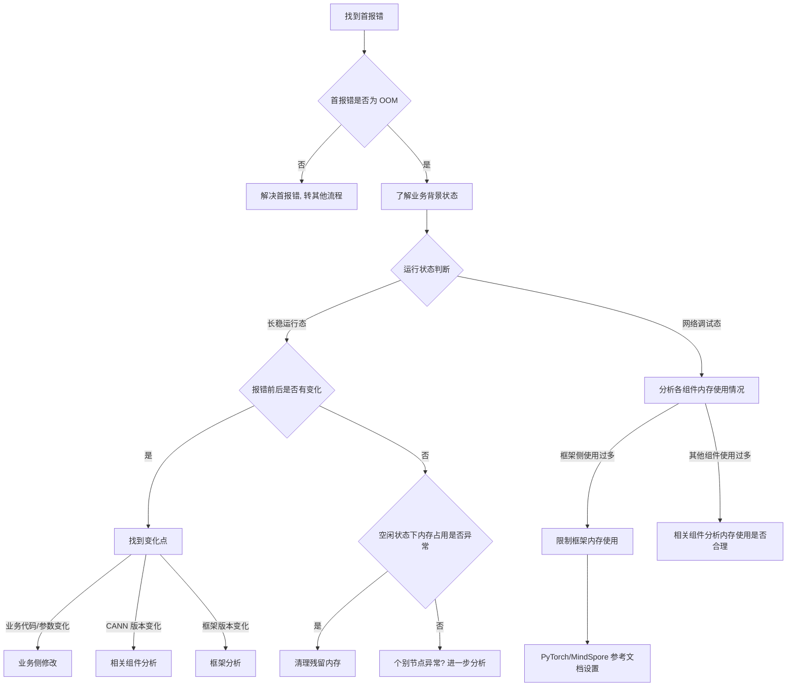

# 内存 OOM 专项诊断参考

> **执行入口**：本页为离线分析参考，只分析已提供的日志、配置和采样存档，不启动实时监控或补采。现场命令（`npu-smi info -t memory`、`CANN_MEMORY_DEBUG`、`free -h`、`grep ERROR` 等）不执行，只在已有材料中找对应内存占用证据。已有对应结果时可引用；缺失则记录 evidence_gaps 与结论边界，继续其他现有证据。

> 本文档面向 CANN 日志中的内存 OOM 问题，整理
> 排查流程、关键证据和典型问题案例。用于分析 `EL0004`、
> `HBM memory allocation failed`、`memory not enough`、
> `Out of memory` 和 NPU OOM 定位全流程。

## 目录

- [问题现象](#问题现象)
- [关键日志字段](#关键日志字段)
- [证据收集](#证据收集)
- [排查流程](#排查流程)
- [分支说明](#分支说明)
- [结论边界](#结论边界)
- [案例库](#案例库)

## 问题现象

常见入口包括：

```text
[ERROR][ACL] EL0004 HBM memory allocation failed, requested=32GB, available=28GB
[ERROR][GE] Load graph to device failed: memory not enough
Out of memory: Kill process <pid> (python)
RuntimeError: [Core] Out of memory.
```

退出码 137 仅为 SIGKILL 线索，不能确认 OOM；须核对内存分配失败原文或内核 OOM Kill 记录。

OOM 分为 **Device 侧 OOM**（HBM 内存分配失败）与 **Host 侧 OOM**（Host 内存不足被 OOM
Kill）。首报错是否为 OOM 是第一步判断，非 OOM 首报错须先解决首报错。

## 关键日志字段

| 字段 | 含义 | 使用方式 |
| --- | --- | --- |
| `EL0004` | HBM 内存分配失败 | 确认 Device 侧 OOM，记录请求量和可用量 |
| `requested` | 请求分配的内存大小 | 与 `available` 对比，判断容量不足或请求异常 |
| `available` | 可用内存大小 | 与 `requested` 对比 |
| `memory not enough` | GE 图加载到 Device 失败 | 确认 Device 侧内存不足 |
| `Out of memory` | 框架层 OOM 报错 | 确认框架层内存不足 |
| `Kill process <pid>` | 内核 OOM Kill | 确认 Host 侧 OOM，核对被杀 PID |
| `ERROR` | 日志级别 | 在 plog `debug` 目录中按 ERROR 级别聚合排序找首报错 |
| plog 目录结构 | `debug`（ERROR 级）/ `run`（INFO 级）/ `security` | `debug/device-*` 为 device 侧 ERROR 日志回传 host；`debug/plog` 为 host 侧 ERROR 日志 |
| `total` / `used` / `free` | 内存总量/已用/可用 | 核对各组件内存占用分布 |
| `GEfinalize` | 进程结束标记 | plog run 日志中超时前出现表示进程提前退出（可能为 OOM 导致） |

## 证据收集

至少收集以下材料：

1. 故障时间窗内的完整 CANN plog，包括 `plog/run`（INFO 级）和 `plog/debug`（ERROR 级）目录。
2. 训练打屏日志（stdout），用于查找 OOM 报错和进程退出记录。
3. 已存档内存采样（`npu-smi info -t memory`、`free -h` 等已有快照），记录样本时间与故障
   时间差。
4. 已存档内核/容器/调度日志，记录被杀 PID、OOM/cgroup 限制、退出原因。
5. 模型与运行配置：batch/shape、模型/优化器/缓存、框架内存上限、rank 映射。
6. 既有内存曲线/分配释放记录：同一业务阶段的占用、请求/释放序列。
7. CANN 版本、框架版本、业务代码变更记录。
8. 空闲/预热阶段内存基线、残留进程记录。
9. 已有复现/验证记录：变更前后配置、触发条件、结果。
10. 多卡场景的 rank、主机、Device、PID 映射及各 rank 退出时间。
11. 使能 core dump 的配置记录（首节点定位前置条件）。

不能获得某项材料时，在报告中明确写为"未提供"，不要用猜测填补。

## 排查流程



| 顺序 | 证据 | 判断条件 | 下一步 | 中间过程记录 |
| --- | --- | --- | --- | --- |
| 1 | plog/应用日志首报错 | 首报错是否为 OOM（EL0004、HBM allocation failed、memory not enough、框架 Out of memory） | 是→继续；否→转其他流程 | 记录首报错原文、错误码、侧别（Device/Host/框架） |
| 2 | 模型/算子、batch/shape、训练或推理阶段 | 了解业务背景状态 | 区分长稳运行态/网络调试态 | 记录业务类型、batch size、模型规模、运行阶段 |
| 3 | 报错前后业务状态、内存占用曲线、配置变更 | 长稳运行态：报错前后是否有变化 | 有变化→找变化点；无变化→查空闲内存 | 记录变化点类型（业务代码/CANN版本/框架版本）、变化前后对比 |
| 4 | GE/ACL/HCCL 内存统计、npu-smi 内存快照 | 网络调试态：分析各组件内存使用情况 | 框架多→限制框架内存；其他组件多→分析是否合理 | 记录各组件占用值、total/used/free、占用分布 |
| 5 | 空闲/预热阶段内存基线、残留进程 | 空闲状态下内存占用是否异常 | 异常→清理残留内存；正常→个别节点分析 | 记录空闲时 used/total、是否有残留进程、基线对比 |
| 6 | CANN 版本、框架版本、业务代码变更 | 找到变化点 | 按变化类型分别处理 | 记录变化点、变更前后内存表现、是否关联到本次 OOM |

每步的中间过程记录写入 `diagnosis.md` 的 `result.steps`，包含 step_id、检查内容、
发现结果和下一步，便于追溯走到哪一步定位到问题。

## 分支说明

### 如何快速找到报错的首节点

找到首报错是 OOM 定位的第一步。两种方法：

**方法一：Ascend-faultdiag 故障诊断工具**
- 使用已有工具输出结果（可能会误诊，须交叉核对）。

**方法二：人工简易操作**
1. 获取所有 rank 的 host 日志：plog 和 device 日志（aicpu、hccp 组件回传到 host 的 device
   日志目录）。
2. 在已有 plog 的 `debug` 目录中按 ERROR 级别聚合：`grep ERROR -rn > err.log`。
3. 在 err.log 中按时间排序，找到最先报错的 rank 和错误内容。

plog 目录结构：
- `debug/` — 只包含 ERROR 级别日志。
  - `device-0` ... `device-x` — device 侧运行应用程序产生的 ERROR 日志，回传到 host。
  - `plog/` — host 侧应用程序产生的 ERROR 日志。
- `run/` — INFO 级别日志（同上子结构）。
- `security/` — 安全日志。

**前置条件**：plog、训练打屏日志、使能 core dump 须在定位前收集。

首节点定位中的非报错 rank 处理：
- 所有 rank 都报错 → 锁定首报错 rank 日志定位问题。
- 存在未报错 rank → 定位未报错原因：
  - 未报错卡都是首错之后被 kill → 关闭 watchdog 或平台主动 kill 功能复现。
  - CANN 上层有报错导致进程早于首错结束 → 框架/平台定位报错原因。
  - 有进程早于首错发生 coredump → gdb core 文件。
  - 个别 rank 提前正常结束 → 框架/业务定位是否卡间设置不一致。
  - 关闭 watchdog 后个别 rank 卡在 Host → gdb 定位卡住位置。
  - 关闭 watchdog 后所有卡都超时 → 锁定首报错 rank 日志定位问题。

### 长稳运行态分支

长稳运行态指业务在稳定运行中发生 OOM。核心判断：报错前后是否有变化。

**有变化 → 找到变化点**：
- 业务代码/参数变化 → 业务侧修改。
- CANN 版本变化 → 相关组件分析。
- 框架版本变化 → 框架分析。

**无变化 → 空闲状态下内存占用是否异常**：
- 异常 → 清理残留内存。
- 正常 → 个别节点异常？进一步分析。

### 网络调试态分支

网络调试态指业务在调试阶段发生 OOM。核心判断：分析各组件内存使用情况。

**框架侧使用过多 → 限制框架内存使用**：
- PyTorch → 参考文档设置内存参数。
- MindSpore → 参考文档设置内存参数。

**其他组件使用过多 → 相关组件分析内存使用是否合理**。

### 内存分支判定

| 分支 | 成立所需证据 | 不能单独作为根因的信号 |
| --- | --- | --- |
| Device 容量不足 | 本次 Device 分配失败 + 同时段可用容量/请求量 | 仅 EL0004 或大模型名称 |
| 分配请求异常 | 请求量、shape/dtype/尺寸计算与已有输入/源码可关联 | 请求很大本身不证明 bug |
| 分配器碎片 | 分配器/内存池记录表明总余量与可满足块不一致 | 低利用率或 reserved > allocated |
| Host OOM Kill | 匹配进程的内核/容器 OOM 记录 | 仅退出码 137 |
| 外部 kill / 作业终止 | 调度器、容器或操作记录明确给出终止原因 | 不能把 SIGKILL 重写为内存耗尽 |
| 框架配额/内存池限制 | 有效配置与同一分配请求的失败记录可关联 | 框架报错不证明物理 HBM 已满 |
| 内存泄漏 | 可比业务阶段持续增长 + 对象/分配生命周期证据 | 仅时间曲线增长 |
| 残留内存未清理 | 空闲状态高占用 + 残留进程/未释放分配记录 | 不能凭"重启后好了"反推 |

## 结论边界

- 仅有 `EL0004`：可确认相应分配失败，不可直接写"碎片""泄漏"或某个 buffer 超限。
- 只有退出码 137：写"终止信号线索，OOM 未获证实"；把 OOM 与其他终止原因均保留为候选。
- 缺故障时采样：写明无法核对容量分支，继续用分配器、配置和时间线证据评估。
- 首报错需排除传播/清理日志并定位原文；后续 rank 的等待、超时和清理记录放在传播/清理角色。
- 不能凭大模型名称猜测内存构成或配置错误。
- 事后低占用不能证明故障时有余量，也不能证明碎片。
- 无记录不等于没有 OOM Kill；137 不足以替代内核/容器 OOM 记录。
- 仅时间曲线增长保留"持续增长，原因未定"，须区分预热、缓存与活跃对象。
- "重启后好了"不能反推残留内存，须有残留进程/未释放分配记录。
- 建议修改超时、batch/shape或内存配置必须注明条件和未验证状态，不执行改配置或重跑。
- 当 OOM 与通信超时、崩溃或卡住同时出现时，报告同时保留主场景和次场景，并明确传播关系。
- 没有复现、修复后复跑和回归结果时，不得声明根因或解决方案已验证。

## 案例库

案例库只收录已给出问题现象、定位依据、故障根因和处理方法的典型案例，
用于匹配明确的日志或内存特征。案例不能替代当前现场的版本、设备、首错
和复现证据。

### 案例索引

| 编号 | 案例 | 首要识别特征 |
| --- | --- | --- |
| `O001` | Device HBM 容量不足 | `EL0004`、requested > available、batch 过大 |
| `O002` | Host OOM Kill | `Kill process <pid>`、内核 OOM 记录、退出码 137 |
| `O003` | CANN 版本变化导致 OOM | 长稳运行态、报错前后 CANN 版本变更 |
| `O004` | 残留内存未清理 | 空闲状态内存占用异常、残留进程 |
| `O005` | 框架内存使用过多 | 网络调试态、框架侧内存占用高 |
| `O006` | 业务代码变化导致 OOM | 长稳运行态、报错前后业务代码/参数变更 |
| `O007` | OOM 导致其他 rank 通信超时 | `EL0004` 先于 AllReduce timeout、rank 退出后等待 |

### 案例详解

#### O001：Device HBM 容量不足

**问题现象**

```text
[ERROR][ACL] EL0004 HBM memory allocation failed, requested=32GB, available=28GB
```

**故障根因**

Device 侧 HBM 容量不足。batch size 过大导致请求内存（32GB）超过可用内存（28GB），
分配失败。

**处理方法**

1. 确认首报错为 `EL0004`，记录 `requested` 和 `available` 值。
2. 了解业务背景：batch size、模型规模、运行阶段。
3. 判断为长稳运行态，核对报错前后是否有变化。
4. 无变化→确认容量不足，建议降低 batch size 或 shape。
5. 标注适用前提和未验证状态。

#### O002：Host OOM Kill

**问题现象**

```text
Out of memory: Kill process 12345 (python)
# 退出码 137
```

**故障根因**

Host 侧内存不足，内核 OOM Killer 杀死 python 进程。退出码 137 为 SIGKILL，须核对内核
OOM 记录确认。

**处理方法**

1. 确认退出码 137 仅为线索，不能直接确认 OOM。
2. 在已有内核/容器日志中查找 `Kill process <pid>` 记录。
3. 核对被杀 PID 是否为本次故障进程。
4. 确认 Host OOM Kill 后，分析 Host 内存使用情况。
5. 建议：减少并发任务、调整 cgroup 限制或增加 Host 内存。标注未验证状态。

#### O003：CANN 版本变化导致 OOM

**问题现象**

- 长稳运行态，业务稳定运行后突然 OOM。
- 报错前后有 CANN 版本变更。

**故障根因**

CANN 版本升级后内存使用发生变化，新版本组件内存占用增加导致 OOM。

**处理方法**

1. 确认首报错为 OOM。
2. 判断为长稳运行态，核对报错前后是否有变化。
3. 确认变化点为 CANN 版本变化。
4. 相关组件分析新版本内存使用是否合理。
5. 如可回退版本验证，标注已有验证状态；无验证则保留为 hypothesis。

#### O004：残留内存未清理

**问题现象**

- 空闲状态下 Device 内存占用异常偏高。
- 存在残留进程未正常退出。

**故障根因**

前次业务进程异常退出后未释放 Device 内存，残留进程占用导致下次业务可用内存不足。

**处理方法**

1. 确认首报错为 OOM。
2. 判断为长稳运行态，报错前后无变化。
3. 核对空闲状态下内存占用是否异常（异常）。
4. 查找残留进程/未释放分配记录。
5. 清理残留内存后复跑验证。标注已有验证状态。

#### O005：框架内存使用过多

**问题现象**

- 网络调试态，Device 内存不足。
- 分析各组件内存使用情况，框架侧占用过多。

**故障根因**

框架（PyTorch/MindSpore）内存使用过多，占用了过多 Device 内存，导致业务算子可用内存
不足。

**处理方法**

1. 确认首报错为 OOM。
2. 判断为网络调试态，分析各组件内存使用情况。
3. 确认框架侧使用过多。
4. PyTorch → 参考文档设置内存参数（如 `PYTORCH_NPU_ALLOC_CONF` 等）。
5. MindSpore → 参考文档设置内存参数（如 `set_context` 内存配置等）。
6. 限制框架内存使用后复跑验证。标注已有验证状态。

#### O006：业务代码变化导致 OOM

**问题现象**

- 长稳运行态，业务稳定运行后突然 OOM。
- 报错前后有业务代码/参数变更。

**故障根因**

业务代码修改引入了更大的内存需求（如增加模型层数、增大激活值、新增缓存等），导致
Device 内存不足。

**处理方法**

1. 确认首报错为 OOM。
2. 判断为长稳运行态，核对报错前后是否有变化。
3. 确认变化点为业务代码/参数变化。
4. 业务侧修改：降低新增内存需求或优化内存使用。
5. 修改后复跑验证。标注已有验证状态。

#### O007：OOM 导致其他 rank 通信超时

**问题现象**

```text
# rank0
[ERROR][ACL] EL0004 HBM memory allocation failed
# rank1-rank7
[ERROR][HCCL] EI0002 Communication_Error_Timeout
```

**故障根因**

rank0 发生 `EL0004` OOM 后进程退出，其他 rank 在 AllReduce 通信中等待 rank0 导致
`EI0002` Notify Wait 超时。OOM 为首错，通信超时为传播结果。

**处理方法**

1. 找到首报错：按时间排序所有 rank 的 ERROR 日志，确认 rank0 的 `EL0004` 先于其他 rank
   的 `EI0002`。
2. 确认首报错为 OOM（`EL0004`）。
3. 按 OOM 定位流程分析 rank0 的内存不足原因。
4. 通信超时记录为传播事件，根因单独给出状态。
5. 报告同时保留主场景（OOM）和次场景（通信超时），明确传播关系。
