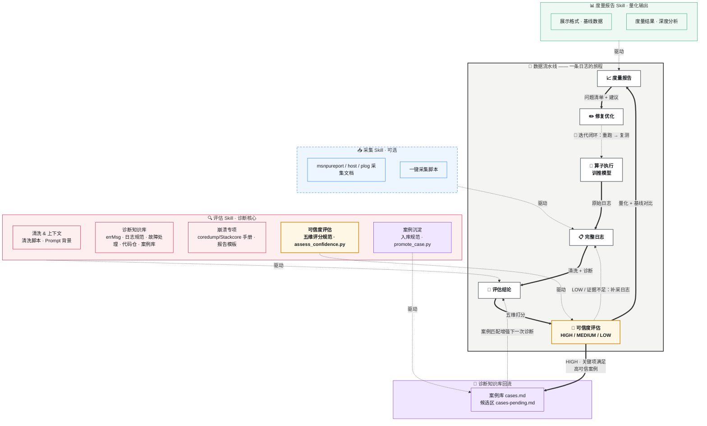

算子执行/训推模型->采集skill（可选） ->完整的日志->评估skill->度量报告skill->按度量结果分析修改->重头开始

说明：
采集skill包含（msnpureprot采集文档，host日志采集文档，plog日志采集文档，采集脚本）
评估skill包含（清洗脚本，prompt背景介绍，errMsg文档，日志规范，故障处理参考，coredump/Stackcore分析手册，coredump报告模板，代码仓地址，常见案例库）
度量报告skill包含（展示格式，基线数据，度量结果文档，度量结果分析文档）

输出工作流和架构图，展示整个流程和各个组件之间的关系。

## 工作流与架构图

> 完整文档见 [docs/architecture.md](docs/architecture.md)



---

## 使用指南

### 安装

没有下载本仓时，可直接用独立脚本安装本 skill 组。安装内容包括 `collect-skill`、`eval-skill`、`metric-skill` 三个子 skill。

安装到 Codex：

```bash
curl -fsSL https://raw.gitcode.com/cann-agent/skills/raw/main/skills/tool-fault-diagnosis/scripts/install.sh | bash -s -- --target codex
```

安装到 Claude Code：

```bash
curl -fsSL https://raw.gitcode.com/cann-agent/skills/raw/main/skills/tool-fault-diagnosis/scripts/install.sh | bash -s -- --target claude
```

安装到 OpenCode：

```bash
curl -fsSL https://raw.gitcode.com/cann-agent/skills/raw/main/skills/tool-fault-diagnosis/scripts/install.sh | bash -s -- --target opencode
```

安装到 CodeFuse：

```bash
curl -fsSL https://raw.gitcode.com/cann-agent/skills/raw/main/skills/tool-fault-diagnosis/scripts/install.sh | bash -s -- --target codefuse
```

CodeFuse 默认全局安装到 `~/.codefuse/fuse/skills`。安装到当前项目时使用：

```bash
curl -fsSL https://raw.gitcode.com/cann-agent/skills/raw/main/skills/tool-fault-diagnosis/scripts/install.sh | bash -s -- --target codefuse --dest .codefuse/skills
```

本地已有仓库时，从仓库根目录执行：

```bash
python3 skills/tool-fault-diagnosis/scripts/install_all_tool_fault_diagnosis_skills.py --target codex --overwrite
python3 skills/tool-fault-diagnosis/scripts/install_all_tool_fault_diagnosis_skills.py --target claude --overwrite
python3 skills/tool-fault-diagnosis/scripts/install_all_tool_fault_diagnosis_skills.py --target opencode --overwrite
python3 skills/tool-fault-diagnosis/scripts/install_all_tool_fault_diagnosis_skills.py --target codefuse --overwrite
```

默认安装目录：
- Codex: `${CODEX_HOME:-$HOME/.codex}/skills`
- Claude Code: `${CLAUDE_HOME:-$HOME/.claude}/skills`
- OpenCode: `${OPENCODE_CONFIG_DIR:-$HOME/.config/opencode}/skills`
- CodeFuse: `$HOME/.codefuse/fuse/skills`

验证安装：

```bash
python3 skills/tool-fault-diagnosis/scripts/install_all_tool_fault_diagnosis_skills.py --target codex --verify-only
python3 skills/tool-fault-diagnosis/scripts/install_all_tool_fault_diagnosis_skills.py --target claude --verify-only
python3 skills/tool-fault-diagnosis/scripts/install_all_tool_fault_diagnosis_skills.py --target opencode --verify-only
python3 skills/tool-fault-diagnosis/scripts/install_all_tool_fault_diagnosis_skills.py --target codefuse --verify-only
```

安装或更新后，重启对应客户端以加载最新 skill metadata。

### 触发方式

安装后，以下表达会触发本 skill 组的 `collect-skill`，执行全量日志采集：

```text
采集所有日志
收集所有日志
采集全量日志
全量日志采集
一键采集日志
收集完整日志
帮我把 CANN 的日志全部收集起来
```

全量流程包括 `collect.sh --all`、补齐已有日志及现场、使用可用的 `msnpureport` / `asys` 工具导出，并检查节点、设备和 rank 覆盖情况。采集完成后交付目录、文件清单和各来源状态；工具缺失、权限不足或日志未生成时会明确列出缺口。详细步骤见 [全量采集流程](collect-skill/references/full-log-collection.md)。已安装旧版本时，需更新并重启客户端，使新的触发描述生效。

安装后，可直接用以下表达触发日志评估 Skill：

```text
分析 xx 日志
帮我看 xx 日志
诊断 xx 日志
排查 xx 日志
```

其中 `xx` 可以是日志目录、zip 压缩包或单个日志文件。

崩溃场景也会触发该 Skill，常见触发词包括：

```text
coredump
core dump
core文件
Stackcore
stackcore文件
CANN崩溃
Segmentation fault
SIGSEGV
SIGABRT
msnpureport
asys analyze
debug so
CANN 符号解析
崩溃根因报告
```

### 前置条件

1. 已有完整日志（至少具备以下之一）：
   - `$HOME/ascend/log/debug/plog/plog-<pid>_*.log`（Host 侧 plog 日志）
   - msnpureport 导出的 Device 侧系统日志（如无，参考 [collect-skill](collect-skill/SKILL.md) 采集）
   - coredump / Linux core / Stackcore / asys 输出（崩溃场景）
2. Python 3.7+（用于运行清洗脚本）

---

### Step 0：采集日志与现场产物（可选）

已有完整日志时可直接进入 Step 1。以下命令从 `skills/tool-fault-diagnosis/` 目录执行，产物清单以 [collect.sh](collect-skill/scripts/collect.sh) 的实际行为为准。

```bash
# 采集所有来源，默认输出目录为 ./logs
bash collect-skill/scripts/collect.sh --all --output ./logs

# 仅采集宿主机和框架日志
bash collect-skill/scripts/collect.sh --host --plog --output ./logs

# 同时指定起止时间
bash collect-skill/scripts/collect.sh --all \
    --start "2026-03-25 10:00:00" --end "2026-03-25 11:00:00" \
    --output ./logs
```

#### 0.1 一键采集脚本产物

下表路径均相对于 `--output` 指定的目录。只有选中的采集来源会执行；源文件缺失、命令不可用或权限不足时，对应产物可能缺失或为空。

| 产物路径 | 采集来源与内容 | 用途及生成条件 |
|----------|----------------|----------------|
| `msnpureprot/` 下的 `*.log` | 复制 `/var/log/npu/slog/` 下的日志 | `--msnpureprot` 或 `--all`；用于关联 Host/Device 事件、任务执行和驱动错误 |
| `msnpureprot/cann/` 下的 `*.log` | 复制 `/usr/local/Ascend/cann-8.5.0/log/` 下的日志 | 同上，且源目录存在；补充 CANN 安装目录中的日志 |
| `host/dmesg_npu.log` | `dmesg` 中匹配 `npu/ascend/davinci/hisi` 的内核消息 | `--host` 或 `--all`，且 `dmesg` 可用；检查设备、驱动及硬件异常 |
| `host/journalctl.log` | 指定时间段的系统日志；未同时指定起止时间时取最近 1000 行 | 同上，且 `journalctl` 可用；检查系统事件及 OOM 等异常 |
| `host/syslog.log` 或 `host/messages.log` | 复制 `/var/log/syslog` 或 `/var/log/messages` | 仅在 `journalctl` 命令不存在时回退，优先选择 `syslog`；命令执行失败不会触发回退 |
| `host/driver/` 下的 `*.log` | 复制 `/var/log/npu/driver/` 下的日志 | `--host` 或 `--all`，且源目录存在；检查 NPU 驱动事件 |
| `host/npu_smi_info.txt` | `npu-smi info` 的设备状态快照 | 同上，且 `npu-smi` 可用；记录采集时的设备状态 |
| `host/memory.txt` | `free -h` 的系统内存快照 | `--host` 或 `--all`；辅助检查宿主机内存压力 |
| `host/disk.txt` | `df -h` 的文件系统容量快照 | 同上；辅助检查磁盘空间不足 |
| `host/processes.txt` | `ps aux` 的全部进程快照 | 同上；关联进程、PID 和资源占用 |
| `plog/` 下的 `*.log` | 递归复制 `${ASCEND_LOG_PATH:-$HOME/ascend/log/plog}` 下的日志 | `--plog` 或 `--all`；分析框架运行、图编译、算子调度和内存事件 |
| `plog/ir/` 下的 `*.ir`、`*.dot` | 从 `$HOME/ascend/` 搜索图编译产物，取搜索结果前 50 项并平铺复制 | 同上；辅助分析计算图和算子融合，源文件需已生成 |
| `manifest.txt` | 输出目录内所有文件路径的排序清单 | 每次采集结束时生成；用于核对文件，可能包含清单自身及目录内已有文件 |

日志复制使用 `cp --parents` 保留源路径层级，不会重命名为 `msnpureprot_*.log`、`host_*.log` 或 `plog_*.log`。例如源文件 `/var/log/npu/slog/device-0/example.log` 会保存为 `logs/msnpureprot/var/log/npu/slog/device-0/example.log`。

典型目录结构如下，实际内容随采集选项和环境变化：

```text
logs/
├── manifest.txt
├── msnpureprot/
│   ├── var/log/npu/slog/...
│   └── cann/usr/local/Ascend/cann-8.5.0/log/...
├── host/
│   ├── dmesg_npu.log
│   ├── journalctl.log        # 或 syslog.log / messages.log
│   ├── driver/var/log/npu/driver/...
│   ├── npu_smi_info.txt
│   ├── memory.txt
│   ├── disk.txt
│   └── processes.txt
└── plog/
    ├── <源路径层级>/.../*.log
    └── ir/                  # *.ir / *.dot
```

采集范围说明：

- 脚本面向 Linux Ascend 环境，使用 GNU `cp --parents`、`touch -d` 等命令；采集系统和驱动日志需具备相应读取权限。
- `--start` 和 `--end` 需同时设置才生效。复制日志时按文件修改时间筛选，范围为起始时间之后、结束时间及之前，不会逐行裁剪日志；`journalctl` 使用自身的时间查询。
- `dmesg`、系统日志文件回退、设备和资源快照、IR 图不受上述时间范围限制。快照反映采集时状态，不一定是故障发生时状态。
- 复制日志仅匹配 `*.log`，不会自动包含 `.log.1`、`.gz` 等轮转或压缩文件。IR 图只保留前 50 项，同名文件平铺复制时可能覆盖。
- 默认 plog 路径若与运行环境不一致，例如实际位于 `$HOME/ascend/log/debug/plog/`，执行采集时可设置 `ASCEND_LOG_PATH` 指向已有日志目录；脚本将该变量直接作为搜索根目录。
- `--msnpureprot` 和 `msnpureprot/` 是现有脚本的参数与目录名称；此步骤只复制本地日志，不会调用驱动工具 `msnpureport` 导出 Device 现场。

#### 0.2 按场景补充的采集产物

以下材料需要按参考文档另行采集或生成，不由 `collect.sh --all` 自动产出。外部工具的目录和文件名可能随版本变化，应保留实际生成的完整目录。

| 场景 | 应保留的产物 | 获取方式与用途 |
|------|--------------|----------------|
| 应用报错、训练或推理失败 | 任务的 `stdout`、`stderr`、框架日志，以及启动命令、复现步骤、故障时间和时区、PID/rank/Device ID | 从任务工作目录或运行平台导出；用于定位首报错并关联各日志源，见 [Host 采集说明](collect-skill/references/host-log-collection.md) |
| 多卡通信异常 | HCCL 日志，可归档到 `host/hccl/` | 从任务的 `hccl_logs/` 或 CANN 对应日志目录复制；保留各节点、各 rank 日志，见 [Host 采集说明](collect-skill/references/host-log-collection.md) |
| 性能问题 | profiling 原始数据及已有性能导出结果 | 从实际 profiling 输出目录采集，参考路径为 `$HOME/ascend/log/profiling/`；用于分析执行时间和资源利用率，见 [plog 采集说明](collect-skill/references/plog-collection.md) |
| Device 故障、Stackcore | `msnpureport` 导出的完整时间戳目录，常见内容包括 `slog/`、`message/`、`hisi_logs/`、`stackcore/`，部分版本还有 `event_sched/`、`module_info/` | 在可写采集目录执行驱动工具 `msnpureport report`；保留设备日志、黑匣子和崩溃栈，见 [崩溃命令手册](eval-skill/references/coredump-command-playbook.md#5-msnpureport-collection) |
| 综合故障现场 | `asys collect` 或 `asys launch` 生成的目录及压缩包，包括 `software_info.txt`、`hardware_info.txt`、`status_info.txt`、`health_result.txt`、`dfx/` 等 | `asys collect --tar=True --output=<collection_root>` 采集现场；`asys launch` 在复现任务时采集，见 [asys 采集说明](eval-skill/references/coredump-command-playbook.md#6-asys-active-collection) |
| Host 崩溃、SIGSEGV/SIGABRT | Linux core/coredump、匹配的可执行文件、依赖 `.so`、debug so/`.debug` 符号文件、Build ID 和版本记录 | 保留故障时对应构建的文件，用于符号解析和源码定位，见 [崩溃命令手册](eval-skill/references/coredump-command-playbook.md) |
| AI Core Error | 对应 Device 的 `event_*.log`、exception dump、报错算子 `.o`/`.json`、版本/hash 对应关系、输入 shape/index、tiling 和内存生命周期信息 | 按 Device、stream/task、`fault kernel_name` 和 hash 收集同次故障的材料，见 [AI Core Error 专项](eval-skill/references/ai-core-reference.md) |
| 已执行崩溃或算子分析 | `gdb_core_analysis.txt`、`asys analyze` 的完整输出；`msaicerr` 的完整 `info_<timestamp>/`，包括生成的 `info.txt`、`debug_info.txt`、`test_single_op.py` 等 | 这些是基于现场生成的分析产物，需与原始日志和 dump 一起保留；不要只提交最终结论文件，见 [崩溃命令手册](eval-skill/references/coredump-command-playbook.md) 和 [AI Core Error 专项](eval-skill/references/ai-core-reference.md) |

`merged.log` 是可选的多源日志合并产物，当前采集脚本不会生成；如另行合并，应同时保留原始文件。压缩包也需单独创建，例如参考文档中的 `msnpureprot_logs.tar.gz`。

#### 0.3 采集完成后的交付与检查

通过 Skill 执行全量采集时，额外产物统一归档到 `supplement/`，Device 工具导出保存到 `msnpureport/`，综合现场保存到 `asys/`。同时生成 `collection_status.md`，逐项记录源路径、产物路径、命令执行结果、文件数量、非空检查、时间和节点/设备/rank 覆盖情况，以及“已采集 / 缺失 / 不适用 / 失败”状态。以上目录和状态文件由 [全量采集流程](collect-skill/references/full-log-collection.md) 组织生成。

多机任务建议每台机器使用独立输出目录，例如 `./logs/<hostname>/`，并记录 CANN、Driver、Firmware、框架版本及任务信息。检查日志是否覆盖完整运行周期、相关设备和 rank，确认关键文件非空；`manifest.txt` 仅列出文件路径，不能证明采集成功或材料齐全。

向评估 Skill 提供完整采集目录或压缩包，并附上补采材料及其路径。原始日志、core、dump、符号文件应保留，后续清洗结果写入独立的 `./cleaned/` 目录。Step 1 生成的清洗日志、诊断结论、可信度 JSON，以及 Step 2 生成的报告属于分析和报告产物，不是采集脚本输出。

---

### Step 1：运行评估 Skill（日志清洗 + 分析 + 评估结论）

#### 1.1 清洗日志

```bash
# 清洗单个 plog 文件，提取 WARNING 及以上级别
python3 eval-skill/scripts/clean.py \
    --input ./logs/plog-12345_20260402.log \
    --level WARNING \
    --output ./cleaned/plog_clean.log

# 清洗整个日志目录
python3 eval-skill/scripts/clean.py \
    --input-dir ./logs/ \
    --output-dir ./cleaned/

# 仅保留 ERROR 级别（最精简，适合快速定位）
python3 eval-skill/scripts/clean.py \
    --input ./logs/plog-12345_20260402.log \
    --level ERROR \
    --output ./cleaned/errors_only.log
```

清洗后日志存放于 `./cleaned/`，可直接提供给 LLM 进行分析。

#### 1.2 用 LLM 分析日志（Prompt 模板）

打开 GitHub Copilot Chat 或其他 LLM 工具，按如下结构构造 Prompt：

```
@workspace /eval-skill/SKILL.md

我有一段CANN运行日志，请按照评估 Skill 流程分析并输出评估结论。

背景：
<粘贴 eval-skill/references/background.md 关键内容，或说明模型/算子名称和场景>

日志内容：
<粘贴 ./cleaned/errors_only.log 的内容>

请完成以下工作：
1. 识别所有 errMsg，提取首报错错误码
2. 对照 errMsg 文档（eval-skill/references/err-messages.md）说明每个错误码含义
3. 判断 errMsg 是否符合官方文档定义（文档符合度）
4. 判断日志行格式是否符合官方规范（格式规范度）
5. 判断 errMsg 是否能指导问题解决（问题指导性）
6. 结合故障处理参考（eval-skill/references/fault-handling.md）定位根因
7. 如果存在 coredump、core 文件、Stackcore、SIGSEGV/SIGABRT 或 asys/msnpureport 崩溃产物，结合 eval-skill/references/coredump-command-playbook.md 和 eval-skill/references/coredump-report-template.md 分析崩溃证据链
8. 查找 eval-skill/references/cases.md 中的匹配历史案例
9. 按 eval-skill/references/confidence-assessment.md 的五维模型评估本次诊断结论的可信度，
   逐项说明哪些是已证实事实、哪些仍属推断、缺哪些材料，并判定入库关键项是否满足
10. 输出标准评估结论（含问题分类、根因分析、影响范围、建议修复方向、诊断可信度）
```

#### 1.3 评估结论格式

LLM 输出的评估结论应具备如下结构（来自 [eval-skill/SKILL.md](eval-skill/SKILL.md)）：

```markdown
## 评估结论

### 问题分类
- 类型：[算子计算错误 / 编译失败 / 性能劣化 / 通信超时 / OOM / 其他]
- 严重程度：[FATAL / ERROR / WARNING]

### errMsg 质量评估
- 首报错错误码：ExxYYYY（所属模块：<模块名>）
- 所有识别到的错误码：[列表]
- 文档符合度：<已记录/未记录>，描述与文档<一致/不一致>
- 格式规范度：<合规/不合规>，问题：<若有>
- 问题指导性：<可定位根因 / 只能确定模块 / 无法定位>
- errMsg 综合质量：EXCELLENT / GOOD / FAIR / POOR

### 根因分析
- 根因描述（具体到算子/模块）
- 相关日志行：`<日志片段>`
- 对应错误码：ExxYYYY（含义：...）

### 影响范围
- 受影响的 rank/设备
- 执行阶段（编译期/运行时）

### 建议修复方向
1. ...
2. ...

### 关联案例
- 参考案例：cases.md#CASE-xxx

### 诊断可信度
- 综合可信度：<score>/100（<HIGH/MEDIUM/LOW/INSUFFICIENT>）
- 维度得分：证据完整性 <x>/25 · 证据一致性 <x>/20 · 因果链 <x>/25 · 复现验证 <x>/15 · 知识对齐 <x>/15
- 关键项：<全部满足 / 首报错日志行未定位 / 因果链存在跳跃>
- 已证实事实：<由源码/复现/多源日志证实的结论>
- 仍属推断：<推断内容 + 缺哪一步证据>
- 待补材料：<具体材料 + 拿到后能提升哪个维度>
- 案例库沉淀：<已入库 CASE-xxx / 进候选区 PCASE-xxx / 不入库（原因）>
```

---

### Step 1.4：评估诊断可信度

评估结论只是推断，可信度决定它能不能当定论用。用脚本量化：

```bash
# 生成检查表
python3 eval-skill/scripts/assess_confidence.py --template > confidence.json

# 按诊断实际情况把 checks 里的 value 填为 true/false，然后打分
python3 eval-skill/scripts/assess_confidence.py --input confidence.json

# 输出机器可读结果，供案例沉淀和度量报告使用
python3 eval-skill/scripts/assess_confidence.py --input confidence.json --json \
    > confidence_result.json
```

五维共 17 个检查项（证据完整性 25 · 证据一致性 20 · 因果链 25 · 复现验证 15 · 知识对齐 15），
没有把握的一律填 `false`。其中两项是入库关键项，未满足时无论总分多少都不允许沉淀进案例库：

| 关键项 | 未满足的后果 |
|------|------------|
| 首报错日志行已定位 | 结论方向可能整体偏移；不得入库 |
| 因果链无跳跃 | 结论含未证实的关键假设；不得入库 |

按等级调整结论表述：

| 等级 | 分数 | 表述方式 |
|------|------|---------|
| HIGH | ≥ 85 | 可作定论 |
| MEDIUM | 70–84 | "当前证据下最可能的原因" |
| LOW | 50–69 | "初步判断" |
| INSUFFICIENT | < 50 | 不给根因结论，只给排查方向和补采建议 |

详细规范见 [eval-skill/references/confidence-assessment.md](eval-skill/references/confidence-assessment.md)。

---

### Step 1.5：把高可信报告沉淀到案例库

高可信结论应回流到案例库，让下一次诊断的案例匹配直接命中：

```bash
# 干跑，确认将写入的案例内容
python3 eval-skill/scripts/promote_case.py \
    --report ./diagnosis_report.md \
    --confidence ./confidence_result.json \
    --dry-run

# 正式写入（accept → cases.md，pending → cases-pending.md）
python3 eval-skill/scripts/promote_case.py \
    --report ./diagnosis_report.md \
    --confidence ./confidence_result.json

# 候选案例补齐证据、重评达 HIGH 后转正
python3 eval-skill/scripts/promote_case.py \
    --promote PCASE-001 --confidence ./confidence_result.json
```

入库门槛由可信度结果的 `case_gate` 字段决定：

| 判定 | 条件 | 去向 |
|------|------|------|
| **accept** | ≥ 85（HIGH）且关键项满足且根因已定位且修复已验证 | `cases.md`（`CASE-xxx`）|
| **pending** | 70–84（MEDIUM），或 HIGH 但修复未验证 | `cases-pending.md`（`PCASE-xxx`）|
| **reject** | < 70，或命中首报错缺失/因果链跳跃 | 不入库，先补证 |

脚本会自动拦截三类问题，命中即中断：入库门槛不足（退出码 2）、含敏感信息如 IP/家目录/凭据
（退出码 3）、疑似重复案例（退出码 4，确认为不同根因用 `--force`）。

案例库是被后续诊断反复复用的知识，错误案例会持续误导诊断。宁可留在候选区，也不要污染主库。
详细规范见 [eval-skill/references/case-contribution.md](eval-skill/references/case-contribution.md)。

---

### Step 2：运行度量报告 Skill（生成结构化报告）

基于 Step 1 的评估结论，生成正式度量报告。

#### 2.1 用 LLM 生成度量报告（Prompt 模板）

```
@workspace /metric-skill/SKILL.md

请基于以下评估结论，生成标准度量报告。

评估结论：
<粘贴 Step 1 输出的评估结论>

诊断可信度：
<粘贴 confidence_result.json，或 Step 1.4 输出的可信度章节>

测试环境：
- 设备：Ascend NPU × <N> 卡，CANN 8.5.0
- 框架：<PyTorch/MindSpore> <版本>
- 算子/模型：<名称>，输入 shape：<shape>，dtype：<FP16/BF16/FP32>

性能数据（如有）：
- 端到端时间：<值> ms
- AICore 时间：<值> ms
- AICore 利用率：<值>%
- HBM 带宽利用率：<值>%

精度数据（如有）：
- max_diff vs FP32：<值>
- mean_diff：<值>

请按照 metric-skill/references/display-format.md 的完整报告模板输出，
包含 errMsg 质量评估章节（3.3 节）和诊断可信度章节（3.4 节），
并参考 metric-skill/references/baseline-data.md 的达标标准进行对比分析。

注意按可信度等级控制结论强度：可信度 < 70 时根因不得使用定论表述，
< 50 时不写根因，改为列出待补采的日志和材料。
```

#### 2.2 报告文件保存

按命名规范保存报告：

```
metric_report_<算子或模型名>_<YYYYMMDD>_v1.md
```

示例：`metric_report_MatMulV2_20260402_v1.md`

---

### Step 3：按度量结果迭代优化

根据报告中的**问题清单**和**改进建议**：

| 优先级 | 触发条件 | 行动 |
|--------|---------|------|
| **P0** | 诊断可信度 < 50（INSUFFICIENT），或精度 max_diff > 0.1 或结果 NaN | 本次迭代必须处理；可信度不足时先补采日志重新诊断 |
| **P1** | 诊断可信度 50~69（LOW），或性能回归 > 10%，或 errMsg 质量 POOR（<50） | 下一次迭代修复 |
| **P2** | 诊断可信度 70~84（MEDIUM）待补证，或 AICore 利用率 < 60%，或 errMsg 质量 FAIR（50~69）| 排期优化；候选案例补齐证据后转正 |
| **P3** | errMsg 质量 GOOD（70~89）可继续提升 | 长期维护 |

可信度排在性能和精度之前：结论不可靠时，后续优化是在错误方向上投入。

修复后重新执行算子/模型 → 回到 Step 1 开始新一轮迭代。高可信案例已沉淀进案例库，
下一轮诊断的案例匹配会直接受益。

---

### 目录结构参考

```
tool-fault-diagnosis/
├── collect-skill/          # 采集 Skill（可选，用于收集日志）
│   ├── SKILL.md
│   ├── references/         # msnpureprot / host / plog 采集文档
│   └── scripts/collect.sh  # 一键采集脚本
├── eval-skill/             # 评估 Skill（核心）
│   ├── SKILL.md            # Skill 入口，含评估流程说明
│   ├── references/
│   │   ├── background.md       # CANN 领域背景知识
│   │   ├── err-messages.md     # 官方错误码体系（21 个模块全量）
│   │   ├── log-spec.md         # 官方日志格式 + 路径 + 环境变量
│   │   ├── fault-handling.md   # AI Core Error / 内存OOM / 进程中断 / 卡住 四大故障定位专题（完整流程+工具+案例）
│   │   ├── coredump-command-playbook.md   # coredump/Stackcore 命令手册
│   │   ├── coredump-report-template.md    # 崩溃专项报告模板（含可信度与入库章节）
│   │   ├── code-repos.md       # CANN 相关代码仓库地址
│   │   ├── cases.md            # 典型问题案例库（CASE-001~006）
│   │   ├── cases-pending.md    # 候选案例库（PCASE，首次沉淀时自动创建）
│   │   ├── confidence-assessment.md  # 诊断可信度评估规范（五维评分 + 入库关键项）
│   │   └── case-contribution.md      # 案例沉淀规范（入库门槛 + 格式 + 脱敏）
│   └── scripts/
│       ├── clean.py                # 日志清洗脚本
│       ├── assess_confidence.py    # 可信度评分（输出等级和入库判定）
│       └── promote_case.py         # 高可信报告沉淀到案例库
├── metric-skill/           # 度量报告 Skill
│   ├── SKILL.md
│   └── references/
│       ├── display-format.md   # 报告模板（含 errMsg 质量 + 诊断可信度章节）
│       ├── baseline-data.md    # 基线数据 + errMsg 达标标准 + 可信度达标标准
│       ├── metric-results.md   # 度量结果 JSON 规范（含 diagnosis_confidence）
│       └── metric-analysis.md  # 深度分析框架（含 errMsg 质量 + 可信度分析）
└── docs/
    ├── architecture.md     # 完整架构说明
    └── architecture.drawio # 架构图源文件
```
