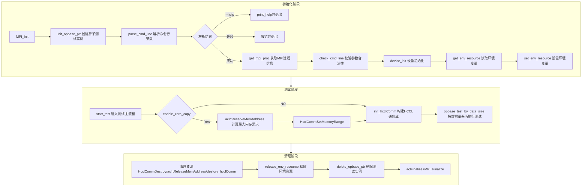
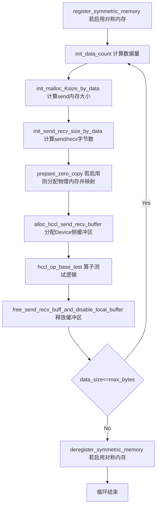
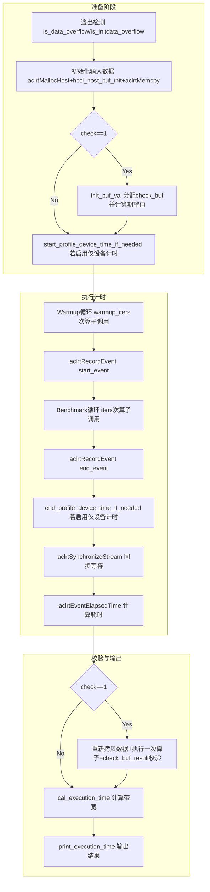
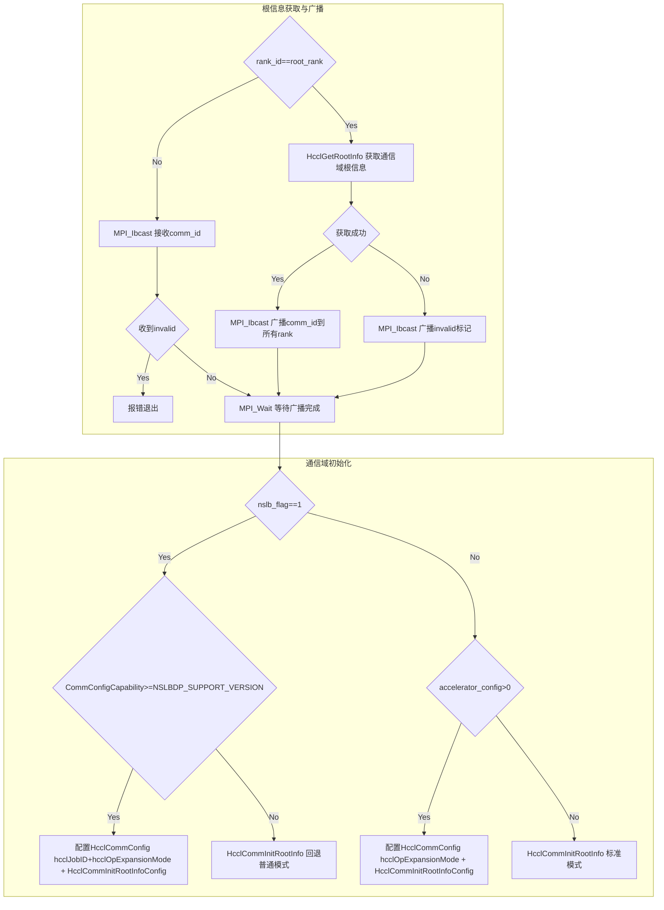

# HCCL Test

HCCL Test是基于昇腾AI处理器的集合通信性能与正确性测试工具，用于在分布式训练或推理场景下验证HCCL（Huawei Collective Communication Library）集合通信操作的功能正确性并评估通信性能。

## 目录结构

```
hccl_test/
├── CMakeLists.txt                          # CMake构建配置（项目安装集成）
├── Makefile                                # Make构建配置（独立编译各算子测试二进制）
├── hostfile                                # 多机集群节点配置文件模板
├── common/src/                             # 公共基础模块
│   ├── hccl_test_main.cc                   # 程序入口，驱动整体执行流程
│   ├── hccl_test_common.h                  # HcclTest基类声明与公共宏定义
│   ├── hccl_test_common.cc                 # HcclTest基类实现（参数解析、设备初始化、通信域构建、内存管理）
│   ├── hccl_check_common.h                 # 数据校验函数声明
│   ├── hccl_check_common.cc                # 数据校验函数实现（按数据类型逐元素比对）
│   ├── hccl_check_buf_init.h               # 数据初始化与校验辅助函数声明（含浮点转换工具）
│   ├── hccl_check_buf_init.cc              # 数据初始化与校验辅助函数实现（含函数映射表分发机制）
│   ├── hccl_opbase_rootinfo_base.h         # HcclOpBaseTest中间基类声明
│   └── hccl_opbase_rootinfo_base.cc        # HcclOpBaseTest中间基类实现（数据量计算、溢出检测、耗时统计）
├── opbase_test/                            # 各集合通信算子测试实现
│   ├── hccl_allgather_rootinfo_test.h/cc   # AllGather算子测试
│   ├── hccl_allgatherv_rootinfo_test.h/cc  # AllGatherV算子测试
│   ├── hccl_allreduce_rootinfo_test.h/cc   # AllReduce算子测试
│   ├── hccl_alltoallv_rootinfo_test.h/cc   # AlltoAllV算子测试
│   ├── hccl_alltoallvc_rootinfo_test.h/cc  # AlltoAllVC算子测试
│   ├── hccl_alltoall_rootinfo_test.h/cc    # AlltoAll算子测试
│   ├── hccl_brocast_rootinfo_test.h/cc     # Broadcast算子测试
│   ├── hccl_reduce_rootinfo_test.h/cc      # Reduce算子测试
│   ├── hccl_reducescatter_rootinfo_test.h/cc # ReduceScatter算子测试
│   ├── hccl_reducescatterv_rootinfo_test.h/cc # ReduceScatterV算子测试
│   ├── hccl_scatter_rootinfo_test.h/cc     # Scatter算子测试
```

## 架构设计

### 类继承体系

HCCL Test采用三层类继承体系实现代码复用与算子扩展：

```
┌──────────────────────────────────────────────────────────────────┐
│ 第一层：HcclTest（基础设施层）                                    │
│ ─────────────────────────────────────────────────────────────── │
│ 参数解析与校验     parse_cmd_line / check_cmd_line               │
│ MPI进程管理       get_mpi_proc                                  │
│ ACL设备初始化     device_init / destory_hcclComm                 │
│ HCCL通信域构建    init_hcclComm                                 │
│ 内存管理          alloc_send_recv / zero_copy / symmetric        │
│ 测试流程编排      start_test / opbase_test_by_data_size         │
│ 虚函数接口        hccl_op_base_test() / init_data_count()       │
│                   init_malloc_Ksize_by_data()                   │
│                   init_send_recv_size_by_data()                 │
│                   destory_alloc_buf()                           │
└──────────────────────────────────────────────────────────────────┘
┌──────────────────────────────────────────────────────────────────┐
│ 第二层：HcclOpBaseTest（算子通用层）                              │
│ ─────────────────────────────────────────────────────────────── │
│ 数据量与类型计算   init_data_count                               │
│ 溢出检测           is_data_overflow / is_initdata_overflow       │
│ 结果校验框架       init_buf_val / check_buf_result               │
│ 耗时统计与输出     print_execution_time                          │
│ Host内存释放      destory_alloc_buf                              │
│ 校验辅助成员       host_buf / check_buf / recv_buff_temp / val  │
└──────────────────────────────────────────────────────────────────┘
┌──────────────────────────────────────────────────────────────────┐
│ 第三层：算子测试类（具体算子实现层）                              │
│ ─────────────────────────────────────────────────────────────── │
│ HcclOpBaseAllgatherTest       ─── all_gather_test                │
│ HcclOpBaseAllgatherVTest      ─── all_gatherv_test               │
│ HcclOpBaseAllreduceTest       ─── all_reduce_test                │
│ HcclOpBaseAlltoallvTest       ─── alltoallv_test                 │
│ HcclOpBaseAlltoallvcTest      ─── alltoallvc_test                │
│ HcclOpBaseAlltoallTest        ─── alltoall_test                  │
│ HcclOpBaseBrocastTest         ─── broadcast_test                 │
│ HcclOpBaseReduceTest          ─── reduce_test                    │
│ HcclOpBaseReducescatterTest   ─── reduce_scatter_test            │
│ HcclOpBaseReducescatterVTest  ─── reduce_scatterv_test           │
│ HcclOpBaseScatterTest         ─── scatter_test                   │
└──────────────────────────────────────────────────────────────────┘
```

- **HcclTest**：提供全部基础设施能力，定义虚函数接口`hccl_op_base_test()`、`init_data_count()`、`init_malloc_Ksize_by_data()`、`init_send_recv_size_by_data()`、`destory_alloc_buf()`供子类覆写。
- **HcclOpBaseTest**：在HcclTest基础上增加算子通用逻辑（数据量计算、溢出检测、校验框架、耗时输出），各虚函数提供默认空实现。
- **算子测试类**：继承HcclOpBaseTest，覆写`hccl_op_base_test()`实现具体算子的性能测试与正确性校验逻辑，同时覆写`init_malloc_Ksize_by_data()`、`init_send_recv_size_by_data()`等接口定义该算子特有的内存布局。

### 工厂模式与多二进制架构

每个算子测试编译为独立的可执行二进制，通过全局函数`init_opbase_ptr()` / `delete_opbase_ptr()`实现工厂模式：

```cpp
// 每个算子 .cc 文件中定义（示例：all_reduce_test）
HcclTest* hccl::init_opbase_ptr(HcclTest* opbase) {
    opbase = new HcclOpBaseAllreduceTest();
    return opbase;
}
void hccl::delete_opbase_ptr(HcclTest *&opbase) {
    delete opbase;
    opbase = nullptr;
}
```

`hccl_test_main.cc`通过调用`init_opbase_ptr()`创建具体算子测试实例，运行时由链接的二进制文件决定实例化哪种算子测试类。Makefile为每个算子生成独立编译命令，产出11个二进制文件放入`bin/`目录。

### 模块职责划分

| 模块 | 核心职责 |
|------|---------|
| **hccl_test_main.cc** | 程序入口，按顺序编排初始化→测试→清理全流程 |
| **HcclTest（基类）** | 命令行解析、MPI进程发现、ACL设备初始化、HCCL通信域构建、send/recv内存管理、数据量遍历调度、zero_copy/symmetric_memory支持 |
| **HcclOpBaseTest（中间层）** | 数据类型与元素数计算、溢出检测策略、结果校验框架（host_buf/check_buf分配与释放）、耗时统计与格式化输出 |
| **算子测试类（叶节点）** | 实现具体HCCL算子调用（如HcclAllReduce）、定义算子特有的数据量对齐规则与send/recv少内存布局、实现算子特有的校验逻辑 |
| **hccl_check_common** | 提供按数据类型（fp32/int8/fp16/int32/int64/u64）逐元素比对的校验函数 |
| **hccl_check_buf_init** | 提供数据初始化函数（host_buf_init / reduce_check_buf_init）与AlltoAll系列校验函数，通过`std::map`函数映射表按数据类型分发 |

### 整体执行流程



### 单次数据量测试流程（opbase_test_by_data_size）

data_size从min_bytes递增到max_bytes循环执行：



### 算子测试内部流程（hccl_op_base_test）

每个算子测试类的 `hccl_op_base_test()` 遵循统一的执行范式：




### HCCL 通信域构建流程（init_hcclComm）

通信域构建依赖MPI广播机制同步各rank的通信信息：



### 内存管理策略

HCCL Test支持三种内存管理模式：

| 模式 | 参数 | 内存分配方式 | 适用算子 |
|------|------|-------------|---------|
| **标准模式** | `-z 0 -m 0` | `aclrtMalloc`分别分配send_buff与recv_buff | 所有算子 |
| **零拷贝模式** | `-z 1` | `aclrtReserveMemAddress`预留虚拟地址 → `aclrtMallocPhysical` + `aclrtMapMem`映射物理内存 → `HcclCommActivateCommMemory`激活 → send/recv从同一虚拟地址区间偏移 | AllGather / ReduceScatter / Broadcast / AllReduce |
| **对称内存模式** | `-m 1` | `hccl_mem_alloc`分配物理内存 → `HcclCommSymWinRegister`注册对称窗口 → send/recv从同一地址偏移 | AllGather / ReduceScatter / AllReduce |

> 零拷贝与对称内存不可同时启用。

### 数据校验机制

校验流程采用"初始化期望值 → 执行算子 → 比对结果"三步模式：

1. **输入初始化**：通过`hccl_host_buf_init()`按`val`（默认值2）或`rank_id + 1`填充host_buf，再拷贝到Device send_buff。
2. **期望值计算**：
   - 非归约算子（AllGather / Broadcast / Scatter）：直接按各rank发送值拼接生成check_buf。
   - 归约算子（AllReduce / Reduce / ReduceScatter）：通过`hccl_reduce_check_buf_init()`按归约操作（sum/prod/max/min）和rank_size计算期望结果。
   - AlltoAll系列：通过`hccl_alltoallv_check_result()` / `hccl_alltoall_check_result()`按各rank发送值逐段校验。
3. **结果比对**：将Device recv_buff拷贝回Host，按数据类型调用对应的`check_buf_result_*()`函数逐元素比对。
4. **溢出跳过**：当数据类型精度不足以容纳归约结果时（如int8在rank_size >= 7时PROD溢出），自动跳过校验并输出Warning。

校验函数通过`std::map<int, FuncPtr>`映射表按`HcclDataType`枚举值分发，覆盖17种数据类型。

### 溢出检测策略

针对归约算子，HCCL Test在执行前根据数据类型精度与rank_size判断结果是否会溢出：

| 归约操作 | 检测条件 | 行为 |
|---------|---------|------|
| **PROD** | rank_size >=精度阈值（fp16≥16, fp32≥128, int8≥7, int32≥31, int64≥63） | 跳过校验，输出Warning |
| **SUM** | rank_size >数据类型可表示最大值/ val | 跳过校验，输出Warning |

各算子测试类覆写`is_data_overflow()`定义算子特有的溢出阈值逻辑。

### 性能计量方式

- **默认模式**：通过ACL Event记录start_event与end_event时间差，统计包含host侧调度与device侧执行的端到端耗时。
- **仅设备计时模式**（`-t 1`）：通过sync_stream + sync_event机制将host侧软件耗时与kernel加载耗时排除，仅统计device执行时间。限制warmup_iters + iters ≤ 100，且不支持aicpu_ts加速模式。
- **算法带宽**：`algorithm_bandwidth =数据量(字节) /平均耗时(秒) / 1E9`，单位GB/s。各算子的数据量计算规则不同（如AllGather按`malloc_kSize * rank_size`，AllReduce按`malloc_kSize`）。

## 支持的集合通信算子

| 算子 | 二进制名称 | HCCL API | 归约操作`-o` | Root参数`-r` | 数据量对齐 | Send/Recv内存布局 |
|------|-----------|----------|-------------|--------------|-----------|-------------------|
| AllGather | `all_gather_test` | `HcclAllGather` | 不生效 | 不生效 | 按`rank_size * 512`对齐 | send = count*type_size, recv = send*rank_size |
| AllGatherV | `all_gatherv_test` | `HcclAllGatherV` | 不生效 | 不生效 | 按`rank_size * 512`对齐 | send = count*type_size, recv = send*rank_size |
| AllReduce | `all_reduce_test` | `HcclAllReduce` | 生效 | 不生效 | 无额外对齐 | send = recv = count*type_size |
| AlltoAllV | `alltoallv_test` | `HcclAlltoAllV` | 不生效 | 不生效 | 按`rank_size * granularity`对齐 | send = recv = count*type_size |
| AlltoAllVC | `alltoallvc_test` | `HcclAlltoAllVC` | 不生效 | 不生效 | 按`rank_size * granularity`对齐 | send = recv = count*type_size |
| AlltoAll | `alltoall_test` | `HcclAlltoAll` | 不生效 | 不生效 | 按`rank_size * granularity`对齐 | send = recv = count*type_size |
| Broadcast | `broadcast_test` | `HcclBroadcast` | 不生效 | 生效 | 无额外对齐 | send = count*type_size, recv = 0 |
| Reduce | `reduce_test` | `HcclReduce` | 生效 | 生效 | 无额外对齐 | send = recv = count*type_size |
| ReduceScatter | `reduce_scatter_test` | `HcclReduceScatter` | 生效 | 不生效 | 按`rank_size * 512`对齐 | send = count*type_size*rank_size, recv = count*type_size |
| ReduceScatterV | `reduce_scatterv_test` | `HcclReduceScatterV` | 生效 | 不生效 | 按`rank_size * 512`对齐 | send = count*type_size*rank_size, recv = count*type_size |
| Scatter | `scatter_test` | `HcclScatter` | 不生效 | 生效 | 按`rank_size * 512`对齐 | send = count*type_size*rank_size, recv = count*type_size |

## 支持的数据类型

| 数据类型 | 参数值 | 元素大小 | 校验支持 | 归约校验支持 |
|---------|-------|---------|---------|------------|
| int8 | `int8` | 1 Byte | 逐元素比对 | 支持（溢出检测） |
| int16 | `int16` | 2 Bytes | 逐元素比对 | 支持（溢出检测） |
| int32 | `int32` | 4 Bytes | 逐元素比对 | 支持 |
| int64 | `int64` | 8 Bytes | 逐元素比对 | 支持 |
| uint8 | `uint8` | 1 Byte | 逐元素比对 | 不支持归约校验 |
| uint16 | `uint16` | 2 Bytes | 逐元素比对 | 不支持归约校验 |
| uint32 | `uint32` | 4 Bytes | 逐元素比对 | 不支持归约校验 |
| uint64 | `uint64` | 8 Bytes | 逐元素比对 | 支持 |
| fp16 | `fp16` | 2 Bytes | 逐元素比对 | 支持（溢出检测） |
| fp32 | `fp32` | 4 Bytes | 浮点容差比对 | 支持（溢出检测） |
| fp64 | `fp64` | 8 Bytes | 逐元素比对 | 不支持归约校验 |
| bfp16 | `bfp16` | 2 Bytes | 逐元素比对 | 支持（溢出检测） |
| int128 | `int128` | 16 Bytes | 仅初始化支持 | 不支持归约校验 |
| hif8 | `hif8` | 1 Byte | 逐元素比对 | 不支持归约校验 |
| fp8e4m3 | `fp8e4m3` | 1 Byte | 逐元素比对 | 不支持归约校验 |
| fp8e5m2 | `fp8e5m2` | 1 Byte | 逐元素比对 | 不支持归约校验 |
| fp8e8m0 | `fp8e8m0` | 1 Byte | 逐元素比对 | 不支持归约校验 |

## 加速器配置

Ascend 950PR/Ascend 950DT支持通过`-a`参数指定加速器配置：

| 参数值 | 配置模式 |
|-------|---------|
| default | 默认CCU调度模式 |
| host_ts | Host侧TS模式 |
| aicpu_ts | AI CPU TS模式 |
| aiv | AIV模式 |
| aiv_only | AIV Only模式 |
| ccu_ms | CCU MS模式 |
| ccu_sched | CCU调度模式 |
| aicpu | AI CPU模式 |

加速器配置通过`HcclCommConfig.hcclOpExpansionMode`在通信域初始化时传入HCCL。

## 使用指导

### 依赖

- CANN Toolkit（提供HCCL / ACL / MsProfiler库与头文件）。
- MPI（提供进程管理与通信能力）。

### 编译

```shell
make MPI_HOME=/path/to/mpi ASCEND_DIR=${ASCEND_HOME_PATH}
```

可选：启用日志输出。

```shell
make HCCL_TEST_LOG_ENABLE MPI_HOME=/path/to/mpi ASCEND_DIR=${ASCEND_HOME_PATH}
```

编译完成后在`bin/`目录生成11个测试二进制。

### 清理

```shell
make clean
```

### 执行示例

```shell
# 单节点 8 NPU — AllReduce fp32 性能测试
mpirun -n 8 ./bin/all_reduce_test -b 8K -e 64M -f 2 -d fp32 -o sum -p 8

# 双节点 16 NPU — Broadcast 测试
mpirun -f hostfile -n 16 ./bin/broadcast_test -b 8K -e 64M -f 2 -p 8 -r 0

# 单节点 8 NPU — 开启零拷贝的 AllGather 测试
mpirun -n 8 ./bin/all_gather_test -b 8K -e 64M -f 2 -p 8 -z 1

# 单节点 8 NPU — 开启仅设备计时的 AllReduce 测试
mpirun -n 8 ./bin/all_reduce_test -b 8K -e 64M -f 2 -p 8 -t 1 -n 20 -w 10
```
详细使用指导参见[HCCL性能测试工具用户指南](https://gitcode.com/cann/oam-tools/tree/master/docs/zh/hccl_test)。