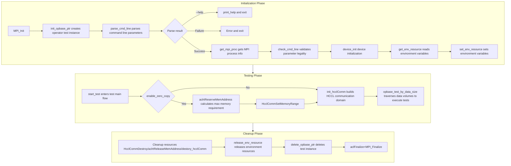
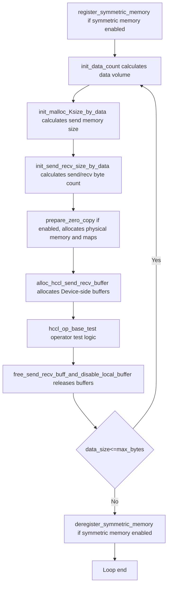
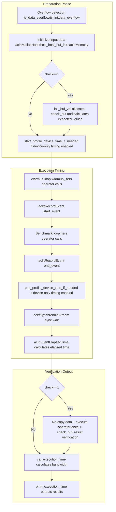
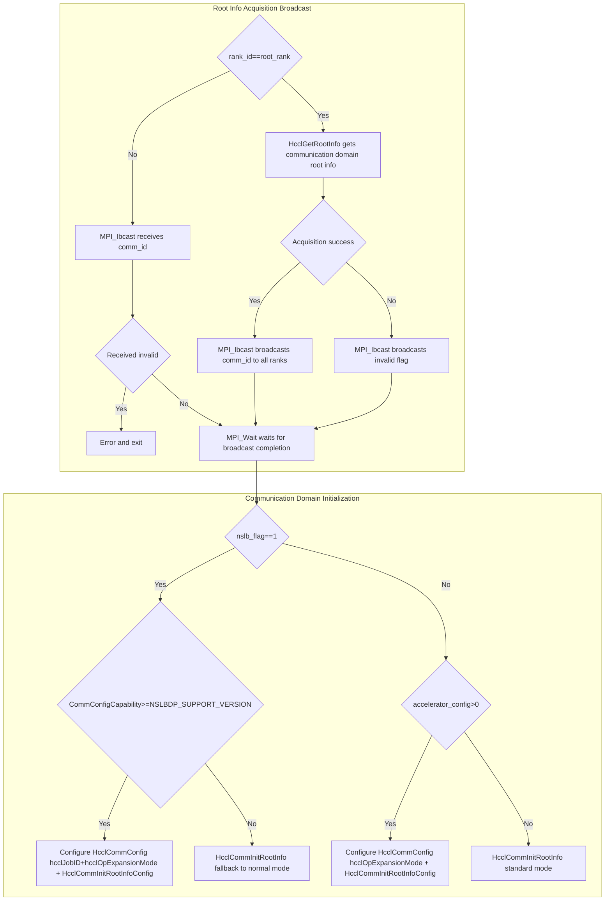

# HCCL Test

HCCL Test is a collective communication performance and correctness testing tool based on Ascend AI processors. It is used to verify the functional correctness of HCCL (Huawei Collective Communication Library) collective communication operations and evaluate communication performance in distributed training or inference scenarios.

## Directory Structure

```
hccl_test/
├── CMakeLists.txt                          # CMake build configuration (project installation integration)
├── Makefile                                # Make build configuration (standalone compilation of each operator test binary)
├── hostfile                                # Multi-node cluster node configuration file template
├── common/src/                             # Common base modules
│   ├── hccl_test_main.cc                   # Program entry, drives the overall execution flow
│   ├── hccl_test_common.h                  # HcclTest base class declaration and common macro definitions
│   ├── hccl_test_common.cc                 # HcclTest base class implementation (parameter parsing, device initialization, communication domain construction, memory management)
│   ├── hccl_check_common.h                 # Data verification function declarations
│   ├── hccl_check_common.cc                # Data verification function implementation (element-wise comparison by data type)
│   ├── hccl_check_buf_init.h               # Data initialization and verification helper function declarations (including float conversion utilities)
│   ├── hccl_check_buf_init.cc              # Data initialization and verification helper function implementation (including function mapping table dispatch mechanism)
│   ├── hccl_opbase_rootinfo_base.h         # HcclOpBaseTest intermediate base class declaration
│   └── hccl_opbase_rootinfo_base.cc        # HcclOpBaseTest intermediate base class implementation (data volume calculation, overflow detection, timing statistics)
├── opbase_test/                            # Each collective communication operator test implementation
│   ├── hccl_allgather_rootinfo_test.h/cc   # AllGather operator test
│   ├── hccl_allgatherv_rootinfo_test.h/cc  # AllGatherV operator test
│   ├── hccl_allreduce_rootinfo_test.h/cc   # AllReduce operator test
│   ├── hccl_alltoallv_rootinfo_test.h/cc   # AlltoAllV operator test
│   ├── hccl_alltoallvc_rootinfo_test.h/cc  # AlltoAllVC operator test
│   ├── hccl_alltoall_rootinfo_test.h/cc    # AlltoAll operator test
│   ├── hccl_brocast_rootinfo_test.h/cc     # Broadcast operator test
│   ├── hccl_reduce_rootinfo_test.h/cc      # Reduce operator test
│   ├── hccl_reducescatter_rootinfo_test.h/cc # ReduceScatter operator test
│   ├── hccl_reducescatterv_rootinfo_test.h/cc # ReduceScatterV operator test
│   ├── hccl_scatter_rootinfo_test.h/cc     # Scatter operator test
```

## Architecture Design

### Class Inheritance Hierarchy

HCCL Test adopts a three-layer class inheritance hierarchy to achieve code reuse and operator extension:

```
┌──────────────────────────────────────────────────────────────────┐
│ Layer 1: HcclTest (Infrastructure Layer)                         │
│ ─────────────────────────────────────────────────────────────── │
│ Parameter parsing & validation   parse_cmd_line / check_cmd_line │
│ MPI process management           get_mpi_proc                    │
│ ACL device initialization        device_init / destory_hcclComm  │
│ HCCL communication domain build  init_hcclComm                   │
│ Memory management                alloc_send_recv / zero_copy / symmetric │
│ Test flow orchestration          start_test / opbase_test_by_data_size │
│ Virtual function interfaces      hccl_op_base_test() / init_data_count() │
│                                  init_malloc_Ksize_by_data()     │
│                                  init_send_recv_size_by_data()   │
│                                  destory_alloc_buf()             │
└──────────────────────────────────────────────────────────────────┘
┌──────────────────────────────────────────────────────────────────┐
│ Layer 2: HcclOpBaseTest (Operator Common Layer)                  │
│ ─────────────────────────────────────────────────────────────── │
│ Data volume & type calculation   init_data_count                 │
│ Overflow detection               is_data_overflow / is_initdata_overflow │
│ Result verification framework    init_buf_val / check_buf_result │
│ Timing statistics & output       print_execution_time            │
│ Host memory release              destory_alloc_buf               │
│ Verification helper members      host_buf / check_buf / recv_buff_temp / val │
└──────────────────────────────────────────────────────────────────┘
┌──────────────────────────────────────────────────────────────────┐
│ Layer 3: Operator Test Classes (Specific Operator Implementation Layer) │
│ ─────────────────────────────────────────────────────────────── │
│ HcclOpBaseAllgatherTest       ─── all_gather_test                │
│ HcclOpBaseAllgatherVTest      ─── all_gatherv_test               │
│ HcclOpBaseAllreduceTest       ─── all_reduce_test                │
│ HcclOpBaseAlltoallvTest       ─── alltoallv_test                 │
│ HcclOpBaseAlltoallvcTest      ─── alltoallvc_test                │
│ HcclOpBaseAlltoallTest        ─── alltoall_test                  │
│ HcclOpBaseBrocastTest         ─── broadcast_test                 │
│ HcclOpBaseReduceTest          ─── reduce_test                    │
│ HcclOpBaseReducescatterTest   ─── reduce_scatter_test            │
│ HcclOpBaseReducescatterVTest  ─── reduce_scatterv_test           │
│ HcclOpBaseScatterTest         ─── scatter_test                   │
└──────────────────────────────────────────────────────────────────┘
```

- **HcclTest**: Provides all infrastructure capabilities, defines virtual function interfaces `hccl_op_base_test()`, `init_data_count()`, `init_malloc_Ksize_by_data()`, `init_send_recv_size_by_data()`, `destory_alloc_buf()` for subclasses to override.
- **HcclOpBaseTest**: Adds operator common logic on top of HcclTest (data volume calculation, overflow detection, verification framework, timing output), providing default empty implementations for each virtual function.
- **Operator test classes**: Inherit HcclOpBaseTest, override `hccl_op_base_test()` to implement specific operator performance testing and correctness verification logic, and override `init_malloc_Ksize_by_data()`, `init_send_recv_size_by_data()` and other interfaces to define the operator-specific memory layout.

### Factory Pattern and Multi-Binary Architecture

Each operator test is compiled into an independent executable binary, implementing the factory pattern through global functions `init_opbase_ptr()` / `delete_opbase_ptr()`:

```cpp
// Defined in each operator .cc file (example: all_reduce_test)
HcclTest* hccl::init_opbase_ptr(HcclTest* opbase) {
    opbase = new HcclOpBaseAllreduceTest();
    return opbase;
}
void hccl::delete_opbase_ptr(HcclTest *&opbase) {
    delete opbase;
    opbase = nullptr;
}
```

`hccl_test_main.cc` creates specific operator test instances by calling `init_opbase_ptr()`, and at runtime the linked binary file determines which operator test class to instantiate. The Makefile generates independent compilation commands for each operator, producing 11 binary files placed in the `bin/` directory.

### Module Responsibilities

| Module | Core Responsibilities |
|------|---------|
| **hccl_test_main.cc** | Program entry, orchestrates the full flow of initialization → testing → cleanup in sequence |
| **HcclTest (base class)** | Command line parsing, MPI process discovery, ACL device initialization, HCCL communication domain construction, send/recv memory management, data volume traversal scheduling, zero_copy/symmetric_memory support |
| **HcclOpBaseTest (intermediate layer)** | Data type and element count calculation, overflow detection strategy, result verification framework (host_buf/check_buf allocation and release), timing statistics and formatted output |
| **Operator test classes (leaf nodes)** | Implement specific HCCL operator calls (e.g., HcclAllReduce), define operator-specific data volume alignment rules and send/recv reduced memory layout, implement operator-specific verification logic |
| **hccl_check_common** | Provides element-wise comparison verification functions by data type (fp32/int8/fp16/int32/int64/u64) |
| **hccl_check_buf_init** | Provides data initialization functions (host_buf_init / reduce_check_buf_init) and AlltoAll series verification functions, dispatched by data type through `std::map` function mapping table |

### Overall Execution Flow



### Single Data Volume Test Flow (opbase_test_by_data_size)

data_size loops from min_bytes incrementing to max_bytes:



### Operator Test Internal Flow (hccl_op_base_test)

Each operator test class's `hccl_op_base_test()` follows a unified execution paradigm:




### HCCL Communication Domain Construction Flow (init_hcclComm)

Communication domain construction relies on MPI broadcast mechanism to synchronize communication info across all ranks:



### Memory Management Strategy

HCCL Test supports three memory management modes:

| Mode | Parameters | Memory Allocation Method | Applicable Operators |
|------|------|-------------|---------|
| **Standard mode** | `-z 0 -m 0` | `aclrtMalloc` allocates send_buff and recv_buff separately | All operators |
| **Zero copy mode** | `-z 1` | `aclrtReserveMemAddress` reserves virtual address → `aclrtMallocPhysical` + `aclrtMapMem` maps physical memory → `HcclCommActivateCommMemory` activates → send/recv offset from same virtual address range | AllGather / ReduceScatter / Broadcast / AllReduce |
| **Symmetric memory mode** | `-m 1` | `hccl_mem_alloc` allocates physical memory → `HcclCommSymWinRegister` registers symmetric window → send/recv offset from same address | AllGather / ReduceScatter / AllReduce |

> Zero copy and symmetric memory cannot be enabled simultaneously.

### Data Verification Mechanism

The verification flow adopts a three-step pattern of "initialize expected values → execute operator → compare results":

1. **Input initialization**: Fill host_buf through `hccl_host_buf_init()` by `val` (default value 2) or `rank_id + 1`, then copy to Device send_buff.
2. **Expected value calculation**:
   - Non-reduction operators (AllGather / Broadcast / Scatter): Directly concatenate sent values from each rank to generate check_buf.
   - Reduction operators (AllReduce / Reduce / ReduceScatter): Calculate expected results through `hccl_reduce_check_buf_init()` based on reduction operation (sum/prod/max/min) and rank_size.
   - AlltoAll series: Verify segment by segment through `hccl_alltoallv_check_result()` / `hccl_alltoall_check_result()` based on sent values from each rank.
3. **Result comparison**: Copy Device recv_buff back to Host, call corresponding `check_buf_result_*()` function for element-wise comparison by data type.
4. **Overflow skip**: When data type precision is insufficient to hold reduction results (e.g., int8 PROD overflow when rank_size >= 7), automatically skip verification and output Warning.

Verification functions are dispatched by `HcclDataType` enum value through `std::map<int, FuncPtr>` mapping table, covering 17 data types.

### Overflow Detection Strategy

For reduction operators, HCCL Test determines whether the result will overflow based on data type precision and rank_size before execution:

| Reduction Operation | Detection Condition | Behavior |
|---------|---------|------|
| **PROD** | rank_size >= precision threshold (fp16≥16, fp32≥128, int8≥7, int32≥31, int64≥63) | Skip verification, output Warning |
| **SUM** | rank_size > max representable value of data type / val | Skip verification, output Warning |

Each operator test class overrides `is_data_overflow()` to define operator-specific overflow threshold logic.

### Performance Measurement Method

- **Default mode**: Records the time difference between start_event and end_event through ACL Event, counting end-to-end time including host-side scheduling and device-side execution.
- **Device-only timing mode** (`-t 1`): Excludes host-side software time and kernel loading time through sync_stream + sync_event mechanism, counting only device execution time. Limits warmup_iters + iters ≤ 100, and does not support aicpu_ts acceleration mode.
- **Algorithm bandwidth**: `algorithm_bandwidth = data volume (bytes) / average time (seconds) / 1E9`, unit GB/s. Data volume calculation rules differ for each operator (e.g., AllGather uses `malloc_kSize * rank_size`, AllReduce uses `malloc_kSize`).

## Supported Collective Communication Operators

| Operator | Binary Name | HCCL API | Reduction Operation `-o` | Root Parameter `-r` | Data Volume Alignment | Send/Recv Memory Layout |
|------|-----------|----------|-------------|--------------|-----------|-------------------|
| AllGather | `all_gather_test` | `HcclAllGather` | Not effective | Not effective | Aligned to `rank_size * 512` | send = count*type_size, recv = send*rank_size |
| AllGatherV | `all_gatherv_test` | `HcclAllGatherV` | Not effective | Not effective | Aligned to `rank_size * 512` | send = count*type_size, recv = send*rank_size |
| AllReduce | `all_reduce_test` | `HcclAllReduce` | Effective | Not effective | No extra alignment | send = recv = count*type_size |
| AlltoAllV | `alltoallv_test` | `HcclAlltoAllV` | Not effective | Not effective | Aligned to `rank_size * granularity` | send = recv = count*type_size |
| AlltoAllVC | `alltoallvc_test` | `HcclAlltoAllVC` | Not effective | Not effective | Aligned to `rank_size * granularity` | send = recv = count*type_size |
| AlltoAll | `alltoall_test` | `HcclAlltoAll` | Not effective | Not effective | Aligned to `rank_size * granularity` | send = recv = count*type_size |
| Broadcast | `broadcast_test` | `HcclBroadcast` | Not effective | Effective | No extra alignment | send = count*type_size, recv = 0 |
| Reduce | `reduce_test` | `HcclReduce` | Effective | Effective | No extra alignment | send = recv = count*type_size |
| ReduceScatter | `reduce_scatter_test` | `HcclReduceScatter` | Effective | Not effective | Aligned to `rank_size * 512` | send = count*type_size*rank_size, recv = count*type_size |
| ReduceScatterV | `reduce_scatterv_test` | `HcclReduceScatterV` | Effective | Not effective | Aligned to `rank_size * 512` | send = count*type_size*rank_size, recv = count*type_size |
| Scatter | `scatter_test` | `HcclScatter` | Not effective | Effective | Aligned to `rank_size * 512` | send = count*type_size*rank_size, recv = count*type_size |

## Supported Data Types

| Data Type | Parameter Value | Element Size | Verification Support | Reduction Verification Support |
|---------|-------|---------|---------|------------|
| int8 | `int8` | 1 Byte | Element-wise comparison | Supported (overflow detection) |
| int16 | `int16` | 2 Bytes | Element-wise comparison | Supported (overflow detection) |
| int32 | `int32` | 4 Bytes | Element-wise comparison | Supported |
| int64 | `int64` | 8 Bytes | Element-wise comparison | Supported |
| uint8 | `uint8` | 1 Byte | Element-wise comparison | Reduction verification not supported |
| uint16 | `uint16` | 2 Bytes | Element-wise comparison | Reduction verification not supported |
| uint32 | `uint32` | 4 Bytes | Element-wise comparison | Reduction verification not supported |
| uint64 | `uint64` | 8 Bytes | Element-wise comparison | Supported |
| fp16 | `fp16` | 2 Bytes | Element-wise comparison | Supported (overflow detection) |
| fp32 | `fp32` | 4 Bytes | Float tolerance comparison | Supported (overflow detection) |
| fp64 | `fp64` | 8 Bytes | Element-wise comparison | Reduction verification not supported |
| bfp16 | `bfp16` | 2 Bytes | Element-wise comparison | Supported (overflow detection) |
| int128 | `int128` | 16 Bytes | Initialization only | Reduction verification not supported |
| hif8 | `hif8` | 1 Byte | Element-wise comparison | Reduction verification not supported |
| fp8e4m3 | `fp8e4m3` | 1 Byte | Element-wise comparison | Reduction verification not supported |
| fp8e5m2 | `fp8e5m2` | 1 Byte | Element-wise comparison | Reduction verification not supported |
| fp8e8m0 | `fp8e8m0` | 1 Byte | Element-wise comparison | Reduction verification not supported |

## Accelerator Configuration

Ascend 950PR/Ascend 950DT supports specifying accelerator configuration through the `-a` parameter:

| Parameter Value | Configuration Mode |
|-------|---------|
| default | Default CCU scheduling mode |
| host_ts | Host-side TS mode |
| aicpu_ts | AI CPU TS mode |
| aiv | AIV mode |
| aiv_only | AIV Only mode |
| ccu_ms | CCU MS mode |
| ccu_sched | CCU scheduling mode |
| aicpu | AI CPU mode |

The accelerator configuration is passed to HCCL through `HcclCommConfig.hcclOpExpansionMode` during communication domain initialization.

## Usage Guide

### Dependencies

- CANN Toolkit (provides HCCL / ACL / MsProfiler libraries and header files).
- MPI (provides process management and communication capabilities).

### Build

```shell
make MPI_HOME=/path/to/mpi ASCEND_DIR=${ASCEND_HOME_PATH}
```

Optional: Enable log output.

```shell
make HCCL_TEST_LOG_ENABLE MPI_HOME=/path/to/mpi ASCEND_DIR=${ASCEND_HOME_PATH}
```

After build completes, 11 test binaries are generated in the `bin/` directory.

### Clean

```shell
make clean
```

### Execution Examples

```shell
# Single node 8 NPUs — AllReduce fp32 performance test
mpirun -n 8 ./bin/all_reduce_test -b 8K -e 64M -f 2 -d fp32 -o sum -p 8

# Dual node 16 NPUs — Broadcast test
mpirun -f hostfile -n 16 ./bin/broadcast_test -b 8K -e 64M -f 2 -p 8 -r 0

# Single node 8 NPUs — AllGather test with zero copy enabled
mpirun -n 8 ./bin/all_gather_test -b 8K -e 64M -f 2 -p 8 -z 1

# Single node 8 NPUs — AllReduce test with device-only timing enabled
mpirun -n 8 ./bin/all_reduce_test -b 8K -e 64M -f 2 -p 8 -t 1 -n 20 -w 10
```
For detailed usage guidance, refer to the [HCCL Performance Test Tool User Guide](https://gitcode.com/cann/oam-tools/tree/master/docs/zh/hccl_test).
